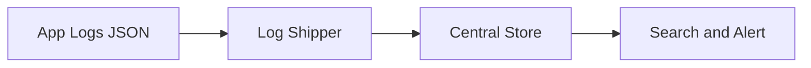

# Python Logging — Intermediate

## Structured Logging

Traditional text logs are hard to parse and query. Structured logging outputs JSON, making logs machine-readable.

```python
# Traditional log — hard to search/filter programmatically
# 2024-01-15 10:30:45 INFO Processed batch batch_id=abc123 rows=5000 duration=3.2s

# Structured JSON log — easily queryable in ELK/CloudWatch
# {"timestamp":"2024-01-15T10:30:45Z","level":"INFO","event":"batch_processed",
#  "batch_id":"abc123","rows":5000,"duration_seconds":3.2}
```

### Using python-json-logger

```python
import logging
from pythonjsonlogger import jsonlogger

logger = logging.getLogger('etl_pipeline')
handler = logging.StreamHandler()

formatter = jsonlogger.JsonFormatter(
    fmt='%(asctime)s %(name)s %(levelname)s %(message)s',
    rename_fields={'asctime': 'timestamp', 'levelname': 'level'},
    datefmt='%Y-%m-%dT%H:%M:%SZ'
)
handler.setFormatter(formatter)
logger.addHandler(handler)
logger.setLevel(logging.INFO)

# Add context as extra fields
logger.info(
    "Batch processed",
    extra={
        "batch_id": "abc123",
        "rows_read": 5000,
        "rows_written": 4987,
        "duration_seconds": 3.2,
        "source": "s3://raw/events/"
    }
)
# Output: {"timestamp":"2024-01-15T10:30:45Z","level":"INFO",
#   "message":"Batch processed","batch_id":"abc123","rows_read":5000,...}
```

### Using structlog

structlog provides a more Pythonic API for structured logging.

```python
import structlog

structlog.configure(
    processors=[
        structlog.processors.TimeStamper(fmt="iso"),
        structlog.processors.add_log_level,
        structlog.processors.StackInfoRenderer(),
        structlog.processors.JSONRenderer()
    ]
)

logger = structlog.get_logger()

# Bind context that persists across log calls
log = logger.bind(pipeline="daily_users", run_id="run_20240115")
log.info("extraction_started", source="s3://raw/users/")
log.info("extraction_complete", rows=50000, duration=12.5)
# Both lines include pipeline and run_id automatically
```

---

## Contextual Logging — Correlation IDs

Track a request or pipeline run across multiple modules and services.

```python
import logging
import uuid
import contextvars

# Thread-safe context variable for correlation ID
correlation_id: contextvars.ContextVar[str] = contextvars.ContextVar(
    'correlation_id', default='no-correlation-id'
)

class CorrelationFilter(logging.Filter):
    """Inject correlation_id into every log record."""
    def filter(self, record: logging.LogRecord) -> bool:
        record.correlation_id = correlation_id.get()
        return True

# Setup
logger = logging.getLogger('pipeline')
logger.addFilter(CorrelationFilter())

formatter = logging.Formatter(
    '%(asctime)s [%(correlation_id)s] %(levelname)s %(name)s: %(message)s'
)
handler = logging.StreamHandler()
handler.setFormatter(formatter)
logger.addHandler(handler)

# At pipeline start — set correlation ID
def run_pipeline(config: dict) -> None:
    run_id = str(uuid.uuid4())[:8]
    correlation_id.set(run_id)
    
    logger.info("Pipeline started")           # [a3f8b2c1] INFO ...
    extract(config["source"])                  # [a3f8b2c1] INFO ...
    transform(config["rules"])                 # [a3f8b2c1] INFO ...
    load(config["target"])                     # [a3f8b2c1] INFO ...
    logger.info("Pipeline complete")           # [a3f8b2c1] INFO ...
```

---

## Logging in Multi-Threaded Code

```python
import logging
import concurrent.futures
from threading import current_thread

logger = logging.getLogger('parallel_etl')

def process_partition(partition_path: str) -> int:
    """Each thread logs with its partition context."""
    thread_name = current_thread().name
    logger.info("Processing %s on thread %s", partition_path, thread_name)
    
    records = read_partition(partition_path)
    logger.info("Read %d records from %s", len(records), partition_path)
    return len(records)

# Thread pool with logging
partitions = ["s3://data/dt=2024-01-15/part-0001.parquet",
              "s3://data/dt=2024-01-15/part-0002.parquet"]

with concurrent.futures.ThreadPoolExecutor(max_workers=4) as executor:
    futures = {
        executor.submit(process_partition, p): p 
        for p in partitions
    }
    for future in concurrent.futures.as_completed(futures):
        partition = futures[future]
        try:
            count = future.result()
            logger.info("Completed %s: %d records", partition, count)
        except Exception as e:
            logger.error("Failed %s: %s", partition, e, exc_info=True)
```

### Multi-Process Logging with QueueHandler

```python
import logging
from logging.handlers import QueueHandler, QueueListener
import multiprocessing

def setup_mp_logging() -> tuple:
    """Setup logging that works across multiple processes."""
    log_queue = multiprocessing.Queue()
    
    # Listener runs in main process — handles actual output
    file_handler = logging.FileHandler('pipeline.log')
    file_handler.setFormatter(
        logging.Formatter('%(asctime)s [%(process)d] %(levelname)s %(message)s')
    )
    listener = QueueListener(log_queue, file_handler)
    listener.start()
    
    return log_queue, listener

def worker_process(log_queue, task_id: int) -> None:
    """Worker process sends logs to the queue."""
    logger = logging.getLogger(f'worker.{task_id}')
    logger.addHandler(QueueHandler(log_queue))
    logger.setLevel(logging.INFO)
    
    logger.info("Worker %d started", task_id)
    # ... do work ...
    logger.info("Worker %d complete", task_id)
```

---

## Custom Filters

Filters add logic beyond simple level-based filtering.

```python
import logging

class SensitiveDataFilter(logging.Filter):
    """Redact PII from log messages."""
    PATTERNS = [
        (r'\b\d{3}-\d{2}-\d{4}\b', '***-**-****'),  # SSN
        (r'\b[\w.]+@[\w]+\.[\w]+\b', '[REDACTED_EMAIL]'),
    ]
    
    def filter(self, record: logging.LogRecord) -> bool:
        import re
        msg = record.getMessage()
        for pattern, replacement in self.PATTERNS:
            msg = re.sub(pattern, replacement, msg)
        record.msg = msg
        record.args = None  # Clear args since we modified msg
        return True

class RateLimitFilter(logging.Filter):
    """Suppress repeated messages within a time window."""
    def __init__(self, rate_seconds: int = 60):
        super().__init__()
        self._cache: dict[str, float] = {}
        self._rate = rate_seconds
    
    def filter(self, record: logging.LogRecord) -> bool:
        import time
        key = f"{record.module}:{record.lineno}:{record.msg}"
        now = time.time()
        last_seen = self._cache.get(key, 0)
        if now - last_seen < self._rate:
            return False  # Suppress
        self._cache[key] = now
        return True

# Apply filters
logger = logging.getLogger('pipeline')
logger.addFilter(SensitiveDataFilter())
logger.addFilter(RateLimitFilter(rate_seconds=30))
```

---

## Custom Handlers

```python
import logging
import requests

class SlackAlertHandler(logging.Handler):
    """Send ERROR+ logs to Slack webhook."""
    
    def __init__(self, webhook_url: str, channel: str = "#data-alerts"):
        super().__init__(level=logging.ERROR)
        self.webhook_url = webhook_url
        self.channel = channel
    
    def emit(self, record: logging.LogRecord) -> None:
        try:
            message = self.format(record)
            payload = {
                "channel": self.channel,
                "text": f":rotating_light: *{record.levelname}*\n```{message}```"
            }
            requests.post(self.webhook_url, json=payload, timeout=5)
        except Exception:
            self.handleError(record)

# Usage
slack_handler = SlackAlertHandler(
    webhook_url="https://hooks.slack.com/services/T.../B.../xxx"
)
logger.addHandler(slack_handler)
logger.error("Pipeline failed: table users_daily has 0 rows")
# → Sends alert to Slack
```

---

## Log Aggregation Patterns

The diagram below shows the typical aggregation flow: applications emit JSON logs, a shipper forwards them to a central store, and that store powers search and alerting.



| Pattern | Tool | Use Case |
|---------|------|----------|
| File → shipper → store | Filebeat → Elasticsearch | On-premise, high volume |
| Direct to cloud | CloudWatch agent | AWS native |
| Sidecar container | Fluentd/Fluent Bit | Kubernetes |
| In-process SDK | DataDog APM | Full observability |

---

## Performance Considerations

```python
import logging

logger = logging.getLogger('performance')

# BAD: String formatting happens even if level is filtered
logger.debug(f"Processing record: {expensive_serialize(record)}")

# GOOD: Lazy formatting — only evaluates if DEBUG is enabled
logger.debug("Processing record: %s", record)

# BETTER: Guard expensive operations
if logger.isEnabledFor(logging.DEBUG):
    logger.debug("Record details: %s", expensive_serialize(record))

# Avoid logging in tight loops — aggregate instead
processed = 0
for record in million_records:
    process(record)
    processed += 1

# Log summary, not every iteration
logger.info("Processed %d records", processed)
```

---

## Interview Tips

> **Tip 1:** "How would you add logging to an existing ETL pipeline?" — "Start with structured JSON logging (python-json-logger or structlog). Add a correlation ID at the pipeline entry point. Log at INFO for stage transitions (extract started/complete, transform started/complete), WARNING for skipped/invalid records, and ERROR for failures. Include metrics in log fields (row counts, durations) for operational dashboards."

> **Tip 2:** "How do you handle logging in multi-process Python code?" — "Each process needs its own logger since logging module handlers aren't process-safe. Use QueueHandler in workers to send log records to a central queue, and QueueListener in the main process to write them. This avoids file corruption from concurrent writes. In containerized environments, each process can log to stdout and let the container orchestrator aggregate."

> **Tip 3:** "What's structured logging and why does it matter?" — "Structured logging outputs logs as JSON objects with typed fields instead of free-form text. It matters because you can query 'show me all logs where batch_id=X and duration > 5s' in tools like Elasticsearch or CloudWatch Insights. With unstructured text, you'd need regex parsing which is fragile and slow."
