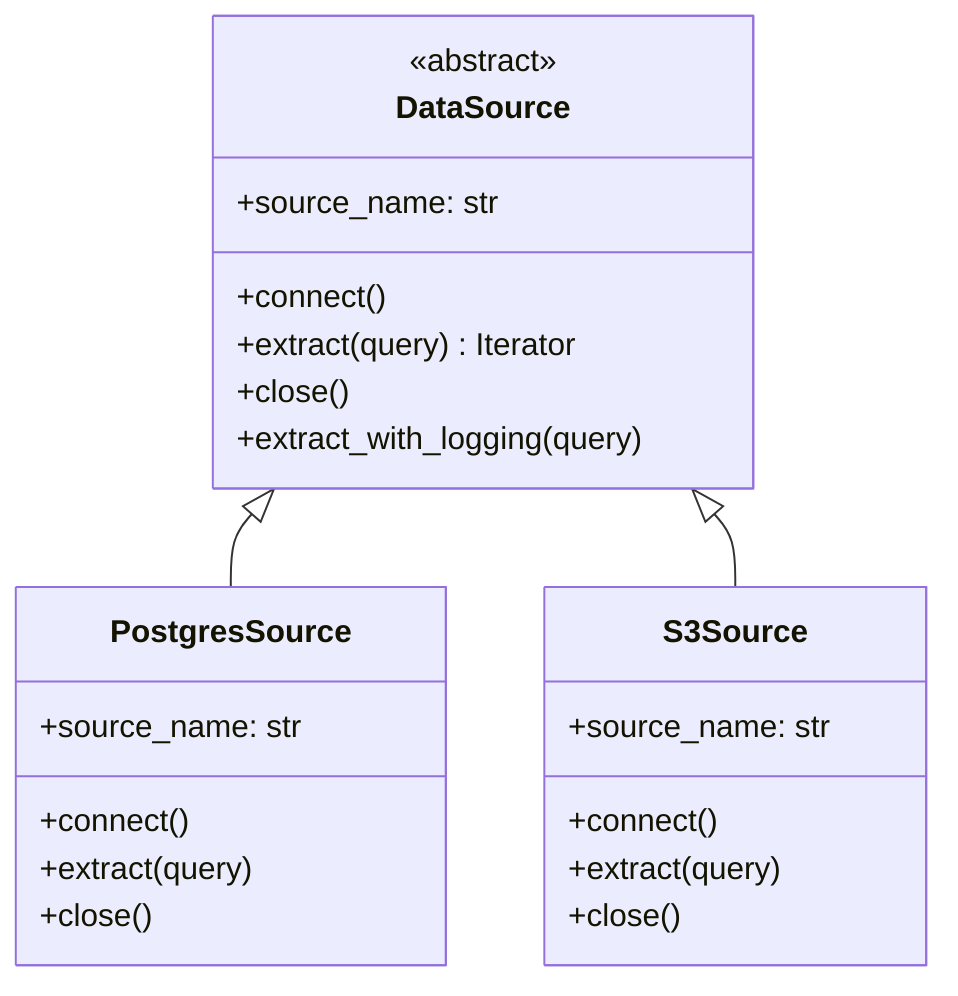

# Python OOP — Intermediate Concepts

## Inheritance vs Composition

**The analogy:** Inheritance is "is-a" (a PostgresConnector IS a DatabaseConnector). Composition is "has-a" (a Pipeline HAS a connector, HAS a transformer). In DE, composition usually wins because pipelines are assembled from interchangeable parts.

```python
# Inheritance — tight coupling (use sparingly)
class DatabaseConnector:
    def connect(self):
        raise NotImplementedError

class PostgresConnector(DatabaseConnector):
    def connect(self):
        return psycopg2.connect(self.conn_string)

# Composition — loose coupling (preferred)
class DataPipeline:
    def __init__(self, connector, transformer, loader):
        self.connector = connector      # HAS-A connector
        self.transformer = transformer  # HAS-A transformer
        self.loader = loader            # HAS-A loader
    
    def run(self):
        data = self.connector.extract()
        transformed = self.transformer.transform(data)
        self.loader.load(transformed)
```

---

## Mixins — Reusable Behavior Modules

Mixins add specific capabilities to classes without deep inheritance:

```python
import logging
import time
from typing import Any

class LoggingMixin:
    """Adds structured logging to any pipeline component."""
    
    @property
    def logger(self):
        return logging.getLogger(self.__class__.__name__)
    
    def log_operation(self, operation: str, **context):
        self.logger.info(f"{operation}", extra=context)

class MetricsMixin:
    """Adds timing and counting metrics."""
    
    def __init_subclass__(cls, **kwargs):
        super().__init_subclass__(**kwargs)
        cls._metrics = {}
    
    def record_metric(self, name: str, value: float):
        self._metrics[name] = value
    
    def timed_operation(self, name: str):
        """Context manager for timing operations."""
        from contextlib import contextmanager
        
        @contextmanager
        def timer():
            start = time.perf_counter()
            yield
            self.record_metric(f"{name}_seconds", time.perf_counter() - start)
        
        return timer()

class RetryMixin:
    """Adds retry capability to any operation."""
    
    def with_retry(self, func, max_attempts=3, backoff=2):
        for attempt in range(max_attempts):
            try:
                return func()
            except Exception as e:
                if attempt == max_attempts - 1:
                    raise
                time.sleep(backoff ** attempt)

# Combine mixins into a pipeline component
class RobustExtractor(LoggingMixin, MetricsMixin, RetryMixin):
    """Extractor with logging, metrics, and retry — via mixins."""
    
    def __init__(self, source_url: str):
        self.source_url = source_url
    
    def extract(self):
        self.log_operation("extract_start", source=self.source_url)
        
        with self.timed_operation("extract"):
            data = self.with_retry(lambda: fetch_data(self.source_url))
        
        self.log_operation("extract_complete", records=len(data))
        return data
```

---

## Magic Methods for Data Engineering

### __repr__ and __str__ — Debuggable Objects

```python
from dataclasses import dataclass
from datetime import datetime

@dataclass
class PipelineRun:
    pipeline_id: str
    started_at: datetime
    records_processed: int = 0
    status: str = "running"
    
    def __repr__(self):
        """For developers — unambiguous, detailed."""
        return (
            f"PipelineRun(id={self.pipeline_id!r}, "
            f"status={self.status!r}, "
            f"records={self.records_processed})"
        )
    
    def __str__(self):
        """For logs — human-readable summary."""
        return f"[{self.status.upper()}] {self.pipeline_id}: {self.records_processed} records"
```

### __eq__ and __hash__ — Set/Dict Compatible Objects

```python
class PartitionKey:
    """
    Immutable partition identifier. Must be hashable for use in sets/dicts.
    Rule: If __eq__ is defined, __hash__ MUST also be defined (or set to None).
    """
    
    def __init__(self, table: str, date: str, region: str):
        self.table = table
        self.date = date
        self.region = region
    
    def __eq__(self, other):
        if not isinstance(other, PartitionKey):
            return NotImplemented
        return (self.table, self.date, self.region) == (other.table, other.date, other.region)
    
    def __hash__(self):
        return hash((self.table, self.date, self.region))
    
    def __repr__(self):
        return f"PartitionKey({self.table}/{self.date}/{self.region})"

# Now usable in sets for tracking processed partitions
processed = set()
key = PartitionKey("users", "2024-01-15", "us-east-1")
processed.add(key)
assert key in processed  # O(1) lookup works
```

### __lt__ for Sortable Objects

```python
from functools import total_ordering

@total_ordering  # Auto-generates __le__, __gt__, __ge__ from __eq__ + __lt__
class PriorityTask:
    def __init__(self, name: str, priority: int, created_at: datetime):
        self.name = name
        self.priority = priority
        self.created_at = created_at
    
    def __eq__(self, other):
        return self.priority == other.priority
    
    def __lt__(self, other):
        # Lower number = higher priority; ties broken by creation time
        if self.priority != other.priority:
            return self.priority < other.priority
        return self.created_at < other.created_at

# Works with heapq, sorted(), min(), max()
import heapq
tasks = [PriorityTask("etl", 1, now), PriorityTask("report", 3, now)]
heapq.heapify(tasks)
```

---

## Property Decorators — Controlled Access

```python
class DataQualityReport:
    """Properties provide computed attributes with validation."""
    
    def __init__(self, total_records: int, valid_records: int):
        self._total = total_records
        self._valid = valid_records
    
    @property
    def pass_rate(self) -> float:
        """Computed on access — always current."""
        if self._total == 0:
            return 0.0
        return self._valid / self._total
    
    @property
    def total_records(self) -> int:
        return self._total
    
    @total_records.setter
    def total_records(self, value: int):
        """Setter with validation."""
        if value < 0:
            raise ValueError("total_records cannot be negative")
        self._total = value
    
    @property
    def is_passing(self) -> bool:
        """Business logic as a property."""
        return self.pass_rate >= 0.95  # 95% threshold

report = DataQualityReport(total_records=10000, valid_records=9800)
print(report.pass_rate)    # 0.98
print(report.is_passing)   # True
```

---

## Abstract Base Classes — Interface Contracts

```python
from abc import ABC, abstractmethod
from typing import Iterator, Dict, Any

class DataSource(ABC):
    """
    Contract that all data sources must fulfill.
    Enforces interface at class creation time (not runtime).
    """
    
    @abstractmethod
    def connect(self) -> None:
        """Establish connection to the data source."""
        ...
    
    @abstractmethod
    def extract(self, query: str) -> Iterator[Dict[str, Any]]:
        """Extract records matching the query."""
        ...
    
    @abstractmethod
    def close(self) -> None:
        """Release resources."""
        ...
    
    @property
    @abstractmethod
    def source_name(self) -> str:
        """Human-readable name for logging."""
        ...
    
    # Concrete method — shared behavior
    def extract_with_logging(self, query: str) -> Iterator[Dict]:
        print(f"[{self.source_name}] Starting extraction: {query}")
        yield from self.extract(query)
        print(f"[{self.source_name}] Extraction complete")

class PostgresSource(DataSource):
    """Concrete implementation — must implement ALL abstract methods."""
    
    def __init__(self, conn_string: str):
        self._conn_string = conn_string
        self._conn = None
    
    @property
    def source_name(self) -> str:
        return "PostgreSQL"
    
    def connect(self):
        import psycopg2
        self._conn = psycopg2.connect(self._conn_string)
    
    def extract(self, query: str) -> Iterator[Dict]:
        with self._conn.cursor() as cur:
            cur.execute(query)
            columns = [desc[0] for desc in cur.description]
            for row in cur:
                yield dict(zip(columns, row))
    
    def close(self):
        if self._conn:
            self._conn.close()

# Cannot instantiate ABC directly
# source = DataSource()  # TypeError: Can't instantiate abstract class
```

The class diagram below shows the contract relationship: `DataSource` declares the abstract interface, and concrete sources like `PostgresSource` and `S3Source` inherit from it and implement every abstract member.



---

## Composition Over Inheritance — Pipeline Builder

```python
class ETLPipeline:
    """
    Composed from independent, interchangeable components.
    Each component only needs to match the expected interface.
    """
    
    def __init__(self):
        self._extractors = []
        self._transformers = []
        self._loaders = []
    
    def add_extractor(self, extractor: DataSource):
        self._extractors.append(extractor)
        return self  # Enable method chaining
    
    def add_transformer(self, transformer):
        self._transformers.append(transformer)
        return self
    
    def add_loader(self, loader):
        self._loaders.append(loader)
        return self
    
    def run(self):
        # Extract from all sources
        all_records = []
        for extractor in self._extractors:
            extractor.connect()
            all_records.extend(extractor.extract("SELECT *"))
            extractor.close()
        
        # Apply transformations in sequence
        data = all_records
        for transformer in self._transformers:
            data = transformer.transform(data)
        
        # Load to all destinations
        for loader in self._loaders:
            loader.load(data)

# Usage — declarative pipeline construction
pipeline = (
    ETLPipeline()
    .add_extractor(PostgresSource("postgresql://..."))
    .add_extractor(S3Source("s3://bucket/path/"))
    .add_transformer(DeduplicationTransformer())
    .add_transformer(SchemaValidator(schema))
    .add_loader(RedshiftLoader("redshift://..."))
)
pipeline.run()
```

---

## Interview Tips

> **Tip 1:** When asked "inheritance or composition?", default to composition for DE systems. Say: "Pipelines are assembled from interchangeable components — I want to swap a Postgres extractor for an S3 extractor without changing the pipeline logic. Composition gives that flexibility; inheritance creates rigid hierarchies."

> **Tip 2:** For magic methods, show you know the contract: "If I define `__eq__`, I must define `__hash__` for set/dict usage. Objects that compare equal must have the same hash." This precision signals deep understanding vs. surface-level knowledge.

> **Tip 3:** ABCs are your answer for "how do you enforce interfaces in Python?" — but note that Python uses duck typing by convention. ABCs add explicit enforcement. In interviews, recommend ABCs for team codebases where the interface contract needs to be discoverable and IDE-friendly, not for small scripts.
