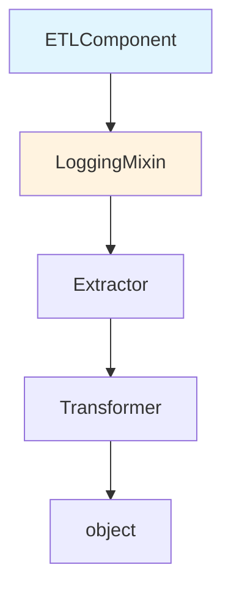

# Python OOP — Senior Deep Dive

## Metaclasses — Classes That Create Classes

**The analogy:** If a class is a blueprint for objects, a metaclass is a blueprint for blueprints. It controls how classes themselves are created — like a factory that builds factories.

```python
class RegistryMeta(type):
    """
    Metaclass that auto-registers all subclasses.
    Use case: Plugin systems, connector registries, format handlers.
    """
    _registry = {}
    
    def __new__(mcs, name, bases, namespace):
        cls = super().__new__(mcs, name, bases, namespace)
        # Auto-register non-abstract classes
        if hasattr(cls, 'source_type') and cls.source_type:
            mcs._registry[cls.source_type] = cls
        return cls
    
    @classmethod
    def get_connector(mcs, source_type: str):
        cls = mcs._registry.get(source_type)
        if not cls:
            available = list(mcs._registry.keys())
            raise ValueError(f"Unknown source '{source_type}'. Available: {available}")
        return cls

class DataConnector(metaclass=RegistryMeta):
    """Base class — subclasses auto-register themselves."""
    source_type = None  # Abstract — not registered

class PostgresConnector(DataConnector):
    source_type = "postgres"
    
    def __init__(self, host, port, database):
        self.conn_string = f"postgresql://{host}:{port}/{database}"

class S3Connector(DataConnector):
    source_type = "s3"
    
    def __init__(self, bucket, prefix):
        self.uri = f"s3://{bucket}/{prefix}"

class KafkaConnector(DataConnector):
    source_type = "kafka"
    
    def __init__(self, bootstrap_servers, topic):
        self.servers = bootstrap_servers
        self.topic = topic

# Usage — factory from config
def create_connector_from_config(config: dict):
    connector_cls = RegistryMeta.get_connector(config["type"])
    return connector_cls(**config["params"])

config = {"type": "postgres", "params": {"host": "db.prod", "port": 5432, "database": "analytics"}}
connector = create_connector_from_config(config)
```

---

## Descriptors — Attribute Access Protocol

Descriptors control what happens when you get/set/delete attributes. They power `property`, `classmethod`, `staticmethod`, and ORMs.

```python
class Validated:
    """
    Descriptor that validates values on assignment.
    Reusable across multiple classes — DRY validation.
    """
    
    def __init__(self, validator, error_msg=None):
        self.validator = validator
        self.error_msg = error_msg
    
    def __set_name__(self, owner, name):
        self.name = name
        self.private_name = f"_{name}"
    
    def __get__(self, obj, objtype=None):
        if obj is None:
            return self
        return getattr(obj, self.private_name, None)
    
    def __set__(self, obj, value):
        if not self.validator(value):
            raise ValueError(
                self.error_msg or f"Invalid value for {self.name}: {value!r}"
            )
        setattr(obj, self.private_name, value)

# Reusable validators
positive_int = Validated(lambda x: isinstance(x, int) and x > 0, "Must be positive integer")
non_empty_string = Validated(lambda x: isinstance(x, str) and len(x.strip()) > 0, "Must be non-empty string")

class PipelineConfig:
    """Uses descriptors for validated configuration."""
    
    batch_size = positive_int
    table_name = non_empty_string
    max_retries = positive_int
    
    def __init__(self, batch_size, table_name, max_retries=3):
        self.batch_size = batch_size    # Triggers __set__ validation
        self.table_name = table_name
        self.max_retries = max_retries

# Validation happens automatically
config = PipelineConfig(batch_size=10000, table_name="dim_users")
# config.batch_size = -1  # ValueError: Must be positive integer
# config.table_name = ""  # ValueError: Must be non-empty string
```

---

## __slots__ — Memory Optimization

`__slots__` eliminates the per-instance `__dict__`, reducing memory by 30-50%:

```python
import sys

class RegularRecord:
    def __init__(self, user_id, event_type, timestamp, amount):
        self.user_id = user_id
        self.event_type = event_type
        self.timestamp = timestamp
        self.amount = amount

class SlottedRecord:
    __slots__ = ('user_id', 'event_type', 'timestamp', 'amount')
    
    def __init__(self, user_id, event_type, timestamp, amount):
        self.user_id = user_id
        self.event_type = event_type
        self.timestamp = timestamp
        self.amount = amount

# Memory comparison
regular = RegularRecord("u1", "click", "2024-01-15", 9.99)
slotted = SlottedRecord("u1", "click", "2024-01-15", 9.99)

print(sys.getsizeof(regular) + sys.getsizeof(regular.__dict__))  # ~200 bytes
print(sys.getsizeof(slotted))  # ~72 bytes (no __dict__)

# For 10M records in memory:
# Regular: ~2 GB
# Slotted: ~720 MB — significant savings!
```

**When to use slots in DE:**
- In-memory record objects processed in bulk (millions of instances)
- Lightweight value objects (partition keys, schema fields)
- NOT for config objects or classes that need dynamic attributes

---

## MRO — Method Resolution Order

Python uses C3 linearization for diamond inheritance. Understanding MRO matters for mixin-heavy architectures:

```python
class Extractor:
    def validate(self):
        print("Extractor.validate")
        return True

class Transformer:
    def validate(self):
        print("Transformer.validate")
        return True

class LoggingMixin:
    def validate(self):
        print("LoggingMixin.validate — logging before")
        result = super().validate()  # Calls NEXT in MRO, not parent
        print("LoggingMixin.validate — logging after")
        return result

class ETLComponent(LoggingMixin, Extractor, Transformer):
    pass

# What does ETLComponent().validate() do?
print(ETLComponent.__mro__)
# (ETLComponent, LoggingMixin, Extractor, Transformer, object)

# LoggingMixin.validate → super() → Extractor.validate
```

The diagram below lays out the resulting method resolution order as a single chain: a `super()` call in any class hands off to the next class to its right in this sequence, ending at `object`.



---

## Design Pattern: Factory

```python
from abc import ABC, abstractmethod
from typing import Dict, Any

class FileHandler(ABC):
    @abstractmethod
    def read(self, path: str):
        ...
    
    @abstractmethod
    def write(self, data, path: str):
        ...

class CSVHandler(FileHandler):
    def read(self, path):
        import csv
        with open(path) as f:
            return list(csv.DictReader(f))
    
    def write(self, data, path):
        import csv
        with open(path, 'w', newline='') as f:
            writer = csv.DictWriter(f, fieldnames=data[0].keys())
            writer.writeheader()
            writer.writerows(data)

class ParquetHandler(FileHandler):
    def read(self, path):
        import pyarrow.parquet as pq
        return pq.read_table(path).to_pylist()
    
    def write(self, data, path):
        import pyarrow as pa
        import pyarrow.parquet as pq
        table = pa.Table.from_pylist(data)
        pq.write_table(table, path)

class FileHandlerFactory:
    """Factory pattern — create handler based on file extension."""
    
    _handlers = {
        ".csv": CSVHandler,
        ".parquet": ParquetHandler,
    }
    
    @classmethod
    def register(cls, extension: str, handler_class):
        cls._handlers[extension] = handler_class
    
    @classmethod
    def create(cls, filepath: str) -> FileHandler:
        from pathlib import Path
        ext = Path(filepath).suffix.lower()
        handler_cls = cls._handlers.get(ext)
        if not handler_cls:
            raise ValueError(f"No handler for extension: {ext}")
        return handler_cls()

# Usage
handler = FileHandlerFactory.create("data/users.parquet")
records = handler.read("data/users.parquet")
```

---

## Design Pattern: Strategy

```python
from abc import ABC, abstractmethod
from typing import List, Dict

class PartitionStrategy(ABC):
    """Strategy pattern — interchangeable partitioning algorithms."""
    
    @abstractmethod
    def partition(self, records: List[Dict], num_partitions: int) -> List[List[Dict]]:
        ...

class HashPartition(PartitionStrategy):
    def __init__(self, key_field: str):
        self.key_field = key_field
    
    def partition(self, records, num_partitions):
        buckets = [[] for _ in range(num_partitions)]
        for record in records:
            bucket = hash(record[self.key_field]) % num_partitions
            buckets[bucket].append(record)
        return buckets

class RangePartition(PartitionStrategy):
    def __init__(self, key_field: str, boundaries: list):
        self.key_field = key_field
        self.boundaries = sorted(boundaries)
    
    def partition(self, records, num_partitions):
        import bisect
        buckets = [[] for _ in range(len(self.boundaries) + 1)]
        for record in records:
            idx = bisect.bisect_left(self.boundaries, record[self.key_field])
            buckets[idx].append(record)
        return buckets

class DataWriter:
    """Uses strategy pattern for flexible partitioning."""
    
    def __init__(self, strategy: PartitionStrategy):
        self._strategy = strategy
    
    def write_partitioned(self, records, num_partitions, output_dir):
        partitions = self._strategy.partition(records, num_partitions)
        for i, partition in enumerate(partitions):
            write_to_file(partition, f"{output_dir}/part_{i:04d}.parquet")

# Swap strategies without changing writer code
writer = DataWriter(HashPartition(key_field="user_id"))
writer.write_partitioned(records, num_partitions=16, output_dir="/output")
```

---

## Design Pattern: Observer

```python
from typing import Callable, List
from dataclasses import dataclass, field
from datetime import datetime

@dataclass
class PipelineEvent:
    event_type: str
    pipeline_name: str
    timestamp: datetime = field(default_factory=datetime.utcnow)
    metadata: dict = field(default_factory=dict)

class PipelineEventBus:
    """Observer pattern for pipeline monitoring."""
    
    def __init__(self):
        self._listeners: dict[str, List[Callable]] = {}
    
    def subscribe(self, event_type: str, callback: Callable):
        self._listeners.setdefault(event_type, []).append(callback)
    
    def publish(self, event: PipelineEvent):
        for callback in self._listeners.get(event.event_type, []):
            callback(event)
        # Also notify wildcard subscribers
        for callback in self._listeners.get("*", []):
            callback(event)

# Usage
bus = PipelineEventBus()
bus.subscribe("pipeline_failed", send_pagerduty_alert)
bus.subscribe("pipeline_completed", update_dashboard)
bus.subscribe("*", write_to_audit_log)

bus.publish(PipelineEvent("pipeline_failed", "daily_etl", metadata={"error": "timeout"}))
```

---

## Interview Tips

> **Tip 1:** Metaclasses are rarely needed in application code, but knowing them signals deep Python mastery. In interviews, mention them for plugin/registry systems: "I'd use a metaclass to auto-register all DataConnector subclasses, so adding a new connector type requires zero changes to the framework — just define the class and it's available."

> **Tip 2:** For MRO questions, remember `super()` follows the MRO, not the class hierarchy. This means `super()` in a mixin calls the NEXT class in MRO, which might not be its direct parent. Always check `ClassName.__mro__` when debugging mixin behavior in production code.

> **Tip 3:** `__slots__` is a memory optimization lever that interviewers love asking about. Know the tradeoff: saves 30-50% memory per instance but prevents dynamic attribute addition and slightly complicates inheritance. Use it for value objects with millions of instances (like parsed records), not for configuration or service objects.

## ⚡ Cheat Sheet

**Metaclass Rules**
- `type` is the default metaclass; custom metaclass inherits from `type`
- `__new__(mcs, name, bases, namespace)` → called when the CLASS is defined (not instantiated)
- `__init_subclass__` is cleaner alternative for most registry use cases
- Use metaclass for: auto-registration, enforcing class-level invariants, ORM column mapping

**Descriptor Protocol**
- `__set_name__(owner, name)` → called when class is defined; save `self.name` here
- `__get__(obj, objtype)` → if `obj is None`: accessed on class, return `self`
- `__set__(obj, value)` → called on attribute assignment; validate + store in `obj.__dict__` (or `_name`)
- `property` is a descriptor — `@property` is syntactic sugar for `Descriptor.__get__`

**`__slots__` Quick Facts**
- Eliminates per-instance `__dict__`: ~200 bytes → ~72 bytes per object
- 10M regular objects: ~2 GB; 10M slotted: ~720 MB
- Cannot add attributes not in `__slots__`; `__weakref__` must be explicit
- Inheritance: subclass must also define `__slots__` or parent savings are lost

**MRO (C3 Linearization)**
- `ClassName.__mro__` shows the full resolution order
- `super()` calls the NEXT class in MRO, not the direct parent
- Mixin's `super()` calls next-in-MRO — enables cooperative multiple inheritance
- `object` is always last in MRO

**Design Pattern Summary**
| Pattern | Key Mechanism | DE Use Case |
|---------|---------------|-------------|
| Factory | `_handlers[ext]()` dispatch | `FileHandlerFactory.create("data.parquet")` |
| Strategy | Inject interchangeable algorithm | `HashPartition` vs `RangePartition` |
| Observer | Event bus with `subscribe(type, cb)` | Pipeline event → Slack/dashboard/audit log |
| Registry Metaclass | `__new__` auto-registers subclasses | Connector plugins (postgres, s3, kafka) |

**`super()` in Mixins**
- `super()` in `LoggingMixin.validate()` → calls `Extractor.validate()` (next in MRO)
- Add `LoggingMixin` first in bases to intercept calls before the real implementation
- Always call `super().__init__()` in `__init__` for proper MRO initialization
