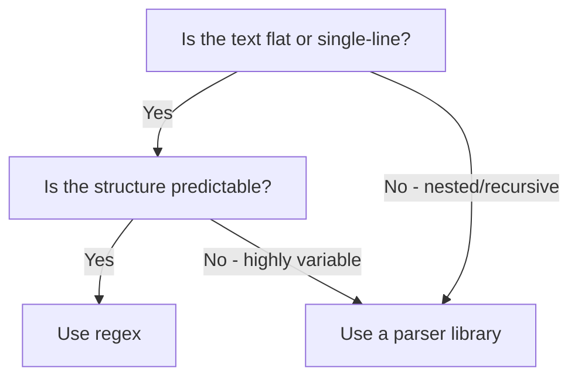

# Python Regular Expressions — Senior Deep Dive

## Performance Optimization

### Catastrophic Backtracking

When a regex engine explores exponentially many paths before failing to match.

```python
import re
import time

# DANGEROUS: This pattern causes catastrophic backtracking
# Pattern: (a+)+ trying to match "aaaaaaaaaaaaaaaaX"
# The engine tries every way to partition "aaa...a" among the groups

dangerous_pattern = r'(a+)+b'
test_string = 'a' * 25 + 'X'  # "aaaa...aX" — no 'b' at end

# This will hang or take minutes:
# re.match(dangerous_pattern, test_string)  # DON'T RUN

# REAL-WORLD EXAMPLE: Email validation gone wrong
bad_email = r'^([a-zA-Z0-9]+\.)+[a-zA-Z]{2,}$'
# On input like "aaaaaaaaaaaaaaaa.c" — exponential backtracking

# SAFE version — no nested quantifiers
safe_email = r'^[a-zA-Z0-9]+(?:\.[a-zA-Z0-9]+)*\.[a-zA-Z]{2,}$'
```

**Rules to prevent catastrophic backtracking:**

| Rule | Bad Pattern | Safe Pattern |
|------|-------------|--------------|
| No nested quantifiers | `(a+)+` | `a+` |
| No overlapping alternatives | `(a|a)+` | `a+` |
| Use atomic groups (possessive) | `.*.*` | `[^x]*x` |
| Be specific | `.+` | `[^\s]+` |

### Benchmarking Patterns

```python
import re
import timeit

def benchmark_pattern(pattern: str, text: str, n: int = 10000) -> float:
    compiled = re.compile(pattern)
    return timeit.timeit(lambda: compiled.search(text), number=n)

# Compare approaches
text = "key1=value1 key2=value2 key3=value3 " * 100

# Approach 1: Generic (slower)
t1 = benchmark_pattern(r'key2=(.+?)(?:\s|$)', text)

# Approach 2: Specific character class (faster)
t2 = benchmark_pattern(r'key2=([^\s]+)', text)

print(f"Generic: {t1:.3f}s, Specific: {t2:.3f}s")
# Specific is typically 2-5x faster
```

---

## Atomic Groups and Possessive Quantifiers

Python's `re` module doesn't support atomic groups directly, but the `regex` library does.

```python
import regex  # pip install regex (third-party, more powerful than re)

# Possessive quantifier (++) — never backtracks
# Standard: r'\d+:' on "123456789" — tries 9 chars, fails, backtracks to 8, 7...
# Possessive: r'\d++:' on "123456789" — tries 9 chars, fails immediately (no backtrack)

pattern_standard = regex.compile(r'\d+:')
pattern_possessive = regex.compile(r'\d++:')

text = '1' * 1000  # No colon — will fail to match

# Standard: slow (backtracks 1000 times)
# Possessive: fast (fails immediately after consuming all digits)

# Atomic group: (?>...)  — same effect, groups the match
atomic_pattern = regex.compile(r'(?>\d+):')
```

---

## Regex in PySpark

### regexp_extract for Column Extraction

```python
from pyspark.sql import SparkSession
from pyspark.sql.functions import regexp_extract, regexp_replace, col

spark = SparkSession.builder.getOrCreate()

# Sample data: semi-structured log column
df = spark.createDataFrame([
    ("2024-01-15 ERROR [auth] Login failed user=alice ip=10.0.0.1",),
    ("2024-01-15 INFO [api] Request completed user=bob ip=10.0.0.2",),
], ["raw_log"])

# Extract fields using regexp_extract(col, pattern, group_index)
parsed = df.select(
    regexp_extract("raw_log", r"(\d{4}-\d{2}-\d{2})", 1).alias("date"),
    regexp_extract("raw_log", r"(ERROR|WARN|INFO|DEBUG)", 1).alias("level"),
    regexp_extract("raw_log", r"\[(\w+)\]", 1).alias("service"),
    regexp_extract("raw_log", r"user=(\w+)", 1).alias("user"),
    regexp_extract("raw_log", r"ip=([\d.]+)", 1).alias("ip"),
)
parsed.show()
# +----------+-----+-------+-----+---------+
# |      date|level|service| user|       ip|
# +----------+-----+-------+-----+---------+
# |2024-01-15|ERROR|   auth|alice| 10.0.0.1|
# |2024-01-15| INFO|    api|  bob| 10.0.0.2|
# +----------+-----+-------+-----+---------+

# regexp_replace for data cleaning
cleaned = df.withColumn(
    "sanitized",
    regexp_replace("raw_log", r"ip=[\d.]+", "ip=[REDACTED]")
)
```

### Pandas str.extract

```python
import pandas as pd

df = pd.DataFrame({
    "log": [
        "2024-01-15 ERROR [auth] Login failed",
        "2024-01-15 INFO [api] Request OK",
    ]
})

# Named groups become columns
extracted = df["log"].str.extract(
    r'(?P<date>\d{4}-\d{2}-\d{2})\s+(?P<level>\w+)\s+\[(?P<service>\w+)\]'
)
#          date  level service
# 0  2024-01-15  ERROR    auth
# 1  2024-01-15   INFO     api

# str.contains for filtering (boolean mask)
error_df = df[df["log"].str.contains(r'\bERROR\b', regex=True)]

# str.extractall for multiple matches per row
df2 = pd.DataFrame({"text": ["user=alice user=bob", "user=charlie"]})
all_users = df2["text"].str.extractall(r'user=(\w+)')
```

---

## Building Configurable Parsers

```python
import re
from dataclasses import dataclass, field
from typing import Any

@dataclass
class FieldDefinition:
    name: str
    pattern: str
    transform: type = str  # str, int, float
    required: bool = True

@dataclass
class LogParser:
    """Configurable regex-based parser for semi-structured text."""
    fields: list[FieldDefinition]
    delimiter: str = r'\s+'
    _compiled: re.Pattern = field(init=False, repr=False)
    
    def __post_init__(self) -> None:
        # Build combined pattern from field definitions
        parts = []
        for f in self.fields:
            parts.append(f'(?P<{f.name}>{f.pattern})')
        
        full_pattern = self.delimiter.join(parts)
        self._compiled = re.compile(full_pattern)
    
    def parse(self, line: str) -> dict[str, Any] | None:
        match = self._compiled.search(line)
        if not match:
            return None
        
        result = {}
        for f in self.fields:
            value = match.group(f.name)
            if value is None and f.required:
                return None
            try:
                result[f.name] = f.transform(value) if value else None
            except (ValueError, TypeError):
                result[f.name] = value
        return result
    
    def parse_many(self, lines: list[str]) -> tuple[list[dict], list[str]]:
        """Returns (parsed_records, unparsed_lines)."""
        parsed = []
        errors = []
        for line in lines:
            result = self.parse(line)
            if result:
                parsed.append(result)
            else:
                errors.append(line)
        return parsed, errors

# Usage: configure parser for Apache access logs
apache_parser = LogParser(fields=[
    FieldDefinition("ip", r'\S+'),
    FieldDefinition("identity", r'\S+'),
    FieldDefinition("user", r'\S+'),
    FieldDefinition("timestamp", r'\[[^\]]+\]'),
    FieldDefinition("request", r'"[^"]*"'),
    FieldDefinition("status", r'\d+', transform=int),
    FieldDefinition("bytes", r'\d+', transform=int),
])

parsed, errors = apache_parser.parse_many(log_lines)
print(f"Parsed: {len(parsed)}, Failed: {len(errors)}")
```

---

## When NOT to Use Regex

| Scenario | Use Instead | Why |
|----------|-------------|-----|
| Parse JSON | `json.loads()` | Handles nested structures, escaping |
| Parse XML/HTML | `lxml`, `BeautifulSoup` | Tree structure, malformed input |
| Parse CSV | `csv` module, pandas | Handles quoting, escaping, edge cases |
| Parse SQL | `sqlparse` | Complex grammar, comments, strings |
| Parse URLs | `urllib.parse` | Standard library, handles encoding |
| Complex grammars | `pyparsing`, `lark` | Recursive structures, error recovery |
| Date parsing | `dateutil.parser` | Handles 100+ formats |

```python
# BAD: regex for JSON extraction (breaks on nested objects, escapes)
import re
bad_json_extract = re.findall(r'"name":\s*"([^"]*)"', json_text)  # Fragile!

# GOOD: proper JSON parsing
import json
data = json.loads(json_text)
names = [item["name"] for item in data]

# BAD: regex for HTML
bad_title = re.search(r'<title>(.*?)</title>', html)  # Breaks on attributes, nesting

# GOOD: proper HTML parser
from bs4 import BeautifulSoup
soup = BeautifulSoup(html, 'html.parser')
title = soup.title.string
```

---

## Regex vs Parsing Libraries Comparison

```python
# When the format is SIMPLE and FLAT — regex is fine
# Parse key=value from a single log line:
import re
line = "status=200 duration=3.2 path=/api/users"
parsed = dict(re.findall(r'(\w+)=([\S]+)', line))
# Fast, simple, clear intent

# When the format is NESTED or COMPLEX — use a parser
# Parse a Spark plan, SQL query, or config file:
import sqlparse
sql = "SELECT a, b FROM (SELECT * FROM users WHERE id > 100) t"
parsed = sqlparse.parse(sql)
# Handles nesting, comments, string literals correctly
```

**Decision framework:**

The flowchart below captures the rule of thumb: reach for regex only when the text is flat, single-line, and predictable, and switch to a dedicated parser whenever the structure is nested or highly variable.



---

## Interview Tips

> **Tip 1:** "How do you prevent catastrophic backtracking?" — "Three rules: (1) Never nest quantifiers inside quantifiers (`(a+)+` is deadly). (2) Use specific character classes instead of `.` — `[^\s]+` is safer than `.+?`. (3) Ensure alternatives don't overlap. If you must use complex patterns, test with the `regex` library's timeout feature or use possessive quantifiers (`++`) to prevent backtracking."

> **Tip 2:** "When would you choose regex over a parser library?" — "Regex for flat, single-line, predictable text: log lines, key=value pairs, simple field extraction. Parser libraries (lark, pyparsing) for nested structures, recursive grammars, or formats with complex escaping. If you catch yourself writing a regex longer than one line, or if it handles nested brackets/quotes, switch to a proper parser."

> **Tip 3:** "How would you use regex in PySpark?" — "Two main functions: `regexp_extract(column, pattern, group_index)` to pull named fields from semi-structured columns, and `regexp_replace(column, pattern, replacement)` for cleaning. Key difference from Python `re`: PySpark uses Java regex syntax (mostly the same but some edge cases differ). Always test patterns on a sample before running on the full dataset."

## ⚡ Cheat Sheet

**Compile vs inline**
```python
# Compile when reusing pattern multiple times (faster)
pattern = re.compile(r'(\d{4}-\d{2}-\d{2})', re.MULTILINE)
# One-shot: re.search/match/findall directly
```

**Match vs Search vs Fullmatch**
```python
re.match(r'\d+', '123abc')   # matches at START only → Match('123')
re.search(r'\d+', 'abc123')  # first match ANYWHERE → Match('123')
re.fullmatch(r'\d+', '123')  # ENTIRE string must match
re.findall(r'\d+', 'a1b2c3') # all non-overlapping → ['1','2','3']
re.finditer(r'\d+', 'a1b2')  # iterator of Match objects
```

**Groups**
```python
m = re.search(r'(\d{4})-(\d{2})-(\d{2})', '2024-01-15')
m.group(0)   # full match: '2024-01-15'
m.group(1)   # first group: '2024'
m.groups()   # all groups: ('2024', '01', '15')
# Named groups
m = re.search(r'(?P<year>\d{4})-(?P<month>\d{2})', '2024-01')
m.group('year')    # '2024'
m.groupdict()      # {'year': '2024', 'month': '01'}
```

**Substitution**
```python
re.sub(r'\s+', ' ', text)                    # collapse whitespace
re.sub(r'(\w+)@(\w+)', r'[REDACTED]@\2', s) # mask usernames
re.sub(r'(\d{3})\d{6}(\d{4})', r'\1***\2', s) # mask SSN
re.subn(r'foo', 'bar', s)  # returns (new_string, count_replaced)
```

**Lookahead/lookbehind**
```python
re.findall(r'\d+(?= USD)', '100 USD 200 GBP')   # → ['100'] (lookahead)
re.findall(r'(?<=\$)\d+', '$100 $200')           # → ['100', '200'] (lookbehind)
re.findall(r'\d+(?! USD)', '100 USD 200 GBP')   # → ['200'] (negative lookahead)
```

**Flags**
```python
re.IGNORECASE  # case-insensitive
re.MULTILINE   # ^ and $ match start/end of each line
re.DOTALL      # . matches newline too
re.VERBOSE     # allow whitespace and comments in pattern
```

**Performance rules**
- Avoid catastrophic backtracking: never `(a+)+` or `(.*)(.*)` on same input
- Use `re.compile()` for patterns used >3 times in a loop
- `re.fullmatch` > `re.match(r'pattern$', ...)` — cleaner and slightly faster
- Possessive quantifiers / atomic groups: use `regex` library for `(?>...)`
