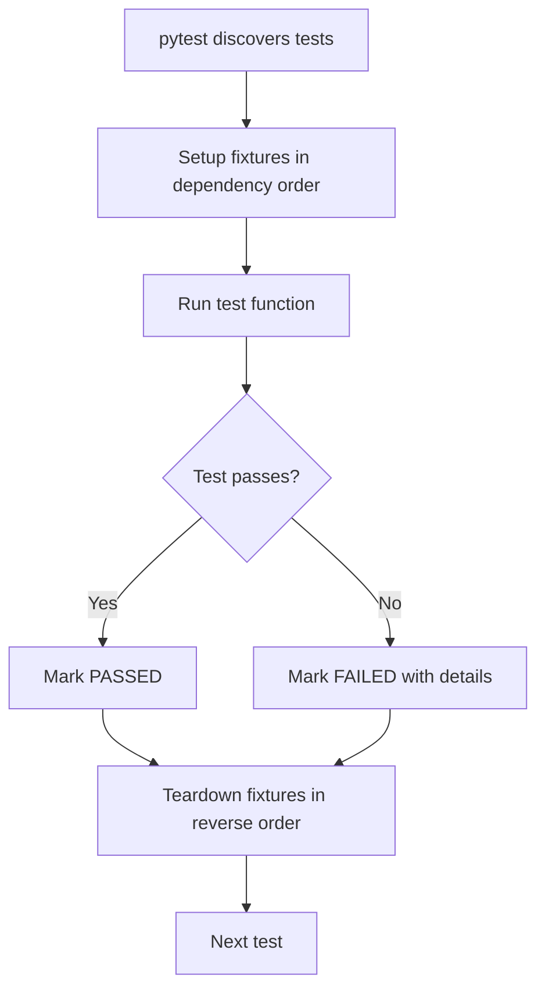

# Python Testing with pytest — Fundamentals


## 🎯 Analogy

Think of pytest like a quality inspector on an assembly line: each test function verifies one behavior, fixtures are pre-assembled test components (database connections, sample data), and parametrize lets you run the same check with 10 different inputs automatically.

---
## Why Testing Matters in Data Engineering

Data pipelines transform millions of records. A subtle bug — wrong date parsing, dropped nulls, incorrect join logic — can corrupt downstream analytics without any visible error. Tests are your safety net against silent data corruption.

**The analogy:** Tests are like quality control checkpoints on a factory assembly line. Each checkpoint verifies the product (data) meets specifications before it moves to the next stage.

---

## pytest Basics — Your First Tests

```python
# tests/test_transforms.py

def test_normalize_email():
    """Simple assertion test."""
    assert normalize_email("  USER@Example.COM  ") == "user@example.com"

def test_parse_amount_valid():
    """Test numeric parsing."""
    assert parse_amount("$1,234.56") == 1234.56

def test_parse_amount_invalid():
    """Test that invalid input raises the right exception."""
    import pytest
    with pytest.raises(ValueError, match="Invalid amount format"):
        parse_amount("not_a_number")

def test_deduplicate_preserves_order():
    """Test with more complex assertions."""
    records = [
        {"id": 1, "name": "Alice"},
        {"id": 2, "name": "Bob"},
        {"id": 1, "name": "Alice"},  # duplicate
    ]
    result = deduplicate(records, key="id")
    
    assert len(result) == 2
    assert result[0]["name"] == "Alice"
    assert result[1]["name"] == "Bob"
```

### Running Tests

```bash
# Run all tests
pytest

# Run specific file
pytest tests/test_transforms.py

# Run specific test
pytest tests/test_transforms.py::test_normalize_email

# Verbose output
pytest -v

# Stop on first failure
pytest -x

# Show print statements
pytest -s
```

---

## Assertions — Rich Comparison

pytest rewrites assertions to show detailed failure information:

```python
def test_schema_matches():
    """pytest shows exactly what differs on failure."""
    expected_columns = ["user_id", "email", "created_at", "status"]
    actual_columns = get_table_schema("users")
    
    assert actual_columns == expected_columns
    # On failure, pytest shows:
    # AssertionError: assert ['user_id', 'email', 'created'] == ['user_id', 'email', 'created_at', 'status']
    #   At index 2: 'created' != 'created_at'

def test_record_count_within_range():
    """Numeric assertions with helpful messages."""
    count = extract_record_count()
    assert count > 0, f"Expected records but got {count}"
    assert count <= 1_000_000, f"Unexpectedly high count: {count}"

def test_data_quality_metrics():
    """Dict comparison — pytest shows missing/extra keys."""
    metrics = run_quality_checks(sample_data)
    
    assert metrics["null_rate"] < 0.01
    assert metrics["duplicate_rate"] == 0.0
    assert metrics["schema_valid"] is True
```

---

## Fixtures — Reusable Test Setup

Fixtures provide test data and resources with automatic cleanup:

```python
import pytest
import tempfile
import csv
import os

@pytest.fixture
def sample_csv(tmp_path):
    """Create a temporary CSV file for testing."""
    filepath = tmp_path / "test_data.csv"
    records = [
        {"user_id": "u1", "email": "alice@test.com", "amount": "100.50"},
        {"user_id": "u2", "email": "bob@test.com", "amount": "200.75"},
        {"user_id": "u3", "email": "carol@test.com", "amount": "invalid"},
    ]
    
    with open(filepath, 'w', newline='') as f:
        writer = csv.DictWriter(f, fieldnames=records[0].keys())
        writer.writeheader()
        writer.writerows(records)
    
    return str(filepath)

@pytest.fixture
def sample_records():
    """Provide test records."""
    return [
        {"user_id": "u1", "event": "login", "timestamp": "2024-01-15T10:00:00"},
        {"user_id": "u2", "event": "purchase", "timestamp": "2024-01-15T11:30:00"},
        {"user_id": "u1", "event": "logout", "timestamp": "2024-01-15T12:00:00"},
    ]

def test_csv_extraction(sample_csv):
    """Fixture is automatically injected by name."""
    records = extract_csv(sample_csv)
    assert len(records) == 3
    assert records[0]["user_id"] == "u1"

def test_filter_by_event(sample_records):
    """Use fixture data in test."""
    logins = filter_events(sample_records, event_type="login")
    assert len(logins) == 1
    assert logins[0]["user_id"] == "u1"
```

### Fixture Scopes

```python
@pytest.fixture(scope="session")
def database_connection():
    """Created once per test session — expensive setup."""
    conn = create_test_database()
    yield conn
    conn.close()  # Cleanup after ALL tests

@pytest.fixture(scope="module")
def test_table(database_connection):
    """Created once per test file."""
    database_connection.execute("CREATE TABLE test_events (...)")
    yield "test_events"
    database_connection.execute("DROP TABLE test_events")

@pytest.fixture  # Default: scope="function" — fresh per test
def clean_table(database_connection, test_table):
    """Truncate before each test for isolation."""
    database_connection.execute(f"TRUNCATE {test_table}")
    yield test_table
```

---

## @pytest.mark.parametrize — Data-Driven Tests

Test the same logic with multiple inputs:

```python
import pytest

@pytest.mark.parametrize("input_email,expected", [
    ("USER@EXAMPLE.COM", "user@example.com"),
    ("  alice@test.com  ", "alice@test.com"),
    ("Bob.Smith@Company.IO", "bob.smith@company.io"),
    ("", ""),
    (None, None),
])
def test_normalize_email(input_email, expected):
    assert normalize_email(input_email) == expected

@pytest.mark.parametrize("amount_str,expected_cents", [
    ("$1,234.56", 123456),
    ("100", 10000),
    ("0.99", 99),
    ("-50.00", -5000),
])
def test_parse_to_cents(amount_str, expected_cents):
    assert parse_to_cents(amount_str) == expected_cents

# Parametrize with IDs for clear test names
@pytest.mark.parametrize("record,is_valid", [
    pytest.param({"user_id": "u1", "email": "a@b.com"}, True, id="valid_record"),
    pytest.param({"user_id": "", "email": "a@b.com"}, False, id="empty_user_id"),
    pytest.param({"user_id": "u1"}, False, id="missing_email"),
    pytest.param({}, False, id="empty_record"),
])
def test_validate_record(record, is_valid):
    assert validate_record(record) == is_valid
```

---

## Test Organization

```
project/
├── src/
│   └── pipeline/
│       ├── extract.py
│       ├── transform.py
│       └── load.py
├── tests/
│   ├── conftest.py          # Shared fixtures
│   ├── test_extract.py      # Tests for extract module
│   ├── test_transform.py    # Tests for transform module
│   ├── test_load.py         # Tests for load module
│   └── integration/
│       ├── conftest.py      # Integration-specific fixtures
│       └── test_pipeline.py # End-to-end tests
└── pytest.ini               # Configuration
```

```ini
# pytest.ini
[pytest]
testpaths = tests
python_files = test_*.py
python_functions = test_*
markers =
    slow: marks tests as slow (deselect with '-m "not slow"')
    integration: marks integration tests
    unit: marks unit tests
```

```python
# tests/conftest.py — shared fixtures available to all tests
import pytest

@pytest.fixture
def sample_config():
    return {
        "source_table": "raw.events",
        "target_table": "curated.events",
        "batch_size": 1000,
    }
```

---

## Testing Exceptions

```python
import pytest

def test_invalid_config_raises():
    """Verify the right exception type and message."""
    with pytest.raises(ValueError, match="batch_size must be positive"):
        PipelineConfig(batch_size=-1)

def test_connection_failure_is_retryable():
    """Verify exception attributes."""
    with pytest.raises(ExtractionError) as exc_info:
        extract_from_dead_server()
    
    assert exc_info.value.retryable is True
    assert "connection" in str(exc_info.value).lower()
```

---

## Test Lifecycle Flow

The flowchart below shows pytest's per-test lifecycle: fixtures are set up in dependency order, the test runs and is marked passed or failed, and fixtures are then torn down in reverse order before the next test starts.



---


## ▶️ Try It Yourself

```python
import pytest

# Function under test
def transform_orders(orders: list[dict]) -> list[dict]:
    return [
        {**o, "amount_eur": round(o["amount"] * 0.92, 2)}
        for o in orders if o["amount"] > 0
    ]

# Fixture: reusable test data
@pytest.fixture
def sample_orders():
    return [
        {"id": 1, "amount": 100.0},
        {"id": 2, "amount": -50.0},  # Should be filtered
        {"id": 3, "amount": 200.0},
    ]

# Basic test
def test_filters_negative(sample_orders):
    result = transform_orders(sample_orders)
    assert len(result) == 2
    assert all(o["amount"] > 0 for o in result)

# Parametrized test: run same assertion with multiple inputs
@pytest.mark.parametrize("amount,expected_eur", [
    (100.0, 92.0),
    (50.0, 46.0),
    (1000.0, 920.0),
])
def test_conversion_rate(amount, expected_eur):
    result = transform_orders([{"id": 1, "amount": amount}])
    assert result[0]["amount_eur"] == expected_eur

# Run: pytest test_transform.py -v
```

> **Run it:** Copy the snippet into a REPL or file — no external services needed for the basic example.

---
## Interview Tips

> **Tip 1:** In DE interviews, mention that you test transforms independently from I/O. "I separate pure transformation logic from side effects (reading files, writing to DBs). The transforms get fast unit tests with parametrize. The I/O gets integration tests with fixtures that set up temp files or mock connections."

> **Tip 2:** Know `pytest.raises` for testing error paths — data pipelines must handle bad data gracefully. If asked "how do you test error handling?", show that you verify the right exceptions are raised with the right messages, not just that "something fails."

> **Tip 3:** Fixture scopes matter for test performance. Explain: "I use session scope for expensive resources like database connections, module scope for test tables, and function scope for data isolation. This keeps the test suite fast while maintaining isolation."
