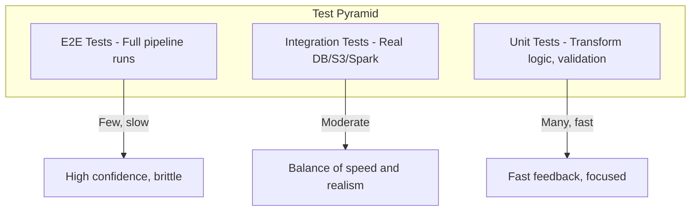

# Python Testing with pytest — Senior Deep Dive

## Testing PySpark ETL Jobs

Testing Spark jobs requires a local SparkSession and DataFrame comparison utilities:

```python
import pytest
from pyspark.sql import SparkSession
from pyspark.sql.types import StructType, StructField, StringType, IntegerType, DoubleType
from datetime import date

@pytest.fixture(scope="session")
def spark():
    """Session-scoped Spark instance — created once for all tests."""
    session = (
        SparkSession.builder
        .master("local[2]")
        .appName("pytest-etl-tests")
        .config("spark.sql.shuffle.partitions", "2")
        .config("spark.default.parallelism", "2")
        .config("spark.sql.warehouse.dir", "/tmp/spark-warehouse-test")
        .getOrCreate()
    )
    yield session
    session.stop()

@pytest.fixture
def sample_events_df(spark):
    """Create a test DataFrame."""
    schema = StructType([
        StructField("user_id", StringType(), False),
        StructField("event_type", StringType(), False),
        StructField("amount", DoubleType(), True),
        StructField("event_date", StringType(), False),
    ])
    data = [
        ("u1", "purchase", 100.0, "2024-01-15"),
        ("u2", "purchase", 200.0, "2024-01-15"),
        ("u1", "refund", -50.0, "2024-01-16"),
        ("u3", "purchase", 150.0, "2024-01-16"),
        ("u2", "purchase", None, "2024-01-16"),
    ]
    return spark.createDataFrame(data, schema)

def test_daily_aggregation(spark, sample_events_df):
    """Test a Spark transformation."""
    from pipeline.transforms import aggregate_daily_revenue
    
    result = aggregate_daily_revenue(sample_events_df)
    
    # Collect to compare (small test data)
    result_rows = {row.event_date: row for row in result.collect()}
    
    assert result_rows["2024-01-15"].total_revenue == 300.0
    assert result_rows["2024-01-15"].transaction_count == 2
    assert result_rows["2024-01-16"].total_revenue == 100.0  # 150 + (-50), null excluded

def test_schema_output(spark, sample_events_df):
    """Verify output schema matches expected contract."""
    from pipeline.transforms import aggregate_daily_revenue
    
    result = aggregate_daily_revenue(sample_events_df)
    
    expected_columns = {"event_date", "total_revenue", "transaction_count", "unique_users"}
    assert set(result.columns) == expected_columns
    assert result.schema["total_revenue"].dataType == DoubleType()
```

### DataFrame Comparison Utility

```python
def assert_dataframes_equal(actual, expected, order_by=None):
    """
    Compare two DataFrames for equality.
    Handles column ordering and row ordering.
    """
    # Same columns
    assert set(actual.columns) == set(expected.columns), (
        f"Column mismatch: {set(actual.columns)} != {set(expected.columns)}"
    )
    
    # Same count
    assert actual.count() == expected.count(), (
        f"Row count mismatch: {actual.count()} != {expected.count()}"
    )
    
    # Same data (order-independent comparison)
    if order_by:
        actual = actual.orderBy(order_by)
        expected = expected.orderBy(order_by)
    
    actual_rows = [row.asDict() for row in actual.collect()]
    expected_rows = [row.asDict() for row in expected.collect()]
    
    for i, (a, e) in enumerate(zip(actual_rows, expected_rows)):
        assert a == e, f"Row {i} differs: {a} != {e}"
```

---

## Testing with Temporary S3 (moto)

```python
import pytest
import boto3
from moto import mock_aws
import json

@pytest.fixture
def s3_bucket():
    """Create a mock S3 bucket for testing."""
    with mock_aws():
        client = boto3.client("s3", region_name="us-east-1")
        client.create_bucket(Bucket="test-data-lake")
        
        # Pre-populate with test data
        test_records = [
            {"user_id": "u1", "event": "login"},
            {"user_id": "u2", "event": "purchase"},
        ]
        client.put_object(
            Bucket="test-data-lake",
            Key="raw/events/2024-01-15/data.json",
            Body=json.dumps(test_records)
        )
        
        yield client

def test_s3_extraction(s3_bucket):
    """Test S3 reading logic with mocked AWS."""
    from pipeline.extract import read_events_from_s3
    
    records = read_events_from_s3(
        bucket="test-data-lake",
        prefix="raw/events/2024-01-15/"
    )
    
    assert len(records) == 2
    assert records[0]["user_id"] == "u1"

def test_s3_write_partitioned(s3_bucket):
    """Test S3 writing logic."""
    from pipeline.load import write_partitioned
    
    records = [
        {"user_id": "u1", "event_date": "2024-01-15"},
        {"user_id": "u2", "event_date": "2024-01-16"},
    ]
    
    write_partitioned(records, bucket="test-data-lake", prefix="curated/")
    
    # Verify files were created
    response = s3_bucket.list_objects_v2(
        Bucket="test-data-lake", Prefix="curated/"
    )
    keys = [obj["Key"] for obj in response["Contents"]]
    assert any("2024-01-15" in k for k in keys)
    assert any("2024-01-16" in k for k in keys)
```

---

## Database Fixtures with Testcontainers

```python
import pytest
from testcontainers.postgres import PostgresContainer

@pytest.fixture(scope="session")
def postgres():
    """Real PostgreSQL in Docker for integration tests."""
    with PostgresContainer("postgres:15") as pg:
        yield pg

@pytest.fixture(scope="session")
def db_connection(postgres):
    """Connection to test database."""
    import psycopg2
    conn = psycopg2.connect(postgres.get_connection_url())
    
    # Create schema
    with conn.cursor() as cur:
        cur.execute("""
            CREATE TABLE events (
                id SERIAL PRIMARY KEY,
                user_id VARCHAR(50) NOT NULL,
                event_type VARCHAR(50) NOT NULL,
                amount NUMERIC(10,2),
                created_at TIMESTAMP DEFAULT NOW()
            )
        """)
    conn.commit()
    yield conn
    conn.close()

@pytest.fixture
def clean_db(db_connection):
    """Truncate tables before each test."""
    with db_connection.cursor() as cur:
        cur.execute("TRUNCATE events RESTART IDENTITY")
    db_connection.commit()
    yield db_connection

def test_batch_insert(clean_db):
    """Integration test with real database."""
    from pipeline.load import batch_insert
    
    records = [
        {"user_id": "u1", "event_type": "login", "amount": None},
        {"user_id": "u2", "event_type": "purchase", "amount": 99.99},
    ]
    
    batch_insert(clean_db, "events", records)
    
    with clean_db.cursor() as cur:
        cur.execute("SELECT COUNT(*) FROM events")
        assert cur.fetchone()[0] == 2
```

---

## Property-Based Testing with Hypothesis

Instead of writing specific examples, describe properties that should always hold:

```python
from hypothesis import given, strategies as st, settings
import hypothesis

@given(st.lists(st.dictionaries(
    keys=st.sampled_from(["user_id", "amount", "timestamp"]),
    values=st.one_of(st.text(), st.integers(), st.none())
), min_size=0, max_size=100))
def test_deduplicate_never_adds_records(records):
    """Property: dedup output is always <= input size."""
    result = deduplicate(records, key="user_id")
    assert len(result) <= len(records)

@given(st.lists(st.integers(), min_size=1))
def test_batch_chunking_preserves_all_items(data):
    """Property: chunking doesn't lose or duplicate items."""
    chunks = list(make_batches(data, batch_size=10))
    flattened = [item for chunk in chunks for item in chunk]
    assert flattened == data

@given(st.dictionaries(
    keys=st.text(min_size=1, max_size=20),
    values=st.one_of(
        st.text(),
        st.integers(),
        st.floats(allow_nan=False),
        st.none()
    )
))
def test_serialize_deserialize_roundtrip(record):
    """Property: serialization is lossless."""
    import json
    serialized = json.dumps(record)
    deserialized = json.loads(serialized)
    assert deserialized == record

@given(st.integers(min_value=1, max_value=10000))
@settings(max_examples=50)
def test_partition_count_matches_config(num_partitions):
    """Property: partitioner produces exactly N partitions."""
    data = list(range(100))
    partitions = hash_partition(data, num_partitions)
    assert len(partitions) == num_partitions
    # All items accounted for
    total = sum(len(p) for p in partitions)
    assert total == len(data)
```

---

## Integration Test Patterns

```python
import pytest
from datetime import datetime

@pytest.mark.integration
class TestFullPipelineRun:
    """End-to-end pipeline test."""
    
    @pytest.fixture(autouse=True)
    def setup_pipeline(self, spark, s3_bucket, clean_db):
        """Setup all resources needed for integration test."""
        self.spark = spark
        self.s3 = s3_bucket
        self.db = clean_db
    
    def test_extract_transform_load(self):
        """Full ETL cycle."""
        from pipeline.main import run_daily_pipeline
        
        # Seed source data
        self._seed_source_data()
        
        # Run pipeline
        result = run_daily_pipeline(
            source_bucket="test-data-lake",
            target_connection=self.db,
            execution_date="2024-01-15",
            spark=self.spark
        )
        
        # Verify outcomes
        assert result.status == "success"
        assert result.records_loaded > 0
        assert result.error_count == 0
        
        # Verify data in target
        with self.db.cursor() as cur:
            cur.execute("SELECT COUNT(*) FROM events WHERE event_date = '2024-01-15'")
            assert cur.fetchone()[0] == result.records_loaded
    
    def _seed_source_data(self):
        """Put test data in mock S3."""
        import json
        self.s3.put_object(
            Bucket="test-data-lake",
            Key="raw/events/dt=2024-01-15/data.json",
            Body=json.dumps([{"user_id": "u1", "event": "test"}])
        )
```

---

## Test Pyramid for Data Pipelines

The diagram below maps the test pyramid to data pipelines: many fast unit tests at the base cover transform logic, a moderate layer of integration tests exercises real systems, and a few slow end-to-end tests sit on top for full-pipeline confidence.



---

## Interview Tips

> **Tip 1:** For PySpark testing, explain the "local mode" strategy: "I run Spark in local[2] mode with minimal shuffle partitions for tests. This gives real Spark behavior without cluster overhead. Tests run in seconds and catch real issues like null handling and schema mismatches."

> **Tip 2:** Property-based testing impresses in senior interviews. Frame it: "Instead of testing specific examples, I test invariants — 'dedup never adds records', 'serialization is lossless', 'partitioning preserves all items'. Hypothesis generates hundreds of edge cases I'd never think of, like empty inputs, unicode strings, and extreme values."

> **Tip 3:** Know the test pyramid tradeoffs for DE: "Unit tests for transform logic are fast and focused. Integration tests with testcontainers give confidence in real DB interactions. E2E tests verify the full pipeline works but are expensive to maintain. I invest most in unit tests, use integration for critical paths, and have minimal E2E for smoke tests."
