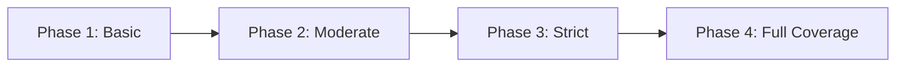

# Python Type Hints — Senior Deep Dive

## Running mypy in CI/CD

Integrating mypy into your CI pipeline catches type regressions before merge.

```yaml
# .github/workflows/type-check.yml
name: Type Check
on: [pull_request]

jobs:
  mypy:
    runs-on: ubuntu-latest
    steps:
      - uses: actions/checkout@v4
      - uses: actions/setup-python@v5
        with:
          python-version: '3.11'
      - run: pip install -e ".[dev]"
      - run: mypy src/ --config-file pyproject.toml
        name: Run mypy strict check
```

```toml
# pyproject.toml — production-grade mypy config
[tool.mypy]
python_version = "3.11"
strict = true
warn_return_any = true
warn_unused_configs = true
disallow_untyped_defs = true
disallow_any_generics = true
no_implicit_reexport = true
check_untyped_defs = true

# Per-module overrides for gradual adoption
[[tool.mypy.overrides]]
module = "tests.*"
disallow_untyped_defs = false

[[tool.mypy.overrides]]
module = "legacy_module.*"
ignore_errors = true

[[tool.mypy.overrides]]
module = ["pyspark.*", "boto3.*"]
ignore_missing_imports = true
```

---

## Strict Mode Migration Strategy

Moving a large codebase to `strict = true` requires a phased approach.



| Phase | Settings | Effort |
|-------|----------|--------|
| 1. Basic | `ignore_missing_imports = true`, no strict | Low — just run mypy, fix obvious errors |
| 2. Moderate | `disallow_untyped_defs = true` on new code | Medium — all new functions need hints |
| 3. Strict | `strict = true` with per-module overrides | High — fix remaining Any usage |
| 4. Full | Remove all overrides, zero mypy errors | Ongoing — enforce in CI gate |

```python
# Gradual typing: use type: ignore for legacy code you'll fix later
def legacy_function(data):  # type: ignore[no-untyped-def]
    return process(data)

# Reveal type for debugging complex inferences
from typing import reveal_type
result = complex_operation()
reveal_type(result)  # mypy will print the inferred type
```

---

## Typing Decorators with ParamSpec and Concatenate

```python
from typing import ParamSpec, TypeVar, Callable, Concatenate
from functools import wraps
import logging

P = ParamSpec('P')
R = TypeVar('R')

def with_logging(
    func: Callable[Concatenate[str, P], R]
) -> Callable[Concatenate[str, P], R]:
    """Decorator that requires first arg to be a job_name string."""
    @wraps(func)
    def wrapper(job_name: str, *args: P.args, **kwargs: P.kwargs) -> R:
        logging.info(f"Starting {job_name}")
        try:
            result = func(job_name, *args, **kwargs)
            logging.info(f"Completed {job_name}")
            return result
        except Exception as e:
            logging.error(f"Failed {job_name}: {e}")
            raise
    return wrapper

@with_logging
def run_etl(job_name: str, source: str, target: str) -> int:
    # mypy knows full signature is preserved
    return 100

run_etl("daily_load", source="s3://raw/", target="s3://curated/")
```

---

## Typing Pandas DataFrames with Pandera

Standard pandas has minimal type support. Pandera adds schema validation.

```python
import pandas as pd
import pandera as pa
from pandera.typing import DataFrame, Series

class UserSchema(pa.DataFrameModel):
    user_id: Series[int] = pa.Field(gt=0, unique=True)
    email: Series[str] = pa.Field(str_matches=r'^[\w.]+@[\w]+\.[\w]+$')
    created_at: Series[pd.Timestamp]
    revenue: Series[float] = pa.Field(ge=0)
    segment: Series[str] = pa.Field(isin=["free", "pro", "enterprise"])

    class Config:
        strict = True  # No extra columns allowed
        coerce = True  # Auto-coerce types

@pa.check_types
def transform_users(raw_df: DataFrame[UserSchema]) -> DataFrame[UserSchema]:
    """Pandera validates input AND output match the schema."""
    return raw_df.assign(
        revenue=raw_df["revenue"].fillna(0)
    )

# At runtime, pandera raises SchemaError with clear column/row info
try:
    result = transform_users(dirty_dataframe)
except pa.errors.SchemaErrors as e:
    print(e.failure_cases)  # Shows exactly which rows/columns failed
```

---

## Type Narrowing

Type narrowing helps mypy understand types within conditional branches.

```python
from typing import TypeGuard

class RawRecord:
    data: str | None
    source: str

class ValidRecord:
    data: str
    source: str
    validated_at: float

def is_valid_record(record: RawRecord) -> TypeGuard[ValidRecord]:
    """TypeGuard tells mypy: if True, record is ValidRecord."""
    return record.data is not None and len(record.data) > 0

def process_records(records: list[RawRecord]) -> list[ValidRecord]:
    valid = []
    for record in records:
        if is_valid_record(record):
            # mypy now knows record is ValidRecord here
            valid.append(record)
    return valid

# isinstance also narrows types
def handle_result(result: str | int | None) -> str:
    if result is None:
        return "missing"
    if isinstance(result, int):
        return f"count: {result}"  # mypy knows result is int here
    return result.upper()          # mypy knows result is str here
```

---

## Variance: Covariant and Contravariant

Variance controls how generic types relate in subtype hierarchies.

```python
from typing import TypeVar, Generic

# Covariant: Producer[Child] is subtype of Producer[Parent]
T_co = TypeVar('T_co', covariant=True)

class DataReader(Generic[T_co]):
    """Read-only container — covariant is safe."""
    def __init__(self, data: list[T_co]) -> None:
        self._data = data
    
    def read(self) -> T_co:
        return self._data[0]

# Contravariant: Consumer[Parent] is subtype of Consumer[Child]
T_contra = TypeVar('T_contra', contravariant=True)

class DataWriter(Generic[T_contra]):
    """Write-only sink — contravariant is safe."""
    def write(self, item: T_contra) -> None:
        ...

# Invariant (default): no subtyping relationship
# list[int] is NOT a subtype of list[float]
```

| Variance | Keyword | Use When | Analogy |
|----------|---------|----------|---------|
| Covariant | `covariant=True` | Type only appears in return position | Producer/Reader |
| Contravariant | `contravariant=True` | Type only appears in argument position | Consumer/Writer |
| Invariant | default | Type appears in both positions | list, dict |

---

## Conditional Types with @overload

```python
from typing import overload, Literal

@overload
def read_data(path: str, as_df: Literal[True]) -> pd.DataFrame: ...
@overload
def read_data(path: str, as_df: Literal[False]) -> list[dict]: ...

def read_data(path: str, as_df: bool = True) -> pd.DataFrame | list[dict]:
    data = load_file(path)
    if as_df:
        return pd.DataFrame(data)
    return data

# mypy infers the correct return type based on the literal argument
df = read_data("data.parquet", as_df=True)     # pd.DataFrame
records = read_data("data.parquet", as_df=False)  # list[dict]
```

---

## Plugin Development for mypy

Custom mypy plugins add type inference for domain-specific patterns.

```python
# mypy_plugin.py — minimal plugin skeleton
from mypy.plugin import Plugin, FunctionContext
from mypy.types import Type

class PipelinePlugin(Plugin):
    def get_function_hook(self, fullname: str):
        if fullname == "pipeline.core.register_task":
            return self.register_task_hook
        return None
    
    def register_task_hook(self, ctx: FunctionContext) -> Type:
        """Add custom type inference for register_task()."""
        # Analyze arguments, return refined type
        return ctx.default_return_type

def plugin(version: str):
    return PipelinePlugin
```

```toml
# pyproject.toml — register the plugin
[tool.mypy]
plugins = ["mypy_plugin"]
```

**When to write a plugin:**
- Your internal framework has patterns mypy can't infer
- You use dynamic class generation (like SQLAlchemy models)
- You want to enforce domain rules at the type level

---

## Advanced Patterns Comparison

| Pattern | Use Case | Complexity |
|---------|----------|------------|
| ParamSpec + Concatenate | Typed decorators | High |
| TypeGuard | Custom type narrowing functions | Medium |
| @overload + Literal | Return type depends on input value | Medium |
| Covariant TypeVar | Read-only generic containers | High |
| mypy plugin | Framework-specific inference | Very High |
| Pandera schemas | DataFrame validation | Medium |

---

## Interview Tips

> **Tip 1:** "How would you migrate a 100k-line codebase to strict typing?" — "Phased approach: (1) Run mypy in non-strict mode, fix the easy errors. (2) Enable `disallow_untyped_defs` for new code only using per-module overrides. (3) Add a CI gate that blocks PRs with new mypy errors. (4) Incrementally remove overrides module by module. The key is never breaking the build — typing is additive, not a big-bang migration."

> **Tip 2:** "What's the difference between covariant and contravariant?" — "Covariant means a generic type follows the subtype direction: Reader[Dog] is a subtype of Reader[Animal] because you can always read an Animal from a Dog reader. Contravariant is the opposite: Writer[Animal] is a subtype of Writer[Dog] because if you can write any Animal, you can certainly write a Dog. It matters for generic container APIs."

> **Tip 3:** "How do you type pandas code?" — "Standard pandas has weak typing. Use Pandera for schema validation — define DataFrameModel classes with column types and constraints. Pandera validates at runtime via decorators and integrates with mypy for static checks. For pure static typing, pandas-stubs provides basic type information but doesn't validate column schemas."
