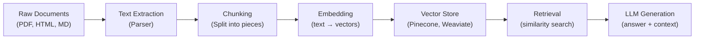
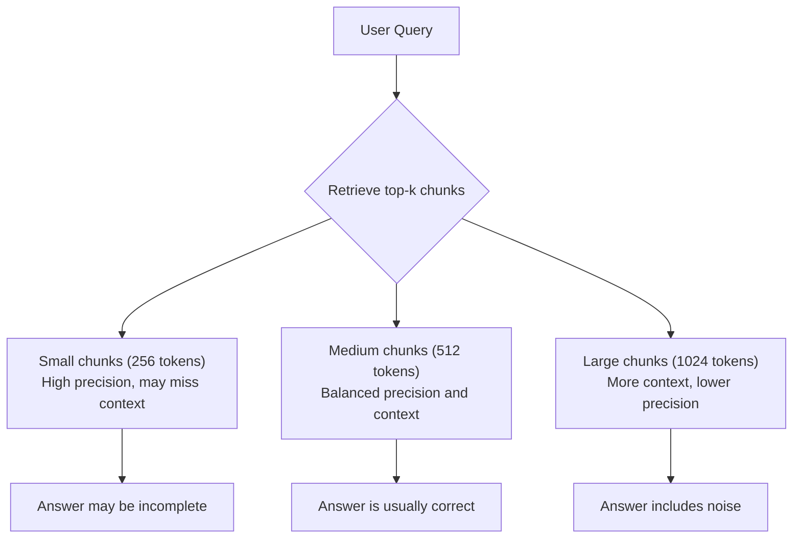

# Chunking Strategies — Fundamentals

## Why Chunking Matters

Chunking is the process of breaking large documents into smaller pieces (chunks) before embedding them and storing them in a vector database. It's the **most impactful decision** in a RAG pipeline — get it wrong and your retrieval quality collapses regardless of how good your LLM is.

Three fundamental reasons chunking exists:

1. **Context window limits** — LLMs have fixed input sizes (4K–128K tokens). You can't stuff an entire 500-page manual into a prompt.
2. **Retrieval precision** — Smaller chunks mean more targeted retrieval. A 10-page chunk about "databases" is less useful than a 200-word chunk specifically about "PostgreSQL connection pooling."
3. **Embedding quality** — Embedding models produce better vector representations for focused, coherent text than for long, topic-shifting documents.

> **Key Insight for Data Engineers:** Chunking is a data transformation step. Think of it like partitioning in a data warehouse — the way you split data determines query performance. Bad partitioning = full table scans. Bad chunking = irrelevant retrieval.

---

## The Document-to-Answer Pipeline



**What this shows:** Documents flow through a pipeline where chunking sits between parsing and embedding. As a Data Engineer, you own steps A through E — the data infrastructure that makes RAG possible. The quality of your chunking directly determines how good the retrieval (F) and generation (G) steps perform.

---

## Fixed-Size Chunking

The simplest approach: split text every N characters or N tokens, regardless of content.

### Character-Based Splitting

```python
def fixed_size_chunks(text: str, chunk_size: int = 1000, overlap: int = 200) -> list[str]:
    """Split text into fixed-size character chunks with overlap."""
    chunks = []
    start = 0
    while start < len(text):
        end = start + chunk_size
        chunk = text[start:end]
        chunks.append(chunk)
        start += chunk_size - overlap  # Step forward by (size - overlap)
    return chunks

# Example
document = "A very long document..." * 500
chunks = fixed_size_chunks(document, chunk_size=1000, overlap=200)
print(f"Document: {len(document)} chars → {len(chunks)} chunks")
```

### Token-Based Splitting

```python
import tiktoken

def token_based_chunks(text: str, chunk_size: int = 512, overlap: int = 50, model: str = "cl100k_base") -> list[str]:
    """Split text into fixed-size token chunks with overlap."""
    encoder = tiktoken.get_encoding(model)
    tokens = encoder.encode(text)
    
    chunks = []
    start = 0
    while start < len(tokens):
        end = start + chunk_size
        chunk_tokens = tokens[start:end]
        chunk_text = encoder.decode(chunk_tokens)
        chunks.append(chunk_text)
        start += chunk_size - overlap
    return chunks

# Token counting matters because embedding models have token limits
# OpenAI text-embedding-3-small: max 8191 tokens
chunks = token_based_chunks(long_document, chunk_size=512, overlap=50)
```

**When to use fixed-size chunking:**
- Quick prototyping and baseline RAG pipelines
- When documents have no clear structural markers
- When you need predictable, uniform chunk sizes for cost estimation

**Downsides:**
- Splits mid-sentence, mid-paragraph, even mid-word
- Ignores semantic boundaries — a chunk might contain the end of one topic and the start of another

---

## Separator-Based Chunking

Split on natural text boundaries: paragraphs, sentences, or newlines.

```python
def separator_chunking(text: str, separators: list[str] = None, chunk_size: int = 1000) -> list[str]:
    """Split text on separators, then combine pieces up to chunk_size."""
    if separators is None:
        separators = ["\n\n", "\n", ". ", " "]
    
    # Split on the first separator that produces pieces
    pieces = [text]
    for sep in separators:
        new_pieces = []
        for piece in pieces:
            if len(piece) > chunk_size:
                new_pieces.extend(piece.split(sep))
            else:
                new_pieces.append(piece)
        pieces = new_pieces
    
    # Combine small pieces into chunks up to chunk_size
    chunks = []
    current_chunk = ""
    for piece in pieces:
        if len(current_chunk) + len(piece) <= chunk_size:
            current_chunk += piece
        else:
            if current_chunk:
                chunks.append(current_chunk.strip())
            current_chunk = piece
    if current_chunk:
        chunks.append(current_chunk.strip())
    
    return chunks
```

**Separator hierarchy (most to least preferred):**

| Priority | Separator | Rationale |
|----------|-----------|-----------|
| 1 | `\n\n` | Paragraph breaks — strongest semantic boundary |
| 2 | `\n` | Line breaks — usually section/list boundaries |
| 3 | `. ` | Sentence endings — complete thoughts |
| 4 | ` ` | Word boundaries — last resort |

> **Best Practice:** Always try higher-priority separators first. Splitting at paragraph boundaries preserves the most meaning.

---

## Chunk Size Considerations

| Chunk Size | Tokens | Best For | Trade-offs |
|-----------|--------|----------|-----------|
| Small | 128–256 | Precise factual Q&A | May lose context, more chunks to search |
| Medium | 256–512 | General-purpose RAG | Good balance of precision and context |
| Large | 512–1024 | Summarization, complex topics | Less precise retrieval, more noise |
| Very Large | 1024+ | Long-form analysis | Loses retrieval benefit, high cost |

**The chunk size dilemma:**

```
Too small (< 128 tokens):
  ✗ Loses surrounding context
  ✗ "The company was founded in 2010" — which company?
  ✗ More embeddings to compute and store (cost ↑)

Too large (> 1024 tokens):
  ✗ Retrieves irrelevant content alongside relevant content
  ✗ Uses more of the LLM's context window per chunk
  ✗ Embedding quality degrades (too many topics in one vector)

Sweet spot (256–512 tokens):
  ✓ Complete thoughts with enough context
  ✓ Embedding models trained on this range
  ✓ Good retrieval precision without excessive fragmentation
```

---

## Overlap: Why It Matters

Overlap means adjacent chunks share some text. Without overlap, information at chunk boundaries gets split and becomes unretrievable.

```python
# WITHOUT overlap — information at boundary is split
chunk_1 = "...PostgreSQL supports several types of indexes including"
chunk_2 = "B-tree, Hash, GiST, and GIN indexes. B-tree is the default..."

# WITH 20% overlap — boundary information preserved in both chunks
chunk_1 = "...PostgreSQL supports several types of indexes including B-tree, Hash, GiST, and GIN indexes."
chunk_2 = "types of indexes including B-tree, Hash, GiST, and GIN indexes. B-tree is the default..."
```

**Overlap guidelines:**

| Overlap % | Tokens (for 512-token chunks) | Use Case |
|----------|-------------------------------|----------|
| 0% | 0 | When chunks are semantically complete (e.g., each is a full section) |
| 10% | ~50 | Minimal safety net for boundary splits |
| 15–20% | ~75–100 | Recommended default — good boundary coverage |
| 25%+ | 128+ | When information density is high and boundaries are unpredictable |

> **Rule of thumb:** Start with 10–20% overlap. If users report answers that seem "cut off" or incomplete, increase overlap. If storage costs are a concern and retrieval is good, reduce it.

---

## Chunk Size vs. Retrieval Quality



**What this shows:** Chunk size directly affects retrieval quality. Smaller chunks are more precisely matched but may lack context. Larger chunks provide context but dilute the relevance signal. Medium (512) is the standard starting point.

---

## Practical Implementation with LangChain

```python
from langchain.text_splitter import (
    CharacterTextSplitter,
    RecursiveCharacterTextSplitter,
)

# Basic character splitter (splits on a single separator)
char_splitter = CharacterTextSplitter(
    separator="\n\n",
    chunk_size=1000,
    chunk_overlap=200,
    length_function=len,
)

# Recursive splitter (tries separators in order) — RECOMMENDED
recursive_splitter = RecursiveCharacterTextSplitter(
    chunk_size=1000,
    chunk_overlap=200,
    separators=["\n\n", "\n", ". ", " "],
    length_function=len,
)

# Usage
with open("large_document.txt") as f:
    text = f.read()

chunks = recursive_splitter.split_text(text)
print(f"Split into {len(chunks)} chunks")
print(f"Average chunk size: {sum(len(c) for c in chunks) / len(chunks):.0f} chars")
```

---

## Quick Reference: Choosing Your First Chunking Strategy

| Document Type | Recommended Strategy | Chunk Size | Overlap |
|--------------|---------------------|-----------|---------|
| Technical docs | Recursive separator | 512 tokens | 15% |
| FAQs / Short articles | Paragraph-based | 256 tokens | 10% |
| Legal documents | Sentence-based | 512 tokens | 20% |
| Code files | Language-aware split | 1000 chars | 0% |
| Chat logs | Message-based | 256 tokens | 0% |

---

## Interview Tips

> **Tip 1:** "Why do we need chunking?" — "LLMs have context limits, but more importantly, chunking controls retrieval precision. A vector search returns the most similar chunks — if chunks are too large, you retrieve irrelevant noise alongside the answer. If too small, you lose context. It's like database indexing: the granularity of your index determines query performance."

> **Tip 2:** "What chunk size do you use?" — "I start with 512 tokens and 15% overlap as a baseline, then evaluate using retrieval metrics. For factual Q&A I go smaller (256), for summarization tasks I go larger (1024). The right answer depends on your embedding model, query patterns, and what you measure."

> **Tip 3:** "Fixed-size vs separator-based?" — "Always prefer separator-based (recursive) in production. Fixed-size is only for quick prototypes. Splitting mid-sentence creates chunks that are hard to embed meaningfully and confusing when retrieved as context."

