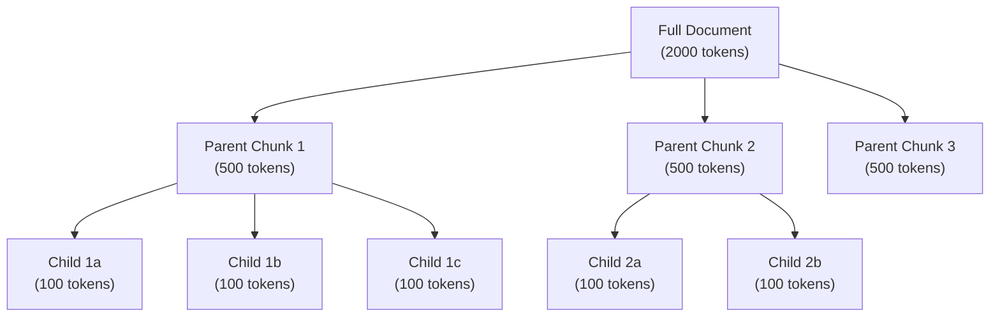

# Chunking Strategies — Intermediate

## Semantic Chunking

Instead of splitting at fixed character counts, semantic chunking splits where the **meaning changes** — detected by embedding similarity between consecutive sentences.

```python
from sentence_transformers import SentenceTransformer
import numpy as np

class SemanticChunker:
    """Split text where semantic meaning shifts between sentences."""
    
    def __init__(self, model_name: str = "all-MiniLM-L6-v2", threshold: float = 0.5):
        self.model = SentenceTransformer(model_name)
        self.threshold = threshold  # Similarity below this = split point
    
    def chunk(self, text: str) -> list[str]:
        # Step 1: Split into sentences
        sentences = self._split_sentences(text)
        if len(sentences) <= 1:
            return [text]
        
        # Step 2: Embed all sentences
        embeddings = self.model.encode(sentences, normalize_embeddings=True)
        
        # Step 3: Find semantic break points
        similarities = []
        for i in range(len(embeddings) - 1):
            sim = np.dot(embeddings[i], embeddings[i + 1])
            similarities.append(sim)
        
        # Step 4: Split where similarity drops below threshold
        chunks = []
        current_chunk = [sentences[0]]
        
        for i, sim in enumerate(similarities):
            if sim < self.threshold:
                # Semantic break — start new chunk
                chunks.append(" ".join(current_chunk))
                current_chunk = [sentences[i + 1]]
            else:
                current_chunk.append(sentences[i + 1])
        
        chunks.append(" ".join(current_chunk))  # Last chunk
        return chunks
    
    def _split_sentences(self, text: str) -> list[str]:
        """Basic sentence splitting."""
        import re
        sentences = re.split(r'(?<=[.!?])\s+', text)
        return [s.strip() for s in sentences if s.strip()]

# Usage
chunker = SemanticChunker(threshold=0.45)
chunks = chunker.chunk(long_document)
# Chunks will split at topic boundaries, not mid-paragraph
```

**When to use:** Documents with multiple distinct sections (research papers, documentation) where fixed-size chunking would split in the middle of a concept.

---

## Recursive Character Text Splitter (LangChain Approach)

This splitter tries progressively smaller separators until chunks fit within the size limit:

```python
from langchain.text_splitter import RecursiveCharacterTextSplitter

# The default separator hierarchy: try to split at natural boundaries
splitter = RecursiveCharacterTextSplitter(
    chunk_size=500,           # Target chunk size (characters)
    chunk_overlap=50,         # Overlap between chunks
    separators=[
        "\n\n",   # Try paragraph breaks first
        "\n",     # Then line breaks
        ". ",     # Then sentences
        ", ",     # Then clauses
        " ",      # Then words
        ""        # Last resort: character-level
    ],
    length_function=len,
)

chunks = splitter.split_text(document_text)
# Result: chunks that respect paragraph/sentence boundaries where possible
```

### Custom Recursive Splitter for Code

```python
# For Python code: split at logical boundaries
code_splitter = RecursiveCharacterTextSplitter.from_language(
    language="python",
    chunk_size=1000,
    chunk_overlap=100,
)
# Separators for Python: class → function → method → if/for → line

# For Markdown: respect headers
md_splitter = RecursiveCharacterTextSplitter(
    chunk_size=500,
    chunk_overlap=50,
    separators=[
        "\n## ",    # H2 headers
        "\n### ",   # H3 headers
        "\n\n",     # Paragraphs
        "\n",       # Lines
        ". ",       # Sentences
    ]
)
```

---

## Parent-Child Chunking

Small chunks are precise for retrieval, but lose context. Parent-child chunking solves this by retrieving small chunks but returning the larger parent context.

The following diagram shows how parent-child chunking stores both granular and contextual representations:



The small child chunks are embedded and stored in the vector DB for precise retrieval. When a child matches, its parent chunk is returned to the LLM for richer context.

```python
from dataclasses import dataclass
from typing import Optional

@dataclass
class Chunk:
    id: str
    text: str
    parent_id: Optional[str]
    metadata: dict

class ParentChildChunker:
    """Create hierarchical chunks: small for search, large for context."""
    
    def __init__(self, parent_size: int = 2000, child_size: int = 400, overlap: int = 50):
        self.parent_size = parent_size
        self.child_size = child_size
        self.overlap = overlap
    
    def chunk_document(self, doc_id: str, text: str) -> tuple[list[Chunk], list[Chunk]]:
        """Returns (parent_chunks, child_chunks)."""
        parents = []
        children = []
        
        # Create parent chunks
        parent_texts = self._split(text, self.parent_size, self.overlap)
        for i, parent_text in enumerate(parent_texts):
            parent = Chunk(
                id=f"{doc_id}_parent_{i}",
                text=parent_text,
                parent_id=None,
                metadata={"doc_id": doc_id, "chunk_type": "parent", "index": i}
            )
            parents.append(parent)
            
            # Create child chunks within this parent
            child_texts = self._split(parent_text, self.child_size, 0)
            for j, child_text in enumerate(child_texts):
                child = Chunk(
                    id=f"{doc_id}_child_{i}_{j}",
                    text=child_text,
                    parent_id=parent.id,
                    metadata={"doc_id": doc_id, "chunk_type": "child", "parent_id": parent.id}
                )
                children.append(child)
        
        return parents, children
    
    def _split(self, text: str, size: int, overlap: int) -> list[str]:
        chunks = []
        start = 0
        while start < len(text):
            end = start + size
            chunks.append(text[start:end])
            start = end - overlap
        return chunks

# Retrieval flow:
# 1. Embed CHILD chunks → store in vector DB with parent_id metadata
# 2. Query matches child chunks (precise)
# 3. Look up parent chunks by parent_id (rich context)
# 4. Send parent text to LLM (more context than just the child)
```

---

## Document-Type-Specific Strategies

### PDF Documents

```python
import fitz  # PyMuPDF

def chunk_pdf(pdf_path: str, chunk_size: int = 500) -> list[dict]:
    """Extract and chunk PDF preserving page metadata."""
    doc = fitz.open(pdf_path)
    chunks = []
    
    for page_num, page in enumerate(doc):
        text = page.get_text()
        
        # Split page text into chunks
        page_chunks = recursive_split(text, chunk_size)
        
        for i, chunk_text in enumerate(page_chunks):
            chunks.append({
                "text": chunk_text,
                "metadata": {
                    "source": pdf_path,
                    "page": page_num + 1,
                    "chunk_index": i,
                }
            })
    
    return chunks
```

### HTML Documents

```python
from bs4 import BeautifulSoup

def chunk_html(html: str, chunk_size: int = 500) -> list[dict]:
    """Chunk HTML preserving section structure."""
    soup = BeautifulSoup(html, "html.parser")
    chunks = []
    
    # Split by headers (h1, h2, h3)
    current_section = ""
    current_header = ""
    
    for element in soup.find_all(["h1", "h2", "h3", "p", "li", "pre"]):
        if element.name in ["h1", "h2", "h3"]:
            if current_section:
                chunks.append({"text": current_section, "metadata": {"header": current_header}})
            current_header = element.get_text()
            current_section = current_header + "\n"
        else:
            text = element.get_text()
            if len(current_section) + len(text) > chunk_size:
                chunks.append({"text": current_section, "metadata": {"header": current_header}})
                current_section = current_header + "\n" + text + "\n"
            else:
                current_section += text + "\n"
    
    if current_section:
        chunks.append({"text": current_section, "metadata": {"header": current_header}})
    
    return chunks
```

### Tables and Structured Data

```python
def chunk_table(table_data: list[dict], table_name: str) -> list[dict]:
    """Convert table rows to natural language chunks for embedding."""
    chunks = []
    
    # Create a summary chunk for the table schema
    columns = list(table_data[0].keys())
    schema_chunk = f"Table: {table_name}. Columns: {', '.join(columns)}. Contains {len(table_data)} rows."
    chunks.append({"text": schema_chunk, "metadata": {"type": "schema", "table": table_name}})
    
    # Convert rows to natural language (batch by 5-10 rows per chunk)
    batch_size = 5
    for i in range(0, len(table_data), batch_size):
        batch = table_data[i:i+batch_size]
        text_rows = []
        for row in batch:
            row_text = ". ".join(f"{k}: {v}" for k, v in row.items())
            text_rows.append(row_text)
        
        chunk_text = f"From table {table_name}:\n" + "\n".join(text_rows)
        chunks.append({
            "text": chunk_text,
            "metadata": {"type": "rows", "table": table_name, "row_start": i}
        })
    
    return chunks
```

---

## Metadata Preservation During Chunking

Always preserve context about where a chunk came from:

```python
@dataclass
class ChunkWithMetadata:
    text: str
    doc_id: str
    source_file: str
    page_number: Optional[int]
    section_header: Optional[str]
    chunk_index: int
    total_chunks: int
    start_char: int
    end_char: int
    
    def to_vector_metadata(self) -> dict:
        """Metadata stored alongside the vector for filtering and context."""
        return {
            "doc_id": self.doc_id,
            "source": self.source_file,
            "page": self.page_number,
            "section": self.section_header,
            "chunk_idx": self.chunk_index,
            "total_chunks": self.total_chunks,
        }
```

**Why metadata matters:**
- Enables source attribution ("This answer comes from page 12 of the Q4 report")
- Allows metadata filtering ("Only search engineering docs from last 6 months")
- Supports parent-child lookups ("Get surrounding context for this chunk")
- Debugging: trace back a bad result to its source document

---

## Interview Tips

> **Tip 1:** "Fixed-size vs semantic chunking?" — Fixed-size is simple, predictable, and works well for homogeneous content. Semantic chunking is better for mixed-topic documents where you need each chunk to contain exactly one concept. Start with fixed-size + overlap; upgrade to semantic if retrieval precision is poor.

> **Tip 2:** "How do you handle tables in documents?" — Convert table rows to natural language sentences that embed well. Include the table schema as a separate chunk for schema-level questions. Don't just flatten CSV into one string — it embeds poorly.

> **Tip 3:** "What metadata do you preserve?" — At minimum: source document ID, page/section reference, and chunk index. This enables source attribution, contextual retrieval (get neighboring chunks), and metadata filtering. Without metadata, you can't cite sources or debug retrieval quality.
