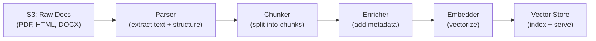

# Chunking Strategies — Real-World Production Examples

## Pattern 1: Production Document Processing Pipeline

A complete pipeline from raw documents to searchable chunks:



This pipeline handles diverse document formats, applies appropriate chunking per format, enriches with metadata, and indexes for retrieval.

```python
import os
from pathlib import Path
from dataclasses import dataclass, field
from typing import Optional
import hashlib

@dataclass
class ProcessedChunk:
    chunk_id: str
    text: str
    embedding: Optional[list[float]] = None
    metadata: dict = field(default_factory=dict)

class DocumentProcessingPipeline:
    """End-to-end pipeline: parse → chunk → enrich → embed → index."""
    
    def __init__(self, parsers: dict, chunker, embedder, vector_store):
        self.parsers = parsers  # {".pdf": PdfParser, ".html": HtmlParser, ...}
        self.chunker = chunker
        self.embedder = embedder
        self.vector_store = vector_store
    
    def process_file(self, file_path: str, doc_metadata: dict = None) -> list[ProcessedChunk]:
        """Process a single file through the full pipeline."""
        ext = Path(file_path).suffix.lower()
        
        # Step 1: Parse (extract text and structure)
        parser = self.parsers.get(ext)
        if not parser:
            raise ValueError(f"No parser for extension: {ext}")
        
        parsed = parser.parse(file_path)
        # parsed = {"text": "...", "sections": [...], "tables": [...], "pages": [...]}
        
        # Step 2: Chunk (strategy depends on document type)
        raw_chunks = self.chunker.chunk(
            text=parsed["text"],
            sections=parsed.get("sections"),
            doc_type=ext,
        )
        
        # Step 3: Enrich with metadata
        doc_id = hashlib.sha256(file_path.encode()).hexdigest()[:12]
        chunks = []
        for i, raw in enumerate(raw_chunks):
            chunk = ProcessedChunk(
                chunk_id=f"{doc_id}_c{i:04d}",
                text=raw["text"],
                metadata={
                    "doc_id": doc_id,
                    "source_file": os.path.basename(file_path),
                    "file_type": ext,
                    "chunk_index": i,
                    "total_chunks": len(raw_chunks),
                    "section_header": raw.get("header", ""),
                    "page_number": raw.get("page"),
                    **(doc_metadata or {}),
                }
            )
            chunks.append(chunk)
        
        # Step 4: Embed
        texts = [c.text for c in chunks]
        embeddings = self.embedder.embed_batch(texts)
        for chunk, emb in zip(chunks, embeddings):
            chunk.embedding = emb
        
        # Step 5: Index
        self.vector_store.upsert([
            {"id": c.chunk_id, "vector": c.embedding, "metadata": c.metadata}
            for c in chunks
        ])
        
        return chunks
    
    def process_directory(self, dir_path: str, **kwargs) -> dict:
        """Process all files in a directory."""
        stats = {"files": 0, "chunks": 0, "errors": []}
        
        for file_path in Path(dir_path).rglob("*"):
            if file_path.suffix.lower() in self.parsers:
                try:
                    chunks = self.process_file(str(file_path), **kwargs)
                    stats["files"] += 1
                    stats["chunks"] += len(chunks)
                except Exception as e:
                    stats["errors"].append({"file": str(file_path), "error": str(e)})
        
        return stats
```

---

## Pattern 2: Multi-Format Chunking Strategy

```python
class AdaptiveChunker:
    """Choose chunking strategy based on document type and structure."""
    
    def __init__(self, default_chunk_size: int = 500, overlap: int = 50):
        self.default_size = default_chunk_size
        self.overlap = overlap
    
    def chunk(self, text: str, sections: list = None, doc_type: str = None) -> list[dict]:
        """Route to appropriate chunking strategy."""
        
        if doc_type == ".md" and sections:
            return self._chunk_by_sections(text, sections)
        elif doc_type == ".py":
            return self._chunk_code(text)
        elif doc_type == ".pdf" and self._has_tables(text):
            return self._chunk_mixed_content(text)
        else:
            return self._chunk_recursive(text)
    
    def _chunk_by_sections(self, text: str, sections: list) -> list[dict]:
        """Chunk markdown/structured docs by headers."""
        chunks = []
        for section in sections:
            section_text = section["content"]
            if len(section_text) <= self.default_size:
                chunks.append({"text": section_text, "header": section["title"]})
            else:
                # Sub-chunk large sections
                sub_chunks = self._chunk_recursive(section_text)
                for sc in sub_chunks:
                    sc["header"] = section["title"]
                chunks.extend(sub_chunks)
        return chunks
    
    def _chunk_code(self, text: str) -> list[dict]:
        """Chunk code at function/class boundaries."""
        import re
        # Split at function/class definitions
        pattern = r'\n(?=(?:def |class |async def ))'
        blocks = re.split(pattern, text)
        
        chunks = []
        for block in blocks:
            if len(block.strip()) > 20:  # Skip tiny fragments
                chunks.append({
                    "text": block.strip(),
                    "header": block.strip().split("\n")[0][:80],
                })
        return chunks
    
    def _chunk_mixed_content(self, text: str) -> list[dict]:
        """Handle PDFs with mix of prose and tables."""
        chunks = []
        # Simple heuristic: paragraphs separated by double newlines
        paragraphs = text.split("\n\n")
        
        current_chunk = ""
        for para in paragraphs:
            if len(current_chunk) + len(para) > self.default_size:
                if current_chunk:
                    chunks.append({"text": current_chunk.strip()})
                current_chunk = para
            else:
                current_chunk += "\n\n" + para
        
        if current_chunk.strip():
            chunks.append({"text": current_chunk.strip()})
        
        return chunks
    
    def _chunk_recursive(self, text: str) -> list[dict]:
        """Default: recursive splitting with overlap."""
        separators = ["\n\n", "\n", ". ", " "]
        return self._recursive_split(text, separators, self.default_size, self.overlap)
    
    def _recursive_split(self, text, separators, size, overlap) -> list[dict]:
        chunks = []
        if len(text) <= size:
            return [{"text": text}]
        
        for sep in separators:
            if sep in text:
                parts = text.split(sep)
                current = ""
                for part in parts:
                    if len(current) + len(part) > size and current:
                        chunks.append({"text": current.strip()})
                        # Keep overlap from end of previous chunk
                        current = current[-overlap:] + sep + part if overlap else part
                    else:
                        current = current + sep + part if current else part
                if current.strip():
                    chunks.append({"text": current.strip()})
                return chunks
        
        # Fallback: character-level split
        for i in range(0, len(text), size - overlap):
            chunks.append({"text": text[i:i + size]})
        return chunks
    
    def _has_tables(self, text: str) -> bool:
        """Detect if text contains tabular data."""
        lines = text.split("\n")
        pipe_lines = sum(1 for l in lines if "|" in l and l.count("|") >= 3)
        return pipe_lines > 5
```

---

## Pattern 3: Chunking Quality Monitoring

```python
import numpy as np
from collections import Counter

class ChunkQualityMonitor:
    """Monitor chunk quality metrics in production."""
    
    def __init__(self):
        self.metrics = {
            "chunk_sizes": [],
            "retrieval_positions": [],
            "empty_results": 0,
            "low_score_results": 0,
        }
    
    def analyze_chunks(self, chunks: list[dict]) -> dict:
        """Analyze a set of chunks for quality indicators."""
        sizes = [len(c["text"]) for c in chunks]
        
        return {
            "total_chunks": len(chunks),
            "avg_size_chars": np.mean(sizes),
            "min_size_chars": min(sizes),
            "max_size_chars": max(sizes),
            "std_size_chars": np.std(sizes),
            "too_small": sum(1 for s in sizes if s < 50),  # Likely garbage chunks
            "too_large": sum(1 for s in sizes if s > 3000),  # Likely unfocused
            "size_distribution": {
                "<100": sum(1 for s in sizes if s < 100),
                "100-500": sum(1 for s in sizes if 100 <= s < 500),
                "500-1000": sum(1 for s in sizes if 500 <= s < 1000),
                ">1000": sum(1 for s in sizes if s >= 1000),
            }
        }
    
    def diagnose_retrieval_issues(self, search_logs: list[dict]) -> dict:
        """Analyze search logs to identify chunking problems."""
        issues = []
        
        for log in search_logs:
            query = log["query"]
            results = log["results"]
            user_clicked = log.get("clicked_position")
            
            if not results:
                issues.append({"type": "no_results", "query": query})
            elif results[0]["score"] < 0.4:
                issues.append({"type": "low_relevance", "query": query, "score": results[0]["score"]})
            elif user_clicked and user_clicked > 3:
                issues.append({"type": "relevant_not_top", "query": query, "clicked_at": user_clicked})
        
        # Categorize issues
        issue_types = Counter(i["type"] for i in issues)
        
        recommendations = []
        if issue_types["low_relevance"] > len(search_logs) * 0.2:
            recommendations.append("Chunks may be too large (unfocused embeddings). Try reducing chunk_size.")
        if issue_types["no_results"] > len(search_logs) * 0.1:
            recommendations.append("Missing content coverage. Check if all source docs are chunked and indexed.")
        if issue_types["relevant_not_top"] > len(search_logs) * 0.15:
            recommendations.append("Chunks may be too small (missing context). Try parent-child chunking.")
        
        return {
            "total_searches": len(search_logs),
            "issue_breakdown": dict(issue_types),
            "issue_rate": len(issues) / len(search_logs),
            "recommendations": recommendations,
        }
```

---

## Pattern 4: A/B Testing Chunk Strategies

```python
class ChunkingABTest:
    """Compare two chunking strategies in production."""
    
    def __init__(self, chunker_a, chunker_b, eval_queries: list[dict]):
        self.chunker_a = chunker_a  # e.g., fixed 500 char
        self.chunker_b = chunker_b  # e.g., semantic chunking
        self.eval_queries = eval_queries
    
    def run_comparison(self, documents: list[str], embed_fn) -> dict:
        """Chunk same docs with both strategies, compare retrieval."""
        
        # Chunk with strategy A
        chunks_a = []
        for doc in documents:
            chunks_a.extend(self.chunker_a.chunk(doc))
        embeddings_a = embed_fn([c["text"] for c in chunks_a])
        
        # Chunk with strategy B
        chunks_b = []
        for doc in documents:
            chunks_b.extend(self.chunker_b.chunk(doc))
        embeddings_b = embed_fn([c["text"] for c in chunks_b])
        
        # Evaluate both on test queries
        results_a = self._evaluate(chunks_a, embeddings_a, embed_fn)
        results_b = self._evaluate(chunks_b, embeddings_b, embed_fn)
        
        return {
            "strategy_a": {
                "name": self.chunker_a.__class__.__name__,
                "total_chunks": len(chunks_a),
                "avg_chunk_size": np.mean([len(c["text"]) for c in chunks_a]),
                **results_a,
            },
            "strategy_b": {
                "name": self.chunker_b.__class__.__name__,
                "total_chunks": len(chunks_b),
                "avg_chunk_size": np.mean([len(c["text"]) for c in chunks_b]),
                **results_b,
            },
            "winner": "B" if results_b["recall_10"] > results_a["recall_10"] else "A",
        }
    
    def _evaluate(self, chunks, embeddings, embed_fn) -> dict:
        recalls = []
        for q in self.eval_queries:
            q_emb = embed_fn([q["query"]])[0]
            scores = np.dot(np.array(embeddings), q_emb)
            top_10 = np.argsort(scores)[::-1][:10]
            # Check if any top-10 chunk is from a relevant document
            retrieved_texts = [chunks[i]["text"] for i in top_10]
            hit = any(q["answer_snippet"] in t for t in retrieved_texts)
            recalls.append(1.0 if hit else 0.0)
        
        return {"recall_10": np.mean(recalls), "samples": len(recalls)}
```

---

## Pattern 5: Incremental Re-Chunking

When documents update, minimize re-processing:

```python
class IncrementalReChunker:
    """Only re-chunk and re-embed content that actually changed."""
    
    def __init__(self, chunker, embedder, vector_store, state_db):
        self.chunker = chunker
        self.embedder = embedder
        self.vector_store = vector_store
        self.state_db = state_db
    
    def update_document(self, doc_id: str, new_content: str) -> dict:
        """Efficiently update chunks for a modified document."""
        # Get previous chunk hashes
        old_state = self.state_db.get(doc_id)  # {chunk_hash: chunk_id, ...}
        old_hashes = set(old_state.keys()) if old_state else set()
        
        # Generate new chunks
        new_chunks = self.chunker.chunk(new_content)
        new_hashes = {}
        for i, chunk in enumerate(new_chunks):
            h = hashlib.md5(chunk["text"].encode()).hexdigest()
            new_hashes[h] = {"text": chunk["text"], "index": i}
        
        # Diff
        added_hashes = set(new_hashes.keys()) - old_hashes
        removed_hashes = old_hashes - set(new_hashes.keys())
        unchanged_hashes = old_hashes & set(new_hashes.keys())
        
        # Remove old chunks that no longer exist
        if removed_hashes and old_state:
            ids_to_remove = [old_state[h] for h in removed_hashes]
            self.vector_store.delete(ids=ids_to_remove)
        
        # Add new chunks
        new_chunk_ids = {}
        if added_hashes:
            texts = [new_hashes[h]["text"] for h in added_hashes]
            embeddings = self.embedder.embed_batch(texts)
            
            for h, emb in zip(added_hashes, embeddings):
                chunk_id = f"{doc_id}_c{new_hashes[h]['index']:04d}"
                self.vector_store.upsert([{
                    "id": chunk_id,
                    "vector": emb,
                    "metadata": {"doc_id": doc_id, "chunk_index": new_hashes[h]["index"]}
                }])
                new_chunk_ids[h] = chunk_id
        
        # Update state
        final_state = {}
        for h in unchanged_hashes:
            final_state[h] = old_state[h]
        for h, cid in new_chunk_ids.items():
            final_state[h] = cid
        self.state_db.set(doc_id, final_state)
        
        return {
            "added": len(added_hashes),
            "removed": len(removed_hashes),
            "unchanged": len(unchanged_hashes),
            "embed_savings_pct": len(unchanged_hashes) / max(len(new_hashes), 1) * 100,
        }
```

---

## Interview Tips

> **Tip 1:** "How would you build a chunking pipeline for 1M documents?" — Parse → chunk → embed → index, with: content-hash dedup (skip unchanged docs), batch embedding (GPU, 512 at a time), parallel processing (4-8 workers), and progress tracking. Expect ~2-4 hours for 1M docs on a single A10G GPU.

> **Tip 2:** "How do you know your chunks are good?" — Measure retrieval quality (recall@10) against a test set of query-answer pairs. Monitor in production: if top-1 scores are consistently low or users aren't clicking results, chunks may be too large (unfocused) or too small (missing context). A/B test different strategies.

> **Tip 3:** "How do you handle document updates efficiently?" — Hash each chunk. On update, re-chunk the document and compare hashes against stored state. Only re-embed and re-index truly changed chunks. For a document where 80% of content is unchanged, this saves 80% of embedding cost.
