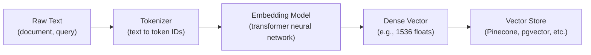

# Embedding Models — Fundamentals


## 🎯 Analogy

Think of embedding models like universal translators for meaning: they convert any text (a question, a document paragraph) into a fixed-length vector of numbers. Similar meanings produce similar vectors — which is why semantic search works.

---
## What Are Embeddings?

Embeddings are **dense vector representations** of text (or images, audio, etc.) that capture semantic meaning in a numerical format. Similar texts produce similar vectors, enabling machines to understand "meaning" through math.

```python
from openai import OpenAI

client = OpenAI()

# Two semantically similar sentences produce similar vectors
response = client.embeddings.create(
    model="text-embedding-3-small",
    input=["The cat sat on the mat", "A feline rested on the rug"]
)

vector_1 = response.data[0].embedding  # [0.023, -0.041, 0.089, ...] (1536 dimensions)
vector_2 = response.data[1].embedding  # Similar vector — high cosine similarity

# These two vectors will be close together in vector space
# because the sentences mean nearly the same thing
```

> **Key Insight for DE:** Embeddings transform unstructured text into structured numerical data that can be indexed, searched, and joined — just like any other data in your warehouse.

---

## The Embedding Pipeline

The following diagram shows how text is transformed into searchable vectors:



Each step transforms the input: raw text becomes token IDs, which the model processes through attention layers to produce a fixed-size vector that captures the semantic meaning of the entire input.

---

## Popular Embedding Models

| Model | Provider | Dimensions | Max Tokens | Speed | Cost | Best For |
|-------|----------|-----------|-----------|-------|------|----------|
| text-embedding-3-small | OpenAI | 1536 | 8191 | Fast | $0.02/1M tokens | General purpose, cost-effective |
| text-embedding-3-large | OpenAI | 3072 | 8191 | Medium | $0.13/1M tokens | High precision needs |
| embed-v3 | Cohere | 1024 | 512 | Fast | $0.10/1M tokens | Multilingual, search |
| all-MiniLM-L6-v2 | Sentence-Transformers | 384 | 256 | Very Fast | Free (self-hosted) | Low-latency, budget |
| BGE-large-en-v1.5 | BAAI | 1024 | 512 | Medium | Free (self-hosted) | Open-source, high quality |
| E5-large-v2 | Microsoft | 1024 | 512 | Medium | Free (self-hosted) | Instruction-following |
| Titan Embeddings v2 | AWS Bedrock | 1024 | 8192 | Fast | $0.02/1M tokens | AWS-native pipelines |

---

## Dimensionality — What It Means

The **dimension count** is the length of the output vector. Higher dimensions can capture more nuance but cost more to store and search.

```python
import numpy as np

# 384-dimensional vector (MiniLM) — compact, fast
small_vector = np.random.randn(384)   # 384 * 4 bytes = 1.5 KB per document

# 1536-dimensional vector (OpenAI small) — balanced
medium_vector = np.random.randn(1536) # 1536 * 4 bytes = 6 KB per document

# 3072-dimensional vector (OpenAI large) — highest precision
large_vector = np.random.randn(3072)  # 3072 * 4 bytes = 12 KB per document
```

**Storage math for 10M documents:**
- 384 dims: 10M × 1.5 KB = ~15 GB
- 1536 dims: 10M × 6 KB = ~60 GB
- 3072 dims: 10M × 12 KB = ~120 GB

> **Rule of thumb:** Start with 1536 dimensions (OpenAI small or equivalent). Only go larger if evaluation shows improvement. Go smaller (384) if latency/cost is the priority.

---

## Similarity Metrics

Once you have vectors, you need a way to measure how "close" they are. The three common distance/similarity functions:

### Cosine Similarity (Most Common)

Measures the angle between two vectors, ignoring magnitude. Returns -1 to 1 (1 = identical direction).

```python
import numpy as np

def cosine_similarity(a, b):
    """Cosine similarity: measures directional similarity regardless of magnitude."""
    return np.dot(a, b) / (np.linalg.norm(a) * np.linalg.norm(b))

# Example
vec_a = np.array([1, 2, 3])
vec_b = np.array([1, 2, 3.1])  # Very similar
vec_c = np.array([-1, -2, -3]) # Opposite direction

print(cosine_similarity(vec_a, vec_b))  # ~0.9999 (very similar)
print(cosine_similarity(vec_a, vec_c))  # -1.0 (opposite)
```

### Dot Product

Like cosine but sensitive to vector magnitude. Used when magnitude encodes importance.

```python
def dot_product(a, b):
    """Dot product: cosine * magnitudes. Sensitive to vector length."""
    return np.dot(a, b)
```

### Euclidean Distance (L2)

Straight-line distance between points. Lower = more similar.

```python
def euclidean_distance(a, b):
    """L2 distance: physical distance in vector space. Lower = closer."""
    return np.linalg.norm(a - b)
```

**When to use which:**
- **Cosine similarity** — Default choice. Works when vectors are normalized (most embedding models output normalized vectors)
- **Dot product** — When using models that encode relevance in vector magnitude (e.g., some custom models)
- **Euclidean** — When absolute position matters more than direction (less common for text)

---

## Tokenization Basics

Models don't see raw text — they see **tokens** (subword units). Understanding tokenization helps you manage context limits.

```python
import tiktoken

# OpenAI's tokenizer
enc = tiktoken.encoding_for_model("text-embedding-3-small")

text = "Data engineering pipelines process large datasets"
tokens = enc.encode(text)
print(f"Text: {text}")
print(f"Tokens: {tokens}")       # [1061, 15320, 62275, 1920, 3544, 2927]
print(f"Token count: {len(tokens)}")  # 6 tokens

# Important: most embedding models have a MAX token limit
# text-embedding-3-small: 8191 tokens max
# If your text exceeds this, it gets TRUNCATED (not an error, just silent loss)
```

**Token approximation:** ~1 token per 4 characters in English, or ~75% of a word.

---

## API-Based vs Local Models

| Aspect | API (OpenAI, Cohere) | Local (sentence-transformers) |
|--------|---------------------|------------------------------|
| Setup | API key, no infra | Install model, GPU optional |
| Cost | Per-token billing | Fixed infra cost |
| Latency | Network round-trip (~100-300ms) | Local inference (~10-50ms) |
| Scalability | Auto-scales | You manage scaling |
| Privacy | Data leaves your network | Data stays local |
| Quality | Generally higher | Varies by model |
| Maintenance | Provider handles updates | You manage versions |

```python
# API-based (OpenAI)
from openai import OpenAI
client = OpenAI()
response = client.embeddings.create(model="text-embedding-3-small", input=["hello world"])
vector = response.data[0].embedding

# Local (sentence-transformers) — no network call
from sentence_transformers import SentenceTransformer
model = SentenceTransformer("all-MiniLM-L6-v2")
vector = model.encode("hello world")  # numpy array, instant
```

---

## Why Embeddings Matter for Data Engineers

| Use Case | How Embeddings Help |
|----------|-------------------|
| Semantic search over docs | Find relevant content by meaning, not keywords |
| Data deduplication | Detect near-duplicate records via vector similarity |
| Data classification | Classify unstructured text without rules |
| Anomaly detection | Find outlier documents that don't cluster |
| Recommendation systems | "Similar items" via embedding proximity |
| Data quality | Detect records that semantically don't belong |

---


## ▶️ Try It Yourself

```python
# pip install sentence-transformers
from sentence_transformers import SentenceTransformer
import numpy as np

model = SentenceTransformer("all-MiniLM-L6-v2")  # 384-dim, fast

# Embed sentences
sentences = [
    "How does Spark handle large datasets?",
    "PySpark processes big data using distributed computing",
    "My cat knocked over the coffee mug",
]
embeddings = model.encode(sentences)
print("Shape:", embeddings.shape)  # (3, 384)

# Compute cosine similarity
def cosine_similarity(a, b):
    return np.dot(a, b) / (np.linalg.norm(a) * np.linalg.norm(b))

# Similar topics should have high similarity
sim_01 = cosine_similarity(embeddings[0], embeddings[1])
sim_02 = cosine_similarity(embeddings[0], embeddings[2])
print(f"Spark vs PySpark: {sim_01:.3f}")   # High (same topic)
print(f"Spark vs cat: {sim_02:.3f}")       # Low (different topic)
```

> **Run it:** Copy the snippet into a REPL or file — no external services needed for the basic example.

---
## Interview Tips

> **Tip 1:** "What embedding model would you choose?" — Consider: data volume (cost), latency requirements, privacy constraints (API vs local), language support, and dimensionality tradeoffs. Start with OpenAI small for prototyping, evaluate open-source for production if cost/privacy matters.

> **Tip 2:** "How do you handle documents longer than the token limit?" — Chunk the document into smaller pieces, embed each chunk separately, and store all chunks with metadata linking them to the parent document. When retrieving, you can either return individual chunks or reconstruct the parent context.

> **Tip 3:** "Cosine similarity vs dot product?" — If your vectors are normalized (unit length), cosine and dot product give identical rankings. Most embedding APIs return normalized vectors, so cosine is the safe default.
