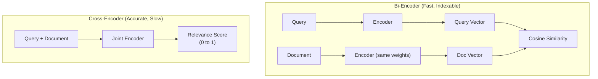

# Embedding Models — Intermediate

## Bi-Encoder vs Cross-Encoder Architecture

Understanding these two architectures is critical for building retrieval systems:

The following diagram shows how bi-encoders process query and document independently, while cross-encoders process them together for higher accuracy but lower speed:



**Trade-offs:**
- **Bi-encoder:** Embed once, search fast (milliseconds). Used for initial retrieval from millions of docs.
- **Cross-encoder:** Must process query+doc pair together — can't pre-compute. Used for re-ranking top-k results (10-100 candidates).

**Production pattern:** Bi-encoder retrieves top-50, cross-encoder re-ranks to top-5.

```python
from sentence_transformers import SentenceTransformer, CrossEncoder

# Stage 1: Bi-encoder for fast retrieval
bi_encoder = SentenceTransformer("all-MiniLM-L6-v2")
query_vec = bi_encoder.encode("What is data partitioning?")
# Compare against pre-computed doc vectors via ANN search → top 50

# Stage 2: Cross-encoder for precise re-ranking
cross_encoder = CrossEncoder("cross-encoder/ms-marco-MiniLM-L-6-v2")
pairs = [(query, doc) for doc in top_50_docs]
scores = cross_encoder.predict(pairs)
# Sort by score → top 5 most relevant
```

---

## Fine-Tuning Embeddings for Your Domain

Generic embedding models work well for general text but underperform on domain-specific content (legal, medical, financial, internal jargon). Fine-tuning adapts the model to your vocabulary and similarity judgments.

### Contrastive Learning (The Core Technique)

```python
from sentence_transformers import SentenceTransformer, InputExample, losses
from torch.utils.data import DataLoader

# Load base model
model = SentenceTransformer("all-MiniLM-L6-v2")

# Training data: pairs of (similar_text, similar_text) or triplets
# For a data engineering domain:
train_examples = [
    # Positive pairs (should be similar)
    InputExample(texts=["partition pruning in Spark", "Spark skips irrelevant partitions"]),
    InputExample(texts=["broadcast join", "small table sent to all executors"]),
    InputExample(texts=["data skew", "one partition much larger than others"]),
    # With hard negatives (triplets: anchor, positive, negative)
    InputExample(texts=[
        "SCD Type 2",                          # anchor
        "slowly changing dimension with history", # positive
        "SCD Type 1 overwrites old values"       # hard negative (related but different)
    ]),
]

train_dataloader = DataLoader(train_examples, shuffle=True, batch_size=16)

# MultipleNegativesRankingLoss: standard for training embedding models
train_loss = losses.MultipleNegativesRankingLoss(model)

# Fine-tune
model.fit(
    train_objectives=[(train_dataloader, train_loss)],
    epochs=3,
    warmup_steps=100,
    output_path="./de-embedding-model"
)
```

### How Many Examples Do You Need?

| Training Set Size | Expected Improvement | Use Case |
|------------------|---------------------|----------|
| 100-500 pairs | Moderate (5-15%) | Internal jargon recognition |
| 1,000-5,000 pairs | Good (15-25%) | Domain adaptation |
| 10,000+ pairs | Best (20-40%) | Full domain specialization |

---

## Batch Processing for Large Corpora

When embedding millions of documents, naive sequential processing is too slow:

```python
from openai import OpenAI
import numpy as np
from concurrent.futures import ThreadPoolExecutor
import time

client = OpenAI()

def embed_batch(texts: list[str], model: str = "text-embedding-3-small") -> list[list[float]]:
    """Embed a batch of texts. OpenAI supports up to 2048 texts per request."""
    response = client.embeddings.create(model=model, input=texts)
    return [item.embedding for item in response.data]

def embed_corpus(documents: list[str], batch_size: int = 512, max_workers: int = 5):
    """Embed a large corpus with batching and parallelism."""
    all_embeddings = []
    batches = [documents[i:i+batch_size] for i in range(0, len(documents), batch_size)]
    
    with ThreadPoolExecutor(max_workers=max_workers) as executor:
        futures = [executor.submit(embed_batch, batch) for batch in batches]
        for i, future in enumerate(futures):
            embeddings = future.result()
            all_embeddings.extend(embeddings)
            if (i + 1) % 10 == 0:
                print(f"Processed {(i+1) * batch_size}/{len(documents)} documents")
    
    return np.array(all_embeddings)

# For 1M documents at batch_size=512 with 5 workers:
# ~2000 batches, ~5 concurrent → ~400 rounds → ~8 minutes at 50ms/batch
```

### Local Model Batch Processing (GPU)

```python
from sentence_transformers import SentenceTransformer
import torch

model = SentenceTransformer("all-MiniLM-L6-v2", device="cuda")

# Encode with GPU batching — much faster than API for large volumes
documents = ["doc1...", "doc2...", ...]  # 1M documents

embeddings = model.encode(
    documents,
    batch_size=256,          # GPU batch size
    show_progress_bar=True,
    normalize_embeddings=True,  # Normalize for cosine similarity
    convert_to_numpy=True
)
# With A100 GPU: ~5000 docs/sec → 1M docs in ~3 minutes
```

---

## Embedding Caching Strategies

Re-embedding unchanged documents wastes compute and money. A cache prevents redundant work.

```python
import hashlib
import json
import redis
import numpy as np

class EmbeddingCache:
    """Cache embeddings in Redis to avoid re-computing unchanged documents."""
    
    def __init__(self, redis_url: str = "redis://localhost:6379", ttl: int = 86400 * 30):
        self.redis = redis.from_url(redis_url)
        self.ttl = ttl  # 30-day TTL
    
    def _cache_key(self, text: str, model: str) -> str:
        """Deterministic key from text content + model name."""
        content_hash = hashlib.sha256(f"{model}:{text}".encode()).hexdigest()[:16]
        return f"emb:{content_hash}"
    
    def get(self, text: str, model: str) -> np.ndarray | None:
        """Retrieve cached embedding."""
        key = self._cache_key(text, model)
        data = self.redis.get(key)
        if data:
            return np.frombuffer(data, dtype=np.float32)
        return None
    
    def set(self, text: str, model: str, embedding: np.ndarray):
        """Store embedding in cache."""
        key = self._cache_key(text, model)
        self.redis.setex(key, self.ttl, embedding.astype(np.float32).tobytes())
    
    def get_or_compute(self, texts: list[str], model: str, embed_fn) -> np.ndarray:
        """Return cached embeddings where available, compute the rest."""
        results = [None] * len(texts)
        to_compute = []
        to_compute_indices = []
        
        for i, text in enumerate(texts):
            cached = self.get(text, model)
            if cached is not None:
                results[i] = cached
            else:
                to_compute.append(text)
                to_compute_indices.append(i)
        
        if to_compute:
            new_embeddings = embed_fn(to_compute)
            for idx, emb in zip(to_compute_indices, new_embeddings):
                results[idx] = emb
                self.set(texts[idx], model, np.array(emb))
        
        return np.array(results)
```

---

## Matryoshka Embeddings (Variable Dimensionality)

Matryoshka Representation Learning produces embeddings where the first N dimensions are a valid lower-dimensional embedding. This allows you to trade accuracy for speed/storage dynamically.

```python
from sentence_transformers import SentenceTransformer

# Models trained with Matryoshka loss (e.g., nomic-embed-text-v1.5)
model = SentenceTransformer("nomic-ai/nomic-embed-text-v1.5", trust_remote_code=True)

# Full embedding (768 dimensions)
full_embedding = model.encode("What is data partitioning?")

# Truncate to first 256 dimensions — still semantically valid!
compact_embedding = full_embedding[:256]

# Truncate to first 64 dimensions — fast but less precise
tiny_embedding = full_embedding[:64]

# Use case: search with 256-dim for fast filtering, re-rank with 768-dim for precision
```

**Storage savings:** 768 → 256 dims = 3x less memory, 3x faster search.

---

## Handling Multilingual Content

For international data platforms, your embedding model must handle multiple languages:

```python
from sentence_transformers import SentenceTransformer

# Multilingual model — maps 50+ languages into shared vector space
model = SentenceTransformer("paraphrase-multilingual-MiniLM-L12-v2")

texts = [
    "How to optimize SQL queries",           # English
    "Comment optimiser les requetes SQL",    # French
    "SQL-Abfragen optimieren",              # German
    "SQLクエリの最適化方法",                    # Japanese
]

embeddings = model.encode(texts)

# Cross-lingual similarity works — same concept, different languages
from sklearn.metrics.pairwise import cosine_similarity
sims = cosine_similarity([embeddings[0]], embeddings[1:])
# All will have high similarity despite different languages
```

---

## MTEB Benchmark — Reading the Leaderboard

The Massive Text Embedding Benchmark (MTEB) ranks models across multiple tasks. Key columns to evaluate:

| Task Category | What It Tests | Why It Matters for RAG |
|--------------|---------------|----------------------|
| Retrieval | Find relevant passages for a query | Direct RAG performance |
| STS (Semantic Textual Similarity) | Rate similarity of sentence pairs | Quality of vector proximity |
| Classification | Assign categories to text | Useful for routing/filtering |
| Clustering | Group similar documents | Data organization |

> **How to read MTEB:** Focus on the "Retrieval" score for RAG use cases. A model scoring 55 on Retrieval average is better for RAG than one scoring 60 overall but only 48 on Retrieval.

---

## Interview Tips

> **Tip 1:** "How does chunk size affect embedding quality?" — Shorter chunks produce more focused embeddings (one concept per vector) but lose context. Longer chunks capture more context but become less precise for retrieval. The sweet spot is 256-512 tokens for most retrieval tasks.

> **Tip 2:** "When would you fine-tune an embedding model?" — When your domain has specialized vocabulary (medical, legal, internal codenames) that generic models haven't seen, or when your similarity judgments differ from general text (e.g., in your domain, "partition" means data sharding, not political division).

> **Tip 3:** "API vs self-hosted?" — API for <1M documents (cheaper at low volume, zero infra). Self-hosted for >10M documents, strict privacy requirements, or low-latency needs (<10ms). The break-even is typically around 5-10M embeddings/month.
