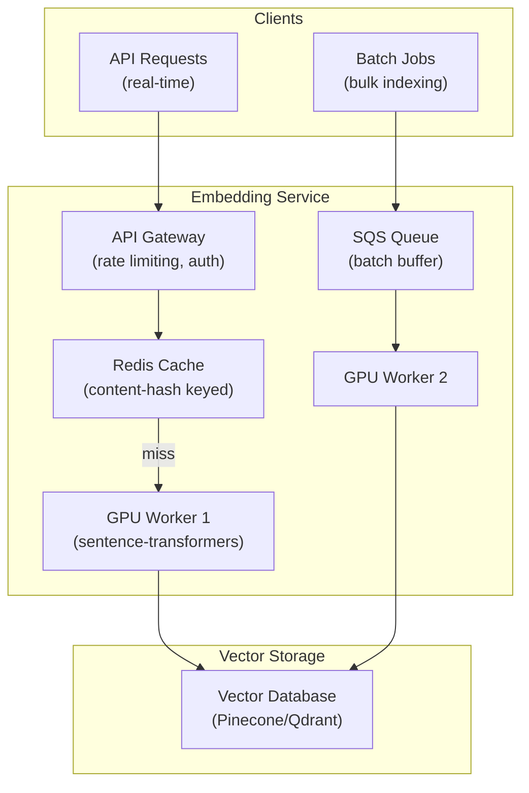

# Embedding Models — Real-World Production Examples

## Pattern 1: Production Embedding Service Architecture

The following diagram shows a scalable embedding service that handles both real-time and batch embedding requests:



This architecture separates real-time (low-latency, cached) from batch (high-throughput, queued) paths while sharing the same GPU workers and vector store.

```python
from fastapi import FastAPI, BackgroundTasks
from sentence_transformers import SentenceTransformer
import redis
import hashlib
import numpy as np
import json
from pydantic import BaseModel

app = FastAPI()
model = SentenceTransformer("all-MiniLM-L6-v2", device="cuda")
cache = redis.Redis(host="localhost", port=6379, db=0)

class EmbedRequest(BaseModel):
    texts: list[str]
    model_name: str = "all-MiniLM-L6-v2"

class EmbedResponse(BaseModel):
    embeddings: list[list[float]]
    cached_count: int
    computed_count: int

@app.post("/embed", response_model=EmbedResponse)
async def embed_texts(request: EmbedRequest):
    """Real-time embedding endpoint with caching."""
    results = [None] * len(request.texts)
    to_compute = []
    to_compute_indices = []
    cached_count = 0
    
    # Check cache first
    for i, text in enumerate(request.texts):
        cache_key = f"emb:{hashlib.sha256(text.encode()).hexdigest()[:16]}"
        cached = cache.get(cache_key)
        if cached:
            results[i] = json.loads(cached)
            cached_count += 1
        else:
            to_compute.append(text)
            to_compute_indices.append(i)
    
    # Compute missing embeddings
    if to_compute:
        embeddings = model.encode(to_compute, normalize_embeddings=True).tolist()
        for idx, emb, text in zip(to_compute_indices, embeddings, to_compute):
            results[idx] = emb
            # Cache for 7 days
            cache_key = f"emb:{hashlib.sha256(text.encode()).hexdigest()[:16]}"
            cache.setex(cache_key, 86400 * 7, json.dumps(emb))
    
    return EmbedResponse(
        embeddings=results,
        cached_count=cached_count,
        computed_count=len(to_compute)
    )
```

---

## Pattern 2: Batch Embedding Pipeline (10M+ Documents)

```python
import boto3
from concurrent.futures import ProcessPoolExecutor
from sentence_transformers import SentenceTransformer
import pyarrow.parquet as pq
import numpy as np
from dataclasses import dataclass
from typing import Iterator

@dataclass
class EmbeddingJob:
    source_table: str
    text_column: str
    id_column: str
    model_name: str
    output_path: str
    batch_size: int = 1024
    
class BatchEmbeddingPipeline:
    """Embed millions of documents from S3/data lake efficiently."""
    
    def __init__(self, job: EmbeddingJob):
        self.job = job
        self.model = SentenceTransformer(job.model_name, device="cuda")
        self.stats = {"total": 0, "embedded": 0, "skipped": 0, "errors": 0}
    
    def read_documents(self) -> Iterator[tuple[list[str], list[str]]]:
        """Read documents in batches from parquet files."""
        parquet_files = self._list_parquet_files(self.job.source_table)
        
        batch_ids, batch_texts = [], []
        for file_path in parquet_files:
            table = pq.read_table(file_path, columns=[self.job.id_column, self.job.text_column])
            for row in table.to_pydict()[self.job.text_column]:
                doc_id = table.to_pydict()[self.job.id_column][self.stats["total"]]
                text = row
                self.stats["total"] += 1
                
                if not text or len(text.strip()) < 10:
                    self.stats["skipped"] += 1
                    continue
                
                batch_ids.append(doc_id)
                batch_texts.append(text[:2048])  # Truncate to model max
                
                if len(batch_texts) >= self.job.batch_size:
                    yield batch_ids, batch_texts
                    batch_ids, batch_texts = [], []
        
        if batch_texts:
            yield batch_ids, batch_texts
    
    def run(self):
        """Execute the full embedding pipeline."""
        print(f"Starting batch embedding: {self.job.source_table}")
        
        for batch_ids, batch_texts in self.read_documents():
            try:
                embeddings = self.model.encode(
                    batch_texts,
                    batch_size=256,
                    normalize_embeddings=True,
                    show_progress_bar=False
                )
                self._write_embeddings(batch_ids, embeddings)
                self.stats["embedded"] += len(batch_ids)
            except Exception as e:
                self.stats["errors"] += len(batch_ids)
                print(f"Error in batch: {e}")
        
        print(f"Complete: {self.stats}")
        return self.stats
    
    def _write_embeddings(self, ids: list[str], embeddings: np.ndarray):
        """Write embeddings to vector store or parquet."""
        # Option A: Write to Pinecone
        # vectors = [(id, emb.tolist()) for id, emb in zip(ids, embeddings)]
        # index.upsert(vectors=vectors, batch_size=100)
        
        # Option B: Write to parquet (for later bulk load)
        import pyarrow as pa
        table = pa.table({
            "id": ids,
            "embedding": [emb.tolist() for emb in embeddings]
        })
        pq.write_table(table, f"{self.job.output_path}/batch_{self.stats['embedded']}.parquet")
    
    def _list_parquet_files(self, path: str) -> list[str]:
        """List parquet files in S3 path."""
        # Implementation depends on your storage layer
        pass

# Usage
job = EmbeddingJob(
    source_table="s3://data-lake/documents/",
    text_column="content",
    id_column="doc_id",
    model_name="BAAI/bge-large-en-v1.5",
    output_path="s3://embeddings/documents/",
)
pipeline = BatchEmbeddingPipeline(job)
pipeline.run()
```

---

## Pattern 3: Incremental Embedding Updates via CDC

When source documents change, only re-embed the changed ones:

```python
from datetime import datetime, timedelta

class IncrementalEmbeddingUpdater:
    """Update embeddings only for documents that changed since last run."""
    
    def __init__(self, vector_store, embedding_model, metadata_db):
        self.vector_store = vector_store
        self.model = embedding_model
        self.metadata_db = metadata_db
    
    def get_changed_documents(self, since: datetime) -> list[dict]:
        """Fetch documents modified since last embedding run."""
        return self.metadata_db.query("""
            SELECT doc_id, content, updated_at, change_type
            FROM document_changes
            WHERE updated_at > :since
            ORDER BY updated_at
        """, {"since": since})
    
    def run_incremental_update(self):
        """Process only new/updated/deleted documents."""
        last_run = self.metadata_db.get_last_embedding_run()
        changes = self.get_changed_documents(last_run)
        
        stats = {"upserted": 0, "deleted": 0, "errors": 0}
        
        # Group by change type
        to_embed = [c for c in changes if c["change_type"] in ("INSERT", "UPDATE")]
        to_delete = [c for c in changes if c["change_type"] == "DELETE"]
        
        # Delete removed documents from vector store
        if to_delete:
            delete_ids = [c["doc_id"] for c in to_delete]
            self.vector_store.delete(ids=delete_ids)
            stats["deleted"] = len(delete_ids)
        
        # Embed new/updated documents in batches
        batch_size = 512
        for i in range(0, len(to_embed), batch_size):
            batch = to_embed[i:i+batch_size]
            texts = [doc["content"] for doc in batch]
            ids = [doc["doc_id"] for doc in batch]
            
            embeddings = self.model.encode(texts, normalize_embeddings=True)
            
            vectors = [
                {"id": doc_id, "values": emb.tolist(), "metadata": {"updated_at": str(datetime.now())}}
                for doc_id, emb in zip(ids, embeddings)
            ]
            self.vector_store.upsert(vectors=vectors)
            stats["upserted"] += len(batch)
        
        # Record this run
        self.metadata_db.record_embedding_run(datetime.now(), stats)
        return stats
```

---

## Pattern 4: A/B Testing Embedding Models

```python
import random
from dataclasses import dataclass

@dataclass
class SearchResult:
    doc_id: str
    score: float
    model_variant: str

class EmbeddingABTest:
    """Route queries between two embedding models and track quality metrics."""
    
    def __init__(self, model_a, model_b, traffic_split: float = 0.5):
        self.model_a = model_a  # Control (current production model)
        self.model_b = model_b  # Treatment (new model candidate)
        self.split = traffic_split
        self.metrics = {"a": [], "b": []}
    
    def search(self, query: str, k: int = 5) -> tuple[list[SearchResult], str]:
        """Route query to A or B model based on traffic split."""
        variant = "b" if random.random() < self.split else "a"
        model = self.model_b if variant == "b" else self.model_a
        
        query_embedding = model.encode(query)
        results = self.vector_store.query(query_embedding, top_k=k, namespace=variant)
        
        return results, variant
    
    def record_feedback(self, query_id: str, variant: str, clicked_position: int):
        """Record user interaction for evaluation."""
        mrr = 1.0 / clicked_position if clicked_position > 0 else 0
        self.metrics[variant].append({"query_id": query_id, "mrr": mrr})
    
    def evaluate(self) -> dict:
        """Compare models after sufficient data collected."""
        mrr_a = np.mean([m["mrr"] for m in self.metrics["a"]])
        mrr_b = np.mean([m["mrr"] for m in self.metrics["b"]])
        
        # Statistical significance test
        from scipy.stats import mannwhitneyu
        _, p_value = mannwhitneyu(
            [m["mrr"] for m in self.metrics["a"]],
            [m["mrr"] for m in self.metrics["b"]]
        )
        
        return {
            "model_a_mrr": mrr_a,
            "model_b_mrr": mrr_b,
            "improvement": (mrr_b - mrr_a) / mrr_a * 100,
            "p_value": p_value,
            "significant": p_value < 0.05,
            "recommendation": "deploy_b" if (mrr_b > mrr_a and p_value < 0.05) else "keep_a"
        }
```

---

## Pattern 5: Monitoring Embedding Quality in Production

```python
from prometheus_client import Histogram, Counter, Gauge
import time

# Prometheus metrics
EMBED_LATENCY = Histogram("embedding_latency_seconds", "Time to compute embeddings", ["model"])
EMBED_BATCH_SIZE = Histogram("embedding_batch_size", "Number of texts per batch")
CACHE_HIT_RATE = Gauge("embedding_cache_hit_rate", "Cache hit ratio over last 5 min")
RETRIEVAL_SCORE = Histogram("retrieval_similarity_score", "Top-1 similarity score", ["source"])

class MonitoredEmbeddingService:
    """Embedding service with production monitoring."""
    
    def embed_with_monitoring(self, texts: list[str]) -> np.ndarray:
        EMBED_BATCH_SIZE.observe(len(texts))
        
        start = time.time()
        embeddings = self.model.encode(texts, normalize_embeddings=True)
        duration = time.time() - start
        
        EMBED_LATENCY.labels(model=self.model_name).observe(duration)
        
        # Monitor embedding health: check norms and distribution
        norms = np.linalg.norm(embeddings, axis=1)
        if norms.mean() < 0.5 or norms.std() > 0.5:
            # Abnormal embeddings — model may have issues
            self.alert("Embedding norm anomaly detected", norms.mean(), norms.std())
        
        return embeddings
    
    def monitor_search_quality(self, query: str, results: list[dict]):
        """Track retrieval quality in production."""
        if results:
            top_score = results[0]["score"]
            RETRIEVAL_SCORE.labels(source="production").observe(top_score)
            
            # Alert if top results are consistently low-scoring
            if top_score < 0.3:
                self.log_low_quality_query(query, top_score)
```

---

## Cost Comparison Table

| Scenario | OpenAI Small | Cohere v3 | Self-Hosted (A10G) |
|----------|-------------|-----------|-------------------|
| 1M docs initial embed | $4 | $20 | $6 (1 hr GPU) |
| 10M docs initial embed | $40 | $200 | $60 (10 hrs GPU) |
| 100K docs/day incremental | $0.40/day | $2/day | $72/day (always-on) |
| 10M docs/day incremental | $40/day | $200/day | $72/day (always-on) |
| Latency (single query) | ~150ms | ~200ms | ~10ms |
| Privacy | Data leaves VPC | Data leaves VPC | Stays in VPC |

> **Break-even:** Self-hosted wins at ~5M+ embeddings/day with steady load. API wins for bursty/low-volume workloads. Always consider privacy requirements — some industries require self-hosted regardless of cost.

---

## Interview Tips

> **Tip 1:** "Design an embedding pipeline for 50M documents" — CDC from source → dedup filter → batch chunker → GPU embedding workers (auto-scaling) → vector store upsert. Incremental updates via change log. Cache layer for frequently re-embedded content.

> **Tip 2:** "How do you handle embedding model upgrades?" — Dual-write period: new queries use new model, gradually re-embed existing corpus in background. A/B test both indexes. Once quality confirmed, deprecate old index. Never mix embeddings from different models in the same index.

> **Tip 3:** "What metrics would you monitor?" — Embedding latency (p50/p99), cache hit rate, vector norms distribution, retrieval top-1 similarity scores, user engagement (click-through on search results), and cost per 1M embeddings.
