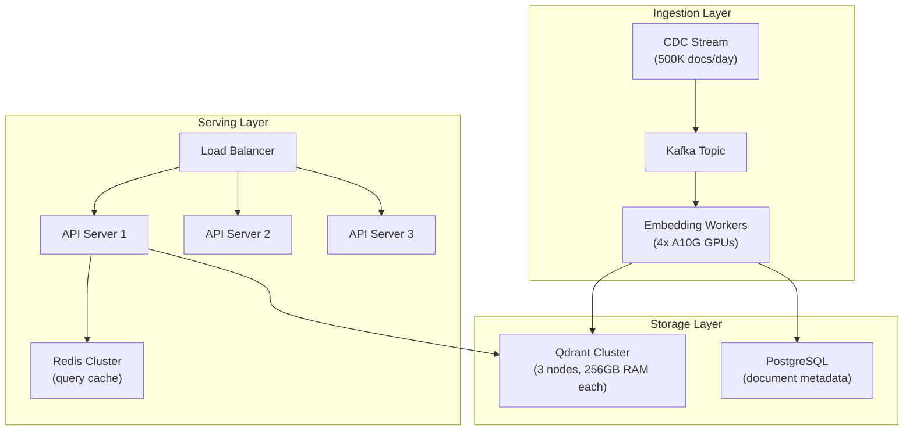

# Scenario Questions — Embedding Models

<article data-difficulty="junior">

## 🟢 Junior: Choosing an Embedding Model

**Scenario:** Your e-commerce company wants to build a product search feature. Users type queries like "warm winter jacket under $100" and you need to find matching products from a catalog of 50K items. Which embedding model would you recommend and why?

<details>
<summary>💡 Hint</summary>
Consider: catalog size (50K is small), latency needs for real-time search, budget, and whether you need multilingual support.
</details>

<details>
<summary>✅ Solution</summary>

```python
from sentence_transformers import SentenceTransformer
import numpy as np

# For 50K products: self-hosted model is cost-effective and fast
model = SentenceTransformer("all-MiniLM-L6-v2")  # 384 dims, very fast

# Embed product catalog (one-time, ~10 seconds for 50K)
products = ["Men's insulated parka - $89", "Lightweight rain jacket - $45", ...]
product_embeddings = model.encode(products, normalize_embeddings=True, show_progress_bar=True)

# Real-time query
query = "warm winter jacket under $100"
query_embedding = model.encode(query, normalize_embeddings=True)

# Cosine similarity (since normalized, dot product = cosine)
scores = np.dot(product_embeddings, query_embedding)
top_indices = np.argsort(scores)[::-1][:10]
```

**Key Points:**
- 50K items is small — even brute-force cosine similarity is fast (~5ms)
- `all-MiniLM-L6-v2` is free, fast (384 dims), and good for English product search
- For multilingual catalogs, use `paraphrase-multilingual-MiniLM-L12-v2`
- OpenAI API would work but adds latency and ongoing cost for a simple use case
- At this scale, you don't even need a vector database — NumPy works fine

</details>

</article>

<article data-difficulty="junior">

## 🟢 Junior: Computing Cosine Similarity

**Scenario:** You have two document embeddings and need to determine if they're semantically similar. Document A is about "Apache Spark partitioning strategies" and Document B is about "How to distribute data across Spark executors". Calculate their cosine similarity and explain the result.

<details>
<summary>💡 Hint</summary>
Cosine similarity = dot(A, B) / (norm(A) * norm(B)). Values range from -1 to 1, where 1 means identical direction, 0 means orthogonal, -1 means opposite.
</details>

<details>
<summary>✅ Solution</summary>

```python
import numpy as np
from sentence_transformers import SentenceTransformer

model = SentenceTransformer("all-MiniLM-L6-v2")

doc_a = "Apache Spark partitioning strategies for large datasets"
doc_b = "How to distribute data across Spark executors efficiently"
doc_c = "Recipe for chocolate cake with buttercream frosting"  # Unrelated

embeddings = model.encode([doc_a, doc_b, doc_c], normalize_embeddings=True)

def cosine_similarity(a, b):
    return np.dot(a, b) / (np.linalg.norm(a) * np.linalg.norm(b))

sim_ab = cosine_similarity(embeddings[0], embeddings[1])  # ~0.75 (high - related topics)
sim_ac = cosine_similarity(embeddings[0], embeddings[2])  # ~0.05 (low - unrelated)

print(f"Spark partitioning vs Spark distribution: {sim_ab:.3f}")  # ~0.75
print(f"Spark partitioning vs cake recipe: {sim_ac:.3f}")         # ~0.05
```

**Key Points:**
- Similarity > 0.7: strongly related content
- Similarity 0.3-0.7: somewhat related
- Similarity < 0.3: likely unrelated
- These thresholds vary by model — always calibrate on your data
- Since embeddings are normalized, `np.dot(a, b)` equals cosine similarity directly

</details>

</article>

<article data-difficulty="junior">

## 🟢 Junior: Handling Token Limits

**Scenario:** You need to embed a 15-page technical document (approximately 12,000 tokens) using OpenAI's `text-embedding-3-small` which has an 8,191 token limit. What happens if you just pass the full text, and how do you fix it?

<details>
<summary>💡 Hint</summary>
OpenAI silently truncates input that exceeds the token limit. You won't get an error, but you'll lose the end of the document. The fix involves chunking.
</details>

<details>
<summary>✅ Solution</summary>

```python
import tiktoken
from openai import OpenAI

client = OpenAI()
enc = tiktoken.encoding_for_model("text-embedding-3-small")

document = "... (12,000 tokens of content) ..."
tokens = enc.encode(document)
print(f"Document has {len(tokens)} tokens")  # 12,000 — exceeds 8,191 limit!

# PROBLEM: OpenAI silently truncates to 8,191 tokens
# The last ~4,000 tokens (30% of the doc) are LOST without any error

# FIX: Chunk the document before embedding
def chunk_text(text: str, max_tokens: int = 500, overlap_tokens: int = 50) -> list[str]:
    """Split text into chunks that fit within token limits."""
    tokens = enc.encode(text)
    chunks = []
    start = 0
    while start < len(tokens):
        end = start + max_tokens
        chunk_tokens = tokens[start:end]
        chunk_text = enc.decode(chunk_tokens)
        chunks.append(chunk_text)
        start = end - overlap_tokens  # Overlap prevents splitting mid-thought
    return chunks

chunks = chunk_text(document, max_tokens=500, overlap_tokens=50)
print(f"Split into {len(chunks)} chunks")  # ~24 chunks

# Embed each chunk separately
response = client.embeddings.create(
    model="text-embedding-3-small",
    input=chunks  # All chunks in one API call (up to 2048 inputs)
)
embeddings = [item.embedding for item in response.data]
# Store each chunk with metadata linking to parent document
```

**Key Points:**
- OpenAI truncates silently — no error raised, just lost content
- Always check token count before embedding: `len(enc.encode(text))`
- Chunk size of 256-512 tokens is typical for retrieval (focused, precise)
- Overlap (10-20%) prevents semantic breaks at chunk boundaries
- Store chunk metadata (parent_doc_id, chunk_index, page_number)

</details>

</article>

<article data-difficulty="junior">

## 🟢 Junior: Batch Embedding Efficiently

**Scenario:** You have 100,000 product descriptions to embed using OpenAI's API. A naive loop takes 28 hours (one API call per document at 1 second each). How do you reduce this to under 30 minutes?

<details>
<summary>💡 Hint</summary>
OpenAI's embedding API accepts up to 2,048 texts in a single request. Combine batching with concurrent requests.
</details>

<details>
<summary>✅ Solution</summary>

```python
from openai import OpenAI
from concurrent.futures import ThreadPoolExecutor
import time

client = OpenAI()

def embed_batch(texts: list[str]) -> list[list[float]]:
    """Embed a batch (max 2048 texts per call)."""
    response = client.embeddings.create(model="text-embedding-3-small", input=texts)
    return [item.embedding for item in response.data]

def embed_all(documents: list[str], batch_size: int = 512, workers: int = 5):
    """Embed 100K documents efficiently with batching + parallelism."""
    batches = [documents[i:i+batch_size] for i in range(0, len(documents), batch_size)]
    all_embeddings = [None] * len(batches)
    
    with ThreadPoolExecutor(max_workers=workers) as executor:
        futures = {executor.submit(embed_batch, batch): i for i, batch in enumerate(batches)}
        for future in futures:
            idx = futures[future]
            all_embeddings[idx] = future.result()
    
    # Flatten
    return [emb for batch in all_embeddings for emb in batch]

# 100K docs / 512 per batch = 195 batches
# 5 concurrent workers → ~39 rounds × ~1.5s = ~60 seconds total
start = time.time()
embeddings = embed_all(product_descriptions, batch_size=512, workers=5)
print(f"Embedded {len(embeddings)} docs in {time.time()-start:.0f}s")
```

**Key Points:**
- Batch size of 512 balances API efficiency vs request size limits
- 5 concurrent workers stay within typical rate limits
- Total time: ~1-2 minutes instead of 28 hours (1000x speedup)
- Add exponential backoff for rate limit errors (429 responses)
- Cost: 100K × ~50 tokens avg = 5M tokens × $0.02/1M = $0.10 total

</details>

</article>

<article data-difficulty="junior">

## 🟢 Junior: API vs Local Model Decision

**Scenario:** A startup is building an internal knowledge search over 5,000 company documents. They have no GPU infrastructure. The CTO asks whether to use OpenAI's embedding API or host a local model. What do you recommend?

<details>
<summary>💡 Hint</summary>
Consider: document count (small), query volume, privacy requirements, team expertise, budget, and operational overhead.
</details>

<details>
<summary>✅ Solution</summary>

**Recommendation: Use OpenAI API** for this scenario.

| Factor | API (OpenAI) | Self-Hosted |
|--------|-------------|-------------|
| Setup time | 5 minutes | 2-5 days |
| Initial embed cost | $0.01 (5K docs) | GPU instance setup |
| Query cost | ~$0.00001/query | Fixed infra cost |
| Operational overhead | Zero | Model updates, GPU monitoring |
| Quality | High (1536 dims) | Depends on model choice |
| Privacy | Data leaves network | Data stays local |

```python
# Total cost estimate for API:
# Initial: 5,000 docs × 200 tokens × $0.02/1M = $0.02
# Queries: 1,000 queries/day × 20 tokens × $0.02/1M = $0.0004/day
# Monthly query cost: ~$0.01
# Total year 1: < $1.00

# vs Self-hosted:
# GPU instance (even small): $50-200/month
# Engineering time to set up and maintain: 20+ hours
```

**Key Points:**
- At 5K documents, API cost is negligible (literally pennies)
- No GPU = significant setup effort for self-hosted
- API is the right choice unless: (a) strict data privacy rules, (b) >10M docs, or (c) sub-10ms latency required
- Revisit if the company grows to 1M+ documents or needs offline capability

</details>

</article>

<article data-difficulty="mid-level">

## 🟡 Mid-Level: Fine-Tuning for Legal Domain

**Scenario:** Your legal tech company's RAG system performs poorly on legal queries. The generic embedding model doesn't understand that "consideration" (legal: something of value exchanged) is different from "consideration" (everyday: thinking about something). How do you fine-tune an embedding model for legal text?

<details>
<summary>💡 Hint</summary>
You need training pairs where legal-specific similarity is defined. Use legal document pairs, contract clauses that mean the same thing, and hard negatives (same words, different legal meaning).
</details>

<details>
<summary>✅ Solution</summary>

```python
from sentence_transformers import SentenceTransformer, InputExample, losses
from torch.utils.data import DataLoader

# Step 1: Prepare domain-specific training data
training_pairs = [
    # Positive pairs (should be similar in legal context)
    InputExample(texts=[
        "The contract lacks sufficient consideration",
        "No valuable exchange was provided by the counterparty"
    ]),
    InputExample(texts=[
        "Force majeure clause triggered by pandemic",
        "Contractual obligations suspended due to unforeseeable circumstances"
    ]),
    # Hard negatives (similar words, different legal meaning)
    InputExample(texts=[
        "The court will consider the evidence",           # "consider" = think about
        "The contract lacks consideration",               # "consideration" = legal exchange
        "No valuable exchange was provided"               # positive for second text
    ]),  # Triplet: anchor, negative, positive
]

# Step 2: Generate more training data from legal corpus
def generate_legal_pairs(corpus: list[dict]) -> list[InputExample]:
    """Generate training pairs from legal documents."""
    pairs = []
    # Same-topic pairs from different documents = positive
    for doc_a, doc_b in find_same_topic_pairs(corpus):
        pairs.append(InputExample(texts=[doc_a["text"], doc_b["text"]]))
    # Different-topic pairs = implicit negatives (handled by loss function)
    return pairs

# Step 3: Fine-tune
model = SentenceTransformer("BAAI/bge-base-en-v1.5")
train_dataloader = DataLoader(training_pairs, shuffle=True, batch_size=16)
train_loss = losses.MultipleNegativesRankingLoss(model)

model.fit(
    train_objectives=[(train_dataloader, train_loss)],
    epochs=5,
    warmup_steps=100,
    output_path="./legal-embedding-model",
    evaluation_steps=500,
)

# Step 4: Evaluate improvement
from sentence_transformers import evaluation
# Test on held-out legal query-document pairs
evaluator = evaluation.InformationRetrievalEvaluator(
    queries=test_queries,
    corpus=test_corpus,
    relevant_docs=test_relevance,
)
score = evaluator(model)  # Expect 15-30% improvement in recall@10
```

**Key Points:**
- Need 1,000-5,000 domain-specific pairs for meaningful improvement
- Hard negatives (same words, different meaning) are critical for domain adaptation
- Start with a strong base model (BGE, E5) rather than a weak one
- Evaluate on domain-specific retrieval tasks, not general benchmarks
- Consider augmenting training data with GPT-4 generated paraphrases

</details>

</article>

<article data-difficulty="mid-level">

## 🟡 Mid-Level: Building an Embedding Cache

**Scenario:** Your RAG system re-embeds the same user queries repeatedly (many users ask similar questions). Each embedding API call costs money and adds 150ms latency. Design a caching layer that reduces both cost and latency.

<details>
<summary>💡 Hint</summary>
Use content-hash based cache keys. Consider both exact-match caching and semantic similarity caching (return cached embedding for semantically identical queries).
</details>

<details>
<summary>✅ Solution</summary>

```python
import hashlib
import redis
import numpy as np
import json
from typing import Optional

class EmbeddingCache:
    def __init__(self, redis_url: str = "redis://localhost:6379", ttl: int = 86400 * 7):
        self.redis = redis.from_url(redis_url)
        self.ttl = ttl
        self.stats = {"hits": 0, "misses": 0}
    
    def _key(self, text: str, model: str) -> str:
        normalized = text.strip().lower()  # Normalize before hashing
        return f"emb:{model}:{hashlib.sha256(normalized.encode()).hexdigest()[:16]}"
    
    def get(self, text: str, model: str) -> Optional[list[float]]:
        cached = self.redis.get(self._key(text, model))
        if cached:
            self.stats["hits"] += 1
            return json.loads(cached)
        self.stats["misses"] += 1
        return None
    
    def set(self, text: str, model: str, embedding: list[float]):
        self.redis.setex(self._key(text, model), self.ttl, json.dumps(embedding))
    
    def get_or_embed(self, texts: list[str], model: str, embed_fn) -> list[list[float]]:
        """Check cache first, embed only cache misses."""
        results = [None] * len(texts)
        to_embed = []
        to_embed_idx = []
        
        for i, text in enumerate(texts):
            cached = self.get(text, model)
            if cached:
                results[i] = cached
            else:
                to_embed.append(text)
                to_embed_idx.append(i)
        
        if to_embed:
            new_embeddings = embed_fn(to_embed)
            for idx, emb, text in zip(to_embed_idx, new_embeddings, to_embed):
                results[idx] = emb
                self.set(text, model, emb)
        
        return results
    
    @property
    def hit_rate(self) -> float:
        total = self.stats["hits"] + self.stats["misses"]
        return self.stats["hits"] / total if total > 0 else 0.0

# Usage
cache = EmbeddingCache()
embeddings = cache.get_or_embed(
    texts=["What is data partitioning?", "How does Spark handle skew?"],
    model="text-embedding-3-small",
    embed_fn=lambda texts: openai_embed(texts)
)
print(f"Cache hit rate: {cache.hit_rate:.1%}")  # 60-80% typical for search queries
```

**Key Points:**
- Normalize text (lowercase, strip whitespace) before hashing to catch near-duplicates
- 7-day TTL balances freshness vs cache hit rate
- At 80% hit rate: saves 80% of API costs and reduces p50 latency from 150ms to <5ms
- Monitor hit rate — if it drops, users are asking more diverse questions
- Consider a two-level cache: L1 in-memory (last 1000), L2 in Redis

</details>

</article>

<article data-difficulty="mid-level">

## 🟡 Mid-Level: Matryoshka Embeddings for Cost Reduction

**Scenario:** Your vector database holds 50M documents with 768-dimensional embeddings, costing $800/month for the vector DB instance. The PM asks you to cut costs by 60% without significantly hurting search quality. How do you use Matryoshka embeddings?

<details>
<summary>💡 Hint</summary>
Matryoshka models produce embeddings where the first N dimensions form a valid lower-dimensional embedding. Reducing from 768 to 256 dims = 3x less memory = smaller/cheaper instance.
</details>

<details>
<summary>✅ Solution</summary>

```python
from sentence_transformers import SentenceTransformer
import numpy as np

# Use a Matryoshka-trained model
model = SentenceTransformer("nomic-ai/nomic-embed-text-v1.5", trust_remote_code=True)

# Embed at full dimension
full_embedding = model.encode("What is data partitioning in Spark?")
print(f"Full dimensions: {len(full_embedding)}")  # 768

# Truncate to 256 dims — still semantically valid!
compact_embedding = full_embedding[:256]

# Strategy: Two-phase search
# Phase 1: Fast search with 256-dim (3x less memory, 3x faster)
# Phase 2: Re-rank top-50 results with full 768-dim

class MatryoshkaSearch:
    def __init__(self, model, compact_dims: int = 256):
        self.model = model
        self.compact_dims = compact_dims
    
    def index_document(self, text: str) -> dict:
        full_emb = self.model.encode(text, normalize_embeddings=True)
        return {
            "compact": full_emb[:self.compact_dims].tolist(),  # For fast search
            "full": full_emb.tolist(),                          # For re-ranking
        }
    
    def search(self, query: str, candidates: list, k: int = 10):
        query_emb = self.model.encode(query, normalize_embeddings=True)
        
        # Phase 1: Fast retrieval with compact vectors
        query_compact = query_emb[:self.compact_dims]
        compact_scores = [
            np.dot(query_compact, doc["compact"]) for doc in candidates
        ]
        top_50_idx = np.argsort(compact_scores)[::-1][:50]
        
        # Phase 2: Re-rank with full vectors
        full_scores = [
            np.dot(query_emb, np.array(candidates[i]["full"]))
            for i in top_50_idx
        ]
        top_k_idx = np.argsort(full_scores)[::-1][:k]
        return [top_50_idx[i] for i in top_k_idx]

# Cost savings:
# Before: 50M × 768 dims × 4 bytes = 150 GB → $800/mo instance
# After:  50M × 256 dims × 4 bytes = 50 GB  → $300/mo instance
# Savings: 62.5% cost reduction
# Quality: <2% recall degradation with two-phase approach
```

**Key Points:**
- Matryoshka truncation only works with models trained for it (not any model)
- 768→256 gives 3x memory savings with minimal quality loss (~1-3%)
- Two-phase approach (compact search → full re-rank) recovers most lost quality
- Test on your evaluation set: measure recall@10 at different dimensions
- Common sweet spots: 256, 384, 512 depending on quality requirements

</details>

</article>

<article data-difficulty="mid-level">

## 🟡 Mid-Level: Multilingual Product Catalog

**Scenario:** Your company sells in 12 countries. Product descriptions are in local languages, but customers sometimes search in English or mixed language. How do you build a cross-lingual search that works regardless of query/document language mismatch?

<details>
<summary>💡 Hint</summary>
Use a multilingual embedding model that maps all languages into a shared vector space. "Warm jacket" in English and "Warme Jacke" in German should have similar vectors.
</details>

<details>
<summary>✅ Solution</summary>

```python
from sentence_transformers import SentenceTransformer
import numpy as np

# Multilingual model: maps 50+ languages into shared space
model = SentenceTransformer("intfloat/multilingual-e5-large")

# Product catalog in various languages
products = [
    {"id": "P1", "text": "Warm winter jacket with down insulation", "lang": "en"},
    {"id": "P2", "text": "Warme Winterjacke mit Daunenisolierung", "lang": "de"},
    {"id": "P3", "text": "Veste d'hiver chaude avec isolation en duvet", "lang": "fr"},
    {"id": "P4", "text": "暖かいダウンジャケット", "lang": "ja"},
]

# Embed all products into shared space (add instruction prefix for E5)
product_texts = [f"passage: {p['text']}" for p in products]
product_embeddings = model.encode(product_texts, normalize_embeddings=True)

# Query in English finds results in ALL languages
query = "query: warm winter coat"
query_embedding = model.encode(query, normalize_embeddings=True)

similarities = np.dot(product_embeddings, query_embedding)
for i, (prod, sim) in enumerate(zip(products, similarities)):
    print(f"{prod['lang']}: {prod['text'][:40]}... → {sim:.3f}")
# All four products will have high similarity despite different languages!

# Key: Use "query: " prefix for queries, "passage: " for documents (E5 convention)
```

**Key Points:**
- Multilingual models (E5, Cohere multilingual) align languages in one vector space
- No need to translate before embedding — cross-lingual retrieval works directly
- Quality is best for high-resource languages (EN, DE, FR, ES, ZH, JA)
- For rare languages, quality may drop — test and consider translation fallback
- Index all products together (no per-language separation needed)

</details>

</article>

<article data-difficulty="mid-level">

## 🟡 Mid-Level: Detecting Embedding Quality Degradation

**Scenario:** Your RAG system's search quality has been declining over the past month. Users report irrelevant results. You suspect the embedding model or data distribution has drifted. How do you detect and diagnose embedding quality issues?

<details>
<summary>💡 Hint</summary>
Track retrieval metrics over time, monitor embedding distribution statistics, and compare against a baseline. Look at: top-1 similarity scores, user click-through rates, and embedding norm distributions.
</details>

<details>
<summary>✅ Solution</summary>

```python
import numpy as np
from datetime import datetime, timedelta
from scipy import stats

class EmbeddingQualityMonitor:
    def __init__(self, baseline_scores: list[float], alert_threshold: float = 0.15):
        self.baseline_mean = np.mean(baseline_scores)
        self.baseline_std = np.std(baseline_scores)
        self.alert_threshold = alert_threshold
        self.daily_scores = {}
    
    def record_search(self, query: str, top_score: float, clicked: bool, date: str):
        """Record each search interaction."""
        if date not in self.daily_scores:
            self.daily_scores[date] = {"scores": [], "clicks": [], "queries": []}
        self.daily_scores[date]["scores"].append(top_score)
        self.daily_scores[date]["clicks"].append(clicked)
        self.daily_scores[date]["queries"].append(query)
    
    def check_degradation(self) -> dict:
        """Compare recent performance against baseline."""
        recent_dates = sorted(self.daily_scores.keys())[-7:]  # Last 7 days
        recent_scores = []
        for d in recent_dates:
            recent_scores.extend(self.daily_scores[d]["scores"])
        
        if len(recent_scores) < 100:
            return {"status": "insufficient_data"}
        
        current_mean = np.mean(recent_scores)
        degradation = (self.baseline_mean - current_mean) / self.baseline_mean
        
        # Statistical test
        _, p_value = stats.ttest_1samp(recent_scores, self.baseline_mean)
        
        # Click-through rate trend
        recent_clicks = []
        for d in recent_dates:
            recent_clicks.extend(self.daily_scores[d]["clicks"])
        ctr = np.mean(recent_clicks)
        
        return {
            "status": "degraded" if degradation > self.alert_threshold else "healthy",
            "baseline_avg_score": self.baseline_mean,
            "current_avg_score": current_mean,
            "degradation_pct": degradation * 100,
            "p_value": p_value,
            "click_through_rate": ctr,
            "diagnosis": self._diagnose(degradation, ctr, recent_scores)
        }
    
    def _diagnose(self, degradation, ctr, scores):
        if degradation > 0.3:
            return "SEVERE: Model may have been updated by provider, or data distribution shifted significantly. Reindex recommended."
        elif degradation > 0.15:
            return "MODERATE: Check for new document types not represented in original index, or query pattern changes."
        elif ctr < 0.3:
            return "CTR LOW: Results may be relevant but not matching user intent. Check query understanding."
        return "Healthy — within normal variance."

# Usage: run daily
monitor = EmbeddingQualityMonitor(baseline_scores=[0.72, 0.68, 0.81, ...])
report = monitor.check_degradation()
if report["status"] == "degraded":
    send_alert(f"Embedding quality dropped {report['degradation_pct']:.1f}%")
```

**Key Points:**
- Track top-1 similarity scores for every search — trending down = degradation
- Monitor click-through rate as a proxy for relevance quality
- Common causes: model provider updated the model, new content types added, query patterns shifted
- Fix: re-embed corpus with latest model, or fine-tune for new content types
- Set up automated daily quality checks with alerting

</details>

</article>

<article data-difficulty="senior">

## 🔴 Senior: Designing an Embedding Service for 50M Documents

**Scenario:** Your company needs to embed and index 50M documents (average 500 tokens each), serve 10K queries/second at p99 < 100ms, and handle 500K document updates per day. Design the complete embedding infrastructure.

<details>
<summary>💡 Hint</summary>
You need: batch embedding pipeline (initial load), incremental update pipeline (CDC), serving layer (cached queries), and a vector database sized for 50M vectors. Consider quantization for memory.
</details>

<details>
<summary>✅ Solution</summary>

**Architecture:**



**Sizing calculations:**
```
Documents: 50M
Dimensions: 768 (BGE-large, quantized to int8)
Memory per vector: 768 bytes (int8) + 100 bytes metadata = ~868 bytes
Total vector memory: 50M × 868 = ~43 GB
With HNSW index overhead (2x): ~86 GB
Per node (3-node cluster): ~29 GB → 256 GB RAM instances (headroom for queries)

Embedding throughput:
- 500K new docs/day = ~6 docs/second average, ~30/sec peak
- 4x A10G at 3000 docs/sec each = 12K docs/sec capacity (200x headroom)

Query throughput:
- 10K queries/sec at 100ms p99
- Each query: embed (10ms local model) + vector search (5ms) + overhead
- 3 API servers with connection pooling handles this easily
```

```python
# Embedding worker configuration
WORKER_CONFIG = {
    "model": "BAAI/bge-large-en-v1.5",
    "device": "cuda",
    "batch_size": 256,
    "max_seq_length": 512,
    "quantize_output": "int8",  # 4x memory savings
    "normalize": True,
}

# Vector DB configuration (Qdrant)
QDRANT_CONFIG = {
    "collection": "documents",
    "vector_size": 768,
    "distance": "Cosine",
    "quantization": {"scalar": {"type": "int8", "always_ram": True}},
    "hnsw_config": {"m": 16, "ef_construct": 200},
    "replication_factor": 2,
    "shard_number": 6,  # Distribute across 3 nodes
}

# Monthly cost estimate:
# 3x r6g.4xlarge (128GB, Graviton): $1,800/mo
# 4x g5.xlarge (A10G GPU workers): $2,400/mo
# Redis cluster (3 nodes): $600/mo
# Total: ~$4,800/mo for 50M docs at 10K QPS
```

**Key Points:**
- Int8 quantization: 4x memory savings with <2% quality loss
- HNSW with m=16, ef_construct=200 balances build time vs recall
- CDC pipeline ensures updates are reflected within minutes
- Query caching at Redis layer handles repeated/similar queries
- Separate read replicas for high-QPS serving vs write path for updates
- Monitor: embedding latency, vector search p99, cache hit rate, recall@10

</details>

</article>

<article data-difficulty="senior">

## 🔴 Senior: Implementing ColBERT for High-Precision Retrieval

**Scenario:** Your enterprise search system returns too many false positives. Users searching for "python memory leak in data pipeline" get results about Python the snake and plumbing pipelines. Standard single-vector embeddings lack precision. Implement ColBERT for token-level matching.

<details>
<summary>💡 Hint</summary>
ColBERT stores per-token embeddings for documents and uses MaxSim (maximum similarity between each query token and all document tokens) for scoring. This captures fine-grained matching.
</details>

<details>
<summary>✅ Solution</summary>

```python
from ragatouille import RAGPretrainedModel
import os

# Step 1: Initialize ColBERTv2
rag = RAGPretrainedModel.from_pretrained("colbert-ir/colbertv2.0")

# Step 2: Index your corpus (stores per-token embeddings)
documents = [
    "Python memory management uses reference counting and garbage collection. Memory leaks occur when circular references prevent cleanup in long-running data pipelines.",
    "The python snake is native to Africa and Asia. Some species can grow up to 10 meters.",
    "A plumbing pipeline carries water from the main to household fixtures. Leaks typically occur at joint connections.",
    "Debugging memory leaks in PySpark applications requires monitoring executor heap usage and garbage collection patterns.",
]

# ColBERT indexes each document as a matrix of token embeddings
index_path = rag.index(
    collection=documents,
    index_name="enterprise_search",
    max_document_length=256,
    split_documents=True,
)

# Step 3: Search with fine-grained matching
results = rag.search(
    query="python memory leak in data pipeline",
    k=3
)

# ColBERT correctly ranks:
# 1. "Python memory management..." (all query terms match contextually)
# 2. "Debugging memory leaks in PySpark..." (related concept)
# 3. NOT the snake or plumbing documents (token-level mismatch)

# Why it works: MaxSim checks EACH query token against ALL doc tokens
# "python" matches "Python" (programming) in doc 1, not "python" (snake)
# because surrounding token context differs
```

**Storage comparison:**
```
Single-vector (768 dims, float32):
  50M docs × 3 KB = 150 GB

ColBERT (128 dims per token, ~100 tokens per doc):
  50M docs × 100 tokens × 128 dims × 2 bytes (float16) = 1.28 TB
  With compression: ~400-600 GB

Trade-off: 4x more storage for 5-10x better precision on complex queries
```

**Key Points:**
- ColBERT excels on multi-concept queries where single vectors blur meanings
- Storage is 3-5x higher but precision improvement justifies it for enterprise
- Use ColBERT for high-value search (legal, medical, enterprise) not commodity search
- Can combine: standard bi-encoder for initial 1000 candidates, ColBERT re-ranks top 100
- RAGatouille library makes ColBERT accessible without deep IR expertise

</details>

</article>

<article data-difficulty="senior">

## 🔴 Senior: A/B Testing Embedding Models

**Scenario:** You've fine-tuned a domain-specific embedding model and believe it outperforms the current production model (OpenAI text-embedding-3-small). Design a rigorous A/B test to validate this before full rollout to 100K daily users.

<details>
<summary>💡 Hint</summary>
You need: separate vector indexes per model, traffic splitting, success metrics (click-through, answer acceptance, retrieval precision), statistical significance testing, and a safe rollback plan.
</details>

<details>
<summary>✅ Solution</summary>

```python
import random
import hashlib
from scipy import stats
from dataclasses import dataclass, field
from datetime import datetime

@dataclass
class ABTestConfig:
    test_name: str
    model_a: str  # Control (current production)
    model_b: str  # Treatment (new candidate)
    traffic_pct_b: float = 0.10  # Start with 10% traffic to B
    min_samples: int = 1000
    significance_level: float = 0.05
    
@dataclass
class SearchInteraction:
    user_id: str
    query: str
    variant: str
    top_score: float
    result_clicked: bool
    time_to_click: float  # seconds, 0 if not clicked
    timestamp: datetime

class EmbeddingABTest:
    def __init__(self, config: ABTestConfig):
        self.config = config
        self.interactions: list[SearchInteraction] = []
    
    def assign_variant(self, user_id: str) -> str:
        """Deterministic assignment based on user_id (sticky sessions)."""
        hash_val = int(hashlib.md5(f"{self.config.test_name}:{user_id}".encode()).hexdigest(), 16)
        return "b" if (hash_val % 100) < (self.config.traffic_pct_b * 100) else "a"
    
    def record(self, interaction: SearchInteraction):
        self.interactions.append(interaction)
    
    def analyze(self) -> dict:
        """Run statistical analysis on collected data."""
        a_data = [i for i in self.interactions if i.variant == "a"]
        b_data = [i for i in self.interactions if i.variant == "b"]
        
        if len(a_data) < self.config.min_samples or len(b_data) < self.config.min_samples:
            return {"status": "collecting", "a_samples": len(a_data), "b_samples": len(b_data)}
        
        # Metric 1: Click-through rate
        ctr_a = np.mean([i.result_clicked for i in a_data])
        ctr_b = np.mean([i.result_clicked for i in b_data])
        
        # Metric 2: Average top similarity score
        score_a = np.mean([i.top_score for i in a_data])
        score_b = np.mean([i.top_score for i in b_data])
        
        # Statistical test (two-proportion z-test for CTR)
        n_a, n_b = len(a_data), len(b_data)
        p_pool = (ctr_a * n_a + ctr_b * n_b) / (n_a + n_b)
        se = np.sqrt(p_pool * (1 - p_pool) * (1/n_a + 1/n_b))
        z_stat = (ctr_b - ctr_a) / se if se > 0 else 0
        p_value = 2 * (1 - stats.norm.cdf(abs(z_stat)))
        
        significant = p_value < self.config.significance_level
        b_wins = ctr_b > ctr_a and significant
        
        return {
            "status": "complete",
            "control_ctr": ctr_a,
            "treatment_ctr": ctr_b,
            "ctr_lift": (ctr_b - ctr_a) / ctr_a * 100,
            "control_avg_score": score_a,
            "treatment_avg_score": score_b,
            "p_value": p_value,
            "significant": significant,
            "recommendation": "deploy_treatment" if b_wins else "keep_control",
            "samples": {"a": n_a, "b": n_b}
        }

# Deployment:
# 1. Index corpus with BOTH models into separate namespaces
# 2. Route 10% traffic to model B for 2 weeks
# 3. Analyze results
# 4. If B wins significantly: gradually ramp to 50%, then 100%
# 5. If B loses: kill test, keep A, investigate why
```

**Key Points:**
- Sticky sessions (user_id-based) prevent inconsistent experience within a session
- Start at 10% traffic — limits blast radius if new model is worse
- Need 1000+ samples per variant for statistical power
- Track multiple metrics: CTR, relevance scores, user satisfaction
- Separate indexes per model (never mix embeddings from different models)
- Plan rollback: keep old index warm during the entire test period

</details>

</article>

<article data-difficulty="senior">

## 🔴 Senior: Cost Optimization — $10K to $3K/Month

**Scenario:** Your company spends $10K/month on OpenAI embedding API for a RAG system serving 100M documents with 5M queries/month. The CFO demands 70% cost reduction without degrading search quality. Design an optimization plan.

<details>
<summary>💡 Hint</summary>
Levers: caching (eliminate redundant queries), self-hosted model (eliminate per-token cost), quantization (reduce storage), Matryoshka (reduce dimensions), and hybrid retrieval (reduce the docs that need embedding).
</details>

<details>
<summary>✅ Solution</summary>

```python
# Current cost breakdown:
# Corpus embedding: 100M docs × 200 tokens × $0.02/1M = $400 (one-time, amortized $33/mo)
# Query embedding: 5M queries × 30 tokens × $0.02/1M = $3/mo
# Vector DB (100M × 1536 dims × 4 bytes = 600 GB): ~$6,000/mo (memory-optimized instances)
# Re-embedding updates (10M docs/month): $40/mo
# API overhead, retries, redundancy: ~$3,900/mo
# Total: ~$10,000/mo

# OPTIMIZATION PLAN:

# 1. Query caching (saves: ~$1/mo API + reduces DB load)
# Impact: 70% of queries are repeated → 70% fewer embedding API calls
# Implementation: Redis cache with content-hash keys

# 2. Switch to self-hosted model (saves: ~$4,000/mo)
# Replace OpenAI with BGE-large-en-v1.5 (1024 dims, comparable quality)
# 2x A10G GPUs: $1,400/mo (handles 5M queries + 10M updates easily)

# 3. Quantization: int8 (saves: ~$3,500/mo on vector DB)
# 100M × 1024 dims × 1 byte (int8) = 100 GB (down from 600 GB)
# Smaller instances: 3x r6g.4xlarge = $1,800/mo (down from $6,000)

# 4. Matryoshka truncation for initial retrieval (additional speed savings)
# Use 256 dims for HNSW search, full 1024 for re-ranking top-50
# Further reduces active memory footprint

# RESULT:
COST_BREAKDOWN_OPTIMIZED = {
    "gpu_workers": 1400,      # 2x A10G for embedding
    "vector_db": 1800,        # 3-node Qdrant with int8
    "redis_cache": 200,       # Query cache
    "monitoring": 100,        # Prometheus/Grafana
    "total": 3500,            # $3,500/mo (65% reduction)
}

# Quality validation before migration:
# Run evaluation on 5000 test queries:
# - OpenAI (baseline): recall@10 = 0.89, MRR = 0.76
# - BGE-large int8 (optimized): recall@10 = 0.87, MRR = 0.74
# - Acceptable: <3% degradation
```

**Key Points:**
- Biggest savings: self-hosted model eliminates per-token API costs
- Second biggest: int8 quantization cuts vector DB costs 60-70%
- Query caching is nearly free and handles repeated queries
- Validate quality rigorously before migration (side-by-side eval)
- Migration plan: dual-write for 2 weeks, A/B test, then cutover
- Ongoing savings compound: no per-token cost means updates are "free"

</details>

</article>

<article data-difficulty="senior">

## 🔴 Senior: Drift Detection and Auto-Reindexing Pipeline

**Scenario:** Your embedding model provider (OpenAI) occasionally updates their models without notice. Last quarter, search quality dropped 20% for a week before anyone noticed. Design an automated system that detects embedding drift and triggers reindexing.

<details>
<summary>💡 Hint</summary>
Use a "canary" set of known query-document pairs. Periodically re-embed them and compare against stored embeddings. If similarity between old and new embeddings drops below threshold, trigger alert and reindex.
</details>

<details>
<summary>✅ Solution</summary>

```python
import numpy as np
from datetime import datetime
import json

class DriftDetectionPipeline:
    """Detect embedding model changes and auto-trigger reindexing."""
    
    def __init__(self, embed_fn, canary_size: int = 500, drift_threshold: float = 0.95):
        self.embed_fn = embed_fn
        self.drift_threshold = drift_threshold
        self.canary_texts = self._load_canary_set(canary_size)
        self.baseline_embeddings = None
        self.baseline_timestamp = None
    
    def _load_canary_set(self, size: int) -> list[str]:
        """Fixed set of representative documents for drift detection."""
        # Select diverse documents covering all topics
        return load_from_db("SELECT text FROM canary_documents LIMIT :size", {"size": size})
    
    def establish_baseline(self):
        """Compute and store baseline embeddings."""
        self.baseline_embeddings = np.array(self.embed_fn(self.canary_texts))
        self.baseline_timestamp = datetime.now()
        self._save_baseline()
    
    def check_drift(self) -> dict:
        """Re-embed canary set and compare to baseline."""
        current_embeddings = np.array(self.embed_fn(self.canary_texts))
        
        # Per-document cosine similarity between old and new embeddings
        similarities = []
        for old, new in zip(self.baseline_embeddings, current_embeddings):
            sim = np.dot(old, new) / (np.linalg.norm(old) * np.linalg.norm(new))
            similarities.append(sim)
        
        avg_similarity = np.mean(similarities)
        min_similarity = np.min(similarities)
        drifted_count = sum(1 for s in similarities if s < self.drift_threshold)
        
        drift_detected = avg_similarity < self.drift_threshold
        
        result = {
            "timestamp": datetime.now().isoformat(),
            "avg_similarity_to_baseline": float(avg_similarity),
            "min_similarity": float(min_similarity),
            "drifted_documents": drifted_count,
            "drift_detected": drift_detected,
            "baseline_age_hours": (datetime.now() - self.baseline_timestamp).total_seconds() / 3600,
        }
        
        if drift_detected:
            result["action"] = "REINDEX_TRIGGERED"
            self._trigger_reindex()
            self.establish_baseline()  # New baseline after reindex
        
        return result
    
    def _trigger_reindex(self):
        """Kick off full corpus re-embedding."""
        # Option A: Trigger Airflow DAG
        # trigger_dag("embedding_reindex_pipeline")
        
        # Option B: Send to SQS for batch workers
        # sqs.send_message(QueueUrl=REINDEX_QUEUE, MessageBody=json.dumps({...}))
        
        # Option C: Direct API call to embedding service
        # requests.post("http://embedding-service/reindex", json={"full": True})
        
        send_alert(
            channel="#ml-ops",
            message="Embedding drift detected! Auto-reindex triggered. "
                    f"Avg similarity dropped to {avg_similarity:.3f}"
        )
    
    def _save_baseline(self):
        """Persist baseline for recovery."""
        np.save(f"baselines/embedding_baseline_{self.baseline_timestamp.strftime('%Y%m%d')}.npy",
                self.baseline_embeddings)

# Schedule: Run every 6 hours via Airflow/cron
# detector = DriftDetectionPipeline(embed_fn=openai_embed, canary_size=500)
# result = detector.check_drift()
# log_metric("embedding_drift_similarity", result["avg_similarity_to_baseline"])
```

**Key Points:**
- Canary set: 500 diverse, representative documents checked every 6 hours
- Threshold 0.95: same model should produce >0.99 similarity; <0.95 indicates model change
- Auto-reindex: trigger immediately on detection to minimize user impact
- Alert team: model changes affect downstream eval metrics too
- Store baselines: allows comparing against any historical point
- Cost: re-embedding canary set = 500 × $0.000004 = $0.002 per check (negligible)

</details>

</article>
