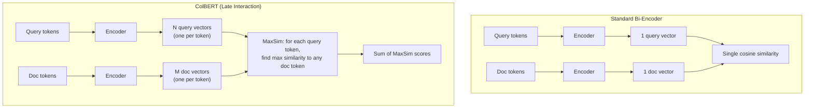

# Embedding Models — Senior-Level Deep Dive

## Late Interaction Models (ColBERT)

Traditional bi-encoders compress an entire document into a single vector, losing fine-grained token-level information. ColBERT keeps per-token embeddings and uses MaxSim for matching.

The following diagram shows ColBERT's late interaction architecture compared to standard bi-encoders:



**Why ColBERT matters:**
- 5-10x better retrieval precision than single-vector models on complex queries
- Documents can still be pre-indexed (each doc = matrix of token vectors)
- Query-time cost: compute MaxSim across stored token vectors (~50ms vs ~5ms for single-vector)

```python
# ColBERT with RAGatouille (high-level library)
from ragatouille import RAGPretrainedModel

# Load ColBERTv2
rag = RAGPretrainedModel.from_pretrained("colbert-ir/colbertv2.0")

# Index documents (stores per-token embeddings)
rag.index(
    collection=["Document 1 text...", "Document 2 text...", ...],
    index_name="my_index",
    max_document_length=256,
    split_documents=True  # Handles chunking internally
)

# Search — multi-vector matching
results = rag.search(query="What causes data skew in Spark joins?", k=5)
# Returns much more precise results than single-vector search
```

---

## Quantized Embeddings — 32x Memory Savings

Full-precision float32 embeddings are expensive at scale. Quantization reduces memory while preserving most quality:

| Precision | Bytes per Dimension | 1M docs × 1536 dims | Quality Loss |
|-----------|--------------------|--------------------|-------------|
| float32 | 4 bytes | 6 GB | Baseline |
| float16 | 2 bytes | 3 GB | Negligible (<0.1%) |
| int8 | 1 byte | 1.5 GB | Minimal (1-2%) |
| binary (1-bit) | 0.125 bytes | 192 MB | Moderate (5-10%) |

```python
import numpy as np

def quantize_int8(embeddings: np.ndarray) -> tuple[np.ndarray, dict]:
    """Quantize float32 embeddings to int8 (4x memory reduction)."""
    # Compute per-dimension min/max for rescaling
    mins = embeddings.min(axis=0)
    maxs = embeddings.max(axis=0)
    ranges = maxs - mins
    ranges[ranges == 0] = 1  # Avoid division by zero
    
    # Scale to 0-255 range, then shift to -128 to 127
    scaled = ((embeddings - mins) / ranges * 255).astype(np.int8)
    
    # Store calibration params for dequantization
    calibration = {"mins": mins, "ranges": ranges}
    return scaled, calibration

def quantize_binary(embeddings: np.ndarray) -> np.ndarray:
    """Binary quantization: each dimension → 1 bit (32x compression)."""
    # Simply: positive values → 1, negative → 0
    binary = (embeddings > 0).astype(np.uint8)
    # Pack 8 bits per byte for actual storage savings
    packed = np.packbits(binary, axis=1)
    return packed

def binary_similarity(query_packed: np.ndarray, doc_packed: np.ndarray) -> float:
    """Hamming-based similarity for binary vectors."""
    # XOR gives differing bits, popcount gives hamming distance
    xor = np.bitwise_xor(query_packed, doc_packed)
    hamming_dist = np.unpackbits(xor).sum()
    total_bits = len(query_packed) * 8
    return 1.0 - (hamming_dist / total_bits)  # Convert to similarity

# Production pattern: binary for initial candidate retrieval (fast),
# float32 for re-ranking top candidates (precise)
```

---

## Instruction-Tuned Embeddings

Modern embedding models respond to instructions that guide what aspect of the text to focus on:

```python
from sentence_transformers import SentenceTransformer

# E5-Mistral and similar instruction-tuned models
model = SentenceTransformer("intfloat/e5-mistral-7b-instruct")

# Different instructions produce different embeddings for the same text!
query_embedding = model.encode(
    "Instruct: Retrieve documents about data pipeline optimization\nQuery: How to fix slow Spark jobs?"
)

doc_embedding = model.encode(
    "Instruct: Represent this technical document for retrieval\n"
    "Document: Spark jobs become slow when data skew causes one partition to be much larger..."
)

# The instruction prefix tells the model what task it's doing,
# improving alignment between query-style and document-style embeddings
```

---

## Embedding Drift Detection and Reindexing

When your source data changes over time, embeddings can become stale or misaligned:

```python
import numpy as np
from scipy import stats

class EmbeddingDriftDetector:
    """Detect when embeddings no longer represent current data distribution."""
    
    def __init__(self, baseline_embeddings: np.ndarray, threshold: float = 0.05):
        self.baseline_centroid = baseline_embeddings.mean(axis=0)
        self.baseline_std = baseline_embeddings.std(axis=0)
        self.baseline_norms = np.linalg.norm(baseline_embeddings, axis=1)
        self.threshold = threshold
    
    def check_drift(self, new_embeddings: np.ndarray) -> dict:
        """Compare new batch of embeddings against baseline distribution."""
        new_centroid = new_embeddings.mean(axis=0)
        new_norms = np.linalg.norm(new_embeddings, axis=1)
        
        # Test 1: Centroid shift (has the "center" of embedding space moved?)
        centroid_distance = np.linalg.norm(new_centroid - self.baseline_centroid)
        
        # Test 2: Distribution of norms changed? (KS test)
        ks_stat, p_value = stats.ks_2samp(self.baseline_norms, new_norms)
        
        # Test 3: Per-dimension variance shift
        new_std = new_embeddings.std(axis=0)
        variance_ratio = (new_std / self.baseline_std).mean()
        
        drift_detected = (
            centroid_distance > self.threshold or
            p_value < 0.01 or
            abs(variance_ratio - 1.0) > 0.2
        )
        
        return {
            "drift_detected": drift_detected,
            "centroid_shift": float(centroid_distance),
            "ks_p_value": float(p_value),
            "variance_ratio": float(variance_ratio),
            "recommendation": "reindex" if drift_detected else "no_action"
        }
```

**Common drift causes:**
- Model provider updated the model (OpenAI periodically updates embedding models)
- Source data distribution shifted (new topics, vocabulary changes)
- Chunking strategy changed (different text fed to same model)

---

## Cost Optimization at Scale

At 100M+ embeddings, costs become significant. Key optimization levers:

```python
# Cost modeling
class EmbeddingCostModel:
    """Compare costs across embedding strategies."""
    
    PRICING = {
        "openai-small": {"per_1m_tokens": 0.02, "avg_tokens_per_doc": 200},
        "openai-large": {"per_1m_tokens": 0.13, "avg_tokens_per_doc": 200},
        "cohere-v3": {"per_1m_tokens": 0.10, "avg_tokens_per_doc": 200},
        "self-hosted-gpu": {
            "gpu_hourly": 3.00,  # A10G on AWS
            "docs_per_hour": 500_000,  # all-MiniLM throughput
        },
    }
    
    def monthly_cost(self, provider: str, docs_per_month: int) -> float:
        p = self.PRICING[provider]
        if "per_1m_tokens" in p:
            total_tokens = docs_per_month * p["avg_tokens_per_doc"]
            return total_tokens / 1_000_000 * p["per_1m_tokens"]
        else:
            hours_needed = docs_per_month / p["docs_per_hour"]
            return hours_needed * p["gpu_hourly"]

# Example: 50M new documents/month
model = EmbeddingCostModel()
# OpenAI small:  50M * 200 tokens / 1M * $0.02 = $200/month
# Self-hosted:   50M / 500K docs/hr = 100 hours * $3/hr = $300/month
# Break-even is around 100M docs/month for self-hosted to win
```

**Optimization strategies:**
1. **Cache aggressively** — Don't re-embed unchanged documents
2. **Matryoshka truncation** — Use 256 dims instead of 768 for initial search (3x faster)
3. **Batch deduplication** — Hash text before embedding to skip duplicates
4. **Tiered storage** — Binary quantized for initial retrieval, full precision for top-k reranking

---

## Custom Model Evaluation

Before deploying a new embedding model, evaluate it against your actual retrieval tasks:

```python
import numpy as np
from typing import List, Dict

def evaluate_retrieval(
    queries: List[str],
    relevant_docs: Dict[str, List[str]],  # query → list of relevant doc IDs
    embeddings_fn,  # function that embeds text
    corpus: Dict[str, str],  # doc_id → text
    k_values: List[int] = [1, 5, 10, 20]
) -> Dict[str, float]:
    """Evaluate embedding model on retrieval metrics."""
    
    # Embed corpus
    doc_ids = list(corpus.keys())
    doc_texts = [corpus[did] for did in doc_ids]
    doc_embeddings = embeddings_fn(doc_texts)
    
    metrics = {f"recall@{k}": [] for k in k_values}
    metrics["mrr"] = []
    
    for query in queries:
        query_emb = embeddings_fn([query])[0]
        
        # Compute similarities
        similarities = np.dot(doc_embeddings, query_emb)
        ranked_indices = np.argsort(similarities)[::-1]
        ranked_doc_ids = [doc_ids[i] for i in ranked_indices]
        
        relevant = set(relevant_docs.get(query, []))
        
        # Recall@k
        for k in k_values:
            retrieved = set(ranked_doc_ids[:k])
            recall = len(retrieved & relevant) / max(len(relevant), 1)
            metrics[f"recall@{k}"].append(recall)
        
        # MRR (Mean Reciprocal Rank)
        for rank, doc_id in enumerate(ranked_doc_ids, 1):
            if doc_id in relevant:
                metrics["mrr"].append(1.0 / rank)
                break
        else:
            metrics["mrr"].append(0.0)
    
    return {k: np.mean(v) for k, v in metrics.items()}

# Usage:
# results = evaluate_retrieval(test_queries, ground_truth, model.encode, corpus)
# {"recall@1": 0.72, "recall@5": 0.89, "recall@10": 0.94, "mrr": 0.81}
```

---

## Interview Tips

> **Tip 1:** "How would you handle embedding 100M documents?" — Batch processing with GPU workers, deduplication before embedding, incremental updates (only embed new/changed docs via CDC), and caching. Store embeddings in a vector database with appropriate quantization to control memory.

> **Tip 2:** "When would you use ColBERT over a standard bi-encoder?" — When retrieval precision is critical and you can tolerate higher storage (N vectors per doc instead of 1) and slightly slower queries. Ideal for enterprise search where wrong results have high cost.

> **Tip 3:** "How do you detect that your embeddings need reindexing?" — Monitor retrieval quality metrics (hit rate, user click-through on search results). Track embedding distribution drift (centroid shift, norm distribution change). Set up automated alerts when quality drops below threshold, triggering reindexing with the latest model.

## ⚡ Cheat Sheet

**RAG pipeline architecture**
```
Document → Chunk → Embed → Store in Vector DB
Query → Embed query → ANN search → Retrieve top-k chunks → Augment prompt → LLM → Answer
```

**Chunking strategies**
```python
# Fixed-size with overlap
text_splitter = RecursiveCharacterTextSplitter(chunk_size=512, chunk_overlap=50)
chunks = text_splitter.split_text(document)

# Semantic chunking (split on topic boundaries)
from langchain.text_splitter import SemanticChunker
chunker = SemanticChunker(embedding_model)

# Hierarchical: large chunks for context, small for retrieval
# Parent-child: store parent chunk, retrieve child, return parent to LLM
```

**Embedding models**
| Model | Dims | Use case |
|---|---|---|
| text-embedding-3-small | 1536 | General purpose, OpenAI |
| text-embedding-3-large | 3072 | Higher accuracy, OpenAI |
| all-MiniLM-L6-v2 | 384 | Fast, local, free |
| BAAI/bge-large-en | 1024 | Strong retrieval, local |
| Cohere embed-v3 | 1024 | Multilingual |

**Vector databases**
| DB | Type | Strengths |
|---|---|---|
| Pinecone | Managed | Easy ops, fully managed |
| Weaviate | OSS/managed | Hybrid search (vector + BM25) |
| Qdrant | OSS/managed | Fast, Rust-based, payload filtering |
| pgvector | PostgreSQL extension | Existing Postgres infrastructure |
| Chroma | OSS | Local dev, lightweight |
| FAISS | Library | Fastest local, no persistence |

**Retrieval optimization**
```python
# Hybrid search (vector + keyword)
results = vector_db.hybrid_search(
    query=query, vector=embed(query), alpha=0.7  # 0=pure BM25, 1=pure vector
)
# Re-ranking with cross-encoder
from sentence_transformers import CrossEncoder
ranker = CrossEncoder("cross-encoder/ms-marco-MiniLM-L-6-v2")
scores = ranker.predict([(query, doc.text) for doc in results])
reranked = sorted(zip(results, scores), key=lambda x: x[1], reverse=True)
```

**Evaluation metrics**
```
Faithfulness:    LLM answer only uses facts from retrieved context (anti-hallucination)
Answer Relevance: answer addresses the question
Context Precision: retrieved chunks actually contain the answer
Context Recall:   all relevant chunks were retrieved
RAGAS framework: automated evaluation of all four metrics
```

**Prompt engineering patterns**
```python
# System prompt with RAG context
system_prompt = """You are a data engineering assistant.
Answer only based on the provided context. If the answer is not in the context, say 'I don't know.'
Context:
{context}"""

# Few-shot prompting
few_shot_examples = [
    {"question": "What is Delta Lake?", "answer": "Delta Lake is an open-source..."},
]

# Chain-of-thought (CoT): "Let's think step by step"
# React pattern: Reason + Act (tool use) + Observe → loop until answer
```

**Fine-tuning vs RAG**
```
RAG:         best for dynamic/proprietary knowledge; no training needed; updatable
Fine-tuning: best for domain tone/style; specialized tasks; fixed knowledge cutoff
Combine:     fine-tune for domain adaptation + RAG for factual grounding
```

**Key interview points**
- Chunk size tradeoff: small chunks = precise retrieval; large chunks = more context
- Cosine similarity vs dot product: cosine for variable-length texts; dot for normalized
- Metadata filtering: filter by document_type, date, or source before ANN search
- Guardrails: LLM output validation (Guardrails AI, Nemo Guardrails, Instructor)
