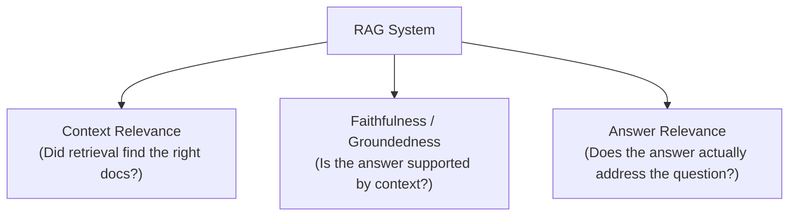

# RAG Evaluation Metrics — Fundamentals

## Why Evaluation Matters

Without evaluation, you're flying blind. Changes to chunking, embedding models, or prompts may help or hurt — you won't know until users complain. Evaluation gives you quantitative feedback on every change.

> **Key Insight for DE:** RAG evaluation is like data quality testing. You define what "correct" looks like, build automated checks, and run them on every change. Treat your RAG system's eval suite like you treat your data pipeline's test suite.

---

## The RAG Evaluation Triad

Every RAG system should be evaluated on three dimensions:



These three dimensions cover the full RAG pipeline: retrieval quality (Context Relevance), generation accuracy (Faithfulness), and end-to-end usefulness (Answer Relevance).

| Metric | What It Measures | Blame If Low |
|--------|-----------------|--------------|
| Context Relevance | Retrieved docs are relevant to the query | Retrieval (embeddings, chunking) |
| Faithfulness | Answer only uses info from retrieved context | Generation (prompt, model) |
| Answer Relevance | Answer addresses the user's question | Both retrieval + generation |

---

## Retrieval Metrics

These measure how well your retrieval system finds the right documents.

### Precision@K

Of the K documents retrieved, how many are actually relevant?

```python
def precision_at_k(retrieved_ids: list[str], relevant_ids: set[str], k: int) -> float:
    """What fraction of retrieved docs are relevant?"""
    top_k = retrieved_ids[:k]
    relevant_in_top_k = sum(1 for doc_id in top_k if doc_id in relevant_ids)
    return relevant_in_top_k / k

# Example: retrieved 5 docs, 3 are relevant
# Precision@5 = 3/5 = 0.60
```

### Recall@K

Of all relevant documents that exist, how many did we find in top-K?

```python
def recall_at_k(retrieved_ids: list[str], relevant_ids: set[str], k: int) -> float:
    """What fraction of all relevant docs did we retrieve?"""
    top_k = set(retrieved_ids[:k])
    found_relevant = len(top_k & relevant_ids)
    return found_relevant / len(relevant_ids) if relevant_ids else 0.0

# Example: 4 relevant docs exist, we found 3 in top-5
# Recall@5 = 3/4 = 0.75
```

### Hit Rate (Success@K)

Did at least one relevant document appear in the top-K?

```python
def hit_rate_at_k(retrieved_ids: list[str], relevant_ids: set[str], k: int) -> float:
    """Binary: did we find ANY relevant doc in top-K?"""
    top_k = set(retrieved_ids[:k])
    return 1.0 if top_k & relevant_ids else 0.0

# Simpler metric: for most RAG systems, finding even ONE relevant doc is enough
# Average over many queries: "85% hit rate" means 85% of queries find something useful
```

### MRR (Mean Reciprocal Rank)

How high up does the first relevant document appear?

```python
def reciprocal_rank(retrieved_ids: list[str], relevant_ids: set[str]) -> float:
    """1/position of the first relevant doc. Higher = found it faster."""
    for rank, doc_id in enumerate(retrieved_ids, 1):
        if doc_id in relevant_ids:
            return 1.0 / rank
    return 0.0

# If first relevant doc is at position 1: RR = 1.0
# If first relevant doc is at position 3: RR = 0.33
# MRR = average of RR across all test queries
```

### NDCG (Normalized Discounted Cumulative Gain)

Accounts for position AND graded relevance (not just binary relevant/irrelevant):

```python
import numpy as np

def ndcg_at_k(retrieved_ids: list[str], relevance_scores: dict[str, float], k: int) -> float:
    """NDCG considers position-weighted relevance scores."""
    # DCG: sum of relevance / log2(position+1)
    dcg = 0.0
    for i, doc_id in enumerate(retrieved_ids[:k], 1):
        rel = relevance_scores.get(doc_id, 0.0)
        dcg += rel / np.log2(i + 1)
    
    # Ideal DCG (perfect ranking)
    ideal_rels = sorted(relevance_scores.values(), reverse=True)[:k]
    idcg = sum(rel / np.log2(i + 2) for i, rel in enumerate(ideal_rels))
    
    return dcg / idcg if idcg > 0 else 0.0
```

---

## Generation Metrics

### BLEU (Bilingual Evaluation Understudy)

Measures n-gram overlap between generated and reference text. Commonly used but has limitations for RAG (penalizes valid paraphrases).

```python
from nltk.translate.bleu_score import sentence_bleu

reference = "The default value of spark.sql.shuffle.partitions is 200".split()
generated = "spark.sql.shuffle.partitions has a default value of 200".split()

score = sentence_bleu([reference], generated)  # ~0.5 (penalizes reordering)
# BLEU is a rough proxy — not ideal for RAG evaluation
```

### ROUGE (Recall-Oriented Understudy for Gisting Evaluation)

Measures overlap of n-grams with emphasis on recall (did the output capture the key content?):

```python
from rouge_score import rouge_scorer

scorer = rouge_scorer.RougeScorer(['rouge1', 'rouge2', 'rougeL'], use_stemmer=True)

reference = "Spark's default shuffle partition count is 200. Increase it for large datasets."
generated = "The default value of shuffle partitions in Spark is 200. For large data, increase this setting."

scores = scorer.score(reference, generated)
# rouge1: Precision=0.82, Recall=0.78, F1=0.80 (unigram overlap)
# rougeL: F1=0.72 (longest common subsequence)
```

### BERTScore

Uses BERT embeddings to measure semantic similarity (catches valid paraphrases that BLEU/ROUGE miss):

```python
from bert_score import score

references = ["The default shuffle partition count is 200"]
candidates = ["Spark uses 200 as the default number of shuffle partitions"]

P, R, F1 = score(candidates, references, lang="en")
print(f"BERTScore F1: {F1.item():.3f}")  # ~0.92 (recognizes semantic equivalence)
```

---

## End-to-End Evaluation

### Human Evaluation (Gold Standard)

```python
# Create evaluation dataset with ground truth
evaluation_set = [
    {
        "question": "What is the default spark.sql.shuffle.partitions?",
        "ground_truth": "200",
        "context_required": ["Spark documentation on shuffle configuration"],
    },
    {
        "question": "When should you use broadcast join?",
        "ground_truth": "When one table is small enough to fit in memory (default threshold 10MB)",
        "context_required": ["Spark join optimization documentation"],
    },
    # 100-500 test cases
]

# For each test case:
# 1. Run your RAG pipeline
# 2. Compare output to ground_truth
# 3. Score: correct (1), partially correct (0.5), incorrect (0)
```

### Automated Evaluation (Scalable)

```python
def automated_eval(question: str, generated_answer: str, ground_truth: str) -> dict:
    """Use an LLM to evaluate answer quality."""
    
    response = client.chat.completions.create(
        model="gpt-4o",  # Use strong model as judge
        messages=[{
            "role": "user",
            "content": f"""Evaluate this answer against the ground truth.

Question: {question}
Ground Truth: {ground_truth}
Generated Answer: {generated_answer}

Score each dimension from 0-1:
- correctness: Does the answer contain the correct information?
- completeness: Does it cover all aspects of the ground truth?
- conciseness: Is it appropriately brief without unnecessary information?

Respond as JSON: {{"correctness": 0-1, "completeness": 0-1, "conciseness": 0-1}}"""
        }],
        response_format={"type": "json_object"},
        temperature=0,
    )
    
    return json.loads(response.choices[0].message.content)
```

---

## Creating an Evaluation Dataset

Your eval dataset is the foundation of all quality measurement:

```python
def create_eval_dataset(source: str = "manual") -> list[dict]:
    """Build an evaluation dataset for your RAG system."""
    
    if source == "manual":
        # Best quality: domain experts write Q&A pairs
        # Time: 2-4 hours for 100 high-quality pairs
        return manually_curated_pairs
    
    elif source == "synthetic":
        # Good for bootstrapping: LLM generates Q&A from your docs
        eval_pairs = []
        for doc in sample_documents(n=50):
            response = client.chat.completions.create(
                model="gpt-4o",
                messages=[{
                    "role": "user",
                    "content": f"""Based on this document, generate 3 question-answer pairs.
Questions should be things a user would actually ask.
Answers should be directly supported by the document.

Document: {doc['text'][:2000]}

Return as JSON: [{{"question": "...", "answer": "...", "doc_id": "{doc['id']}"}}]"""
                }],
                response_format={"type": "json_object"},
                temperature=0.3,
            )
            pairs = json.loads(response.choices[0].message.content)
            eval_pairs.extend(pairs.get("pairs", pairs.get("questions", [])))
        
        return eval_pairs
    
    elif source == "production":
        # Use real user queries with validated answers
        return get_verified_production_queries(limit=200)

# Best practice: combine all three sources
# 50 manual (highest quality) + 100 synthetic (coverage) + 50 production (realistic)
```

---

## Key Metric Benchmarks

| Metric | Poor | Acceptable | Good | Excellent |
|--------|------|-----------|------|-----------|
| Hit Rate@5 | <60% | 60-75% | 75-90% | >90% |
| MRR | <0.3 | 0.3-0.5 | 0.5-0.7 | >0.7 |
| Faithfulness | <60% | 60-80% | 80-90% | >90% |
| Answer Relevance | <50% | 50-70% | 70-85% | >85% |

---

## Interview Tips

> **Tip 1:** "How do you evaluate a RAG system?" — The RAG triad: (1) Context Relevance (retrieval found right docs?), (2) Faithfulness (answer only uses retrieved info?), (3) Answer Relevance (answer addresses the question?). Measure all three because fixing one doesn't guarantee the others improve.

> **Tip 2:** "What metrics for retrieval?" — Hit Rate@K for "did we find something useful?" (binary), MRR for "how high up was it?" (ranking quality), Recall@K for "did we miss relevant docs?" (coverage). Start with Hit Rate — it's the simplest and most interpretable.

> **Tip 3:** "How do you get ground truth for evaluation?" — Three sources: (1) Manual annotation by domain experts (best quality, expensive), (2) Synthetic generation with GPT-4 from your documents (good coverage, fast), (3) Production queries with verified answers (most realistic). Use a mix of all three for robust evaluation.
