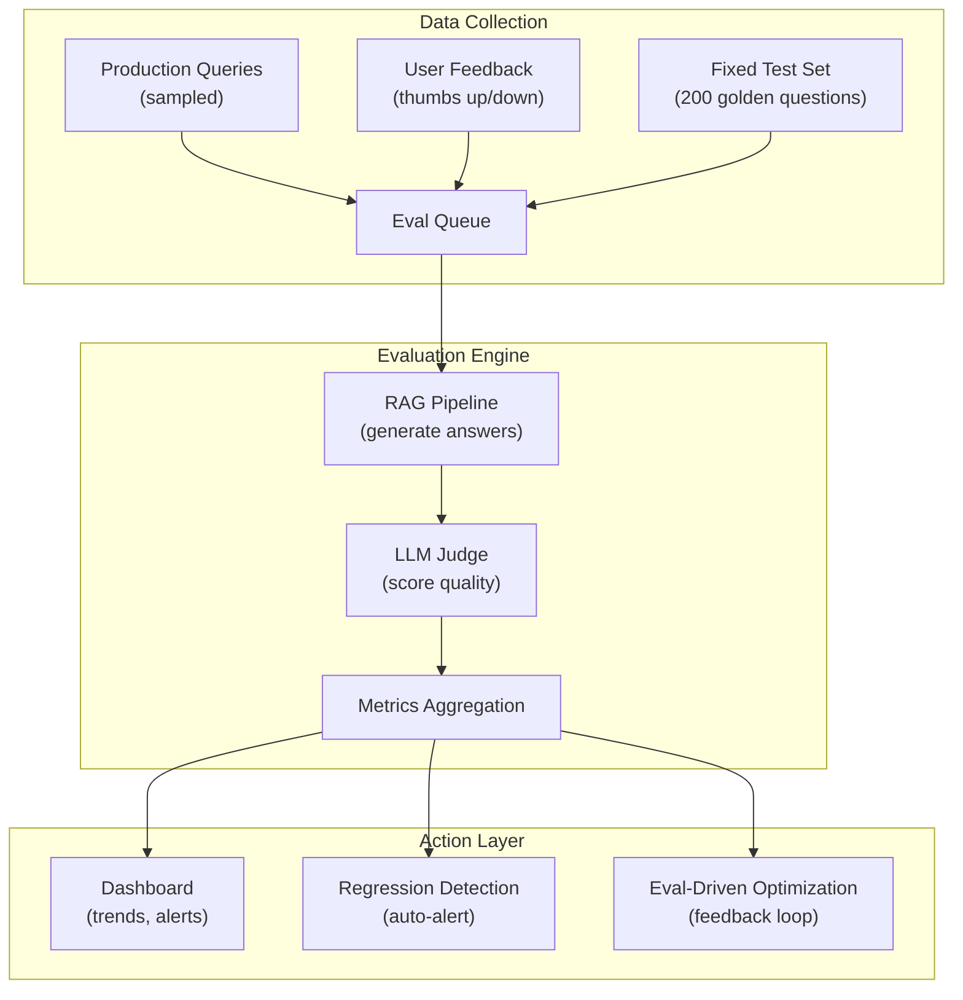

# RAG Evaluation Metrics — Senior-Level Deep Dive

## Building a Continuous Evaluation Platform

Production RAG systems need always-on evaluation, not just one-off checks:



This architecture shows how production evaluation runs continuously: collecting queries, scoring answers, detecting regressions, and driving optimization decisions.

```python
from dataclasses import dataclass, field
from datetime import datetime, timedelta
import numpy as np

@dataclass
class EvalMetric:
    name: str
    value: float
    timestamp: datetime
    metadata: dict = field(default_factory=dict)

class ContinuousEvalPlatform:
    """Always-on evaluation with regression detection and alerting."""
    
    def __init__(self, rag_system, judge, metrics_store, alert_service):
        self.rag = rag_system
        self.judge = judge
        self.store = metrics_store
        self.alerts = alert_service
        
        # Baselines (updated weekly)
        self.baselines = self.load_baselines()
    
    def run_scheduled_eval(self, eval_type: str = "nightly"):
        """Triggered by scheduler (Airflow/cron)."""
        
        if eval_type == "nightly":
            # Fixed test set: consistent comparison over time
            test_set = self.load_golden_test_set()  # 200 questions
        elif eval_type == "production_sample":
            # Random sample from today's production queries
            test_set = self.sample_production_queries(n=50)
        
        # Run evaluation
        results = []
        for case in test_set:
            answer = self.rag.answer(case["question"])
            score = self.judge.evaluate_answer(
                question=case["question"],
                answer=answer["text"],
                context=answer["contexts"],
                ground_truth=case.get("ground_truth"),
            )
            results.append(score)
        
        # Aggregate and store
        metrics = self.aggregate(results)
        self.store.save(metrics, timestamp=datetime.now())
        
        # Check for regression
        self.check_regression(metrics)
        
        return metrics
    
    def check_regression(self, current_metrics: dict):
        """Alert if quality drops below baseline."""
        for metric_name, value in current_metrics.items():
            baseline = self.baselines.get(metric_name, 0)
            
            if value < baseline - 0.05:  # >5% drop
                self.alerts.send(
                    severity="critical",
                    message=f"RAG quality regression: {metric_name} dropped from {baseline:.2f} to {value:.2f}",
                    data={"metric": metric_name, "baseline": baseline, "current": value},
                )
            elif value < baseline - 0.02:  # 2-5% drop
                self.alerts.send(
                    severity="warning",
                    message=f"RAG quality dip: {metric_name} at {value:.2f} (baseline: {baseline:.2f})",
                )
    
    def update_baselines(self):
        """Weekly: recompute baselines from last 7 days of metrics."""
        week_metrics = self.store.query(last_n_days=7)
        self.baselines = {
            metric: np.percentile([m.value for m in week_metrics if m.name == metric], 25)
            for metric in ["faithfulness", "relevance", "correctness"]
        }
        # Use 25th percentile as baseline (conservative — only alert on clear regression)
```

---

## Multi-Dimensional Evaluation

RAG quality isn't one number — it's a trade-off surface:

```python
class MultiDimensionalEvaluator:
    """Evaluate RAG across quality, latency, and cost simultaneously."""
    
    def evaluate_full(self, test_cases: list[dict]) -> dict:
        results = {
            "quality": {"faithfulness": [], "correctness": [], "relevance": []},
            "performance": {"latency_ms": [], "tokens_used": []},
            "cost": {"input_tokens": [], "output_tokens": [], "total_cost": []},
        }
        
        for case in test_cases:
            import time
            start = time.time()
            
            answer = self.rag.answer(case["question"])
            latency = (time.time() - start) * 1000
            
            # Quality
            score = self.judge.evaluate(case["question"], answer)
            results["quality"]["faithfulness"].append(score["faithfulness"])
            results["quality"]["correctness"].append(score["correctness"])
            
            # Performance
            results["performance"]["latency_ms"].append(latency)
            results["performance"]["tokens_used"].append(answer.get("total_tokens", 0))
            
            # Cost
            cost = answer.get("total_tokens", 0) * 0.000005  # Approximate
            results["cost"]["total_cost"].append(cost)
        
        # Compute trade-off metrics
        return {
            "quality_score": np.mean(results["quality"]["correctness"]),
            "p50_latency_ms": np.percentile(results["performance"]["latency_ms"], 50),
            "p99_latency_ms": np.percentile(results["performance"]["latency_ms"], 99),
            "avg_cost_per_query": np.mean(results["cost"]["total_cost"]),
            "quality_per_dollar": np.mean(results["quality"]["correctness"]) / max(np.mean(results["cost"]["total_cost"]), 0.0001),
        }
```

---

## Evaluation for Different RAG Patterns

| RAG Pattern | Key Evaluation Focus | Special Metrics |
|-------------|---------------------|-----------------|
| Simple RAG | Retrieval recall, faithfulness | Hit rate@5 |
| Multi-hop | Completeness across hops | Multi-step accuracy |
| Agentic RAG | Tool usage correctness | Steps-to-answer, tool errors |
| Conversational | Context carry-over | Turn-level coherence |
| Multi-modal | Image description accuracy | Visual faithfulness |

```python
# Multi-hop evaluation: check if ALL required facts are covered
def eval_multi_hop(question: str, answer: str, required_facts: list[str]) -> float:
    """Score based on coverage of multiple required facts."""
    covered = sum(1 for fact in required_facts if fact.lower() in answer.lower())
    return covered / len(required_facts)

# Agentic evaluation: check if agent used correct tools
def eval_agent(question: str, agent_trace: list[dict], expected_tools: list[str]) -> dict:
    used_tools = [step["tool"] for step in agent_trace]
    correct_tools = set(expected_tools) & set(used_tools)
    return {
        "tool_accuracy": len(correct_tools) / len(expected_tools),
        "efficiency": len(expected_tools) / max(len(used_tools), 1),  # Fewer steps = better
    }
```

---

## Production Monitoring vs Offline Evaluation

| Aspect | Offline Eval | Production Monitoring |
|--------|-------------|---------------------|
| When | On change (CI/CD) | Always (real-time) |
| Data | Fixed test set | Live user queries |
| Ground truth | Available (curated) | Rarely available |
| Metrics | Accuracy, recall, RAGAS | Latency, user feedback, scores |
| Purpose | Catch regressions before deploy | Detect issues in production |
| Cost | ~$5-20 per eval run | Ongoing (sample-based) |

```python
# Production monitoring: lightweight, real-time quality signals
class ProductionQualityMonitor:
    def on_rag_response(self, query: str, answer: str, contexts: list[str], top_score: float):
        """Called for every production RAG response."""
        
        # Signal 1: Retrieval quality proxy (no LLM call needed)
        if top_score < 0.4:
            self.log_low_retrieval_quality(query, top_score)
        
        # Signal 2: Answer length anomaly
        if len(answer) < 20:  # Suspiciously short
            self.log_short_answer(query, answer)
        
        # Signal 3: "I don't know" rate
        if "don't have information" in answer.lower():
            self.log_no_answer(query)
        
        # Signal 4: Spot-check with LLM judge (sample 1% of traffic)
        if random.random() < 0.01:
            score = self.judge.quick_eval(query, answer, contexts)
            self.log_quality_score(query, score)
```

---

## Evaluation-Driven Development

Use evaluation metrics to guide architecture decisions:

```python
class EvalDrivenOptimizer:
    """Use evaluation results to prioritize improvements."""
    
    def diagnose_issues(self, eval_results: list[dict]) -> dict:
        """Analyze eval results to identify root causes."""
        
        low_retrieval = [r for r in eval_results if r["retrieval_score"] < 0.5]
        low_faithfulness = [r for r in eval_results if r["faithfulness"] < 0.6]
        low_relevance = [r for r in eval_results if r["relevance"] < 0.6]
        
        diagnosis = {
            "retrieval_failures": len(low_retrieval) / len(eval_results),
            "hallucination_rate": len(low_faithfulness) / len(eval_results),
            "irrelevance_rate": len(low_relevance) / len(eval_results),
        }
        
        # Prioritize fixes by impact
        if diagnosis["retrieval_failures"] > 0.2:
            diagnosis["top_priority"] = "Fix retrieval: try hybrid search, better chunking, or re-embedding"
        elif diagnosis["hallucination_rate"] > 0.15:
            diagnosis["top_priority"] = "Fix generation: stricter prompt, lower temperature, add fact-checking"
        elif diagnosis["irrelevance_rate"] > 0.2:
            diagnosis["top_priority"] = "Fix query understanding: add query transformation or decomposition"
        else:
            diagnosis["top_priority"] = "System is healthy — focus on edge cases"
        
        return diagnosis
```

---

## Interview Tips

> **Tip 1:** "How do you build a continuous evaluation system?" — Fixed nightly eval (200 golden questions, track trends), production sampling (1% of live queries scored by LLM judge), regression detection with alerting (>5% drop triggers page), and weekly baseline updates. The eval platform is as critical as the RAG system itself.

> **Tip 2:** "How do you use evaluation results to improve the system?" — Categorize failures: low retrieval score → fix embeddings/chunking, hallucination → fix prompt/temperature, irrelevant answers → fix query transformation. Attack the category with highest failure rate first. Rerun eval after each change to confirm improvement.

> **Tip 3:** "Offline eval vs production monitoring?" — Both are essential. Offline eval (on changes): catches regressions before they reach users, uses curated test set with ground truth. Production monitoring (always-on): catches real-world issues that test sets don't cover, uses live signals (top-score, user feedback, answer length). Together they provide full coverage.

## ⚡ Cheat Sheet

**RAG pipeline architecture**
```
Document → Chunk → Embed → Store in Vector DB
Query → Embed query → ANN search → Retrieve top-k chunks → Augment prompt → LLM → Answer
```

**Chunking strategies**
```python
# Fixed-size with overlap
text_splitter = RecursiveCharacterTextSplitter(chunk_size=512, chunk_overlap=50)
chunks = text_splitter.split_text(document)

# Semantic chunking (split on topic boundaries)
from langchain.text_splitter import SemanticChunker
chunker = SemanticChunker(embedding_model)

# Hierarchical: large chunks for context, small for retrieval
# Parent-child: store parent chunk, retrieve child, return parent to LLM
```

**Embedding models**
| Model | Dims | Use case |
|---|---|---|
| text-embedding-3-small | 1536 | General purpose, OpenAI |
| text-embedding-3-large | 3072 | Higher accuracy, OpenAI |
| all-MiniLM-L6-v2 | 384 | Fast, local, free |
| BAAI/bge-large-en | 1024 | Strong retrieval, local |
| Cohere embed-v3 | 1024 | Multilingual |

**Vector databases**
| DB | Type | Strengths |
|---|---|---|
| Pinecone | Managed | Easy ops, fully managed |
| Weaviate | OSS/managed | Hybrid search (vector + BM25) |
| Qdrant | OSS/managed | Fast, Rust-based, payload filtering |
| pgvector | PostgreSQL extension | Existing Postgres infrastructure |
| Chroma | OSS | Local dev, lightweight |
| FAISS | Library | Fastest local, no persistence |

**Retrieval optimization**
```python
# Hybrid search (vector + keyword)
results = vector_db.hybrid_search(
    query=query, vector=embed(query), alpha=0.7  # 0=pure BM25, 1=pure vector
)
# Re-ranking with cross-encoder
from sentence_transformers import CrossEncoder
ranker = CrossEncoder("cross-encoder/ms-marco-MiniLM-L-6-v2")
scores = ranker.predict([(query, doc.text) for doc in results])
reranked = sorted(zip(results, scores), key=lambda x: x[1], reverse=True)
```

**Evaluation metrics**
```
Faithfulness:    LLM answer only uses facts from retrieved context (anti-hallucination)
Answer Relevance: answer addresses the question
Context Precision: retrieved chunks actually contain the answer
Context Recall:   all relevant chunks were retrieved
RAGAS framework: automated evaluation of all four metrics
```

**Prompt engineering patterns**
```python
# System prompt with RAG context
system_prompt = """You are a data engineering assistant.
Answer only based on the provided context. If the answer is not in the context, say 'I don't know.'
Context:
{context}"""

# Few-shot prompting
few_shot_examples = [
    {"question": "What is Delta Lake?", "answer": "Delta Lake is an open-source..."},
]

# Chain-of-thought (CoT): "Let's think step by step"
# React pattern: Reason + Act (tool use) + Observe → loop until answer
```

**Fine-tuning vs RAG**
```
RAG:         best for dynamic/proprietary knowledge; no training needed; updatable
Fine-tuning: best for domain tone/style; specialized tasks; fixed knowledge cutoff
Combine:     fine-tune for domain adaptation + RAG for factual grounding
```

**Key interview points**
- Chunk size tradeoff: small chunks = precise retrieval; large chunks = more context
- Cosine similarity vs dot product: cosine for variable-length texts; dot for normalized
- Metadata filtering: filter by document_type, date, or source before ANN search
- Guardrails: LLM output validation (Guardrails AI, Nemo Guardrails, Instructor)
