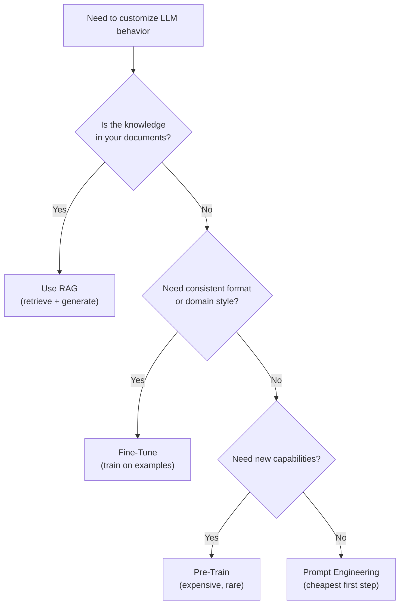

# Fine-Tuning LLMs — Fundamentals

## What Is Fine-Tuning?

Fine-tuning is the process of **further training a pre-trained LLM on your specific data** to adapt it for a particular task, domain, or style. It's like taking a general-purpose engineer and training them on your company's specific tech stack.

```python
# Without fine-tuning: generic model, needs detailed prompts
response = generic_model("Classify this log entry: ERROR OOM in executor 3")
# May need 10 examples in the prompt to get consistent classification

# With fine-tuning: model has learned YOUR classification scheme
response = fine_tuned_model("Classify this log entry: ERROR OOM in executor 3")
# Returns: {"category": "memory", "severity": "critical", "component": "executor"}
# Consistently, without any examples in the prompt
```

> **Key Insight for DE:** Fine-tuning is a data pipeline problem. The quality of training data determines model quality. Your role: build the data pipeline that collects, cleans, and formats training examples.

---

## The Decision Framework

When to use each approach:



This decision tree helps choose between prompting, RAG, fine-tuning, and pre-training based on your specific needs.

| Approach | Cost | Data Needed | Best For |
|----------|------|-------------|----------|
| Prompt Engineering | Free | 0-10 examples | Format control, simple tasks |
| RAG | Low | Documents to index | Knowledge/fact retrieval |
| Fine-Tuning | Medium | 50-10,000 examples | Consistent behavior, domain style |
| Pre-Training | Very High | Billions of tokens | New languages, entirely new domains |

---

## When to Fine-Tune

**Good reasons to fine-tune:**
- Model needs to follow a specific output format consistently (JSON schema, classification labels)
- Domain-specific terminology that the base model doesn't handle well
- Specific tone/style (formal legal writing, casual support responses)
- Reduce prompt size (replace lengthy few-shot examples with learned behavior)
- Improve latency (shorter prompts = faster inference)

**Bad reasons to fine-tune:**
- Adding new factual knowledge (use RAG instead — fine-tuning "memorizes" poorly)
- One-off tasks (prompt engineering is cheaper and faster)
- When you have fewer than 50 examples
- When the task changes frequently (fine-tuning is slow to update)

---

## Training Data Format

### OpenAI Fine-Tuning Format (JSONL)

```jsonl
{"messages": [{"role": "system", "content": "You classify data pipeline errors."}, {"role": "user", "content": "ERROR: java.lang.OutOfMemoryError in executor 3"}, {"role": "assistant", "content": "{\"category\": \"memory\", \"severity\": \"critical\", \"component\": \"executor\", \"action\": \"increase_memory\"}"}]}
{"messages": [{"role": "system", "content": "You classify data pipeline errors."}, {"role": "user", "content": "WARN: Shuffle spill to disk detected, 2.3GB spilled"}, {"role": "assistant", "content": "{\"category\": \"performance\", \"severity\": \"warning\", \"component\": \"shuffle\", \"action\": \"increase_partitions\"}"}]}
{"messages": [{"role": "system", "content": "You classify data pipeline errors."}, {"role": "user", "content": "INFO: Job completed in 45 minutes (SLA: 30 minutes)"}, {"role": "assistant", "content": "{\"category\": \"sla_breach\", \"severity\": \"high\", \"component\": \"job\", \"action\": \"investigate_performance\"}"}]}
```

### Preparing Training Data in Python

```python
import json

def create_training_file(examples: list[dict], output_path: str):
    """Convert training examples to OpenAI JSONL format."""
    
    with open(output_path, "w") as f:
        for ex in examples:
            entry = {
                "messages": [
                    {"role": "system", "content": ex["system_prompt"]},
                    {"role": "user", "content": ex["input"]},
                    {"role": "assistant", "content": ex["expected_output"]},
                ]
            }
            f.write(json.dumps(entry) + "\n")

# Example: creating training data from historical alert classifications
training_examples = [
    {
        "system_prompt": "Classify data pipeline alerts into categories.",
        "input": "ERROR: Connection refused to PostgreSQL host db-prod-01:5432",
        "expected_output": json.dumps({
            "category": "connectivity",
            "severity": "critical",
            "component": "database",
            "action": "check_db_health"
        })
    },
    # ... 200+ examples
]

create_training_file(training_examples, "training_data.jsonl")
```

---

## Fine-Tuning with OpenAI API

```python
from openai import OpenAI

client = OpenAI()

# Step 1: Upload training file
file = client.files.create(
    file=open("training_data.jsonl", "rb"),
    purpose="fine-tune"
)

# Step 2: Create fine-tuning job
job = client.fine_tuning.jobs.create(
    training_file=file.id,
    model="gpt-4o-mini-2024-07-18",  # Base model
    hyperparameters={
        "n_epochs": 3,              # Number of passes over the data
        "batch_size": "auto",       # OpenAI chooses optimal
        "learning_rate_multiplier": "auto",
    },
    suffix="error-classifier-v1",   # Custom model name suffix
)

print(f"Job ID: {job.id}")
print(f"Status: {job.status}")

# Step 3: Monitor progress
import time
while True:
    job = client.fine_tuning.jobs.retrieve(job.id)
    print(f"Status: {job.status}")
    if job.status in ["succeeded", "failed"]:
        break
    time.sleep(60)

# Step 4: Use the fine-tuned model
if job.status == "succeeded":
    model_name = job.fine_tuned_model
    
    response = client.chat.completions.create(
        model=model_name,  # e.g., "ft:gpt-4o-mini-2024-07-18:org:error-classifier-v1:abc123"
        messages=[
            {"role": "system", "content": "Classify data pipeline alerts."},
            {"role": "user", "content": "ERROR: Kafka consumer lag exceeding 1M messages"}
        ],
        temperature=0,
    )
    print(response.choices[0].message.content)
```

---

## Training vs Validation Split

Always hold out data for validation to detect overfitting:

```python
import random

def split_training_data(examples: list[dict], val_ratio: float = 0.2) -> tuple[list, list]:
    """Split data into training and validation sets."""
    random.shuffle(examples)
    split_idx = int(len(examples) * (1 - val_ratio))
    return examples[:split_idx], examples[split_idx:]

train_examples, val_examples = split_training_data(all_examples, val_ratio=0.2)

# Create separate files
create_training_file(train_examples, "train.jsonl")   # 80% for training
create_training_file(val_examples, "val.jsonl")        # 20% for validation

# Upload both
train_file = client.files.create(file=open("train.jsonl", "rb"), purpose="fine-tune")
val_file = client.files.create(file=open("val.jsonl", "rb"), purpose="fine-tune")

# Create job with validation
job = client.fine_tuning.jobs.create(
    training_file=train_file.id,
    validation_file=val_file.id,  # Monitor validation loss
    model="gpt-4o-mini-2024-07-18",
)
```

---

## Hyperparameters

| Parameter | What It Does | Typical Values | Impact |
|-----------|-------------|----------------|--------|
| `n_epochs` | Passes over training data | 2-5 | More = better fit, risk overfit |
| `batch_size` | Examples per update | 1-32 (auto) | Larger = more stable, slower |
| `learning_rate_multiplier` | Step size for updates | 0.5-2.0 (auto) | Higher = faster learning, risk instability |

**Rules of thumb:**
- 50-100 examples: use 3-5 epochs
- 500+ examples: use 2-3 epochs
- 5000+ examples: use 1-2 epochs (more data = fewer epochs needed)
- Always use "auto" if unsure — OpenAI's defaults are well-tuned

---

## Cost Estimation

```python
def estimate_fine_tuning_cost(
    num_examples: int,
    avg_tokens_per_example: int = 200,
    n_epochs: int = 3,
    model: str = "gpt-4o-mini"
) -> dict:
    """Estimate fine-tuning cost."""
    
    # Training cost (per token processed during training)
    training_costs = {
        "gpt-4o-mini": 0.000003,  # $3 per 1M training tokens
        "gpt-4o": 0.000025,       # $25 per 1M training tokens
    }
    
    # Inference cost (using fine-tuned model)
    inference_costs = {
        "gpt-4o-mini": {"input": 0.0003, "output": 0.0012},  # per 1K tokens
        "gpt-4o": {"input": 0.005, "output": 0.015},
    }
    
    total_training_tokens = num_examples * avg_tokens_per_example * n_epochs
    training_cost = total_training_tokens * training_costs[model]
    
    return {
        "training_tokens": total_training_tokens,
        "training_cost": f"${training_cost:.2f}",
        "inference_cost_per_query": f"${inference_costs[model]['input'] * 0.1 + inference_costs[model]['output'] * 0.2:.4f}",
        "time_estimate": f"{num_examples * n_epochs / 5000:.0f} minutes (approx)",
    }

# Example: 500 training examples, 200 tokens each, 3 epochs
print(estimate_fine_tuning_cost(500, 200, 3, "gpt-4o-mini"))
# {"training_cost": "$0.90", "time_estimate": "~1 minute"}
```

---

## Quality > Quantity

The most important factor for fine-tuning success is **training data quality**:

| Approach | Examples | Quality | Result |
|----------|---------|---------|--------|
| Bad | 5000 noisy, inconsistent examples | Low | Confused model, inconsistent outputs |
| Good | 200 clean, carefully curated examples | High | Consistent, accurate model |
| Best | 500+ clean examples with edge cases | High | Robust model that handles corner cases |

**Data quality checklist:**
- ☐ Consistent output format across all examples
- ☐ No contradictory examples (same input → different correct outputs)
- ☐ Representative coverage of expected input types
- ☐ Edge cases included (nulls, empty inputs, long inputs)
- ☐ Reviewed by domain expert (not just auto-generated)

---

## Interview Tips

> **Tip 1:** "When would you fine-tune vs use RAG?" — Fine-tune for behavior/style (consistent JSON output, classification, domain writing style). RAG for knowledge (finding and citing specific facts from documents). They're complementary: fine-tune the generation model to cite RAG results better.

> **Tip 2:** "How much training data do you need?" — Minimum 50 examples to see any improvement. 200-500 for good results. 1000+ for robust production quality. But 200 high-quality examples beat 5000 noisy ones every time.

> **Tip 3:** "What's the cost of fine-tuning?" — Surprisingly cheap for API-based: $1-10 for GPT-4o-mini with 500 examples. The expensive part is creating high-quality training data (human time, not compute cost). Self-hosted fine-tuning (LoRA on GPU) has higher compute cost but zero per-inference cost.
