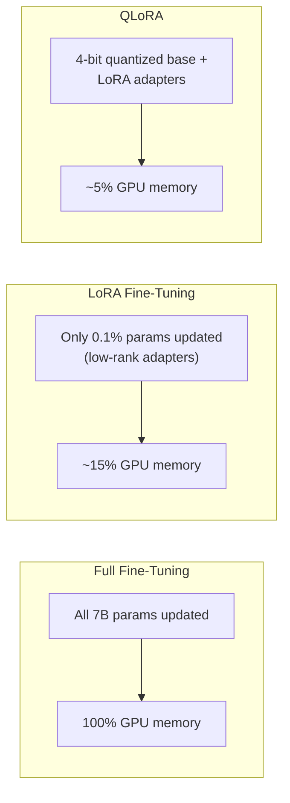

# Fine-Tuning LLMs — Intermediate

## Parameter-Efficient Fine-Tuning (PEFT)

Full fine-tuning updates ALL model parameters (billions). PEFT methods update only a tiny fraction while achieving comparable results.



This comparison shows how PEFT methods dramatically reduce the compute and memory required for fine-tuning.

| Method | Params Trained | GPU Memory (7B model) | Quality vs Full FT |
|--------|---------------|----------------------|-------------------|
| Full Fine-Tuning | 100% (7B) | ~60 GB (2× A100) | Baseline |
| LoRA | 0.1-1% (~10M) | ~16 GB (1× A10G) | 95-99% of full |
| QLoRA | 0.1-1% on 4-bit base | ~8 GB (1× T4) | 90-97% of full |
| Adapters | 2-5% (~200M) | ~24 GB | 95-98% of full |

---

## LoRA (Low-Rank Adaptation) — How It Works

LoRA adds small trainable matrices alongside frozen model weights:

```python
# Conceptual: for each weight matrix W (e.g., attention Q, K, V projections)
# Original: output = W × input  (W is frozen, huge)
# LoRA: output = W × input + (B × A) × input  (A and B are tiny, trainable)

# W: [4096 × 4096] = 16M params (frozen)
# A: [4096 × 16] = 65K params (trainable)
# B: [16 × 4096] = 65K params (trainable)
# B × A: low-rank approximation of the weight update
# Total trainable: 130K per layer vs 16M per layer (99% reduction)
```

### LoRA Fine-Tuning with Hugging Face

```python
from transformers import AutoModelForCausalLM, AutoTokenizer, TrainingArguments
from peft import LoraConfig, get_peft_model, TaskType
from datasets import load_dataset
from trl import SFTTrainer

# Step 1: Load base model
model_name = "meta-llama/Llama-3.1-8B-Instruct"
model = AutoModelForCausalLM.from_pretrained(
    model_name,
    torch_dtype="auto",
    device_map="auto",
)
tokenizer = AutoTokenizer.from_pretrained(model_name)
tokenizer.pad_token = tokenizer.eos_token

# Step 2: Configure LoRA
lora_config = LoraConfig(
    task_type=TaskType.CAUSAL_LM,
    r=16,                      # Rank of the low-rank matrices (higher = more capacity)
    lora_alpha=32,             # Scaling factor (typically 2× r)
    lora_dropout=0.05,         # Dropout for regularization
    target_modules=[           # Which layers to add LoRA to
        "q_proj", "k_proj", "v_proj", "o_proj",  # Attention
        "gate_proj", "up_proj", "down_proj",       # MLP
    ],
)

# Step 3: Apply LoRA to model
model = get_peft_model(model, lora_config)
model.print_trainable_parameters()
# "trainable params: 13,107,200 || all params: 8,030,261,248 || trainable%: 0.16"

# Step 4: Prepare dataset
dataset = load_dataset("json", data_files="training_data.jsonl")

def format_example(example):
    """Format into chat template."""
    messages = example["messages"]
    text = tokenizer.apply_chat_template(messages, tokenize=False, add_generation_prompt=False)
    return {"text": text}

dataset = dataset.map(format_example)

# Step 5: Train
training_args = TrainingArguments(
    output_dir="./lora-output",
    num_train_epochs=3,
    per_device_train_batch_size=4,
    gradient_accumulation_steps=4,
    learning_rate=2e-4,
    warmup_ratio=0.1,
    logging_steps=10,
    save_strategy="epoch",
    fp16=True,
    report_to="wandb",
)

trainer = SFTTrainer(
    model=model,
    train_dataset=dataset["train"],
    args=training_args,
    dataset_text_field="text",
    max_seq_length=2048,
)

trainer.train()

# Step 6: Save adapter weights (tiny — just the LoRA matrices)
model.save_pretrained("./lora-adapter-v1")
# Adapter size: ~50 MB (vs 16 GB for full model)
```

---

## QLoRA — Fine-Tuning on Consumer GPUs

QLoRA quantizes the base model to 4-bit, then applies LoRA adapters. This enables fine-tuning 7B models on a single 16GB GPU.

```python
from transformers import BitsAndBytesConfig
import torch

# 4-bit quantization config
bnb_config = BitsAndBytesConfig(
    load_in_4bit=True,
    bnb_4bit_quant_type="nf4",         # NormalFloat4 (optimal for LLMs)
    bnb_4bit_compute_dtype=torch.float16,
    bnb_4bit_use_double_quant=True,     # Double quantization (further savings)
)

# Load model in 4-bit (uses ~4 GB instead of 16 GB)
model = AutoModelForCausalLM.from_pretrained(
    "meta-llama/Llama-3.1-8B-Instruct",
    quantization_config=bnb_config,
    device_map="auto",
)

# Apply LoRA on top of quantized model
lora_config = LoraConfig(
    r=16,
    lora_alpha=32,
    target_modules=["q_proj", "k_proj", "v_proj", "o_proj"],
    lora_dropout=0.05,
    task_type=TaskType.CAUSAL_LM,
)

model = get_peft_model(model, lora_config)
# Now trainable on a single 16 GB GPU!
```

---

## Dataset Preparation Best Practices

### Instruction Tuning Format

```python
def prepare_instruction_dataset(raw_data: list[dict]) -> list[dict]:
    """Convert raw data into instruction tuning format."""
    
    formatted = []
    for item in raw_data:
        formatted.append({
            "messages": [
                {
                    "role": "system",
                    "content": "You are a data pipeline error classifier. Respond with JSON only."
                },
                {
                    "role": "user",
                    "content": f"Classify this error:\n{item['error_message']}"
                },
                {
                    "role": "assistant",
                    "content": json.dumps(item['classification'])
                }
            ]
        })
    
    return formatted

# Data quality checks
def validate_dataset(examples: list[dict]) -> dict:
    """Check dataset quality before training."""
    issues = []
    
    for i, ex in enumerate(examples):
        msgs = ex["messages"]
        
        # Check structure
        if len(msgs) < 2:
            issues.append(f"Example {i}: needs at least user + assistant messages")
        
        # Check consistency
        assistant_msg = msgs[-1]["content"]
        try:
            json.loads(assistant_msg)  # Should be valid JSON
        except json.JSONDecodeError:
            issues.append(f"Example {i}: assistant output is not valid JSON")
        
        # Check length
        total_tokens = sum(len(m["content"].split()) for m in msgs)
        if total_tokens > 4000:
            issues.append(f"Example {i}: too long ({total_tokens} words)")
    
    return {
        "total_examples": len(examples),
        "issues_found": len(issues),
        "issues": issues[:20],  # First 20 issues
        "ready": len(issues) == 0,
    }
```

---

## Evaluation During Training

Monitor training and validation loss to detect overfitting:

```python
# With OpenAI fine-tuning: check job events
events = client.fine_tuning.jobs.list_events(fine_tuning_job_id=job.id)
for event in events.data:
    if event.type == "metrics":
        print(f"Step {event.data['step']}: train_loss={event.data['train_loss']:.4f}, val_loss={event.data.get('valid_loss', 'N/A')}")

# Expected pattern:
# Step 100: train_loss=1.2, val_loss=1.3  (both decreasing)
# Step 200: train_loss=0.8, val_loss=0.9  (both decreasing — good)
# Step 300: train_loss=0.5, val_loss=0.6  (both decreasing — good)
# Step 400: train_loss=0.3, val_loss=0.7  (train still falling, val rising — OVERFIT!)

# For Hugging Face: use callbacks
from transformers import TrainerCallback

class LossMonitorCallback(TrainerCallback):
    def on_log(self, args, state, control, logs=None, **kwargs):
        if "loss" in logs:
            print(f"Step {state.global_step}: loss={logs['loss']:.4f}")
        if "eval_loss" in logs:
            if logs["eval_loss"] > logs.get("loss", 0) * 1.5:
                print("WARNING: Possible overfitting detected!")
```

---

## Fine-Tuning for Different Tasks

### Classification

```python
# Training data: input → label
{"messages": [{"role": "user", "content": "The Spark job OOM'd on executor 5"}, {"role": "assistant", "content": "memory_error"}]}
# 50-200 examples per class needed
# Use temperature=0 at inference for consistent labels
```

### Structured Extraction

```python
# Training data: unstructured input → structured JSON output
{"messages": [{"role": "user", "content": "Parse: SELECT * FROM orders WHERE date > '2024-01-01'"}, {"role": "assistant", "content": "{\"tables\": [\"orders\"], \"columns\": [\"*\"], \"filters\": [{\"column\": \"date\", \"op\": \">\", \"value\": \"2024-01-01\"}]}"}]}
# 200-500 examples with diverse SQL patterns
```

### Style Transfer

```python
# Training data: input in one style → output in target style
{"messages": [{"role": "system", "content": "Rewrite technical docs for junior engineers."}, {"role": "user", "content": "AQE dynamically coalesces post-shuffle partitions based on runtime statistics."}, {"role": "assistant", "content": "Spark can automatically combine small data chunks after a shuffle operation, based on what it learns while the job is running. This prevents having too many tiny partitions."}]}
# 100-300 style transfer pairs
```

---

## Model Merging

Combine multiple LoRA adapters or merge adapter back into base model:

```python
from peft import PeftModel

# Load base model + adapter
base_model = AutoModelForCausalLM.from_pretrained("meta-llama/Llama-3.1-8B-Instruct")
model = PeftModel.from_pretrained(base_model, "./lora-adapter-v1")

# Merge adapter into base model (removes the adapter, bakes it in)
merged_model = model.merge_and_unload()

# Save as a standalone model (no adapter dependency)
merged_model.save_pretrained("./merged-model-v1")
# Can be deployed like any normal model (no PEFT library needed at inference)
```

---

## Interview Tips

> **Tip 1:** "What is LoRA and why use it?" — LoRA adds tiny trainable matrices (rank 16) alongside frozen model weights. It trains 0.1-1% of parameters instead of 100%, using 90% less GPU memory. Quality is 95-99% of full fine-tuning for most tasks. It's the standard approach for fine-tuning LLMs without massive GPU clusters.

> **Tip 2:** "How do you detect overfitting?" — Monitor validation loss during training. If training loss keeps decreasing but validation loss starts increasing, you're overfitting. Fix: reduce epochs, add dropout, or increase training data. With 200 examples and 5 epochs, overfitting is common — try 2-3 epochs first.

> **Tip 3:** "LoRA rank — how do you choose r?" — r=8 for simple tasks (classification, format), r=16 for moderate tasks (domain adaptation), r=32-64 for complex tasks (code generation, multi-step reasoning). Higher rank = more trainable parameters = more capacity but higher risk of overfitting with small datasets.
