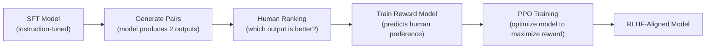

# Fine-Tuning LLMs — Senior-Level Deep Dive

## RLHF (Reinforcement Learning from Human Feedback)

RLHF aligns models with human preferences, going beyond simple instruction following:



This pipeline shows the RLHF process: start with an instruction-tuned model, collect human preferences, train a reward model, then use reinforcement learning to align the model with those preferences.

```python
# Phase 1: Supervised Fine-Tuning (SFT)
# Train model on (instruction, response) pairs — standard fine-tuning

# Phase 2: Reward Model Training
# Collect preference data: for each prompt, generate 2+ responses
# Human ranks them: response_A > response_B
# Train a reward model to predict human preferences

# Phase 3: PPO (Proximal Policy Optimization)
# Use reward model as the "score" function
# Optimize the SFT model to maximize reward while staying close to original

from trl import PPOTrainer, PPOConfig, AutoModelForCausalLMWithValueHead

# Simplified RLHF setup with TRL library
ppo_config = PPOConfig(
    model_name="./sft-model",
    learning_rate=1e-5,
    batch_size=16,
    mini_batch_size=4,
    ppo_epochs=4,
    kl_penalty="kl",       # Penalize diverging too far from SFT model
    init_kl_coef=0.2,
)

model = AutoModelForCausalLMWithValueHead.from_pretrained("./sft-model")
reward_model = load_reward_model("./reward-model")

trainer = PPOTrainer(
    config=ppo_config,
    model=model,
    tokenizer=tokenizer,
)

# Training loop
for batch in dataloader:
    # Generate responses
    response_tensors = trainer.generate(batch["input_ids"], max_new_tokens=256)
    
    # Score with reward model
    rewards = reward_model.score(batch["input_ids"], response_tensors)
    
    # PPO update
    stats = trainer.step(batch["input_ids"], response_tensors, rewards)
```

---

## DPO (Direct Preference Optimization)

DPO is simpler than RLHF — it directly optimizes the model from preference pairs without a separate reward model:

```python
from trl import DPOTrainer, DPOConfig

# DPO only needs preference pairs (no reward model!)
# Format: (prompt, chosen_response, rejected_response)
training_data = [
    {
        "prompt": "Explain data partitioning in Spark",
        "chosen": "Data partitioning divides a dataset across executors...(detailed, accurate)",
        "rejected": "Spark uses partitions...(vague, unhelpful)"
    },
    # 500-2000 preference pairs
]

dpo_config = DPOConfig(
    model_name="./sft-model",
    learning_rate=5e-7,
    beta=0.1,              # Controls how much to deviate from reference model
    num_train_epochs=1,
    per_device_train_batch_size=4,
    gradient_accumulation_steps=4,
)

# DPO directly optimizes: make "chosen" more likely, "rejected" less likely
trainer = DPOTrainer(
    model=model,
    ref_model=ref_model,   # The SFT model (frozen reference)
    args=dpo_config,
    train_dataset=dataset,
    tokenizer=tokenizer,
)

trainer.train()

# DPO advantages over RLHF:
# - No reward model needed (simpler pipeline)
# - More stable training (no RL instability)
# - Comparable quality for most use cases
# - Much easier to implement and debug
```

---

## Distributed Training

For large models or datasets that don't fit on a single GPU:

```python
# DeepSpeed ZeRO-3: distributes model across multiple GPUs
# Each GPU holds only a shard of parameters, gradients, and optimizer states

# deepspeed_config.json
DEEPSPEED_CONFIG = {
    "zero_optimization": {
        "stage": 3,                    # Full sharding across GPUs
        "offload_param": {"device": "cpu"},  # Offload params to CPU when not needed
        "offload_optimizer": {"device": "cpu"},
        "overlap_comm": True,          # Overlap communication with computation
    },
    "bf16": {"enabled": True},
    "train_batch_size": 32,
    "train_micro_batch_size_per_gpu": 2,
    "gradient_accumulation_steps": 4,
}

# Launch with DeepSpeed
# deepspeed --num_gpus=4 train.py --deepspeed deepspeed_config.json

# FSDP (Fully Sharded Data Parallel) — PyTorch native alternative
from torch.distributed.fsdp import FullyShardedDataParallel as FSDP

model = FSDP(
    model,
    sharding_strategy="FULL_SHARD",
    cpu_offload=True,
    mixed_precision=True,
)
```

### GPU Requirements by Model Size

| Model Size | Full FT GPU | LoRA GPU | QLoRA GPU |
|-----------|-------------|----------|-----------|
| 7B | 4× A100 (80GB) | 1× A100 (40GB) | 1× A10G (24GB) |
| 13B | 8× A100 | 2× A100 | 1× A100 (40GB) |
| 70B | 16× A100 | 4× A100 | 2× A100 |

---

## Continuous Fine-Tuning Pipeline

Production systems need continuous training as new data arrives:

```python
class ContinuousFineTuningPipeline:
    """Automated pipeline: collect data → train → evaluate → deploy."""
    
    def __init__(self, config):
        self.config = config
        self.model_registry = ModelRegistry()
    
    def run_training_cycle(self):
        """Weekly training cycle."""
        
        # Step 1: Collect new training data from production feedback
        new_data = self.collect_feedback_data(since_last_run=True)
        
        # Step 2: Quality filter (only use high-confidence examples)
        filtered_data = self.quality_filter(new_data, min_confidence=0.8)
        
        # Step 3: Merge with existing training set
        full_dataset = self.merge_datasets(
            existing=self.load_existing_training_data(),
            new=filtered_data,
            max_size=5000,  # Keep dataset manageable
        )
        
        # Step 4: Train new model version
        model_v_new = self.train(full_dataset)
        
        # Step 5: Evaluate against current production model
        eval_results = self.evaluate(model_v_new, self.test_set)
        current_results = self.evaluate(self.current_production_model, self.test_set)
        
        # Step 6: Deploy if better (with safety margin)
        if eval_results["accuracy"] > current_results["accuracy"] + 0.02:  # Must beat by 2%
            self.deploy(model_v_new, canary_pct=0.1)  # Start with 10% traffic
            self.model_registry.register(model_v_new, eval_results)
        else:
            print(f"New model not better enough: {eval_results['accuracy']:.3f} vs {current_results['accuracy']:.3f}")
    
    def collect_feedback_data(self, since_last_run: bool) -> list[dict]:
        """Collect training examples from user feedback."""
        # Sources:
        # 1. User corrections ("the answer should have been X")
        # 2. Thumbs-up responses (confirmed good outputs)
        # 3. Expert annotations (periodic review)
        pass
    
    def quality_filter(self, data: list[dict], min_confidence: float) -> list[dict]:
        """Filter low-quality training examples."""
        return [
            d for d in data
            if d.get("confidence", 0) >= min_confidence
            and len(d["output"]) > 10  # Not too short
            and not self.is_duplicate(d)
        ]
```

---

## Model Evaluation Frameworks

```python
from dataclasses import dataclass
import numpy as np

@dataclass
class EvalResult:
    accuracy: float
    f1_score: float
    format_compliance: float  # % of outputs matching expected format
    latency_ms: float
    cost_per_query: float

class ModelEvaluator:
    """Comprehensive evaluation for fine-tuned models."""
    
    def __init__(self, test_cases: list[dict]):
        self.test_cases = test_cases
    
    def evaluate(self, model_fn) -> EvalResult:
        """Run all test cases and compute metrics."""
        correct = 0
        format_ok = 0
        latencies = []
        
        for case in self.test_cases:
            import time
            start = time.time()
            output = model_fn(case["input"])
            latencies.append((time.time() - start) * 1000)
            
            # Check correctness
            if self.check_correct(output, case["expected"]):
                correct += 1
            
            # Check format compliance
            if self.check_format(output, case.get("expected_format")):
                format_ok += 1
        
        return EvalResult(
            accuracy=correct / len(self.test_cases),
            f1_score=self.compute_f1(),
            format_compliance=format_ok / len(self.test_cases),
            latency_ms=np.percentile(latencies, 50),
            cost_per_query=self.estimate_cost(),
        )
    
    def compare_models(self, model_a_fn, model_b_fn) -> dict:
        """Side-by-side comparison of two models."""
        results_a = self.evaluate(model_a_fn)
        results_b = self.evaluate(model_b_fn)
        
        return {
            "model_a": results_a,
            "model_b": results_b,
            "winner": "B" if results_b.accuracy > results_a.accuracy else "A",
            "improvement": results_b.accuracy - results_a.accuracy,
        }
```

---

## Training Infrastructure

### Spot Instance Strategy

```python
# Use spot/preemptible instances for 60-80% cost savings
# Key: frequent checkpointing to handle interruptions

training_config = {
    "instance_type": "p4d.24xlarge",  # 8× A100
    "spot": True,                      # 70% cheaper
    "checkpoint_every_n_steps": 100,   # Save frequently
    "resume_from_checkpoint": True,    # Auto-resume on interrupt
    "max_runtime_hours": 4,            # Budget guard
}

# Checkpoint strategy for spot instances:
# - Save every 100 steps to S3
# - On spot interruption: job automatically restarts from last checkpoint
# - Total training time may be 20% longer but 70% cheaper
```

### Cost Comparison: API vs Self-Hosted

| Aspect | OpenAI Fine-Tuning | Self-Hosted (AWS) |
|--------|-------------------|-------------------|
| Setup time | Minutes | Days-weeks |
| 500 examples | $1-5 | $20-50 (GPU time) |
| 50K examples | $50-100 | $200-500 |
| Per-query inference | 2× base model price | Fixed infra cost |
| Break-even queries/mo | N/A | ~100K queries |
| Operational burden | Zero | Significant |
| Model ownership | OpenAI retains | You own fully |

---

## Interview Tips

> **Tip 1:** "RLHF vs DPO?" — RLHF trains a separate reward model, then uses PPO to optimize against it. DPO directly optimizes from preference pairs without a reward model — simpler, more stable, and achieves comparable results. Use DPO for most production cases unless you need a separate reward model for other purposes.

> **Tip 2:** "How do you handle continuous model improvement?" — Automated pipeline: collect user feedback (corrections, thumbs up/down) → quality filter → merge with training set → train new version weekly → evaluate against current production → deploy if better by >2%. Always keep a test set that never enters training data.

> **Tip 3:** "LoRA vs QLoRA vs full fine-tuning?" — Full FT: best quality but requires 4-8 A100s. LoRA: 95%+ quality on a single A100, adapter is tiny (50MB). QLoRA: runs on consumer GPUs (T4, A10G) with slight quality trade-off. For most production cases, LoRA on A100 is the sweet spot — high quality with manageable cost.
