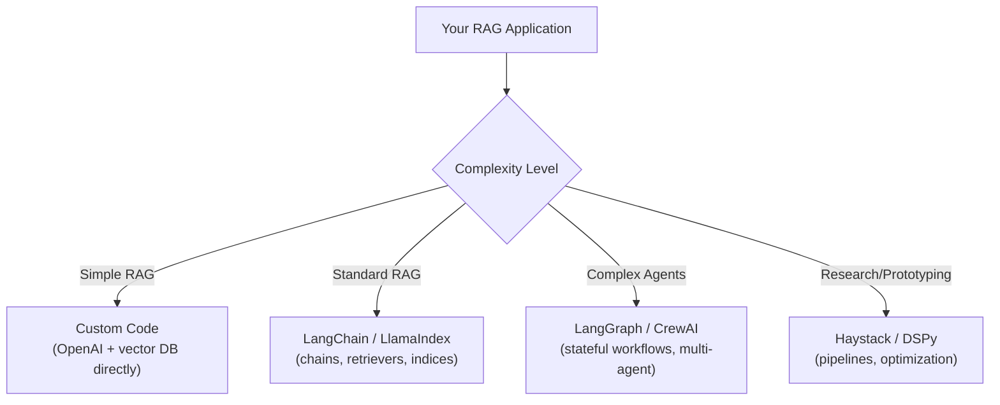

# Orchestration Frameworks — Fundamentals

## What Do Orchestration Frameworks Do?

Orchestration frameworks connect LLMs with tools, data sources, and multi-step logic into coherent workflows. Instead of writing raw API calls, they provide abstractions for common RAG patterns.

```python
# Without a framework (raw API calls):
embedding = openai.embeddings.create(model="...", input=[query])
results = pinecone_index.query(vector=embedding, top_k=5)
context = "\n".join([r.metadata["text"] for r in results])
response = openai.chat.completions.create(messages=[{"role": "user", "content": f"Context: {context}\nQ: {query}"}])

# With LangChain (abstracted):
from langchain_openai import ChatOpenAI, OpenAIEmbeddings
from langchain_community.vectorstores import Pinecone
from langchain.chains import RetrievalQA

chain = RetrievalQA.from_chain_type(llm=ChatOpenAI(), retriever=vectorstore.as_retriever())
answer = chain.invoke(query)
```

> **Key Insight for DE:** Frameworks reduce boilerplate but add a dependency. Choose based on your team's complexity needs — simple RAG may not need a framework at all.

---

## Major Frameworks Compared

The following diagram shows how the major frameworks relate to each other:



Choose based on complexity: raw API for simple cases, LangChain/LlamaIndex for standard RAG, LangGraph for complex stateful agents.

| Framework | Best For | Learning Curve | Production Ready |
|-----------|----------|---------------|-----------------|
| **LangChain** | General-purpose RAG, agents, tools | Medium | Yes |
| **LlamaIndex** | Document indexing, retrieval | Medium | Yes |
| **LangGraph** | Stateful multi-step workflows | High | Yes |
| **Haystack** | Modular pipelines, search | Medium | Yes |
| **DSPy** | Prompt optimization, research | High | Growing |
| **Custom code** | Simple RAG, full control | Low | Always |

---

## LangChain Basics

LangChain is the most popular framework. Its core concepts:

### Chains (Sequential Steps)

```python
from langchain_openai import ChatOpenAI
from langchain_core.prompts import ChatPromptTemplate
from langchain_core.output_parsers import StrOutputParser

# Simple chain: prompt → LLM → parse output
llm = ChatOpenAI(model="gpt-4o-mini", temperature=0)

prompt = ChatPromptTemplate.from_messages([
    ("system", "You are a data engineering expert. Answer concisely."),
    ("user", "{question}")
])

chain = prompt | llm | StrOutputParser()  # Pipe syntax (LCEL)
answer = chain.invoke({"question": "What is data partitioning?"})
```

### Retrievers (Document Search)

```python
from langchain_openai import OpenAIEmbeddings
from langchain_community.vectorstores import Qdrant
from langchain.chains import RetrievalQA

# Connect to vector store
embeddings = OpenAIEmbeddings(model="text-embedding-3-small")
vectorstore = Qdrant.from_existing_collection(
    embeddings=embeddings,
    collection_name="knowledge_base",
    url="http://qdrant:6333",
)

# Create retriever
retriever = vectorstore.as_retriever(search_kwargs={"k": 5})

# RAG chain: retrieve → augment → generate
rag_chain = RetrievalQA.from_chain_type(
    llm=ChatOpenAI(model="gpt-4o-mini"),
    retriever=retriever,
    chain_type="stuff",  # Stuff all docs into context
    return_source_documents=True,
)

result = rag_chain.invoke({"query": "How does Spark handle data skew?"})
print(result["result"])           # The answer
print(result["source_documents"]) # Which docs were used
```

### Tools (External Capabilities)

```python
from langchain.tools import tool

@tool
def search_database(query: str) -> str:
    """Execute a SQL query against the analytics database."""
    result = db.execute(query)
    return str(result[:10])  # Return first 10 rows

@tool
def search_documentation(topic: str) -> str:
    """Search internal documentation for a topic."""
    results = vectorstore.similarity_search(topic, k=3)
    return "\n".join([doc.page_content for doc in results])

# Agent uses tools to answer questions
from langchain.agents import create_openai_tools_agent, AgentExecutor

agent = create_openai_tools_agent(
    llm=ChatOpenAI(model="gpt-4o"),
    tools=[search_database, search_documentation],
    prompt=agent_prompt,
)

executor = AgentExecutor(agent=agent, tools=[search_database, search_documentation])
result = executor.invoke({"input": "How many orders did we process last month?"})
```

---

## LlamaIndex Basics

LlamaIndex focuses on document indexing and retrieval:

```python
from llama_index.core import VectorStoreIndex, SimpleDirectoryReader, Settings
from llama_index.llms.openai import OpenAI
from llama_index.embeddings.openai import OpenAIEmbedding

# Configure
Settings.llm = OpenAI(model="gpt-4o-mini", temperature=0)
Settings.embed_model = OpenAIEmbedding(model="text-embedding-3-small")

# Load and index documents
documents = SimpleDirectoryReader("./docs").load_data()
index = VectorStoreIndex.from_documents(documents)

# Query
query_engine = index.as_query_engine(similarity_top_k=5)
response = query_engine.query("What is the best practice for Spark partitioning?")
print(response.response)         # The answer
print(response.source_nodes)     # Source chunks used
```

### LlamaIndex vs LangChain

| Aspect | LlamaIndex | LangChain |
|--------|-----------|-----------|
| Focus | Document retrieval & indexing | General LLM orchestration |
| Strength | Index types, query engines | Agents, tools, chains |
| RAG quality | More built-in retrieval strategies | More flexible, DIY approach |
| Learning curve | Easier for pure RAG | Easier for agents/tools |
| When to choose | Document Q&A systems | Multi-tool agents, complex workflows |

---

## When to Use a Framework vs Custom Code

**Use a framework when:**
- You need multiple retrieval strategies (hybrid, re-ranking)
- Building agents with tool use
- Need observability/tracing (LangSmith integration)
- Rapid prototyping (get something working in hours)
- Team has varying LLM experience (framework guides patterns)

**Use custom code when:**
- Simple RAG (embed → search → generate)
- Need maximum performance (frameworks add overhead)
- Want full control over error handling
- Avoiding heavy dependencies
- Team is experienced with LLM APIs

```python
# Custom RAG (50 lines, no dependencies):
class SimpleRAG:
    def __init__(self, openai_client, vector_db):
        self.client = openai_client
        self.db = vector_db
    
    def answer(self, question: str) -> str:
        # Embed
        emb = self.client.embeddings.create(model="text-embedding-3-small", input=[question])
        query_vec = emb.data[0].embedding
        
        # Retrieve
        results = self.db.search(query_vec, top_k=5)
        context = "\n".join([r.text for r in results])
        
        # Generate
        response = self.client.chat.completions.create(
            model="gpt-4o-mini",
            messages=[
                {"role": "system", "content": "Answer based only on the context provided."},
                {"role": "user", "content": f"Context:\n{context}\n\nQuestion: {question}"}
            ],
            temperature=0,
        )
        return response.choices[0].message.content

# This is perfectly fine for many production use cases!
```

---

## Memory (Conversation State)

For multi-turn chat, frameworks provide memory abstractions:

```python
from langchain.memory import ConversationBufferMemory
from langchain.chains import ConversationalRetrievalChain

memory = ConversationBufferMemory(memory_key="chat_history", return_messages=True)

chain = ConversationalRetrievalChain.from_llm(
    llm=ChatOpenAI(model="gpt-4o-mini"),
    retriever=vectorstore.as_retriever(),
    memory=memory,
)

# First question
chain.invoke({"question": "What is Spark AQE?"})
# Second question (references first)
chain.invoke({"question": "How does it handle skew?"})
# Memory provides context: "it" = "Spark AQE" from previous turn
```

---

## Interview Tips

> **Tip 1:** "When would you use LangChain vs LlamaIndex vs custom code?" — LangChain for agent workflows with multiple tools. LlamaIndex for document-heavy retrieval with advanced query engines. Custom code for simple RAG where the overhead of a framework isn't justified. Don't use a framework just because it exists — justify the added complexity.

> **Tip 2:** "What are the downsides of frameworks?" — Abstraction leakiness (hard to debug when things go wrong), version churn (APIs change frequently), performance overhead (extra layers), and vendor lock-in (hard to switch later). For production: understand what the framework does under the hood before depending on it.

> **Tip 3:** "How do you handle conversation memory in RAG?" — Store chat history, use it to rewrite follow-up questions into standalone queries (resolve pronouns/references), then retrieve with the standalone query. Frameworks provide memory classes, but the core pattern is: contextualize the question using history before retrieval.
