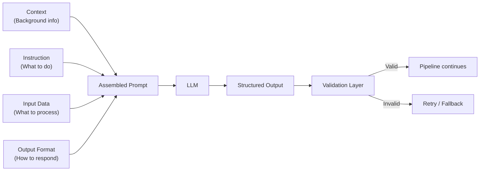

# Prompt Engineering — Fundamentals

## Why This Matters for Data Engineers

Prompt engineering isn't just about chatting with GPT — it's about building **reliable, repeatable LLM-powered components** in data pipelines. As a DE, you'll design prompts for data quality validation, SQL generation, metadata extraction, and anomaly detection. The difference between a good prompt and a bad one is the difference between a production system and a toy demo.

---

## What Is Prompt Engineering?

Prompt engineering is the practice of designing inputs (prompts) to Large Language Models to get consistent, desired outputs. Think of it as writing a **specification** for an API call where the "API" is a language model.



**What this shows:** A well-structured prompt has four components that feed into the LLM. The output goes through validation before entering your pipeline — never trust raw LLM output in production.

---

## Prompt Components

Every effective prompt contains some combination of these elements:

### 1. System Message (Role & Constraints)

Sets the persona, boundaries, and behavioral rules for the model.

```python
system_message = """You are a data quality analyst. Your job is to:
- Identify data anomalies in the provided records
- Classify each anomaly by severity (critical, warning, info)
- Respond ONLY in valid JSON format
- Never make up data or hallucinate values not in the input"""
```

### 2. Context (Background Information)

Provides the model with relevant knowledge it needs to complete the task.

```python
context = """Database schema:
- orders(order_id INT, customer_id INT, amount DECIMAL, created_at TIMESTAMP)
- customers(customer_id INT, name VARCHAR, tier VARCHAR)
Business rules:
- Orders above $10,000 require manager approval
- Tier 'enterprise' customers have no order limit"""
```

### 3. Instruction (The Task)

Clear, specific direction on what to do with the input.

```python
instruction = """Analyze the following records for data quality issues. 
For each issue found, provide:
- field_name: which column has the issue
- issue_type: null, out_of_range, format_error, or business_rule_violation
- severity: critical, warning, or info
- description: brief explanation"""
```

### 4. Input Data (What to Process)

The actual data or content for the model to work with.

```python
input_data = """Records to analyze:
| order_id | customer_id | amount    | created_at          |
|----------|-------------|-----------|---------------------|
| 1001     | NULL        | 500.00    | 2024-01-15 10:30:00 |
| 1002     | 42          | -25.00    | 2024-01-15 11:00:00 |
| 1003     | 99          | 15000.00  | 2099-12-31 00:00:00 |"""
```

### 5. Output Format (How to Respond)

Explicit specification of the expected response structure.

```python
output_format = """Respond with a JSON array:
[
  {
    "field_name": "string",
    "issue_type": "null|out_of_range|format_error|business_rule_violation",
    "severity": "critical|warning|info",
    "description": "string"
  }
]"""
```

---

## Message Roles: System, User, Assistant

Modern LLMs use a chat-based API with three roles:

| Role | Purpose | Example |
|------|---------|---------|
| **system** | Sets behavior, constraints, persona | "You are a SQL expert. Only respond with valid SQL." |
| **user** | The input/question/data to process | "Convert this to SQL: get top 10 customers by revenue" |
| **assistant** | Model's response (or example responses for few-shot) | "SELECT customer_id, SUM(amount)..." |

```python
from openai import OpenAI

client = OpenAI()

response = client.chat.completions.create(
    model="gpt-4o",
    messages=[
        {"role": "system", "content": "You are a SQL expert. Respond only with valid PostgreSQL."},
        {"role": "user", "content": "Get the top 5 customers by total order amount in 2024."}
    ],
    temperature=0.0  # Deterministic for code generation
)

sql = response.choices[0].message.content
print(sql)
```

---

## Prompting Strategies

### Zero-Shot Prompting

No examples provided — the model uses only the instruction and its training.

```python
# Zero-shot: just describe what you want
messages = [
    {"role": "system", "content": "You are a data classification expert."},
    {"role": "user", "content": """Classify this column as one of: 
    email, phone, name, address, id, date, currency, free_text
    
    Column name: 'cust_ph_nbr'
    Sample values: ['555-0123', '(212) 456-7890', '+1-800-555-0199']
    
    Respond with just the classification."""}
]
# Expected output: "phone"
```

**Best for:** Simple tasks where the model has strong prior knowledge.

### Few-Shot Prompting

Provide examples of input→output pairs before the actual task.

```python
messages = [
    {"role": "system", "content": "Classify data columns by their PII sensitivity level."},
    # Example 1
    {"role": "user", "content": "Column: email_address\nSamples: ['john@email.com', 'jane@corp.io']"},
    {"role": "assistant", "content": '{"classification": "direct_pii", "confidence": 0.95}'},
    # Example 2
    {"role": "user", "content": "Column: order_count\nSamples: [5, 12, 3, 28]"},
    {"role": "assistant", "content": '{"classification": "non_pii", "confidence": 0.99}'},
    # Example 3
    {"role": "user", "content": "Column: zip_code\nSamples: ['90210', '10001', '60601']"},
    {"role": "assistant", "content": '{"classification": "quasi_identifier", "confidence": 0.80}'},
    # Actual task
    {"role": "user", "content": "Column: ssn_last4\nSamples: ['1234', '5678', '9012']"},
]
# The model learns the pattern and responds in the same JSON format
```

**Best for:** Tasks where you need consistent output format or domain-specific classification.

### Chain-of-Thought (CoT) Prompting

Ask the model to reason step-by-step before giving a final answer.

```python
messages = [
    {"role": "system", "content": """You are a data pipeline debugger. 
When analyzing issues, think step by step:
1. Identify what the expected behavior should be
2. Identify what actually happened
3. List possible root causes
4. Recommend the most likely cause and fix"""},
    {"role": "user", "content": """Our daily ETL loaded 1.2M records yesterday but only 
800K today. The source system reports no issues. The job completed successfully 
with no errors. What happened?"""}
]
```

**Best for:** Complex reasoning tasks, debugging scenarios, multi-step analysis.

---

## Temperature and Top-p Settings

These parameters control the **randomness** of model outputs:

| Parameter | Value | Effect | Use Case |
|-----------|-------|--------|----------|
| `temperature=0.0` | No randomness | Always picks most likely token | SQL generation, JSON output, classification |
| `temperature=0.3` | Low randomness | Slightly varied but consistent | Data documentation, summaries |
| `temperature=0.7` | Moderate randomness | Creative but coherent | Generating test data, brainstorming |
| `temperature=1.0` | High randomness | Diverse, sometimes off-track | Creative writing (rarely used in DE) |

```python
# For deterministic pipeline tasks — ALWAYS use low temperature
response = client.chat.completions.create(
    model="gpt-4o",
    messages=messages,
    temperature=0.0,  # Deterministic — same input → same output
    top_p=1.0,        # Usually leave at 1.0 when using temperature
)

# top_p (nucleus sampling) — alternative to temperature
# top_p=0.1 means only consider tokens in the top 10% probability mass
response = client.chat.completions.create(
    model="gpt-4o",
    messages=messages,
    temperature=1.0,
    top_p=0.1,  # Very focused despite temperature=1.0
)
```

> **DE Rule of Thumb:** For any prompt in a data pipeline, use `temperature=0.0`. You want deterministic, reproducible outputs. Save creativity for documentation generation.

---

## Output Formatting

### JSON Mode

Force the model to respond with valid JSON:

```python
response = client.chat.completions.create(
    model="gpt-4o",
    messages=[
        {"role": "system", "content": "Respond only with valid JSON."},
        {"role": "user", "content": "Extract entities from: 'Ship 500 units to NYC warehouse by Friday'"}
    ],
    response_format={"type": "json_object"},  # Guarantees valid JSON
    temperature=0.0
)

import json
result = json.loads(response.choices[0].message.content)
# {"quantity": 500, "destination": "NYC warehouse", "deadline": "Friday"}
```

### Structured Outputs (Schema-Enforced)

Define the exact schema you expect:

```python
from pydantic import BaseModel
from typing import Literal

class DataQualityIssue(BaseModel):
    field_name: str
    issue_type: Literal["null", "out_of_range", "format_error", "business_rule_violation"]
    severity: Literal["critical", "warning", "info"]
    description: str

class QualityReport(BaseModel):
    issues: list[DataQualityIssue]
    total_records_checked: int
    pass_rate: float

response = client.beta.chat.completions.parse(
    model="gpt-4o",
    messages=messages,
    response_format=QualityReport,  # Schema-enforced output
)

report = response.choices[0].message.parsed  # Already a QualityReport object
```

---

## Token Limits and Cost Awareness

### Understanding Tokens

A token is roughly 4 characters or ¾ of a word in English.

```python
import tiktoken

encoder = tiktoken.encoding_for_model("gpt-4o")

text = "SELECT customer_id, SUM(amount) FROM orders GROUP BY customer_id"
tokens = encoder.encode(text)
print(f"Text: {len(text)} chars, {len(tokens)} tokens")
# Text: 65 chars, 15 tokens

# Cost estimation
def estimate_cost(input_tokens: int, output_tokens: int, model: str = "gpt-4o") -> float:
    """Estimate API cost in USD."""
    pricing = {
        "gpt-4o": {"input": 2.50 / 1_000_000, "output": 10.00 / 1_000_000},
        "gpt-4o-mini": {"input": 0.15 / 1_000_000, "output": 0.60 / 1_000_000},
    }
    rates = pricing[model]
    return input_tokens * rates["input"] + output_tokens * rates["output"]

# Processing 100K records with ~500 tokens per prompt, ~200 token response
cost = estimate_cost(
    input_tokens=100_000 * 500,
    output_tokens=100_000 * 200,
    model="gpt-4o"
)
print(f"Estimated cost for 100K records: ${cost:.2f}")
# ~$325 with gpt-4o, ~$18 with gpt-4o-mini
```

### Token Limits by Model

| Model | Context Window | Max Output |
|-------|---------------|------------|
| gpt-4o | 128K tokens | 16K tokens |
| gpt-4o-mini | 128K tokens | 16K tokens |
| claude-3.5-sonnet | 200K tokens | 8K tokens |
| llama-3-70b | 8K tokens | 4K tokens |

> **DE Consideration:** When processing large datasets, batch records into chunks that fit within token limits. A single prompt with 1000 rows is more cost-effective than 1000 individual calls.

---

## Complete Example: Data Quality Prompt

Putting it all together in a pipeline-ready format:

```python
from openai import OpenAI
from pydantic import BaseModel
from typing import Literal
import json

client = OpenAI()

class QualityIssue(BaseModel):
    row_index: int
    field: str
    issue: Literal["null", "invalid_format", "out_of_range", "duplicate", "inconsistent"]
    severity: Literal["critical", "warning", "info"]
    detail: str

class ValidationResult(BaseModel):
    issues: list[QualityIssue]
    records_checked: int
    records_with_issues: int

def validate_data_batch(records: list[dict], schema_context: str) -> ValidationResult:
    """Use LLM to validate a batch of records against business rules."""
    
    messages = [
        {
            "role": "system",
            "content": f"""You are a data quality validator. Check records against these rules:
{schema_context}

Identify any data quality issues. Be precise — only flag genuine issues."""
        },
        {
            "role": "user",
            "content": f"Validate these records:\n{json.dumps(records, indent=2)}"
        }
    ]
    
    response = client.beta.chat.completions.parse(
        model="gpt-4o-mini",  # Cost-effective for validation
        messages=messages,
        response_format=ValidationResult,
        temperature=0.0,
    )
    
    return response.choices[0].message.parsed

# Usage in pipeline
schema = """
- customer_id: positive integer, required
- email: valid email format, required
- age: integer 18-120, optional
- signup_date: ISO format, must be in past
"""

records = [
    {"customer_id": 1, "email": "valid@test.com", "age": 25, "signup_date": "2024-01-15"},
    {"customer_id": -1, "email": "bad-email", "age": 150, "signup_date": "2030-01-01"},
]

result = validate_data_batch(records, schema)
for issue in result.issues:
    print(f"Row {issue.row_index}: [{issue.severity}] {issue.field} - {issue.detail}")
```

---

## Interview Tips

> **Tip 1:** Always mention `temperature=0.0` for pipeline tasks. Interviewers want to hear you understand determinism in data systems.

> **Tip 2:** When asked about prompt design, structure your answer: "I'd use a system message for constraints, provide schema context, give clear instructions with output format, and validate the response with Pydantic."

> **Tip 3:** Cost awareness matters. Know the difference between gpt-4o ($2.50/$10 per 1M tokens) and gpt-4o-mini ($0.15/$0.60 per 1M tokens). For high-volume pipeline tasks, model selection is a cost decision.

> **Tip 4:** Few-shot > zero-shot for consistent outputs. But more examples = more input tokens = more cost. Find the minimum examples needed for reliable output (usually 3-5).
