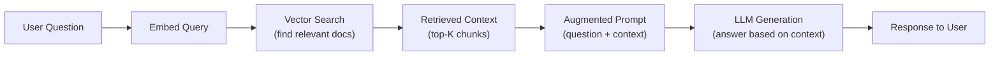

# Retrieval Pipelines — Fundamentals


## 🎯 Analogy

Think of a RAG retrieval pipeline like a research assistant: the user asks a question, the assistant searches a curated document library (vector database), pulls the most relevant excerpts, and hands them to an LLM which synthesizes a precise answer — grounded in your data, not just training weights.

---
## What Is RAG (Retrieval-Augmented Generation)?

RAG is a pattern that **grounds LLM responses in factual, retrieved information** instead of relying solely on the model's training data. It combines a search system (retrieval) with a language model (generation).

```python
# Without RAG: LLM makes up answers (hallucination risk)
response = llm("What's our company's PTO policy?")
# → Generic answer or hallucinated policy details

# With RAG: retrieve real documents, then ask LLM to answer based on them
relevant_docs = vector_search("PTO policy", top_k=3)
response = llm(f"Based on these documents:\n{relevant_docs}\n\nWhat's our PTO policy?")
# → Accurate answer grounded in actual company documents
```

> **Key Insight for DE:** RAG is a data pipeline problem. The quality of your retrieval (data infrastructure) determines the quality of the LLM's answers. Garbage in = garbage out.

---

## The RAG Pipeline Architecture

The following diagram shows the complete flow from user question to grounded answer:



Each step transforms the input: the question becomes a vector, the vector finds relevant documents, those documents become context in a prompt, and the LLM generates an answer grounded in that context.

---

## Naive RAG vs Advanced RAG

| Aspect | Naive RAG | Advanced RAG |
|--------|-----------|--------------|
| Query | Embed raw user query | Transform query (rewrite, decompose, expand) |
| Retrieval | Single vector search | Hybrid search + re-ranking |
| Context | Stuff top-K directly | Compress, filter, deduplicate |
| Generation | Single LLM call | Self-check, iterative refinement |
| Quality | 60-70% accuracy | 85-95% accuracy |

This course covers the progression from naive to advanced RAG.

---

## Step 1: Embedding the Query

The user's question must be converted to a vector using the **same model** that embedded the documents:

```python
from openai import OpenAI

client = OpenAI()

def embed_query(query: str) -> list[float]:
    """Convert user question to a vector for similarity search."""
    response = client.embeddings.create(
        model="text-embedding-3-small",  # MUST match document embedding model
        input=[query]
    )
    return response.data[0].embedding

query_vector = embed_query("How do I optimize Spark shuffle operations?")
# Returns a 1536-dim vector representing the semantic meaning of the question
```

---

## Step 2: Retrieval Methods

### Dense Retrieval (Semantic Search)

Uses embedding vectors and cosine similarity. Finds semantically similar content regardless of exact wording.

```python
# Dense retrieval: finds "reduce shuffle" even when query says "optimize shuffle"
results = vector_db.search(query_vector, top_k=5)
# Returns chunks about shuffle optimization, data skew, partitioning
# even if they don't contain the exact word "optimize"
```

**Strength:** Understands paraphrases and synonyms.
**Weakness:** May miss exact keyword matches (error codes, specific config names).

### Sparse Retrieval (BM25 / Keyword Search)

Traditional keyword matching with TF-IDF weighting. Finds documents containing the exact query terms.

```python
from rank_bm25 import BM25Okapi

# BM25: keyword-based ranking
corpus_tokenized = [doc.lower().split() for doc in all_documents]
bm25 = BM25Okapi(corpus_tokenized)

query_tokens = "spark.sql.shuffle.partitions".lower().split()
scores = bm25.get_scores(query_tokens)
top_docs = sorted(range(len(scores)), key=lambda i: scores[i], reverse=True)[:5]
```

**Strength:** Exact matching (config parameters, error codes, product names).
**Weakness:** Misses semantic equivalents ("optimize" vs "improve performance").

### Hybrid Retrieval (Best of Both)

Combines dense and sparse, merges results:

```python
# Get results from both systems
dense_results = vector_search(query_vector, top_k=20)
sparse_results = bm25_search(query_text, top_k=20)

# Merge using Reciprocal Rank Fusion
final_results = reciprocal_rank_fusion(dense_results, sparse_results, k=60)[:5]
```

---

## Step 3: Top-K Selection

How many documents to retrieve? This is the `top_k` parameter:

| top_k | Recall | Precision | Context Size | Cost |
|-------|--------|-----------|-------------|------|
| 3 | Lower | Higher | Small | Cheap |
| 5 | Balanced | Balanced | Medium | Moderate |
| 10 | Higher | Lower | Large | More tokens |
| 20 | Highest | Lowest | Very large | Expensive |

```python
# Start with top_k=5 as a reasonable default
# Increase if answers are incomplete (need more context)
# Decrease if answers contain irrelevant information (noise)

results = vector_db.search(query_vector, top_k=5)
```

> **Rule of thumb:** top_k = 3-5 for focused Q&A, top_k = 10-20 for research/comprehensive answers.

---

## Step 4: Context Window Stuffing

Put the retrieved documents into the LLM prompt:

```python
def build_rag_prompt(question: str, retrieved_chunks: list[str]) -> str:
    """Construct the augmented prompt with retrieved context."""
    
    context = "\n\n---\n\n".join(retrieved_chunks)
    
    prompt = f"""Answer the question based ONLY on the following context. 
If the context doesn't contain the answer, say "I don't have enough information to answer this."

Context:
{context}

Question: {question}

Answer:"""
    
    return prompt

# Usage
chunks = [result.text for result in vector_db.search(query_vector, top_k=5)]
prompt = build_rag_prompt("How do I optimize Spark shuffles?", chunks)

response = client.chat.completions.create(
    model="gpt-4o-mini",
    messages=[{"role": "user", "content": prompt}],
    temperature=0  # Deterministic, factual answers
)

answer = response.choices[0].message.content
```

---

## Step 5: Basic Prompt Template

A well-structured prompt makes the difference between good and great RAG:

```python
SYSTEM_PROMPT = """You are a helpful technical assistant for data engineers.
Answer questions based ONLY on the provided context documents.
If the context doesn't contain the answer, say so clearly.
Always cite which source document you're referencing.
Format your answer in clear, concise paragraphs."""

def generate_answer(question: str, context_chunks: list[dict]) -> str:
    """Generate an answer using retrieved context."""
    
    # Format context with source references
    formatted_context = ""
    for i, chunk in enumerate(context_chunks, 1):
        source = chunk.get("metadata", {}).get("source", "Unknown")
        formatted_context += f"[Source {i}: {source}]\n{chunk['text']}\n\n"
    
    messages = [
        {"role": "system", "content": SYSTEM_PROMPT},
        {"role": "user", "content": f"Context:\n{formatted_context}\n\nQuestion: {question}"}
    ]
    
    response = client.chat.completions.create(
        model="gpt-4o-mini",
        messages=messages,
        temperature=0,
        max_tokens=500,
    )
    
    return response.choices[0].message.content
```

---

## Complete Naive RAG Pipeline

Putting it all together:

```python
from openai import OpenAI
from pinecone import Pinecone

client = OpenAI()
pc = Pinecone(api_key="your-key")
index = pc.Index("knowledge-base")

def naive_rag(question: str) -> str:
    """Complete naive RAG pipeline: embed → search → generate."""
    
    # Step 1: Embed the question
    query_response = client.embeddings.create(
        model="text-embedding-3-small",
        input=[question]
    )
    query_vector = query_response.data[0].embedding
    
    # Step 2: Retrieve relevant chunks
    search_results = index.query(
        vector=query_vector,
        top_k=5,
        include_metadata=True
    )
    
    # Step 3: Build augmented prompt
    context_texts = [match.metadata["text"] for match in search_results.matches]
    context = "\n\n".join(context_texts)
    
    # Step 4: Generate answer
    messages = [
        {"role": "system", "content": "Answer based only on the provided context."},
        {"role": "user", "content": f"Context:\n{context}\n\nQuestion: {question}"}
    ]
    
    response = client.chat.completions.create(
        model="gpt-4o-mini",
        messages=messages,
        temperature=0,
    )
    
    return response.choices[0].message.content

# Usage
answer = naive_rag("What causes data skew in Spark joins?")
print(answer)
```

---

## When RAG Fails (and Why)

| Failure Mode | Symptom | Cause | Fix |
|-------------|---------|-------|-----|
| Hallucination | Answer contradicts documents | Context not relevant enough | Improve retrieval, add "cite sources" instruction |
| Incomplete answer | Missing important details | top_k too low, chunks too small | Increase top_k, use parent-child chunking |
| Wrong answer | Factually incorrect | Outdated or incorrect source docs | Improve source data quality, add date filtering |
| "I don't know" | Refuses to answer | Relevant doc exists but not retrieved | Check embedding model, chunking strategy |
| Irrelevant context | Answer about wrong topic | Query ambiguity, poor embeddings | Query transformation, hybrid search |

---


## ▶️ Try It Yourself

```python
# pip install chromadb sentence-transformers anthropic
import chromadb
from sentence_transformers import SentenceTransformer

# 1. Embed and store documents
model = SentenceTransformer("all-MiniLM-L6-v2")
client = chromadb.Client()
collection = client.create_collection("docs")

docs = [
    "Airflow uses DAGs to define task dependencies and scheduling.",
    "Delta Lake provides ACID transactions on top of object storage.",
    "dbt transforms raw data into analytics-ready models using SQL.",
]
embeddings = model.encode(docs).tolist()
collection.add(documents=docs, embeddings=embeddings, ids=[f"doc{i}" for i in range(len(docs))])

# 2. Query: embed user question and find nearest docs
question = "How do I schedule data pipelines?"
q_emb = model.encode([question]).tolist()
results = collection.query(query_embeddings=q_emb, n_results=2)
context = "
".join(results["documents"][0])

print("Retrieved context:")
print(context)
print("
Prompt = context + question -> send to Claude/GPT for answer")
```

> **Run it:** Copy the snippet into a REPL or file — no external services needed for the basic example.

---
## Interview Tips

> **Tip 1:** "Explain RAG in simple terms" — "RAG is like an open-book exam. Instead of asking the LLM to answer from memory (which can be wrong), we first search our documents for relevant information, then ask the LLM to answer based on what we found. The LLM is the writer, but the documents are the source of truth."

> **Tip 2:** "When would you NOT use RAG?" — When the LLM's training data already covers the topic perfectly (general knowledge), when real-time data isn't needed, or when the answer requires complex multi-step reasoning that a simple retrieve-then-generate flow can't handle (consider agents instead).

> **Tip 3:** "What's the most important part of a RAG system?" — Retrieval quality. If you retrieve the wrong documents, no amount of prompt engineering will fix the answer. Focus on: embedding model choice, chunk size optimization, and hybrid search. Generation is the easier problem to solve.
