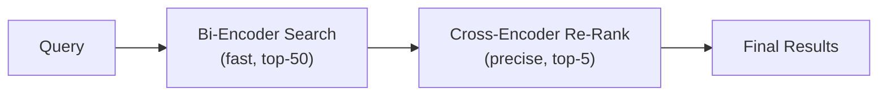

# Retrieval Pipelines — Intermediate

## Query Transformation Techniques

Raw user queries often perform poorly for retrieval. Transforming them improves results significantly.

### HyDE (Hypothetical Document Embeddings)

Instead of embedding the question, generate a hypothetical answer and embed THAT. The hypothetical answer is closer in embedding space to actual documents.

```python
from openai import OpenAI

client = OpenAI()

def hyde_retrieval(question: str, vector_db, top_k: int = 5):
    """Generate hypothetical answer, embed it, search with that embedding."""
    
    # Step 1: Generate a hypothetical answer (may be inaccurate, that's OK)
    hyde_response = client.chat.completions.create(
        model="gpt-4o-mini",
        messages=[{
            "role": "user",
            "content": f"Write a short, detailed passage that would answer this question:\n{question}"
        }],
        temperature=0.7,
        max_tokens=200,
    )
    hypothetical_doc = hyde_response.choices[0].message.content
    
    # Step 2: Embed the hypothetical answer (not the question!)
    emb_response = client.embeddings.create(
        model="text-embedding-3-small",
        input=[hypothetical_doc]
    )
    hyde_vector = emb_response.data[0].embedding
    
    # Step 3: Search with the hypothetical document's embedding
    results = vector_db.search(hyde_vector, top_k=top_k)
    return results

# Why it works:
# Question: "How to fix OOM in Spark?" (short, abstract)
# HyDE generates: "OutOfMemoryError in Spark typically occurs when executor memory
#   is insufficient. Common fixes include increasing spark.executor.memory,
#   reducing partition sizes, or using broadcast joins for small tables..."
# This hypothetical doc is semantically closer to actual documentation about OOM fixes
```

### Multi-Query Expansion

Generate multiple versions of the query to improve recall:

```python
def multi_query_retrieval(question: str, vector_db, top_k: int = 5):
    """Generate multiple query perspectives, search with each, merge results."""
    
    # Generate query variants
    response = client.chat.completions.create(
        model="gpt-4o-mini",
        messages=[{
            "role": "user",
            "content": f"""Generate 3 different versions of this question that might match 
different relevant documents. Make them diverse in wording.

Original question: {question}

Return as a numbered list."""
        }],
        temperature=0.7,
    )
    
    variants = [q.strip().lstrip("123. ") for q in response.choices[0].message.content.split("\n") if q.strip()]
    all_queries = [question] + variants[:3]
    
    # Search with each variant
    all_results = {}
    for query in all_queries:
        query_vec = embed(query)
        results = vector_db.search(query_vec, top_k=top_k)
        for r in results:
            if r.id not in all_results or r.score > all_results[r.id].score:
                all_results[r.id] = r
    
    # Return top-k by best score across all queries
    return sorted(all_results.values(), key=lambda r: r.score, reverse=True)[:top_k]
```

### Query Decomposition

Break complex questions into simpler sub-questions:

```python
def decompose_and_retrieve(question: str, vector_db):
    """Decompose complex question into sub-questions, retrieve for each."""
    
    response = client.chat.completions.create(
        model="gpt-4o-mini",
        messages=[{
            "role": "user",
            "content": f"""Break this question into 2-3 simpler sub-questions that, 
when answered together, fully address the original question.

Question: {question}

Return each sub-question on a new line."""
        }],
        temperature=0,
    )
    
    sub_questions = [q.strip() for q in response.choices[0].message.content.split("\n") if q.strip()]
    
    # Retrieve for each sub-question
    all_context = []
    for sub_q in sub_questions:
        results = vector_db.search(embed(sub_q), top_k=3)
        all_context.extend(results)
    
    # Deduplicate by document ID
    seen = set()
    unique_context = []
    for r in all_context:
        if r.id not in seen:
            seen.add(r.id)
            unique_context.append(r)
    
    return unique_context[:8]  # Cap total context

# Example:
# "How does Spark handle skewed joins and what's the impact on shuffle?" becomes:
# 1. "How does Spark detect data skew in join operations?"
# 2. "What mechanisms does Spark use to handle skewed partitions during joins?"
# 3. "How does data skew affect shuffle performance in Spark?"
```

---

## Re-Ranking

Initial retrieval (bi-encoder) is fast but approximate. Re-ranking (cross-encoder) provides precise relevance scoring on top-k candidates:



This two-stage approach gets the speed of bi-encoders with the accuracy of cross-encoders.

```python
from sentence_transformers import CrossEncoder
import numpy as np

class ReRankingPipeline:
    """Two-stage retrieval: fast recall then precise re-ranking."""
    
    def __init__(self, vector_db, reranker_model: str = "cross-encoder/ms-marco-MiniLM-L-6-v2"):
        self.vector_db = vector_db
        self.reranker = CrossEncoder(reranker_model)
    
    def search(self, query: str, query_vector: list[float], top_k: int = 5):
        """Retrieve top-50, re-rank to top-5."""
        
        # Stage 1: Fast retrieval (bi-encoder, ~5ms)
        candidates = self.vector_db.search(query_vector, top_k=50)
        
        # Stage 2: Precise re-ranking (cross-encoder, ~100ms for 50 pairs)
        pairs = [(query, cand.text) for cand in candidates]
        rerank_scores = self.reranker.predict(pairs)
        
        # Sort by re-ranker score
        scored_results = list(zip(candidates, rerank_scores))
        scored_results.sort(key=lambda x: x[1], reverse=True)
        
        return [result for result, score in scored_results[:top_k]]

# Alternative: Cohere Rerank API (no local model needed)
import cohere

co = cohere.Client("your-key")

def cohere_rerank(query: str, documents: list[str], top_k: int = 5):
    results = co.rerank(
        query=query,
        documents=documents,
        top_n=top_k,
        model="rerank-english-v3.0"
    )
    return [{"index": r.index, "score": r.relevance_score} for r in results.results]
```

---

## Contextual Compression

After retrieval, compress chunks to keep only the relevant parts:

```python
def compress_context(query: str, retrieved_chunks: list[str]) -> list[str]:
    """Extract only the relevant portions from each chunk."""
    
    compressed = []
    for chunk in retrieved_chunks:
        response = client.chat.completions.create(
            model="gpt-4o-mini",
            messages=[{
                "role": "user",
                "content": f"""Extract ONLY the sentences from this text that are relevant to answering the question.
If nothing is relevant, respond with "NOT_RELEVANT".

Question: {query}

Text: {chunk}

Relevant excerpts:"""
            }],
            temperature=0,
            max_tokens=200,
        )
        
        extracted = response.choices[0].message.content
        if extracted != "NOT_RELEVANT":
            compressed.append(extracted)
    
    return compressed

# Result: instead of stuffing 5 full 500-char chunks (2500 chars),
# you get ~800 chars of highly relevant content → better LLM focus
```

---

## Hybrid Search with RRF Scoring

```python
import numpy as np
from rank_bm25 import BM25Okapi

class HybridRetrievalPipeline:
    """Dense + sparse retrieval with Reciprocal Rank Fusion."""
    
    def __init__(self, vector_db, documents: list[dict]):
        self.vector_db = vector_db
        
        # Build BM25 index
        self.doc_ids = [doc["id"] for doc in documents]
        tokenized = [doc["text"].lower().split() for doc in documents]
        self.bm25 = BM25Okapi(tokenized)
    
    def search(self, query: str, query_vector: list[float], top_k: int = 5, alpha: float = 0.6):
        """Hybrid search with configurable dense/sparse weighting."""
        
        # Dense retrieval
        dense_results = self.vector_db.search(query_vector, top_k=30)
        dense_ranked = [r.id for r in dense_results]
        
        # Sparse retrieval (BM25)
        query_tokens = query.lower().split()
        bm25_scores = self.bm25.get_scores(query_tokens)
        sparse_ranked_idx = np.argsort(bm25_scores)[::-1][:30]
        sparse_ranked = [self.doc_ids[i] for i in sparse_ranked_idx if bm25_scores[i] > 0]
        
        # Reciprocal Rank Fusion
        scores = {}
        k = 60  # RRF constant
        
        for rank, doc_id in enumerate(dense_ranked, 1):
            scores[doc_id] = scores.get(doc_id, 0) + alpha * (1.0 / (k + rank))
        
        for rank, doc_id in enumerate(sparse_ranked, 1):
            scores[doc_id] = scores.get(doc_id, 0) + (1 - alpha) * (1.0 / (k + rank))
        
        # Sort by combined score
        final = sorted(scores.items(), key=lambda x: x[1], reverse=True)
        return final[:top_k]

# alpha=0.6: 60% weight on semantic, 40% on keyword
# Increase alpha for conceptual queries ("explain how X works")
# Decrease alpha for specific queries ("error E4012" or "spark.sql.shuffle.partitions")
```

---

## Retrieval with Citations

Track which source documents contribute to each answer:

```python
def rag_with_citations(question: str, vector_db) -> dict:
    """Generate answer with inline source citations."""
    
    # Retrieve
    query_vec = embed(question)
    results = vector_db.search(query_vec, top_k=5, include_metadata=True)
    
    # Format context with numbered references
    context_parts = []
    sources = []
    for i, result in enumerate(results, 1):
        context_parts.append(f"[{i}] {result.text}")
        sources.append({
            "id": i,
            "title": result.metadata.get("title", ""),
            "source": result.metadata.get("source", ""),
            "page": result.metadata.get("page", ""),
        })
    
    context = "\n\n".join(context_parts)
    
    # Generate with citation instruction
    response = client.chat.completions.create(
        model="gpt-4o-mini",
        messages=[
            {"role": "system", "content": "Answer based on the provided context. Cite sources using [1], [2], etc."},
            {"role": "user", "content": f"Context:\n{context}\n\nQuestion: {question}"}
        ],
        temperature=0,
    )
    
    return {
        "answer": response.choices[0].message.content,
        "sources": sources,
    }

# Output:
# {
#   "answer": "Data skew in Spark occurs when one partition is much larger... [1]. 
#              You can fix it using salting or AQE [2][3].",
#   "sources": [{"id": 1, "title": "Spark Partitioning Guide", "page": 12}, ...]
# }
```

---

## Interview Tips

> **Tip 1:** "What's the difference between naive and advanced RAG?" — Naive: embed query → search → generate. Advanced: transform query (HyDE/multi-query) → hybrid search (dense + sparse) → re-rank (cross-encoder) → compress context → generate with citations. Advanced RAG can improve accuracy from 65% to 90%+.

> **Tip 2:** "When would you use HyDE?" — When user queries are short or abstract ("optimize performance") but your documents are detailed technical passages. The hypothetical document bridges the gap between query style and document style. Don't use it when queries are already detailed or when latency matters (adds ~500ms).

> **Tip 3:** "What's the value of re-ranking?" — Bi-encoders embed query and documents independently (fast but approximate). Cross-encoders process query+document together (slow but precise). Using a cross-encoder to re-rank only the top-50 candidates gives you precision without the latency of scoring the entire corpus. Expect 5-15% recall improvement.
