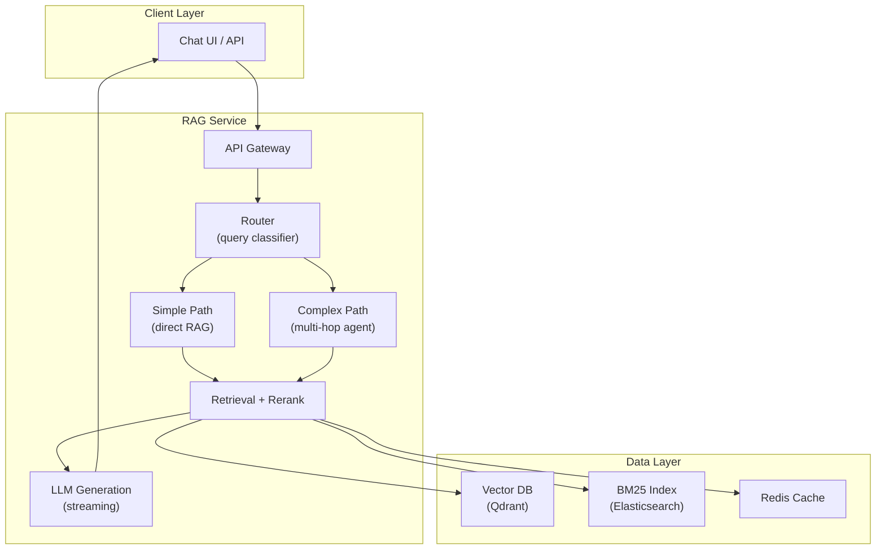

# Retrieval Pipelines — Real-World Production Examples

## Pattern 1: Production RAG Service Architecture



This architecture routes simple queries through a fast direct path and complex queries through a multi-hop agent, sharing the same retrieval and generation infrastructure.

```python
from fastapi import FastAPI, HTTPException
from fastapi.responses import StreamingResponse
from pydantic import BaseModel
import asyncio

app = FastAPI()

class QueryRequest(BaseModel):
    question: str
    session_id: str = None
    filters: dict = None

class RAGService:
    """Production RAG service with routing, caching, and streaming."""
    
    def __init__(self):
        self.router = QueryRouter()
        self.retriever = HybridRetriever()
        self.reranker = CrossEncoderReranker()
        self.generator = StreamingGenerator()
        self.cache = ResponseCache()
    
    async def process_query(self, request: QueryRequest):
        """Main entry point for RAG queries."""
        
        # Check cache
        cached = await self.cache.get(request.question)
        if cached:
            return cached
        
        # Classify and route
        query_type = await self.router.classify(request.question)
        
        # Retrieve
        if query_type == "simple":
            context = await self.retriever.search(
                request.question, 
                top_k=5,
                filters=request.filters
            )
        else:
            context = await self.multi_hop_retrieve(request.question)
        
        # Rerank
        reranked = await self.reranker.rerank(request.question, context, top_k=5)
        
        # Generate (streaming)
        async def stream_response():
            full_response = ""
            async for chunk in self.generator.generate_stream(request.question, reranked):
                full_response += chunk
                yield chunk
            
            # Cache complete response
            await self.cache.set(request.question, full_response, ttl=3600)
        
        return stream_response()

@app.post("/query")
async def query_endpoint(request: QueryRequest):
    service = RAGService()
    response_stream = await service.process_query(request)
    return StreamingResponse(response_stream, media_type="text/plain")
```

---

## Pattern 2: Multi-Source Retrieval

Combine information from multiple knowledge sources:

```python
class MultiSourceRetriever:
    """Search across documentation, SQL databases, and APIs simultaneously."""
    
    def __init__(self):
        self.sources = {
            "docs": VectorDBSource("documentation", top_k=5),
            "sql": TextToSQLSource("analytics_db"),
            "api": APISource("internal_services"),
        }
    
    async def retrieve(self, query: str, query_type: str) -> list[dict]:
        """Route to appropriate sources and merge results."""
        
        # Determine which sources to query
        source_plan = self.plan_sources(query, query_type)
        
        # Query sources in parallel
        tasks = []
        for source_name in source_plan:
            source = self.sources[source_name]
            tasks.append(source.search(query))
        
        results = await asyncio.gather(*tasks, return_exceptions=True)
        
        # Merge and deduplicate
        all_context = []
        for source_name, result in zip(source_plan, results):
            if isinstance(result, Exception):
                continue  # Skip failed sources gracefully
            for item in result:
                item["source_type"] = source_name
                all_context.append(item)
        
        return all_context
    
    def plan_sources(self, query: str, query_type: str) -> list[str]:
        """Decide which sources to query."""
        if "how many" in query.lower() or "count" in query.lower():
            return ["sql", "docs"]  # Quantitative → try SQL first
        elif "api" in query.lower() or "endpoint" in query.lower():
            return ["api", "docs"]
        else:
            return ["docs"]  # Default: documentation


class TextToSQLSource:
    """Generate and execute SQL based on natural language query."""
    
    async def search(self, query: str) -> list[dict]:
        # Generate SQL from natural language
        sql = await self.generate_sql(query)
        
        if sql:
            result = self.execute_sql(sql)
            return [{"text": f"SQL Result: {result}", "source": "database", "sql": sql}]
        return []
    
    async def generate_sql(self, query: str) -> str:
        schema_context = self.get_relevant_schema(query)
        response = await client.chat.completions.create(
            model="gpt-4o-mini",
            messages=[{
                "role": "user",
                "content": f"Schema:\n{schema_context}\n\nGenerate SQL for: {query}\nReturn ONLY the SQL, nothing else."
            }],
            temperature=0,
        )
        return response.choices[0].message.content
```

---

## Pattern 3: Conversational RAG (Chat History)

Handle multi-turn conversations where context builds across messages:

```python
class ConversationalRAG:
    """RAG with chat history awareness — understands references to prior messages."""
    
    def __init__(self, vector_db, session_store):
        self.vector_db = vector_db
        self.session_store = session_store
    
    async def answer(self, question: str, session_id: str) -> dict:
        # Load chat history
        history = self.session_store.get_history(session_id, last_n=5)
        
        # Step 1: Rewrite question with context from history
        # "What about its performance?" → "What about Spark AQE's performance?"
        standalone_question = await self.contextualize_question(question, history)
        
        # Step 2: Retrieve using the contextualized question
        query_vec = embed(standalone_question)
        results = self.vector_db.search(query_vec, top_k=5)
        
        # Step 3: Generate answer with full conversation context
        answer = await self.generate_with_history(
            question=question,
            standalone_question=standalone_question,
            context=[r["text"] for r in results],
            history=history
        )
        
        # Step 4: Save to session
        self.session_store.add_message(session_id, "user", question)
        self.session_store.add_message(session_id, "assistant", answer)
        
        return {"answer": answer, "sources": results}
    
    async def contextualize_question(self, question: str, history: list[dict]) -> str:
        """Rewrite question to be self-contained using chat history."""
        if not history:
            return question
        
        history_text = "\n".join([f"{m['role']}: {m['content']}" for m in history[-4:]])
        
        response = await client.chat.completions.create(
            model="gpt-4o-mini",
            messages=[{
                "role": "user",
                "content": f"""Given this conversation history, rewrite the latest question 
to be self-contained (understandable without the history).
If the question is already self-contained, return it unchanged.

History:
{history_text}

Latest question: {question}

Self-contained version:"""
            }],
            temperature=0,
        )
        return response.choices[0].message.content

# Example conversation:
# User: "Tell me about Spark AQE"
# Assistant: "AQE (Adaptive Query Execution) in Spark 3.0+ optimizes..."
# User: "What about its performance impact?"
#   → Contextualized: "What is the performance impact of Spark AQE?"
#   → Retrieves AQE performance docs (not generic "performance" docs)
```

---

## Pattern 4: RAG Quality Monitoring

```python
from dataclasses import dataclass, field
from datetime import datetime
from prometheus_client import Histogram, Counter, Gauge

# Metrics
RETRIEVAL_LATENCY = Histogram("rag_retrieval_latency_ms", "Retrieval latency")
GENERATION_LATENCY = Histogram("rag_generation_latency_ms", "Generation latency")
TOP_SCORE = Histogram("rag_top_similarity_score", "Top-1 retrieval score")
USER_FEEDBACK = Counter("rag_user_feedback", "User feedback", ["rating"])
HALLUCINATION_RATE = Gauge("rag_hallucination_rate", "Estimated hallucination rate")

@dataclass
class RAGInteraction:
    query: str
    retrieved_docs: list[dict]
    answer: str
    top_score: float
    retrieval_latency_ms: float
    generation_latency_ms: float
    user_rating: str = None  # thumbs_up, thumbs_down, none
    timestamp: datetime = field(default_factory=datetime.now)

class RAGMonitor:
    """Monitor RAG system quality in production."""
    
    def __init__(self):
        self.interactions = []
    
    def log_interaction(self, interaction: RAGInteraction):
        """Record each RAG interaction for monitoring."""
        self.interactions.append(interaction)
        
        # Emit metrics
        RETRIEVAL_LATENCY.observe(interaction.retrieval_latency_ms)
        GENERATION_LATENCY.observe(interaction.generation_latency_ms)
        TOP_SCORE.observe(interaction.top_score)
        
        # Alert conditions
        if interaction.top_score < 0.3:
            self.alert_low_relevance(interaction)
        if interaction.retrieval_latency_ms > 500:
            self.alert_slow_retrieval(interaction)
    
    def log_feedback(self, query: str, rating: str):
        """Record user feedback (thumbs up/down)."""
        USER_FEEDBACK.labels(rating=rating).inc()
    
    def daily_quality_report(self) -> dict:
        """Generate daily quality metrics."""
        today = [i for i in self.interactions if i.timestamp.date() == datetime.now().date()]
        
        if not today:
            return {"status": "no_data"}
        
        return {
            "total_queries": len(today),
            "avg_top_score": sum(i.top_score for i in today) / len(today),
            "low_relevance_pct": sum(1 for i in today if i.top_score < 0.4) / len(today) * 100,
            "avg_retrieval_ms": sum(i.retrieval_latency_ms for i in today) / len(today),
            "avg_generation_ms": sum(i.generation_latency_ms for i in today) / len(today),
            "thumbs_up_rate": sum(1 for i in today if i.user_rating == "thumbs_up") / max(sum(1 for i in today if i.user_rating), 1),
            "p99_latency_ms": sorted([i.retrieval_latency_ms + i.generation_latency_ms for i in today])[int(len(today) * 0.99)],
        }
```

---

## Pattern 5: Scaling RAG to 1000+ Concurrent Users

```python
import asyncio
from functools import lru_cache

class ScalableRAGService:
    """RAG optimized for high concurrency."""
    
    def __init__(self):
        # Connection pools
        self.vector_db_pool = ConnectionPool(max_connections=50)
        self.llm_semaphore = asyncio.Semaphore(20)  # Limit concurrent LLM calls
        
        # Caching layers
        self.query_cache = RedisCache(ttl=3600)      # Full response cache
        self.embedding_cache = RedisCache(ttl=86400)  # Query embedding cache
        self.context_cache = RedisCache(ttl=1800)     # Retrieved context cache
    
    async def answer(self, question: str) -> str:
        # Layer 1: Full response cache (instant)
        cached_response = await self.query_cache.get(self.normalize(question))
        if cached_response:
            return cached_response
        
        # Layer 2: Cached embedding (skip embedding API)
        embedding = await self.get_or_embed(question)
        
        # Layer 3: Cached retrieval results
        cache_key = f"context:{hash(question)}"
        context = await self.context_cache.get(cache_key)
        if not context:
            context = await self.retrieve(embedding)
            await self.context_cache.set(cache_key, context)
        
        # Layer 4: Generate (rate-limited)
        async with self.llm_semaphore:
            answer = await self.generate(question, context)
        
        # Cache the full response
        await self.query_cache.set(self.normalize(question), answer)
        
        return answer
    
    def normalize(self, question: str) -> str:
        """Normalize query for cache dedup."""
        return question.strip().lower().rstrip("?")
    
    async def get_or_embed(self, text: str) -> list[float]:
        cached = await self.embedding_cache.get(f"emb:{text[:100]}")
        if cached:
            return cached
        embedding = self.local_embed_model.encode(text)  # Local = no API latency
        await self.embedding_cache.set(f"emb:{text[:100]}", embedding.tolist())
        return embedding.tolist()

# Scaling strategy:
# - 3 API servers behind load balancer
# - Local embedding model (no external API bottleneck)
# - Redis cluster for multi-layer caching (30-50% hit rate)
# - LLM semaphore prevents overloading the generation service
# - Async throughout for maximum concurrency per server
# - Expected: 1000 concurrent users at <1s p99 latency
```

---

## Interview Tips

> **Tip 1:** "How do you scale RAG to 1000 users?" — Multi-layer caching (response, embedding, context), local embedding model (no API bottleneck), async processing, connection pooling, LLM rate limiting (semaphore), and streaming responses (users see first token quickly even if full answer takes time).

> **Tip 2:** "How do you handle multi-turn conversations in RAG?" — Contextualize each question using chat history: rewrite "What about its cost?" into "What is the cost of Spark AQE?" before retrieval. This ensures the vector search finds relevant documents instead of matching on vague pronouns.

> **Tip 3:** "How do you monitor RAG quality in production?" — Track: retrieval top-score (relevance proxy), user feedback (thumbs up/down), latency percentiles, and hallucination rate (via automated spot-checking with an LLM judge). Alert if top-score trends down or negative feedback spikes.
