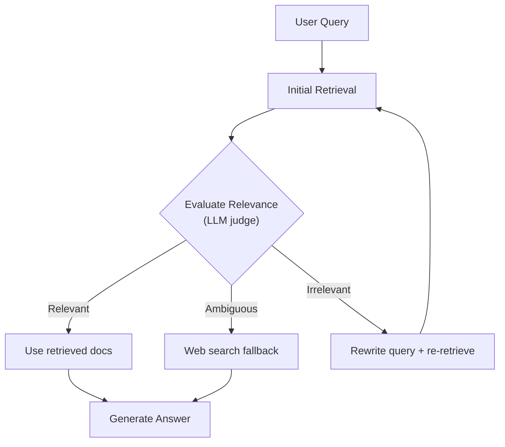

# Retrieval Pipelines — Senior-Level Deep Dive

## Agentic RAG

Instead of a fixed retrieve-then-generate pipeline, an agent decides **when** and **what** to retrieve dynamically:

```python
from openai import OpenAI
import json

client = OpenAI()

class AgenticRAG:
    """Agent that decides when to retrieve, what to search, and when to stop."""
    
    def __init__(self, vector_db, max_iterations: int = 5):
        self.vector_db = vector_db
        self.max_iterations = max_iterations
        self.tools = [
            {
                "type": "function",
                "function": {
                    "name": "search_knowledge_base",
                    "description": "Search the knowledge base for relevant information",
                    "parameters": {
                        "type": "object",
                        "properties": {
                            "query": {"type": "string", "description": "Search query"},
                            "filter_topic": {"type": "string", "description": "Optional topic filter"}
                        },
                        "required": ["query"]
                    }
                }
            }
        ]
    
    def answer(self, question: str) -> dict:
        """Agent iteratively retrieves information until it can answer."""
        messages = [
            {"role": "system", "content": """You are a research assistant. 
To answer questions, search the knowledge base using the search tool.
You may search multiple times with different queries to gather comprehensive information.
When you have enough information, provide a final answer with citations."""},
            {"role": "user", "content": question}
        ]
        
        retrieved_context = []
        
        for iteration in range(self.max_iterations):
            response = client.chat.completions.create(
                model="gpt-4o",
                messages=messages,
                tools=self.tools,
                tool_choice="auto",
            )
            
            message = response.choices[0].message
            
            # If no tool call, agent is ready to answer
            if not message.tool_calls:
                return {
                    "answer": message.content,
                    "searches_performed": len(retrieved_context),
                    "sources": retrieved_context,
                }
            
            # Execute tool calls
            for tool_call in message.tool_calls:
                args = json.loads(tool_call.function.arguments)
                search_results = self._search(args["query"], args.get("filter_topic"))
                
                retrieved_context.append({
                    "query": args["query"],
                    "results": [r["text"][:200] for r in search_results]
                })
                
                # Feed results back to agent
                messages.append(message)
                messages.append({
                    "role": "tool",
                    "tool_call_id": tool_call.id,
                    "content": json.dumps([r["text"] for r in search_results[:3]])
                })
        
        return {"answer": "Could not find sufficient information.", "searches_performed": self.max_iterations}
    
    def _search(self, query: str, topic_filter: str = None):
        query_vec = embed(query)
        filter_dict = {"topic": topic_filter} if topic_filter else None
        return self.vector_db.search(query_vec, top_k=5, filter=filter_dict)
```

**When agentic RAG outperforms standard RAG:**
- Complex questions requiring multiple searches ("Compare X and Y")
- Questions where the first retrieval reveals what else to search for
- Multi-step reasoning where each step builds on previous context

---

## Self-RAG (Self-Reflective Retrieval)

The model evaluates its own retrieval quality and decides whether to retrieve more:

```python
class SelfRAG:
    """Self-reflective RAG: evaluate retrieval quality, retry if insufficient."""
    
    def answer(self, question: str) -> dict:
        # Step 1: Initial retrieval
        results = self.retrieve(question, top_k=5)
        context = [r["text"] for r in results]
        
        # Step 2: Generate answer
        answer = self.generate(question, context)
        
        # Step 3: Self-evaluate (is the answer grounded in the context?)
        evaluation = self.evaluate_groundedness(question, answer, context)
        
        if evaluation["is_grounded"] and evaluation["is_relevant"]:
            return {"answer": answer, "confidence": "high"}
        
        # Step 4: If not grounded, try different retrieval strategy
        if not evaluation["is_relevant"]:
            # Context was irrelevant — try query transformation
            transformed_query = self.transform_query(question)
            results = self.retrieve(transformed_query, top_k=10)
            context = [r["text"] for r in results]
            answer = self.generate(question, context)
        
        elif not evaluation["is_grounded"]:
            # Answer made claims not in context — regenerate with stricter prompt
            answer = self.generate_strict(question, context)
        
        return {"answer": answer, "confidence": "medium", "retried": True}
    
    def evaluate_groundedness(self, question: str, answer: str, context: list[str]) -> dict:
        """LLM evaluates whether the answer is supported by context."""
        eval_prompt = f"""Evaluate this answer:
1. Is the answer RELEVANT to the question? (yes/no)
2. Is every claim in the answer SUPPORTED by the provided context? (yes/no)
3. Does the answer contain information NOT in the context (hallucination)? (yes/no)

Question: {question}
Answer: {answer}
Context: {chr(10).join(context[:3])}

Respond in JSON: {{"is_relevant": bool, "is_grounded": bool, "has_hallucination": bool}}"""
        
        response = client.chat.completions.create(
            model="gpt-4o-mini",
            messages=[{"role": "user", "content": eval_prompt}],
            response_format={"type": "json_object"},
            temperature=0,
        )
        return json.loads(response.choices[0].message.content)
```

---

## Corrective RAG (CRAG)

CRAG verifies retrieval quality and takes corrective action:



This diagram shows how CRAG routes based on retrieval quality assessment — using the retrieved docs directly if relevant, falling back to web search if ambiguous, or rewriting the query if irrelevant.

```python
class CorrectiveRAG:
    """CRAG: verify and correct retrieval before generation."""
    
    def answer(self, question: str) -> dict:
        # Step 1: Retrieve
        results = self.retrieve(question, top_k=5)
        
        # Step 2: Grade each retrieved document
        graded = self.grade_documents(question, results)
        relevant = [r for r, grade in zip(results, graded) if grade == "relevant"]
        
        # Step 3: Corrective action based on grades
        if len(relevant) >= 3:
            # Enough relevant docs — proceed
            context = [r["text"] for r in relevant]
        elif len(relevant) >= 1:
            # Some relevant, supplement with web search
            web_results = self.web_search(question)
            context = [r["text"] for r in relevant] + web_results
        else:
            # Nothing relevant — rewrite query and retry
            new_query = self.rewrite_query(question)
            results = self.retrieve(new_query, top_k=10)
            graded = self.grade_documents(question, results)
            relevant = [r for r, g in zip(results, graded) if g == "relevant"]
            context = [r["text"] for r in relevant[:5]]
        
        # Step 4: Knowledge refinement — extract only relevant parts
        refined_context = self.refine_context(question, context)
        
        # Step 5: Generate
        return self.generate(question, refined_context)
    
    def grade_documents(self, question: str, documents: list[dict]) -> list[str]:
        """Grade each document as relevant/irrelevant."""
        grades = []
        for doc in documents:
            response = client.chat.completions.create(
                model="gpt-4o-mini",
                messages=[{
                    "role": "user",
                    "content": f"""Is this document relevant to answering the question?
Question: {question}
Document: {doc['text'][:500]}
Answer only: relevant or irrelevant"""
                }],
                temperature=0,
            )
            grades.append(response.choices[0].message.content.strip().lower())
        return grades
```

---

## Multi-Hop Retrieval

For questions requiring information from multiple documents:

```python
class MultiHopRetriever:
    """Answer questions that require chaining information from multiple sources."""
    
    def retrieve_multi_hop(self, question: str, max_hops: int = 3) -> list[dict]:
        """Iteratively retrieve, building context across hops."""
        
        all_context = []
        current_query = question
        
        for hop in range(max_hops):
            # Retrieve for current query
            results = self.retrieve(current_query, top_k=3)
            all_context.extend(results)
            
            # Check if we have enough to answer
            can_answer = self.check_sufficiency(question, all_context)
            if can_answer:
                break
            
            # Generate follow-up query based on what we've learned
            current_query = self.generate_follow_up(
                original_question=question,
                context_so_far=[r["text"] for r in all_context],
            )
        
        return all_context
    
    def generate_follow_up(self, original_question: str, context_so_far: list[str]) -> str:
        """Generate the next query based on what's missing."""
        response = client.chat.completions.create(
            model="gpt-4o-mini",
            messages=[{
                "role": "user",
                "content": f"""Original question: {original_question}

Information gathered so far:
{chr(10).join(context_so_far[:3])}

What additional information do we still need to fully answer the question?
Generate a specific search query to find the missing information."""
            }],
            temperature=0,
        )
        return response.choices[0].message.content

# Example:
# Q: "What's the cost difference between Kinesis and MSK for 1TB/day?"
# Hop 1: retrieve Kinesis pricing docs
# Hop 2: retrieve MSK pricing docs (follow-up generated after seeing Kinesis info)
# Hop 3: retrieve comparison guidelines (if needed)
# → Now has all info to compute the comparison
```

---

## Production Latency Optimization

```python
import asyncio
from concurrent.futures import ThreadPoolExecutor

class OptimizedRAGPipeline:
    """Production RAG with latency optimizations."""
    
    def __init__(self):
        self.executor = ThreadPoolExecutor(max_workers=10)
    
    async def answer(self, question: str) -> dict:
        """Optimized pipeline targeting <500ms total latency."""
        
        # Parallel: embed query AND generate HyDE simultaneously
        embed_task = asyncio.get_event_loop().run_in_executor(
            self.executor, self.embed_query, question
        )
        
        # Start with cached results while embedding computes
        cached = self.check_cache(question)
        if cached:
            return cached
        
        query_vector = await embed_task  # ~50ms (local model)
        
        # Parallel: dense search + sparse search simultaneously
        dense_task = asyncio.get_event_loop().run_in_executor(
            self.executor, self.dense_search, query_vector
        )
        sparse_task = asyncio.get_event_loop().run_in_executor(
            self.executor, self.sparse_search, question
        )
        
        dense_results, sparse_results = await asyncio.gather(dense_task, sparse_task)
        # ~10ms each (parallel)
        
        # Merge and re-rank (synchronous, fast)
        merged = self.rrf_merge(dense_results, sparse_results)  # ~1ms
        top_results = self.rerank(question, merged[:20])  # ~50ms (local cross-encoder)
        
        # Generate (streaming for perceived latency)
        context = [r["text"] for r in top_results[:5]]
        answer = await self.generate_streaming(question, context)  # ~200ms to first token
        
        # Cache result
        self.cache_result(question, answer)
        
        return answer
    
    # Latency breakdown:
    # Embed query: 50ms (local model, GPU)
    # Dense + sparse search (parallel): 10ms
    # Re-rank (local cross-encoder, top-20): 50ms
    # LLM generation (first token): 200ms
    # TOTAL: ~310ms to first token (streaming), ~800ms to complete answer
```

---

## Adaptive Retrieval (Query Routing)

Route queries to different retrieval strategies based on query type:

```python
class AdaptiveRetriever:
    """Route queries to optimal retrieval strategy."""
    
    def classify_query(self, query: str) -> str:
        """Classify query type to choose retrieval strategy."""
        response = client.chat.completions.create(
            model="gpt-4o-mini",
            messages=[{
                "role": "user",
                "content": f"""Classify this query into one category:
- factual: specific fact lookup ("What is the default value of X?")
- conceptual: understanding/explanation ("How does X work?")
- comparison: comparing options ("X vs Y")
- troubleshooting: fixing a problem ("Why is X failing?")
- procedural: step-by-step ("How to set up X?")

Query: {query}
Category:"""
            }],
            temperature=0,
        )
        return response.choices[0].message.content.strip().lower()
    
    def retrieve(self, query: str) -> list[dict]:
        query_type = self.classify_query(query)
        
        if query_type == "factual":
            # Precise keyword search (exact match matters)
            return self.hybrid_search(query, alpha=0.3)  # More weight on BM25
        
        elif query_type == "conceptual":
            # Broad semantic search
            return self.dense_search(query, top_k=8)
        
        elif query_type == "comparison":
            # Decompose and search each entity
            return self.multi_entity_search(query)
        
        elif query_type == "troubleshooting":
            # Search error patterns + solutions
            return self.hybrid_search(query, alpha=0.5, filter={"type": "troubleshooting"})
        
        else:  # procedural
            # Search guides/tutorials
            return self.dense_search(query, top_k=5, filter={"type": "guide"})
```

---

## Interview Tips

> **Tip 1:** "What is agentic RAG and when would you use it?" — The agent decides dynamically what to retrieve, when, and how many times. Use it for complex questions that require multiple searches (comparisons, multi-step reasoning) or when the first search reveals what else to look for. Don't use it for simple factual lookups (adds latency without benefit).

> **Tip 2:** "How do you handle RAG latency in production?" — Parallelize independent steps (embed + BM25 simultaneously), use local models for embedding and re-ranking (eliminates API round-trips), cache frequent queries, stream the LLM response (first token in 200ms), and pre-compute embeddings for common query patterns.

> **Tip 3:** "How do you handle questions that require info from multiple documents?" — Multi-hop retrieval: retrieve, check if answer is complete, generate a follow-up query for missing info, retrieve again. This builds up context iteratively. Alternatively, query decomposition splits the question upfront into sub-questions, each answered independently.
