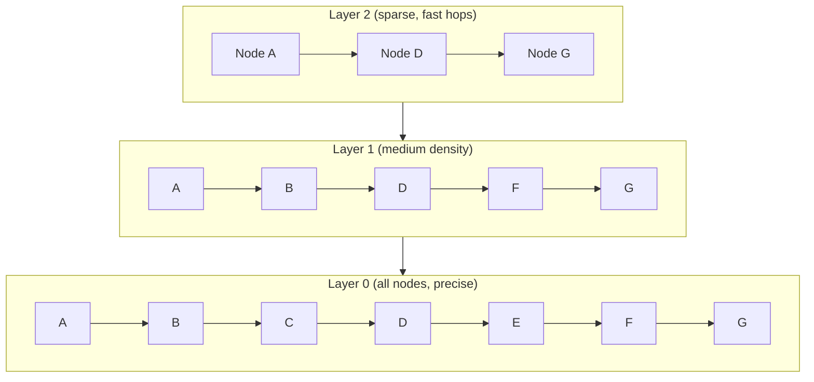

# Vector Databases — Intermediate

## HNSW Deep Dive

HNSW is the dominant index algorithm. Understanding its parameters lets you tune recall vs speed vs memory.

### How HNSW Works

The graph has multiple layers (like a skip list). Top layers have few nodes (long-range connections for fast navigation). Bottom layers have all nodes (short-range connections for precision).



Search starts at the top layer (fast, coarse navigation) and descends to bottom layers (precise, local search). This gives O(log n) query time.

### Key Parameters

| Parameter | What It Controls | Typical Range | Impact |
|-----------|-----------------|---------------|--------|
| `M` | Connections per node | 8-64 | Higher = better recall, more memory |
| `ef_construction` | Build-time candidates | 100-500 | Higher = better graph quality, slower build |
| `ef_search` | Query-time candidates | 50-200 | Higher = better recall, slower queries |

```python
# Qdrant configuration example
from qdrant_client import QdrantClient
from qdrant_client.models import VectorParams, HnswConfigDiff

client = QdrantClient("localhost", port=6333)

# Create collection with tuned HNSW
client.create_collection(
    collection_name="documents",
    vectors_config=VectorParams(
        size=1536,
        distance="Cosine"
    ),
    hnsw_config=HnswConfigDiff(
        m=16,                    # 16 connections per node (balanced)
        ef_construct=200,        # High quality graph construction
        full_scan_threshold=10000,  # Below this, just brute-force (faster for small collections)
    )
)

# At query time, adjust ef for recall vs speed
results = client.search(
    collection_name="documents",
    query_vector=query_embedding,
    limit=10,
    search_params={"hnsw_ef": 128}  # Higher ef = better recall, slower
)
```

### Tuning Guidelines

```python
# High recall needed (legal, medical): sacrifice speed
hnsw_config = {"m": 32, "ef_construction": 400}
search_params = {"hnsw_ef": 200}  # recall@10 ≈ 99%, latency ~10ms

# Balanced (general RAG): good defaults
hnsw_config = {"m": 16, "ef_construction": 200}
search_params = {"hnsw_ef": 64}   # recall@10 ≈ 97%, latency ~3ms

# Speed-optimized (autocomplete, high QPS): sacrifice recall
hnsw_config = {"m": 8, "ef_construction": 100}
search_params = {"hnsw_ef": 32}   # recall@10 ≈ 92%, latency ~1ms
```

---

## IVF-PQ (Inverted File + Product Quantization)

For datasets that don't fit in RAM, IVF-PQ combines clustering with compression:

```python
import faiss
import numpy as np

dimension = 768
num_vectors = 50_000_000  # 50M vectors

# IVF: cluster vectors into 4096 buckets
# PQ: compress each vector from 768 floats → 96 bytes
nlist = 4096         # Number of clusters (sqrt(N) is a common heuristic)
m_pq = 96           # Number of sub-quantizers (dimension must be divisible by this)
nbits = 8           # Bits per sub-quantizer

# Build index
quantizer = faiss.IndexFlatL2(dimension)
index = faiss.IndexIVFPQ(quantizer, dimension, nlist, m_pq, nbits)

# Train on a sample (required for IVF-PQ)
training_data = np.random.randn(100_000, dimension).astype('float32')
index.train(training_data)

# Add vectors
index.add(all_vectors)

# Search with nprobe (how many clusters to check)
index.nprobe = 32  # Check 32 out of 4096 clusters
distances, ids = index.search(query_vector.reshape(1, -1), k=10)

# Memory comparison:
# Raw: 50M × 768 × 4 bytes = 150 GB
# IVF-PQ: 50M × 96 bytes = 4.8 GB (31x compression!)
```

---

## Hybrid Search (Dense + Sparse)

Combining semantic (dense) and keyword (sparse/BM25) search improves both precision and recall:

```python
# Qdrant hybrid search example
from qdrant_client.models import SparseVector

# Store both dense and sparse vectors
client.create_collection(
    collection_name="hybrid_docs",
    vectors_config={
        "dense": VectorParams(size=1536, distance="Cosine"),
    },
    sparse_vectors_config={
        "sparse": {},  # BM25-style sparse vectors
    }
)

# Upsert with both vector types
client.upsert(
    collection_name="hybrid_docs",
    points=[{
        "id": 1,
        "vector": {
            "dense": dense_embedding,
            "sparse": SparseVector(indices=[102, 507, 1024], values=[0.8, 0.5, 0.3])
        },
        "payload": {"text": "Apache Spark partitioning..."}
    }]
)

# Hybrid query using Reciprocal Rank Fusion (RRF)
from qdrant_client.models import Prefetch, FusionQuery, Fusion

results = client.query_points(
    collection_name="hybrid_docs",
    prefetch=[
        Prefetch(query=dense_query_vector, using="dense", limit=50),
        Prefetch(query=sparse_query_vector, using="sparse", limit=50),
    ],
    query=FusionQuery(fusion=Fusion.RRF),  # Combine rankings
    limit=10
)
```

### Reciprocal Rank Fusion (RRF) Scoring

```python
def reciprocal_rank_fusion(ranked_lists: list[list[str]], k: int = 60) -> list[tuple[str, float]]:
    """Combine multiple ranked lists using RRF."""
    scores = {}
    for ranked_list in ranked_lists:
        for rank, doc_id in enumerate(ranked_list, 1):
            if doc_id not in scores:
                scores[doc_id] = 0.0
            scores[doc_id] += 1.0 / (k + rank)
    
    # Sort by combined score
    return sorted(scores.items(), key=lambda x: x[1], reverse=True)

# Dense retrieval returns: [doc_A, doc_C, doc_B, doc_D]
# Sparse retrieval returns: [doc_B, doc_A, doc_E, doc_C]
# RRF combines them: doc_A (high in both), doc_B (high in both), doc_C, ...
```

**When hybrid search helps:**
- Queries with specific technical terms (BM25 catches exact keywords)
- Queries with semantic meaning (dense catches paraphrases)
- Named entities ("Spark 3.5" — BM25 matches exactly, dense might not)

---

## Filtering Strategies: Pre-Filter vs Post-Filter

| Strategy | How | Pro | Con |
|----------|-----|-----|-----|
| Pre-filter | Filter metadata first, then ANN on subset | Accurate | Slow if filter is selective (small subset = poor HNSW performance) |
| Post-filter | ANN on all vectors, then filter results | Fast | May return fewer than K results after filtering |

```python
# Pre-filter: good when most vectors match the filter
# "Find Spark docs" — 30% of corpus is Spark → large subset → HNSW works well
results = index.query(vector=q, filter={"topic": "spark"}, top_k=10)

# Post-filter problem: "Find docs from user_123" — only 50 out of 1M vectors
# ANN returns top-100, but only 2 belong to user_123 → poor results!

# Solution: Use separate collections/namespaces for high-cardinality filters
# OR increase top_k significantly: query top-1000, filter, take top-10
```

---

## Batch Upsert Patterns

```python
import time
from typing import Iterator

def batch_upsert(
    client,
    collection: str,
    vectors: Iterator[dict],
    batch_size: int = 100,
    max_retries: int = 3
):
    """Efficiently upsert vectors in batches with retry logic."""
    batch = []
    total_upserted = 0
    
    for vector in vectors:
        batch.append(vector)
        if len(batch) >= batch_size:
            _upsert_with_retry(client, collection, batch, max_retries)
            total_upserted += len(batch)
            batch = []
            if total_upserted % 10000 == 0:
                print(f"Upserted {total_upserted} vectors")
    
    if batch:
        _upsert_with_retry(client, collection, batch, max_retries)
        total_upserted += len(batch)
    
    return total_upserted

def _upsert_with_retry(client, collection, batch, max_retries):
    for attempt in range(max_retries):
        try:
            client.upsert(collection_name=collection, points=batch)
            return
        except Exception as e:
            if attempt == max_retries - 1:
                raise
            time.sleep(2 ** attempt)  # Exponential backoff
```

---

## Multi-Tenancy Patterns

When multiple users/teams share one vector database:

```python
# Pattern 1: Namespace per tenant (Pinecone)
# Simple, good isolation, but limited to one index's config
index.upsert(vectors=[...], namespace=f"tenant_{tenant_id}")
results = index.query(vector=q, namespace=f"tenant_{tenant_id}", top_k=10)

# Pattern 2: Metadata filter per tenant (Qdrant, pgvector)
# Single collection, filter by tenant_id
client.upsert(points=[{"id": 1, "vector": [...], "payload": {"tenant_id": "acme"}}])
results = client.search(
    query_vector=q,
    query_filter=Filter(must=[FieldCondition(key="tenant_id", match=MatchValue(value="acme"))]),
    limit=10
)

# Pattern 3: Collection per tenant (strongest isolation)
# Best for tenants with very different data sizes or SLA requirements
client.create_collection(f"tenant_{tenant_id}", vectors_config=...)
```

| Pattern | Isolation | Operational Cost | Best For |
|---------|-----------|-----------------|----------|
| Namespace | Logical | Low | 10-100 tenants, similar size |
| Metadata filter | None (shared index) | Lowest | 100+ tenants, small each |
| Collection per tenant | Full | Highest | Different SLAs, compliance |

---

## Interview Tips

> **Tip 1:** "How does HNSW achieve O(log n) search?" — It builds a hierarchical graph with multiple layers. Top layers have few nodes for fast coarse navigation. Bottom layers have all nodes for precise local search. Like a skip list but in high-dimensional space.

> **Tip 2:** "Dense vs hybrid search?" — Dense alone misses exact keyword matches (specific error codes, product IDs). Hybrid adds BM25/sparse retrieval and combines via RRF. Use hybrid when your queries mix semantic intent with specific terms.

> **Tip 3:** "How do you handle multi-tenancy?" — Depends on scale: metadata filtering for many small tenants (simple), namespaces for moderate isolation, separate collections for strong isolation. Key concern: ensuring one tenant's queries never return another tenant's data.
