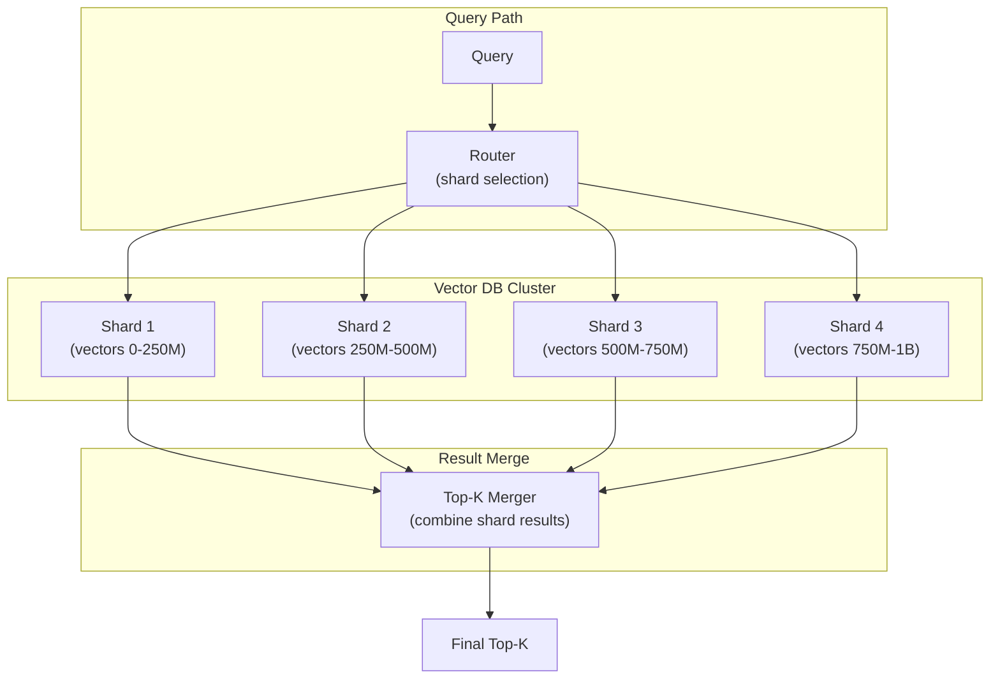

# Vector Databases — Senior-Level Deep Dive

## Scaling to Billions of Vectors

At billion-scale, single-node solutions fail. You need distributed architecture:



Each shard performs ANN search independently, and results are merged to find the global top-K. This is the scatter-gather pattern.

### Sharding Strategies

```python
# Strategy 1: Hash-based sharding (uniform distribution)
# Every vector goes to shard = hash(vector_id) % num_shards
# Pro: even distribution, simple
# Con: query must hit ALL shards (no pruning)

# Strategy 2: Cluster-based sharding (locality-aware)
# Vectors clustered by k-means, each cluster → one shard
# Pro: query only needs to hit nearest cluster shards (fewer shards searched)
# Con: uneven shard sizes, hot spots

# Strategy 3: Metadata-based sharding (domain partitioning)
# Shard by tenant_id or date range
# Pro: tenant queries hit only one shard, strong isolation
# Con: uneven sizes, cross-shard queries expensive

# Production sizing:
# 1B vectors × 768 dims × 1 byte (int8) = 768 GB raw + ~1.5 TB with HNSW index
# Target: 256 GB per node → need 6 shards minimum
# With 2x replication: 12 nodes total
```

---

## Quantization Deep Dive

### Scalar Quantization (SQ)

Maps each float32 dimension to a fixed-point integer:

```python
import numpy as np

def scalar_quantize_uint8(vectors: np.ndarray) -> tuple[np.ndarray, np.ndarray, np.ndarray]:
    """Quantize float32 vectors to uint8 (4x compression)."""
    # Per-dimension min/max calibration
    v_min = vectors.min(axis=0)
    v_max = vectors.max(axis=0)
    scale = (v_max - v_min) / 255.0
    scale[scale == 0] = 1.0  # Avoid division by zero
    
    # Quantize
    quantized = ((vectors - v_min) / scale).clip(0, 255).astype(np.uint8)
    return quantized, v_min, scale

def dequantize(quantized: np.ndarray, v_min: np.ndarray, scale: np.ndarray) -> np.ndarray:
    """Reconstruct approximate float32 vectors."""
    return quantized.astype(np.float32) * scale + v_min
```

### Product Quantization (PQ)

Splits each vector into sub-vectors and encodes each with a codebook:

```python
# Conceptual: 768-dim vector split into 96 sub-vectors of 8 dims each
# Each 8-dim sub-vector is quantized to 1 byte (256 possible centroids)
# Storage: 96 bytes per vector instead of 768 × 4 = 3072 bytes (32x compression)

# PQ search uses precomputed distance tables for speed
# Trade-off: ~5-10% recall loss vs raw vectors, but 32x less memory

# Qdrant configuration:
from qdrant_client.models import ProductQuantization, ScalarQuantization

# Scalar quantization (simpler, less compression)
client.update_collection(
    collection_name="docs",
    quantization_config=ScalarQuantization(
        scalar={"type": "int8", "always_ram": True}
    )
)

# Product quantization (more aggressive compression)
client.update_collection(
    collection_name="docs",
    quantization_config=ProductQuantization(
        product={"compression": "x32", "always_ram": True}
    )
)
```

### Binary Quantization

The most aggressive: each dimension → 1 bit.

```python
# 768 dims × 1 bit = 96 bytes per vector (32x compression from float32)
# Search uses Hamming distance (XOR + popcount) — extremely fast on modern CPUs
# Recall: ~90-95% with oversampling and rescoring

# Pattern: Binary for initial candidate retrieval (oversample 4x)
# Then rescore top candidates with full-precision vectors
```

---

## Memory vs Disk Trade-offs

| Configuration | Latency | Memory Required | Best For |
|--------------|---------|----------------|----------|
| All in RAM (float32) | 1-3ms | 100% of data | Latency-critical, small datasets |
| HNSW in RAM, vectors on disk | 5-15ms | ~30% of data | Large datasets, moderate latency |
| Quantized in RAM | 2-5ms | 25-50% of data | Cost-sensitive, large scale |
| Fully on disk (DiskANN) | 10-50ms | Minimal | Very large, cost-optimized |

```python
# Qdrant: on-disk vectors with HNSW graph in RAM
client.create_collection(
    collection_name="large_docs",
    vectors_config=VectorParams(size=768, distance="Cosine", on_disk=True),
    hnsw_config=HnswConfigDiff(on_disk=False),  # Keep graph in RAM for speed
    quantization_config=ScalarQuantization(
        scalar={"type": "int8", "quantile": 0.99, "always_ram": True}
    )
)
# Quantized vectors in RAM for fast approximate search
# Full vectors on disk for final re-scoring
```

---

## Real-Time Index Updates vs Batch Rebuild

### Write-Ahead Log (WAL) Pattern

```python
# Most vector DBs use WAL for durability:
# 1. Write vector to WAL (append-only, fast)
# 2. Vector available for search immediately (in-memory buffer)
# 3. Background: flush buffer to segment, update HNSW graph
# 4. Periodically: merge small segments (compaction)

# This is why real-time inserts work but may temporarily have lower recall
# (new vectors not yet fully connected in the HNSW graph)

# Qdrant optimization flags:
client.update_collection(
    collection_name="docs",
    optimizer_config={
        "indexing_threshold": 20000,  # Don't build index until 20K vectors (batch-friendly)
        "memmap_threshold": 50000,    # Switch to mmap after 50K vectors
    }
)
```

### When to Rebuild vs Update

```python
# Update in place: <5% of corpus changes per day
# Good for: CDC-driven incremental updates, new document additions

# Full rebuild: model change, quantization config change, >30% of corpus changed
# Pattern: build new collection in background → swap alias → delete old
client.create_collection("docs_v2", ...)  # Build new
# ... populate docs_v2 ...
client.update_collection_aliases(
    change_aliases_operations=[
        {"create_alias": {"alias_name": "docs", "collection_name": "docs_v2"}},
        {"delete_alias": {"alias_name": "docs_old"}}  # if exists
    ]
)
# Zero-downtime switch via alias
```

---

## Consistency Models

| Database | Consistency | Implication |
|----------|-------------|-------------|
| Pinecone | Eventually consistent | Write may not be queryable for seconds |
| Qdrant | Strong (per-shard) | Write visible immediately on same shard |
| Milvus | Eventually consistent | flush() needed for guarantee |
| pgvector | ACID (PostgreSQL) | Fully consistent within transaction |

```python
# Pinecone: wait for freshness
import time
index.upsert(vectors=[...])
time.sleep(2)  # Wait for propagation
results = index.query(...)  # Now guaranteed to see the upsert

# Qdrant: write concern
client.upsert(
    collection_name="docs",
    points=[...],
    wait=True  # Block until indexed and searchable
)
```

---

## Cost Modeling

```python
def vector_db_cost_estimate(
    num_vectors: int,
    dimensions: int,
    queries_per_second: float,
    quantization: str = "none"  # "none", "int8", "binary"
) -> dict:
    """Estimate monthly vector DB costs."""
    
    # Memory calculation
    bytes_per_dim = {"none": 4, "int8": 1, "binary": 0.125}[quantization]
    raw_memory_gb = (num_vectors * dimensions * bytes_per_dim) / (1024**3)
    hnsw_overhead = 1.5  # Graph adds ~50% memory overhead
    total_memory_gb = raw_memory_gb * hnsw_overhead
    
    # Instance sizing (targeting 70% memory utilization)
    memory_needed = total_memory_gb / 0.7
    
    # Cost (r6g.xlarge = 32GB, $0.20/hr = $146/mo)
    nodes_needed = max(1, int(np.ceil(memory_needed / 32)))
    
    # Add replication
    replication_factor = 2 if num_vectors > 10_000_000 else 1
    total_nodes = nodes_needed * replication_factor
    
    monthly_cost = total_nodes * 146  # r6g.xlarge
    
    return {
        "raw_memory_gb": raw_memory_gb,
        "total_memory_gb": total_memory_gb,
        "nodes_needed": total_nodes,
        "monthly_cost_usd": monthly_cost,
        "cost_per_million_vectors": monthly_cost / (num_vectors / 1_000_000),
    }

# Examples:
# 10M vectors, 1536 dims, float32: ~$584/mo (4 nodes)
# 10M vectors, 1536 dims, int8: ~$146/mo (1 node)
# 100M vectors, 768 dims, int8: ~$876/mo (6 nodes)
# 1B vectors, 768 dims, int8: ~$8,760/mo (60 nodes)
```

---

## Vector Database Internals

### Segment Architecture (Qdrant/Milvus)

```
Collection
├── Segment 1 (sealed, immutable, optimized)
│   ├── HNSW index (graph on disk/mmap)
│   ├── Vector storage (quantized in RAM)
│   ├── Payload index (metadata)
│   └── ID mapping
├── Segment 2 (sealed)
└── WAL Segment (mutable, accepts writes)
    ├── New vectors (flat, not yet indexed)
    └── Delete log (tombstones)

Background optimizer:
- Merges small segments into larger ones
- Builds HNSW index for WAL segment once threshold reached
- Applies quantization to new segments
```

---

## Interview Tips

> **Tip 1:** "How would you scale a vector DB to 1 billion vectors?" — Shard across multiple nodes (scatter-gather pattern), use int8/binary quantization (reduce memory 4-32x), keep HNSW graph in RAM but vectors on disk (tiered storage), use 2x replication for HA. Target ~250M vectors per shard for manageable segment sizes.

> **Tip 2:** "What's the trade-off between recall and latency?" — Higher ef_search and larger M values improve recall but increase latency and memory. Profile your specific workload: plot recall@10 vs p99 latency at different ef values. Find the knee of the curve (usually 95-98% recall at 3-5ms).

> **Tip 3:** "How do you handle zero-downtime model upgrades?" — Build a new collection with the new model's embeddings in parallel. Once complete, swap the collection alias atomically. Keep the old collection warm for rollback. This avoids any period where the index mixes embeddings from different models.

## ⚡ Cheat Sheet

**RAG pipeline architecture**
```
Document → Chunk → Embed → Store in Vector DB
Query → Embed query → ANN search → Retrieve top-k chunks → Augment prompt → LLM → Answer
```

**Chunking strategies**
```python
# Fixed-size with overlap
text_splitter = RecursiveCharacterTextSplitter(chunk_size=512, chunk_overlap=50)
chunks = text_splitter.split_text(document)

# Semantic chunking (split on topic boundaries)
from langchain.text_splitter import SemanticChunker
chunker = SemanticChunker(embedding_model)

# Hierarchical: large chunks for context, small for retrieval
# Parent-child: store parent chunk, retrieve child, return parent to LLM
```

**Embedding models**
| Model | Dims | Use case |
|---|---|---|
| text-embedding-3-small | 1536 | General purpose, OpenAI |
| text-embedding-3-large | 3072 | Higher accuracy, OpenAI |
| all-MiniLM-L6-v2 | 384 | Fast, local, free |
| BAAI/bge-large-en | 1024 | Strong retrieval, local |
| Cohere embed-v3 | 1024 | Multilingual |

**Vector databases**
| DB | Type | Strengths |
|---|---|---|
| Pinecone | Managed | Easy ops, fully managed |
| Weaviate | OSS/managed | Hybrid search (vector + BM25) |
| Qdrant | OSS/managed | Fast, Rust-based, payload filtering |
| pgvector | PostgreSQL extension | Existing Postgres infrastructure |
| Chroma | OSS | Local dev, lightweight |
| FAISS | Library | Fastest local, no persistence |

**Retrieval optimization**
```python
# Hybrid search (vector + keyword)
results = vector_db.hybrid_search(
    query=query, vector=embed(query), alpha=0.7  # 0=pure BM25, 1=pure vector
)
# Re-ranking with cross-encoder
from sentence_transformers import CrossEncoder
ranker = CrossEncoder("cross-encoder/ms-marco-MiniLM-L-6-v2")
scores = ranker.predict([(query, doc.text) for doc in results])
reranked = sorted(zip(results, scores), key=lambda x: x[1], reverse=True)
```

**Evaluation metrics**
```
Faithfulness:    LLM answer only uses facts from retrieved context (anti-hallucination)
Answer Relevance: answer addresses the question
Context Precision: retrieved chunks actually contain the answer
Context Recall:   all relevant chunks were retrieved
RAGAS framework: automated evaluation of all four metrics
```

**Prompt engineering patterns**
```python
# System prompt with RAG context
system_prompt = """You are a data engineering assistant.
Answer only based on the provided context. If the answer is not in the context, say 'I don't know.'
Context:
{context}"""

# Few-shot prompting
few_shot_examples = [
    {"question": "What is Delta Lake?", "answer": "Delta Lake is an open-source..."},
]

# Chain-of-thought (CoT): "Let's think step by step"
# React pattern: Reason + Act (tool use) + Observe → loop until answer
```

**Fine-tuning vs RAG**
```
RAG:         best for dynamic/proprietary knowledge; no training needed; updatable
Fine-tuning: best for domain tone/style; specialized tasks; fixed knowledge cutoff
Combine:     fine-tune for domain adaptation + RAG for factual grounding
```

**Key interview points**
- Chunk size tradeoff: small chunks = precise retrieval; large chunks = more context
- Cosine similarity vs dot product: cosine for variable-length texts; dot for normalized
- Metadata filtering: filter by document_type, date, or source before ANN search
- Guardrails: LLM output validation (Guardrails AI, Nemo Guardrails, Instructor)
