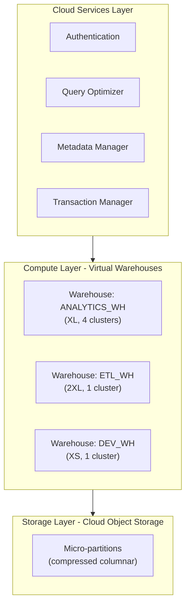

# Snowflake Architecture — Fundamentals

## What Is Snowflake?

Snowflake is a **cloud-native data warehouse** built from the ground up for the cloud. Its key innovation is the **separation of compute and storage** — you can scale processing power and data storage independently.

**The analogy:** Traditional warehouses (Teradata, on-prem) are like buying a car where the engine and trunk are one unit — want a bigger trunk? You need a whole new car. Snowflake is like having the engine and trunk as separate, interchangeable modules — scale each independently.

> **Key Insight:** Snowflake runs on top of cloud object storage (AWS S3, Azure Blob, GCP Cloud Storage). You only pay for compute when queries are actually running.

---

## Three-Layer Architecture



**What this shows:**
- **Layer 1 (Cloud Services):** The "brain" — handles authentication, query optimization, metadata, and transaction management. Always running.
- **Layer 2 (Compute):** Virtual warehouses that execute queries. Can be started/stopped/resized independently. Multiple can run simultaneously.
- **Layer 3 (Storage):** Data stored in cloud object storage as compressed columnar micro-partitions. Cheap, infinite, shared by all warehouses.

---

## Layer 1: Cloud Services

This layer is always running (you don't pay for it separately — included in compute costs).

| Service | What It Does |
|---------|-------------|
| Query Optimizer | Creates execution plans, decides how to read data |
| Metadata Manager | Tracks which micro-partitions exist, their min/max values |
| Transaction Manager | ACID transactions, time-travel, concurrency control |
| Authentication | Users, roles, access control (RBAC) |
| Infrastructure | Manages virtual warehouse provisioning/deprovisioning |

> **The optimizer uses metadata extensively.** It knows the min/max values in each micro-partition, so it can "prune" (skip) irrelevant partitions without scanning them. This is how queries on TB-scale tables can run in seconds.

---

## Layer 2: Virtual Warehouses (Compute)

A virtual warehouse is a **cluster of compute resources** that executes SQL queries. Key properties:

| Property | Explanation |
|----------|-------------|
| Named | Each warehouse has a name (e.g., `ANALYTICS_WH`, `ETL_WH`) |
| Sized | T-shirt sizes: XS, S, M, L, XL, 2XL, 3XL, 4XL |
| Independent | Multiple warehouses run simultaneously without interference |
| Auto-suspend | Turns off after N minutes of inactivity (you stop paying) |
| Auto-resume | Wakes up automatically when a query arrives |
| Multi-cluster | Can scale OUT (add more clusters) for concurrency |

```sql
-- Create a warehouse
CREATE WAREHOUSE analytics_wh
    WAREHOUSE_SIZE = 'LARGE'
    AUTO_SUSPEND = 300          -- Suspend after 5 minutes idle
    AUTO_RESUME = TRUE          -- Wake up on query
    MIN_CLUSTER_COUNT = 1       -- Minimum clusters
    MAX_CLUSTER_COUNT = 4       -- Scale up to 4 clusters if queues form
    SCALING_POLICY = 'STANDARD';

-- Resize on the fly (no downtime)
ALTER WAREHOUSE analytics_wh SET WAREHOUSE_SIZE = 'XLARGE';

-- Suspend to stop costs immediately
ALTER WAREHOUSE analytics_wh SUSPEND;
```

### Warehouse Sizing

Each size **doubles** the compute power (and cost per second):

| Size | Servers | Credits/Hour | Relative Power |
|------|---------|-------------|---------------|
| X-Small | 1 | 1 | 1x |
| Small | 2 | 2 | 2x |
| Medium | 4 | 4 | 4x |
| Large | 8 | 8 | 8x |
| X-Large | 16 | 16 | 16x |
| 2X-Large | 32 | 32 | 32x |

> **Key decision:** A query on 1TB of data takes 8 minutes on Small. On Large (4x power), it takes ~2 minutes (4x faster) — but costs the same total credits (8 min × 2 credits = 16 vs 2 min × 8 credits = 16). Bigger = faster, same cost per query.

---

## Layer 3: Storage (Micro-Partitions)

Snowflake stores data as **micro-partitions** — compressed, columnar files in cloud object storage.

**Micro-partition characteristics:**

| Property | Value |
|----------|-------|
| Size | 50-500 MB compressed (automatically managed) |
| Format | Columnar (only reads columns you need) |
| Compression | Automatic (typically 4-5x compression ratio) |
| Immutable | Once written, never modified (copy-on-write) |
| Metadata | Min/max values per column stored in cloud services |

```
Table: fact_sales (10 TB, ~200,000 micro-partitions)

Micro-partition 1: rows with dates 2024-01-01 to 2024-01-03
Micro-partition 2: rows with dates 2024-01-03 to 2024-01-05
Micro-partition 3: rows with dates 2024-01-05 to 2024-01-07
...

Query: SELECT * FROM fact_sales WHERE sale_date = '2024-01-04'
→ Metadata says: partition 1 (max=Jan 3) SKIP, partition 2 (has Jan 4) READ, ...
→ Only reads ~0.01% of data! (partition pruning)
```

> **You don't manage storage.** Snowflake handles partitioning, compression, columnar layout, and metadata automatically. No CREATE INDEX, no VACUUM, no partition management.

---

## Separation of Compute and Storage — Why It Matters

| Scenario | Traditional Warehouse | Snowflake |
|----------|---------------------|-----------|
| Need more storage | Buy bigger hardware | Storage grows automatically (pay per TB/month) |
| Need faster queries | Buy bigger hardware | Resize warehouse (takes seconds) |
| ETL + Analytics at same time | Compete for same resources | Use separate warehouses (no interference) |
| Night/weekends (no users) | Hardware still running (paying) | Warehouses auto-suspend (paying $0) |
| 10 users → 100 users | Rebuild infrastructure | Add multi-cluster auto-scaling |

> **The business impact:** Pay only for what you use. ETL runs on a dedicated XL warehouse during load time, suspends when done. Analysts query on a separate M warehouse that auto-suspends between queries. Neither impacts the other.

---

## Key Snowflake Objects

```sql
-- Hierarchy: Account → Database → Schema → Table/View
CREATE DATABASE analytics;
CREATE SCHEMA analytics.staging;
CREATE TABLE analytics.staging.raw_orders (
    order_id VARCHAR,
    amount NUMBER(10,2),
    order_date DATE
);

-- Fully qualified name: database.schema.table
SELECT * FROM analytics.staging.raw_orders;
```

| Object | Purpose |
|--------|---------|
| Database | Top-level container (like a namespace) |
| Schema | Grouping within database (staging, raw, curated) |
| Table | Data storage |
| View | Saved query (virtual table) |
| Stage | Landing zone for files (internal or external S3) |
| Pipe | Automated ingestion (Snowpipe) |
| Task | Scheduled SQL execution |
| Stream | Change data capture on a table |

---

## Querying in Snowflake

```sql
-- Use a specific warehouse for this query
USE WAREHOUSE analytics_wh;

-- Standard SQL works (ANSI SQL compliant)
SELECT 
    DATE_TRUNC('month', order_date) AS month,
    COUNT(*) AS order_count,
    SUM(amount) AS total_revenue
FROM analytics.curated.fact_orders
WHERE order_date >= '2024-01-01'
GROUP BY month
ORDER BY month;

-- Semi-structured data (JSON) querying — built-in!
SELECT 
    raw_json:user_id::STRING AS user_id,
    raw_json:event_type::STRING AS event_type,
    raw_json:properties:page_url::STRING AS page_url
FROM analytics.raw.events;
```

---

## Cost Model

| What You Pay For | How It's Measured | Optimization |
|-----------------|-------------------|-------------|
| Compute | Credits per second (warehouse running time) | Auto-suspend, right-size warehouses |
| Storage | $ per TB per month (compressed) | Lifecycle management, transient tables |
| Cloud services | Included in compute (unless >10%) | — |
| Data transfer | Egress charges (cross-region/cloud) | Keep data in same region as compute |

> **Credits:** 1 credit = 1 XS warehouse running for 1 hour. Cost per credit varies by edition and region (~$2-4/credit).

---

## Interview Tips

> **Tip 1:** "Explain Snowflake's architecture" — "Three layers: Cloud Services (optimizer, metadata, security — always on), Compute (virtual warehouses — independent, scalable, auto-suspend), Storage (micro-partitions in cloud object storage — columnar, compressed, immutable). The key innovation is that compute and storage scale independently."

> **Tip 2:** "How does Snowflake handle concurrent workloads?" — "Separate virtual warehouses for different workloads (ETL vs analytics vs reporting). Each warehouse has its own compute resources — they don't compete. Within a warehouse, multi-cluster scaling handles concurrent user queries by adding more clusters automatically."

> **Tip 3:** "How does Snowflake optimize queries without indexes?" — "Partition pruning using micro-partition metadata. Every micro-partition stores min/max values per column. The optimizer uses this to skip irrelevant partitions. With clustering keys, related data is co-located in the same partitions, making pruning even more effective."
