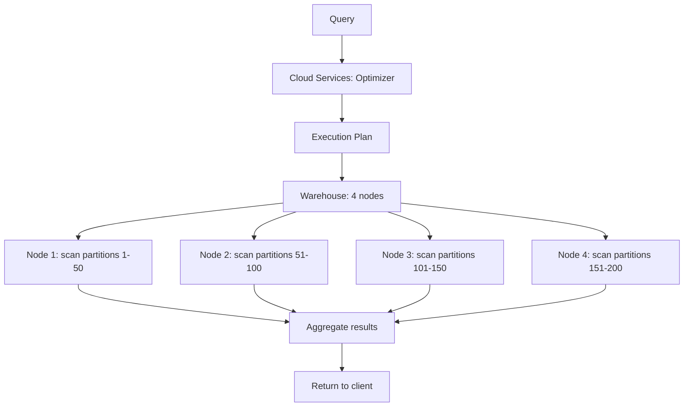

# Snowflake Architecture — Senior-Level Deep Dive

## Micro-Partition Internals

### How Data Is Stored

Each micro-partition is a PAX-format (Partition Attributes Across) file in cloud object storage:

```
Micro-partition file structure:
├── Header (metadata: row count, column stats)
├── Column 1 data (compressed, encoded)
│   ├── Dictionary encoding (for low-cardinality)
│   ├── Run-length encoding (for repeated values)
│   └── Or raw compressed data
├── Column 2 data (compressed, encoded)
├── ...
└── Column N data
```

**Key properties:**
- 50-500 MB compressed per partition (Snowflake chooses automatically)
- ~16MB uncompressed per column section (allows parallel decompression)
- Each column is independently compressed with the best algorithm for its data type
- Min/max and distinct count statistics stored in cloud services metadata

### Partition Pruning in Detail

```sql
-- Table: fact_sales, 10 TB, 200K micro-partitions
-- Clustering: natural on sale_date (loaded chronologically)

SELECT SUM(amount)
FROM fact_sales
WHERE sale_date = '2024-01-15'
  AND store_id = 42;

-- Query profile shows:
-- Partitions total: 200,000
-- Partitions scanned: 12 (0.006%)
-- Bytes scanned: 200 MB out of 10 TB

-- WHY so few partitions?
-- 1. sale_date='2024-01-15' prunes to ~550 partitions (daily data)
-- 2. store_id=42 prunes those further (only 12 have store_id=42 in their range)
```

### Viewing Partition Statistics

```sql
-- Check how well a column prunes
SELECT SYSTEM$CLUSTERING_INFORMATION('fact_sales', '(sale_date)');
-- Returns: total_partition_count, average_depth, average_overlap

-- Query profile (in Snowflake UI): shows partitions scanned vs total
-- If scanning >10% of partitions on filtered queries → consider clustering
```

---

## Query Execution Engine

### Multi-Cluster Architecture Within a Warehouse



**What this shows:**
- A LARGE warehouse has 8 nodes. Work is distributed evenly across them.
- Each node reads a subset of micro-partitions from cloud storage.
- Nodes process data in parallel, then combine results.
- Doubling warehouse size = doubling nodes = ~halving query time.

### Spilling to Disk

When intermediate results exceed node memory (e.g., large JOINs, big GROUP BYs):

```sql
-- Check if a query spilled to disk
SELECT query_id, bytes_spilled_to_local_storage, bytes_spilled_to_remote_storage
FROM snowflake.account_usage.query_history
WHERE query_id = '<your_query_id>';
```

| Spill Type | Speed | When It Happens |
|-----------|-------|----------------|
| Local disk spill | Moderate (SSD) | Intermediate results > node memory |
| Remote storage spill | Slow (S3) | Intermediate results > local disk |

**Fix for spilling:**
1. Increase warehouse size (more memory per node)
2. Reduce data volume (add filters earlier)
3. Break query into steps with temp tables (materialized intermediate results)

---

## Multi-Cluster Warehouses (Scaling for Concurrency)

A single warehouse cluster handles queries sequentially (or with limited parallelism). Multi-cluster warehouses **scale OUT** by adding more clusters.

```sql
CREATE WAREHOUSE reporting_wh
    WAREHOUSE_SIZE = 'MEDIUM'
    MIN_CLUSTER_COUNT = 1       -- Start with 1 cluster
    MAX_CLUSTER_COUNT = 6       -- Scale up to 6 clusters
    SCALING_POLICY = 'STANDARD' -- Add cluster when queue forms
    AUTO_SUSPEND = 120;
```

**Scaling policies:**

| Policy | Behavior | Use Case |
|--------|----------|----------|
| STANDARD | Add cluster when queries queue for 20+ seconds | General use |
| ECONOMY | Add cluster when queue is sustained for 6+ minutes | Cost-sensitive |

**How it works:**
- 10 users send queries simultaneously to a size-M warehouse
- Cluster 1 handles first 3-4 queries
- Remaining queries queue → Snowflake spins up Cluster 2 (within seconds)
- More queuing → Cluster 3, 4, etc. (up to MAX_CLUSTER_COUNT)
- When load decreases, extra clusters suspend automatically

> **Key distinction:** Scaling UP (larger size) = faster individual queries. Scaling OUT (more clusters) = more concurrent queries at the same speed.

---

## Transaction Model and Concurrency

Snowflake uses **MVCC (Multi-Version Concurrency Control)** with snapshot isolation:

- Readers never block writers
- Writers never block readers
- Each transaction sees a consistent snapshot of data
- Conflicts only occur when two transactions modify the same micro-partitions

```sql
-- Session A: reading (long analytical query)
SELECT SUM(amount) FROM fact_sales; -- Takes 5 minutes
-- This query sees a SNAPSHOT of data as of when it started

-- Session B: writing (while Session A is still running)
INSERT INTO fact_sales VALUES (...); -- Succeeds immediately
-- Creates new micro-partitions (doesn't modify old ones)

-- Session A's query is NOT affected by Session B's INSERT
-- (snapshot isolation: A sees pre-B data)
```

**Write conflicts:**
```sql
-- Session A: UPDATE fact_sales SET status = 'X' WHERE id = 1;
-- Session B: UPDATE fact_sales SET status = 'Y' WHERE id = 1;
-- One will succeed, the other will get: "Transaction conflict detected"
-- Solution: retry the failed transaction
```

---

## Query Profile Analysis

The **Query Profile** (in Snowflake UI) is your primary performance debugging tool:

### Key Metrics to Check

| Metric | Good Value | Problem Indicator |
|--------|-----------|-------------------|
| Partitions Scanned / Total | < 5% | > 30% = missing/bad clustering |
| Bytes Spilled to Local | 0 | > 0 = warehouse too small |
| Bytes Spilled to Remote | 0 | > 0 = seriously undersized |
| Percentage Scanned from Cache | High | Low = first-time query, expected |
| Rows Produced vs Processed | Similar | Huge gap = wasteful scan |

### Reading the Query Profile Tree

```
Query Plan Operators (top to bottom):
1. Result             → Final output to client
2. Aggregate         → GROUP BY computation
3. InnerJoin (hash)  → Hash join between tables
4. TableScan (pruning) → Reading from storage with partition pruning
   └── "Partitions scanned: 12 of 200,000"  ← GREAT pruning
   └── "Bytes scanned: 200 MB"
```

**Red flags in the profile:**
- `CartesianJoin` → Accidental cross join (usually a bug)
- `Sort` on huge data → Missing clustering or ORDER BY on large result
- `Spilling` → Need bigger warehouse or query optimization

---

## Snowflake vs Competitors — Architecture Comparison

| Feature | Snowflake | Redshift | BigQuery | Databricks |
|---------|-----------|----------|----------|-----------|
| Compute-storage separation | Full | Partial (RA3 nodes) | Full | Full |
| Auto-suspend compute | Yes | No (always running) | Yes (serverless) | Yes |
| Storage format | Proprietary columnar | Redshift blocks | Capacitor | Delta Lake (Parquet) |
| Concurrency scaling | Multi-cluster WH | Concurrency scaling | Auto (serverless) | Auto (serverless SQL) |
| Semi-structured data | Native (VARIANT) | Via Spectrum | Native (STRUCT) | Native (Spark) |
| Time Travel | Up to 90 days | Snapshots only | 7 days | Unlimited (Delta) |
| Zero-copy clone | Yes | No | No | Yes (Delta) |
| Data sharing | Native (no copy) | Via S3 | Authorized views | Delta Sharing |

---

## Performance Tuning Checklist

| Check | How | Action if Bad |
|-------|-----|---------------|
| Partition pruning effectiveness | Query Profile → Partitions Scanned % | Add clustering key on filter columns |
| Spilling | Query Profile → Bytes Spilled | Increase warehouse size |
| Queue time | Query History → Queued time | Enable multi-cluster or increase size |
| Expensive JOINs | Profile → Join operator bytes | Filter earlier, use smaller dimension |
| Full table scans | Profile → Scan all partitions | Add WHERE clause or clustering |
| Repeated expensive queries | Same SQL pattern daily | Create materialized view |
| Warehouse idle time | Account Usage → WH credit usage | Reduce auto-suspend timeout |

---

## Interview Tips

> **Tip 1:** "How would you troubleshoot a slow Snowflake query?" — "First, I check the Query Profile: (1) How many partitions were scanned vs total? If >10%, I need better clustering or filters. (2) Is there disk spilling? If yes, increase warehouse size. (3) Is there excessive queuing? Add multi-cluster scaling. (4) What's the most expensive operator in the plan?"

> **Tip 2:** "Explain how Snowflake handles concurrency" — "Multi-cluster warehouses scale out automatically when queries queue up (adds more compute clusters). Plus MVCC ensures readers never block writers — each query sees a consistent snapshot. Different workloads (ETL vs analytics) should use separate warehouses entirely."

> **Tip 3:** "How would you migrate from Redshift to Snowflake?" — "Key differences: (1) Remove DISTKEY/SORTKEY DDL — Snowflake handles distribution automatically. (2) Replace WLM/queues with separate virtual warehouses per workload. (3) Replace VACUUM/ANALYZE — Snowflake does this automatically. (4) Convert external tables from Spectrum to Snowflake external tables. (5) Replace stored procedures from PL/pgSQL to Snowflake Scripting or JavaScript."

## ⚡ Cheat Sheet

**Snowflake architecture layers**
```
Cloud Services:   metadata, optimizer, access control, query planning
Virtual Warehouse: compute (T-shirt sizes: XS to 6XL); auto-suspend + auto-resume
Storage:          columnar Parquet on S3/Blob/GCS; billed separately from compute
```

**Virtual warehouse management**
```sql
CREATE WAREHOUSE analytics_wh WITH WAREHOUSE_SIZE='MEDIUM'
  AUTO_SUSPEND=60 AUTO_RESUME=TRUE MAX_CLUSTER_COUNT=3 MIN_CLUSTER_COUNT=1
  SCALING_POLICY='ECONOMY';  -- or STANDARD
ALTER WAREHOUSE analytics_wh SUSPEND;
ALTER WAREHOUSE analytics_wh SET WAREHOUSE_SIZE='LARGE';
```

**Time travel**
```sql
SELECT * FROM orders AT (OFFSET => -60*60);                          -- 1 hour ago
SELECT * FROM orders AT (TIMESTAMP => '2024-01-15 08:00:00'::TIMESTAMP);
SELECT * FROM orders BEFORE (STATEMENT => '8e5d0ca9-005e-44e6-b858-a8f5b37c5726');
-- Restore from time travel
CREATE TABLE orders_restored CLONE orders AT (OFFSET => -3600);
-- Default retention: 1 day (standard), up to 90 days (enterprise)
```

**Streams and Tasks**
```sql
-- Stream: CDC on a table
CREATE STREAM orders_stream ON TABLE orders;
SELECT * FROM orders_stream;  -- METADATA$ACTION, METADATA$ISUPDATE, METADATA$ROW_ID

-- Task: scheduled or triggered compute
CREATE TASK process_orders
  WAREHOUSE = 'etl_wh'
  SCHEDULE = '5 MINUTE'
  WHEN SYSTEM$STREAM_HAS_DATA('orders_stream')
AS
  INSERT INTO gold.orders SELECT * FROM orders_stream WHERE METADATA$ACTION = 'INSERT';

ALTER TASK process_orders RESUME;
```

**Dynamic Tables**
```sql
CREATE DYNAMIC TABLE gold.orders_summary
  TARGET_LAG = '5 minutes'
  WAREHOUSE = etl_wh
AS
  SELECT region, SUM(amount) AS total FROM silver.orders GROUP BY region;
-- Snowflake automatically refreshes when source changes; no task/stream needed
```

**Snowpipe (continuous ingestion)**
```sql
CREATE PIPE orders_pipe AUTO_INGEST=TRUE AS
  COPY INTO orders FROM @orders_stage FILE_FORMAT=(TYPE='CSV');
-- S3 event notification → SQS → Snowpipe auto-triggers COPY on new files
-- Latency: ~1 minute; cost: per-file compute credits
```

**Data sharing**
```sql
CREATE SHARE sales_share;
GRANT USAGE ON DATABASE prod TO SHARE sales_share;
GRANT SELECT ON TABLE prod.gold.orders TO SHARE sales_share;
ALTER SHARE sales_share ADD ACCOUNTS = partner_account_id;
-- Consumer sees a read-only database — no data copy, no egress charges
```

**Stored procedures (JavaScript/Python/Snowflake Scripting)**
```sql
CREATE OR REPLACE PROCEDURE load_and_validate(p_date STRING)
RETURNS STRING LANGUAGE PYTHON RUNTIME_VERSION='3.10'
PACKAGES=('snowflake-snowpark-python') HANDLER='run'
AS $$
def run(session, p_date):
    df = session.table("staging.orders").filter(f"order_date = '{p_date}'")
    if df.count() == 0:
        return f"No data for {p_date}"
    df.write.save_as_table("gold.orders", mode="append")
    return f"Loaded {df.count()} rows"
$$;
```

**External tables**
```sql
CREATE EXTERNAL TABLE ext_orders (
    order_id NUMBER AS (VALUE:c1::NUMBER),
    amount   FLOAT  AS (VALUE:c3::FLOAT)
) WITH LOCATION=@orders_stage FILE_FORMAT=(TYPE='PARQUET')
AUTO_REFRESH=TRUE;
-- Reads directly from S3; no data copy to Snowflake storage
```

**Materialized views**
```sql
CREATE MATERIALIZED VIEW mv_orders_by_region AS
  SELECT region, SUM(amount) AS total FROM orders GROUP BY region;
-- Auto-incremental refresh by Snowflake when base table changes
-- Best for: complex aggregations queried frequently; available in Enterprise+
```

**Key interview points**
- Micro-partitions: 50-500 MB compressed Parquet; automatic clustering per load order
- Cluster keys: explicit clustering on high-cardinality columns (date, customer_id)
- Query profile: check for partition pruning, spillage to disk, heavy operators
- Zero-copy clone: CREATE TABLE dev_orders CLONE gold.orders — instant, no storage cost
- Fail-safe: 7-day recovery window after time travel expires (Snowflake internal only)
