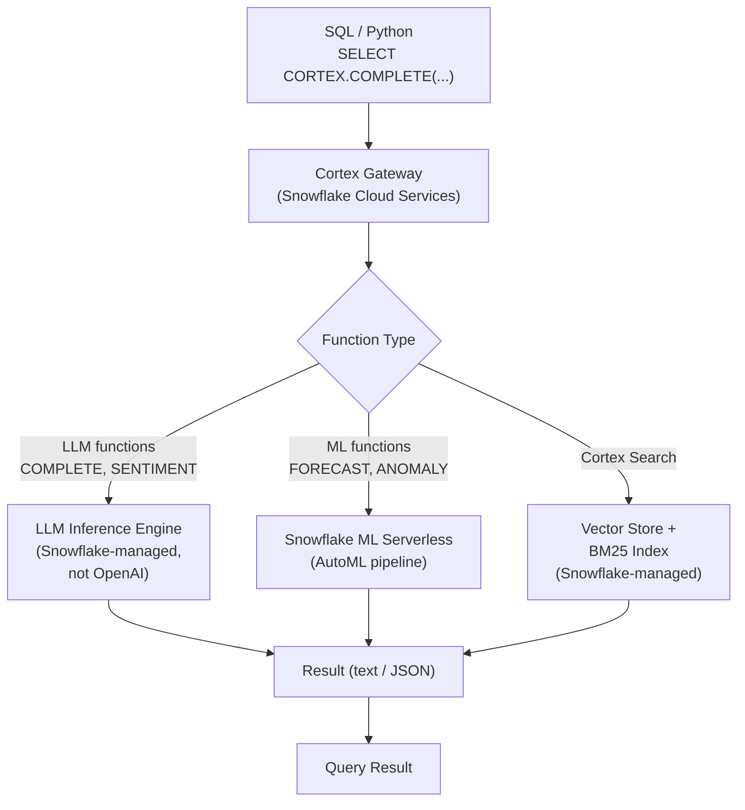

# Snowflake Cortex AI — Senior Deep Dive

## Cortex Architecture: How It Works



**Key point:** All model inference runs inside Snowflake's infrastructure. Your data is encrypted, never sent to external model providers (e.g., OpenAI, Anthropic) — even though the underlying model weights may be open-source (LLaMA, Mistral) or proprietary (Arctic).

---

## Designing Production RAG Pipelines

### Chunking Strategy

How you split documents dramatically impacts retrieval quality:

```python
from snowflake.snowpark import Session
from snowflake.snowpark.functions import col, lit, regexp_replace, length

session = Session.builder.configs(conn).create()

# Strategy: recursive character splitting with overlap
def chunk_text(text: str, chunk_size: int = 512, overlap: int = 64) -> list[dict]:
    chunks = []
    start = 0
    while start < len(text):
        end = start + chunk_size
        chunk = text[start:end]
        # Don't split mid-sentence
        if end < len(text):
            last_period = chunk.rfind('. ')
            if last_period > chunk_size * 0.5:
                end = start + last_period + 1
                chunk = text[start:end]
        chunks.append({"text": chunk, "start_char": start, "end_char": end})
        start = end - overlap
    return chunks

# Register as UDTF
from snowflake.snowpark.functions import udf
from snowflake.snowpark.types import StringType, IntegerType, StructType, StructField, ArrayType

@session.udtf.register(
    output_schema=StructType([
        StructField("chunk_text", StringType()),
        StructField("start_char", IntegerType()),
        StructField("end_char", IntegerType()),
    ]),
    is_permanent=True,
    stage_location="@code_stage",
    name="chunk_document"
)
class DocumentChunker:
    def process(self, text: str, chunk_size: int, overlap: int):
        chunks = chunk_text(text, chunk_size, overlap)
        for c in chunks:
            yield (c["text"], c["start_char"], c["end_char"])
```

```sql
-- Chunk all documents and store
INSERT INTO document_chunks (doc_id, chunk_index, chunk_text)
SELECT
    d.doc_id,
    ROW_NUMBER() OVER (PARTITION BY d.doc_id ORDER BY c.start_char) AS chunk_index,
    c.chunk_text
FROM documents d,
TABLE(chunk_document(d.content, 512, 64)) c;

-- Create Cortex Search on chunks
CREATE CORTEX SEARCH SERVICE doc_chunk_search
    ON chunk_text
    WAREHOUSE = search_wh
    TARGET_LAG = '1 hour'
    AS SELECT doc_id, chunk_index, chunk_text, doc_type, created_at FROM document_chunks;
```

---

## LLM Output Reliability: Structured Output

Raw LLM text is hard to parse. Force structured JSON output:

```sql
-- Force JSON output with schema in the prompt
SELECT
    ticket_id,
    PARSE_JSON(
        SNOWFLAKE.CORTEX.COMPLETE(
            'mistral-7b',
            CONCAT(
                'Analyze this support ticket and return ONLY a JSON object with keys: ',
                '"category" (one of: billing, technical, account, other), ',
                '"urgency" (high/medium/low), ',
                '"sentiment" (positive/neutral/negative), ',
                '"one_line_summary" (string). ',
                'Do not include any text outside the JSON.\n\nTicket: ',
                ticket_body
            )
        )
    ) AS analysis,
    TRY_PARSE_JSON(
        SNOWFLAKE.CORTEX.COMPLETE('mistral-7b', ...)
    ):category::STRING AS category    -- use TRY_ to handle parse failures
FROM support_tickets
LIMIT 100;

-- Validate output schema
SELECT
    ticket_id,
    analysis:category::STRING AS category,
    analysis:urgency::STRING AS urgency,
    CASE WHEN analysis:category IS NULL THEN 'PARSE_FAILED' ELSE 'OK' END AS status
FROM tickets_analyzed;
```

---

## Cost Governance for Cortex

Cortex LLM functions can accumulate large token costs if uncontrolled:

```sql
-- Monitor token usage by user and function
SELECT
    user_name,
    function_name,
    SUM(total_tokens) AS tokens_used,
    ROUND(SUM(total_tokens) * 0.0000008, 4) AS est_cost_usd  -- ~$0.80/1M tokens
FROM SNOWFLAKE.ACCOUNT_USAGE.CORTEX_USAGE_HISTORY
WHERE start_time >= DATE_TRUNC('month', CURRENT_DATE())
GROUP BY 1, 2
ORDER BY tokens_used DESC;

-- Set a resource monitor for serverless credits (covers ML functions, Search)
CREATE RESOURCE MONITOR cortex_guard
    WITH CREDIT_QUOTA = 500
    FREQUENCY = MONTHLY
    TRIGGERS
        ON 80 PERCENT DO NOTIFY
        ON 100 PERCENT DO SUSPEND;
```

**Cost optimization patterns:**
- Use smaller models (mistral-7b) for simple classification; reserve llama3.1-70b for complex reasoning
- Cache results for repeated identical inputs (store COMPLETE output in a table keyed by input hash)
- Filter to only call LLM functions on rows that need it — don't call SENTIMENT on all 100M rows when you only need it on new rows

```sql
-- Only call Cortex on NEW reviews (incremental pattern)
INSERT INTO reviews_analyzed (review_id, sentiment)
SELECT
    review_id,
    SNOWFLAKE.CORTEX.SENTIMENT(review_text)
FROM product_reviews
WHERE review_id NOT IN (SELECT review_id FROM reviews_analyzed);
-- Not 100M rows every day — only the delta
```

---

## Cortex Search: Production Configuration

```sql
-- Production search service configuration
CREATE CORTEX SEARCH SERVICE prod_support_search
    ON content_text
    ATTRIBUTES category, severity, product_name   -- filterable metadata fields
    WAREHOUSE = search_wh
    TARGET_LAG = '5 minutes'   -- index updates within 5 min of new data
    EMBEDDING_MODEL = 'e5-base-v2'  -- optional: specify embedding model
    AS (
        SELECT
            ticket_id,
            title,
            content_text,
            category,
            severity,
            product_name,
            created_at
        FROM support_tickets
        WHERE status != 'SPAM'
    );

-- Monitor search service status
SELECT SYSTEM$CORTEX_SEARCH_SERVICE_STATUS('prod_support_search');
```

---

## Agentic Patterns: Cortex as an AI Reasoning Layer

Cortex functions can be chained for multi-step reasoning (AI agent loops in SQL/Python):

```python
def classify_and_route_ticket(session, ticket_id: str, ticket_body: str) -> dict:
    """Multi-step AI pipeline: classify → extract → route."""

    # Step 1: Classify
    classification_result = session.sql(f"""
        SELECT PARSE_JSON(SNOWFLAKE.CORTEX.COMPLETE(
            'mistral-7b',
            'Classify this ticket. Return JSON only: {{"category": "...", "urgency": "..."}}. Ticket: {ticket_body}'
        )) AS result
    """).collect()[0]["RESULT"]

    category = classification_result.get("category", "other")
    urgency = classification_result.get("urgency", "low")

    # Step 2: Conditional — only extract entities for billing tickets
    if category == "billing":
        extraction = session.sql(f"""
            SELECT SNOWFLAKE.CORTEX.EXTRACT_ANSWER(
                '{ticket_body}',
                'What is the invoice number?'
            ) AS invoice_number
        """).collect()[0]["INVOICE_NUMBER"]
    else:
        extraction = None

    # Step 3: Log decision
    session.sql(f"""
        INSERT INTO ticket_routing_log VALUES (
            '{ticket_id}', '{category}', '{urgency}',
            '{extraction}', CURRENT_TIMESTAMP()
        )
    """).collect()

    return {"category": category, "urgency": urgency, "extracted": extraction}
```

---

## Interview Tips

> **Tip 1:** "How do you ensure LLM output quality in a production Cortex pipeline?" — "Three controls: (1) Prompt engineering — constrain output format with explicit JSON schema instruction. (2) `TRY_PARSE_JSON` — handle parse failures gracefully without crashing the query. (3) Validation layer — check that extracted values are in the expected domain (CASE WHEN category NOT IN ('billing','technical'...) THEN 'UNKNOWN'). Add a feedback loop to sample outputs and measure accuracy against labeled data."

> **Tip 2:** "How does Cortex Search handle updates to source data?" — "TARGET_LAG defines the maximum staleness of the search index. With TARGET_LAG = '1 minute', new documents are searchable within 1 minute of being inserted into the source table. Snowflake maintains the index incrementally — you don't need to rebuild it on each change. Deletions and updates are also tracked."

> **Tip 3:** "What's the trade-off between Cortex fine-tuning and prompt engineering?" — "Prompt engineering is immediate (no training cost) but requires more tokens per call and may not achieve high accuracy on specialized domains. Fine-tuning trains the model on your labeled data — higher accuracy on domain-specific tasks, lower token cost per inference (shorter prompts needed), but requires 100+ labeled examples and compute cost to train. Fine-tune when you have enough labeled data and the accuracy gain justifies the upfront investment."
