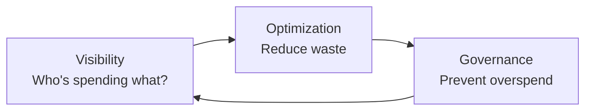

# Snowflake Cost Management — Senior Deep Dive

## FinOps Framework for Snowflake

**Three pillars:** Visibility → Optimization → Governance



### Visibility: Cost Attribution by Team

```sql
-- Tag queries with team/project metadata via query tag
ALTER SESSION SET QUERY_TAG = '{"team":"data-eng","project":"order-pipeline","env":"prod"}';

-- Query cost by team (from query tags)
SELECT
    PARSE_JSON(query_tag):team::STRING AS team,
    PARSE_JSON(query_tag):project::STRING AS project,
    SUM(TOTAL_ELAPSED_TIME) / 1000 / 3600 AS total_hours,
    COUNT(*) AS query_count,
    -- Estimate credits: elapsed_time × warehouse_size_credits_per_second
    SUM(TOTAL_ELAPSED_TIME / 1000 / 3600 * credits_per_hour) AS est_credits
FROM SNOWFLAKE.ACCOUNT_USAGE.QUERY_HISTORY q
JOIN (
    SELECT warehouse_name,
           CASE warehouse_size
               WHEN 'X-Small' THEN 1
               WHEN 'Small' THEN 2
               WHEN 'Medium' THEN 4
               WHEN 'Large' THEN 8
               WHEN 'X-Large' THEN 16
               WHEN '2X-Large' THEN 32
               ELSE 1
           END AS credits_per_hour
    FROM SNOWFLAKE.ACCOUNT_USAGE.WAREHOUSES
) w USING (warehouse_name)
WHERE q.start_time >= DATEADD('month', -1, CURRENT_TIMESTAMP())
  AND query_tag LIKE '{%'
GROUP BY 1, 2
ORDER BY est_credits DESC;
```

---

## Serverless Features: Different Cost Model

Several Snowflake features use **serverless compute** (not your virtual warehouses):

| Feature | Credit Unit | Typical Rate |
|---------|------------|-------------|
| Snowpipe | Serverless | ~1.5× XS warehouse rate |
| Automatic Clustering | Serverless | Ongoing if table changes frequently |
| Materialized View Refresh | Serverless | Per refresh |
| Search Optimization | Serverless | Per query that uses it |
| Snowpark Container Services | Serverless | CPU + memory per hour |
| Cortex AI Functions | Serverless | Per token / per row |

```sql
-- Monitor ALL serverless cost (often overlooked)
SELECT
    'Snowpipe' AS service, SUM(credits_used) AS credits
FROM SNOWFLAKE.ACCOUNT_USAGE.PIPE_USAGE_HISTORY
WHERE start_time >= DATEADD('month', -1, CURRENT_TIMESTAMP())
UNION ALL
SELECT 'Auto Clustering', SUM(credits_used)
FROM SNOWFLAKE.ACCOUNT_USAGE.AUTOMATIC_CLUSTERING_HISTORY
WHERE start_time >= DATEADD('month', -1, CURRENT_TIMESTAMP())
UNION ALL
SELECT 'MV Refresh', SUM(credits_used)
FROM SNOWFLAKE.ACCOUNT_USAGE.MATERIALIZED_VIEW_REFRESH_HISTORY
WHERE start_time >= DATEADD('month', -1, CURRENT_TIMESTAMP())
UNION ALL
SELECT 'Search Optimization', SUM(credits_used)
FROM SNOWFLAKE.ACCOUNT_USAGE.SEARCH_OPTIMIZATION_HISTORY
WHERE start_time >= DATEADD('month', -1, CURRENT_TIMESTAMP())
ORDER BY credits DESC;
```

---

## Query Acceleration Service (QAS)

For queries with long-tail execution times — offloads eligible parts to serverless:

```sql
-- Enable on a warehouse
ALTER WAREHOUSE analytics_wh SET ENABLE_QUERY_ACCELERATION = TRUE;

-- Limit QAS scale factor (cap on extra serverless spend)
ALTER WAREHOUSE analytics_wh SET QUERY_ACCELERATION_MAX_SCALE_FACTOR = 4;
-- 4 = can use up to 4x the warehouse size in serverless acceleration

-- Check which queries used QAS
SELECT query_id, query_text, query_acceleration_partitions_scanned,
       partitions_scanned, total_elapsed_time
FROM SNOWFLAKE.ACCOUNT_USAGE.QUERY_HISTORY
WHERE query_acceleration_partitions_scanned > 0
  AND start_time >= DATEADD('day', -7, CURRENT_TIMESTAMP())
ORDER BY total_elapsed_time DESC;
```

**Cost trade-off:** QAS adds serverless cost per query that uses it, but reduces wall-clock time (warehouse runs shorter = fewer warehouse credits). Net positive when QAS savings > QAS cost.

---

## Cost Allocation: Chargeback Model

```sql
-- Create a chargeback report by department (via warehouse naming convention)
-- Convention: DEPT_USECASE_WH (e.g., MARKETING_BI_WH, DATAENG_ETL_WH)

SELECT
    SPLIT_PART(warehouse_name, '_', 1) AS department,
    SUM(credits_used) AS credits,
    ROUND(SUM(credits_used) * 3.5, 2) AS cost_usd  -- $3.5/credit for Business Critical
FROM SNOWFLAKE.ACCOUNT_USAGE.WAREHOUSE_METERING_HISTORY
WHERE start_time >= DATE_TRUNC('month', CURRENT_DATE())
GROUP BY 1
ORDER BY credits DESC;

-- Chargeback including storage (allocate by bytes owned)
SELECT
    table_owner AS owner_role,
    ROUND(SUM(active_bytes + time_travel_bytes + failsafe_bytes) / 1e12 * 23, 2) AS storage_cost_usd
FROM SNOWFLAKE.ACCOUNT_USAGE.TABLE_STORAGE_METRICS
WHERE deleted = FALSE
GROUP BY 1
ORDER BY storage_cost_usd DESC;
```

---

## Cost Anomaly Detection

```sql
-- Alert: warehouse spending > 2x its 7-day average in last hour
WITH hourly_credits AS (
    SELECT
        warehouse_name,
        DATE_TRUNC('hour', start_time) AS hour,
        SUM(credits_used) AS credits
    FROM SNOWFLAKE.ACCOUNT_USAGE.WAREHOUSE_METERING_HISTORY
    WHERE start_time >= DATEADD('day', -8, CURRENT_TIMESTAMP())
    GROUP BY 1, 2
),
stats AS (
    SELECT warehouse_name,
           AVG(credits) AS avg_hourly,
           STDDEV(credits) AS std_hourly
    FROM hourly_credits
    WHERE hour < DATE_TRUNC('hour', CURRENT_TIMESTAMP())  -- exclude current incomplete hour
      AND hour >= DATEADD('day', -7, CURRENT_TIMESTAMP())
    GROUP BY 1
),
current_hour AS (
    SELECT warehouse_name, credits
    FROM hourly_credits
    WHERE hour = DATE_TRUNC('hour', CURRENT_TIMESTAMP())
)
SELECT
    c.warehouse_name,
    c.credits AS current_hour_credits,
    s.avg_hourly,
    ROUND((c.credits - s.avg_hourly) / NULLIF(s.std_hourly, 0), 1) AS z_score
FROM current_hour c
JOIN stats s ON c.warehouse_name = s.warehouse_name
WHERE c.credits > s.avg_hourly * 2      -- more than 2x average
ORDER BY z_score DESC;
```

---

## Storage Optimization at Scale

```sql
-- Find tables with highest fail-safe costs (often staging tables that should be TRANSIENT)
SELECT
    table_name,
    table_schema,
    ROUND(active_bytes / 1e9, 2) AS active_gb,
    ROUND(failsafe_bytes / 1e9, 2) AS failsafe_gb,
    ROUND(time_travel_bytes / 1e9, 2) AS time_travel_gb,
    table_type
FROM SNOWFLAKE.ACCOUNT_USAGE.TABLE_STORAGE_METRICS
WHERE failsafe_bytes > 1e10  -- > 10 GB in fail-safe
  AND deleted = FALSE
ORDER BY failsafe_bytes DESC;

-- Convert wasteful staging tables to TRANSIENT (no fail-safe)
-- (Must recreate — can't alter existing table type)
CREATE TRANSIENT TABLE staging.orders_raw_v2 CLONE staging.orders_raw;
DROP TABLE staging.orders_raw;
ALTER TABLE staging.orders_raw_v2 RENAME TO staging.orders_raw;

-- Reduce time-travel on large, frequently-updated tables
ALTER TABLE fact_events SET DATA_RETENTION_TIME_IN_DAYS = 1;  -- was 7
-- Saves 6 days of time-travel storage on a large table
```

---

## Snowflake Budgets (2024+)

```sql
-- Create a budget for a specific warehouse group
CREATE BUDGET engineering_budget
    WITH CREDIT_QUOTA = 10000
    FREQUENCY = MONTHLY
    BUDGET_FILTER = (WAREHOUSE_LIST = ('ETL_WH', 'TRANSFORM_WH', 'SYSTEM_WH'));

-- View current spend against budget
SELECT * FROM SNOWFLAKE.LOCAL.ACCOUNT_ROOT_BUDGET!INFORMATION();
```

---

## Interview Tips

> **Tip 1:** "How do you implement chargeback in Snowflake?" — "Name warehouses with team prefixes (MARKETING_BI_WH, DATAENG_ETL_WH), then aggregate WAREHOUSE_METERING_HISTORY by the first segment of the name. Add storage chargeback via TABLE_STORAGE_METRICS grouped by table_owner role. Export monthly to finance as a CSV — teams are billed for their warehouse time + data they own."

> **Tip 2:** "What's the most overlooked Snowflake cost?" — "Serverless features: Automatic Clustering, Materialized View refresh, and Snowpipe. These appear in separate ACCOUNT_USAGE views and aren't in the main warehouse cost report. A table with automatic clustering and frequent DML can accumulate hundreds of credits/month in clustering alone without anyone noticing."

> **Tip 3:** "How would you reduce Snowflake costs by 30% in 2 weeks?" — "Audit WAREHOUSE_METERING_HISTORY to find idle time (warehouse running but no queries). Set AUTO_SUSPEND = 60 on all warehouses. Check QUERY_HISTORY for high PARTITIONS_SCANNED / PARTITIONS_TOTAL ratios — add clustering keys. Review TABLE_STORAGE_METRICS for large staging tables and convert to TRANSIENT. These three steps alone often cut 30-50% from the bill."
