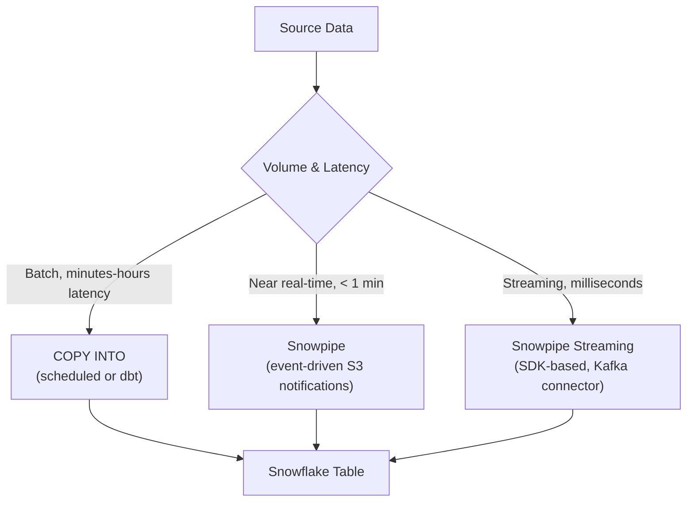

# Snowflake Data Loading & Stages — Senior Deep Dive

## Loading Architecture Decisions



**Choosing:**
- **COPY INTO (batch):** Simple, predictable cost, sufficient for most ETL use cases
- **Snowpipe:** Files land in S3 → SQS event → Snowpipe loads automatically. ~1 min latency
- **Snowpipe Streaming:** Row-level ingestion via API (Kafka Connector for Snowflake). Sub-second latency, higher cost

---

## Snowpipe: Event-Driven Loading Architecture

```sql
-- 1. Create pipe with auto_ingest (S3 → SQS → Snowpipe)
CREATE PIPE orders_pipe
    AUTO_INGEST = TRUE
AS
COPY INTO orders
FROM @s3_stage/orders/
FILE_FORMAT = (FORMAT_NAME = 'csv_format');

-- 2. Get the SQS ARN — configure this in S3 bucket event notification
SHOW PIPES;
-- NOTIFICATION_CHANNEL column = SQS ARN to add to S3 event notification

-- 3. Monitor pipe status
SELECT SYSTEM$PIPE_STATUS('orders_pipe');
-- Returns: executionState, pendingFileCount, lastIngestedTimestamp, etc.

-- 4. Manually trigger (if S3 notifications aren't configured, or for backfill)
ALTER PIPE orders_pipe REFRESH PREFIX='orders/2024-01/';
```

**Snowpipe guarantees:**
- At-least-once delivery (duplicates possible — design tables to be idempotent)
- Files tracked for 14 days (re-queued files within window are deduplicated)

---

## Idempotency and Deduplication Strategies

Snowpipe can deliver duplicates — design for it:

```sql
-- Strategy 1: Natural key deduplication with MERGE
MERGE INTO orders AS target
USING (
    SELECT DISTINCT ON (order_id)
        order_id, customer_id, amount, created_at
    FROM staging.orders_raw
    ORDER BY order_id, loaded_at DESC
) AS source
ON target.order_id = source.order_id
WHEN MATCHED THEN
    UPDATE SET amount = source.amount, updated_at = CURRENT_TIMESTAMP()
WHEN NOT MATCHED THEN
    INSERT (order_id, customer_id, amount, created_at)
    VALUES (source.order_id, source.customer_id, source.amount, source.created_at);

-- Strategy 2: Streams + Tasks for exactly-once semantics
-- Stream tracks new rows in staging
CREATE STREAM orders_stream ON TABLE staging.orders_raw APPEND_ONLY = TRUE;

CREATE TASK orders_dedupe_task
    WAREHOUSE = etl_wh
    SCHEDULE = '1 minute'
AS
MERGE INTO orders t
USING (
    SELECT order_id, customer_id, amount, ROW_NUMBER() OVER (PARTITION BY order_id ORDER BY _metadata_timestamp DESC) AS rn
    FROM orders_stream WHERE rn = 1
) s ON t.order_id = s.order_id
WHEN MATCHED THEN UPDATE SET ...
WHEN NOT MATCHED THEN INSERT ...;
```

---

## Schema Evolution in Loading Pipelines

**Problem:** Source schema changes (new columns, type changes) break COPY INTO.

```sql
-- Option 1: VARIANT column for schema-on-read
-- Load everything into raw VARIANT, query selectively
-- No COPY INTO schema changes ever needed

-- Option 2: ALLOW_COLUMN_MISMATCH = TRUE (Parquet/ORC/Avro)
COPY INTO orders
FROM @s3_stage
FILE_FORMAT = (TYPE = 'PARQUET')
MATCH_BY_COLUMN_NAME = 'CASE_INSENSITIVE'
ALLOW_COLUMN_MISMATCH = TRUE;   -- extra source columns ignored; missing mapped to NULL

-- Option 3: EVOLVE_SCHEMA = TRUE (Snowflake 2024+)
-- Automatically adds new columns from Parquet/Avro to the target table
COPY INTO orders
FROM @s3_stage
FILE_FORMAT = (TYPE = 'PARQUET')
MATCH_BY_COLUMN_NAME = 'CASE_INSENSITIVE'
ENABLE_SCHEMA_EVOLUTION = TRUE;   -- ALTER TABLE is done automatically

-- Option 4: Explicit version columns
-- Add _schema_version INT to track which columns are valid for each row
```

---

## Large-Scale Loading: Performance Tuning

**Rule of thumb:** Warehouse size ↔ number of files to load in parallel

```
XS = 1 server   → process ~1 file at a time
S  = 2 servers  → ~2 files
M  = 4 servers  → ~4 files
L  = 8 servers  → ~8 files
XL = 16 servers → ~16 files
```

**Optimal file sizing:**
```
Target: 100–250 MB per file (compressed)
Too small (< 10 MB): high overhead, slow
Too large (> 500 MB): can't parallelize within the file
```

```sql
-- Pre-split files before loading (in Spark or S3 tools)
-- Or split large files in Snowflake:
COPY INTO @output_stage
FROM (SELECT * FROM large_table)
FILE_FORMAT = (TYPE = 'PARQUET')
MAX_FILE_SIZE = 262144000;  -- 250 MB per output file
```

**Clustering and loading order:**

```sql
-- If loading ordered data into a clustered table, maintain sort order in files
-- Snowflake colocates data in micro-partitions — loading time-ordered data
-- into a time-clustered table is naturally efficient

-- After bulk load, check if clustering is still healthy
SELECT SYSTEM$CLUSTERING_INFORMATION('fact_sales', '(sale_date)');
```

---

## Kafka Connector for Snowflake (Snowpipe Streaming)

Production Kafka → Snowflake pattern:

```
Kafka Topic (raw events)
    → Kafka Connect (Snowflake Connector)
    → Snowpipe Streaming API
    → Snowflake Staging Table (rows with _metadata columns)
    → Stream + Task → Final Table
```

```sql
-- What Kafka connector creates automatically:
-- Table with RECORD_CONTENT VARIANT and _metadata columns
-- _snowpipe_streaming_client_sequence_number
-- _snowpipe_streaming_offset_token
-- _ingested_at TIMESTAMP

-- Build deduplication on top
CREATE VIEW v_dedupe_events AS
SELECT DISTINCT ON (record_content:event_id::STRING)
    record_content:event_id::STRING   AS event_id,
    record_content:user_id::INT       AS user_id,
    record_content:event_type::STRING AS event_type,
    _ingested_at
FROM kafka_raw_events
ORDER BY record_content:event_id::STRING, _ingested_at DESC;
```

---

## Data Validation Post-Load

```sql
-- Row count check: compare source manifest vs loaded rows
CREATE TABLE load_audit (
    load_id    VARCHAR,
    table_name VARCHAR,
    file_name  VARCHAR,
    expected_rows INT,
    loaded_rows   INT,
    load_ts    TIMESTAMP DEFAULT CURRENT_TIMESTAMP()
);

-- After COPY INTO, insert audit record
INSERT INTO load_audit (load_id, table_name, file_name, loaded_rows)
SELECT LAST_QUERY_ID(), 'orders', file_name, rows_loaded
FROM TABLE(INFORMATION_SCHEMA.COPY_HISTORY(TABLE_NAME=>'ORDERS', START_TIME=>DATEADD('minute',-5,CURRENT_TIMESTAMP())));

-- Null rate check post-load
SELECT
    COUNT(*) AS total_rows,
    COUNT(order_id) AS non_null_ids,
    COUNT(amount) AS non_null_amounts,
    SUM(CASE WHEN amount <= 0 THEN 1 ELSE 0 END) AS negative_amounts
FROM orders
WHERE loaded_at >= DATEADD('minute', -5, CURRENT_TIMESTAMP());
```

---

## Interview Tips

> **Tip 1:** "How do you handle late-arriving files in a Snowpipe pipeline?" — "Snowpipe's file history window is 14 days — files loaded within that window for the same path are deduplicated. For files older than 14 days, use `ALTER PIPE ... REFRESH` with the specific prefix. Downstream, design tables with idempotent MERGE rather than INSERT to handle late arrivals safely."

> **Tip 2:** "What's the cost model for Snowpipe vs COPY INTO?" — "COPY INTO uses your virtual warehouse's credits. Snowpipe uses serverless credits (~1.5x the per-second rate of an XS warehouse), billed per file processed. For high file volume, Snowpipe can be more expensive than batch COPY INTO. Model it: if files arrive every 5 minutes, a scheduled COPY INTO task on XS may be cheaper."

> **Tip 3:** "How do you achieve schema evolution without breaking downstream consumers?" — "`ENABLE_SCHEMA_EVOLUTION = TRUE` adds new columns automatically. For type changes (breaking), maintain a raw VARIANT column alongside typed columns — transform in a view. Consumers read the view, which you update independently of the table structure. Source of truth is always the raw VARIANT."
