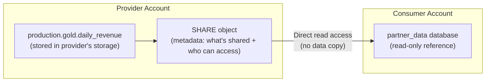

# Snowflake Data Sharing — Fundamentals


## 🎯 Analogy

Think of Snowflake Data Sharing like sharing a live Google Doc: the provider shares a database (no data copy, no ETL), the consumer queries it in real time from their own Snowflake account — zero data movement, always fresh.

---
## What Is Snowflake Data Sharing?

Data Sharing lets you **share live data with other Snowflake accounts** without copying, moving, or transferring data. Consumers query your data directly — always seeing the latest version.

```sql
-- Provider: share a table with another account
CREATE SHARE sales_analytics;
GRANT USAGE ON DATABASE production TO SHARE sales_analytics;
GRANT USAGE ON SCHEMA production.gold TO SHARE sales_analytics;
GRANT SELECT ON TABLE production.gold.daily_revenue TO SHARE sales_analytics;

-- Add consumer account:
ALTER SHARE sales_analytics ADD ACCOUNTS = 'partner_account_xyz';

-- Consumer: access the shared data
CREATE DATABASE partner_data FROM SHARE provider_account.sales_analytics;
SELECT * FROM partner_data.gold.daily_revenue;
-- Reads directly from provider's storage — ZERO data copy!
```

> **Key Insight for DE:** Shared data has NO storage cost for consumers (reads from provider's storage). The provider pays storage; consumers pay only for their compute to query it. This eliminates expensive ETL-to-copy-data patterns.

---

## How Data Sharing Works



The consumer's database is a **read-only pointer** to the provider's storage. When the provider updates data, consumers immediately see the changes. Zero latency, zero ETL, zero storage duplication.

---

## Key Concepts

| Concept | Description |
|---------|-------------|
| **Share** | Named object containing metadata about what's shared |
| **Provider** | Account that owns and shares the data |
| **Consumer** | Account that accesses shared data (read-only) |
| **Reader Account** | Special account Snowflake creates for non-Snowflake consumers |
| **Listing** | Marketplace entry (public or private) for discoverability |

---

## Creating and Managing Shares

```sql
-- PROVIDER SIDE:

-- Step 1: Create a share
CREATE SHARE analytics_share
    COMMENT = 'Daily analytics metrics for partner teams';

-- Step 2: Grant objects to the share
GRANT USAGE ON DATABASE production TO SHARE analytics_share;
GRANT USAGE ON SCHEMA production.gold TO SHARE analytics_share;
GRANT SELECT ON TABLE production.gold.daily_revenue TO SHARE analytics_share;
GRANT SELECT ON TABLE production.gold.customer_segments TO SHARE analytics_share;
-- Can share: tables, secure views, secure UDFs

-- Step 3: Add consumer accounts
ALTER SHARE analytics_share ADD ACCOUNTS = 'consumer_account_1', 'consumer_account_2';

-- Step 4: Verify
SHOW SHARES;
DESCRIBE SHARE analytics_share;
```

```sql
-- CONSUMER SIDE:

-- Step 1: See available shares
SHOW SHARES;  -- Lists shares offered to this account

-- Step 2: Create a database from the share
CREATE DATABASE analytics_from_provider FROM SHARE provider_org.analytics_share;

-- Step 3: Query shared data (read-only!)
SELECT * FROM analytics_from_provider.gold.daily_revenue
WHERE revenue_date >= '2024-01-01';
-- Data is LIVE — always reflects provider's latest version!

-- Step 4: Grant access to users
GRANT USAGE ON DATABASE analytics_from_provider TO ROLE analysts;
GRANT SELECT ON ALL TABLES IN SCHEMA analytics_from_provider.gold TO ROLE analysts;
```

---

## Secure Views (Controlled Sharing)

Share only what consumers should see — filter rows/columns with secure views:

```sql
-- Provider creates a secure view (hides internal logic):
CREATE SECURE VIEW production.shared.partner_orders AS
    SELECT order_id, order_date, amount, product_category, region
    -- Excludes: customer_id, internal_notes, cost_price (sensitive!)
    FROM production.gold.orders
    WHERE region = 'US';  -- Only US data for this partner
-- SECURE: consumers can't see the view definition (SHOW CREATE VIEW is blocked)

-- Share the view (not the underlying table):
GRANT SELECT ON VIEW production.shared.partner_orders TO SHARE partner_share;

-- Consumer queries the view:
SELECT * FROM partner_data.shared.partner_orders;
-- They only see: US orders with selected columns
-- They can't see: other regions, sensitive columns, or the filtering logic
```

---

## Sharing with Non-Snowflake Users (Reader Accounts)

```sql
-- For consumers who DON'T have a Snowflake account:
-- Provider creates a "Reader Account" (managed by provider)

-- Step 1: Create reader account
CREATE MANAGED ACCOUNT partner_reader
    ADMIN_NAME = 'partner_admin'
    ADMIN_PASSWORD = 'SecurePass123!'
    TYPE = READER;

-- Step 2: Share data with the reader account
ALTER SHARE analytics_share ADD ACCOUNTS = 'partner_reader';

-- The reader account:
-- Can query shared data (using compute YOU provide or they configure)
-- Cannot create their own tables (read-only)
-- YOU (provider) pay for their compute (unless they have their own warehouse)
-- Good for: partners who don't have Snowflake, small data consumers
```

---

## Snowflake Marketplace

The Marketplace is a **public catalog** where providers list datasets for any Snowflake customer to discover and access:

```sql
-- PROVIDER: list data on Marketplace
-- Done via Snowflake UI: Data → Provider Studio → Create Listing
-- Set: name, description, sample query, pricing (free or paid), regions

-- CONSUMER: get data from Marketplace
-- UI: Data → Marketplace → Search → "Get" → creates database in your account
-- Or programmatic: CREATE DATABASE weather_data FROM LISTING 'weather_provider.daily_forecast';

-- Example Marketplace datasets:
-- Weather data, financial market data, COVID statistics, demographics
-- Geo-spatial data, industry benchmarks, economic indicators
```

---

## What Can Be Shared

| Object | Shareable? | Notes |
|--------|-----------|-------|
| Tables | ✅ | Direct table sharing |
| Secure Views | ✅ | Recommended (filter rows/columns) |
| Secure UDFs | ✅ | Share custom functions |
| Schemas | ✅ (via GRANT USAGE) | Share all objects in schema |
| Stages | ❌ | Can't share external stages |
| Streams | ❌ | Can't share change streams |
| Tasks | ❌ | Can't share scheduled tasks |

---

## Cost Model

```sql
-- PROVIDER costs:
-- Storage: you pay for the data (normal Snowflake storage pricing)
-- Compute: you pay nothing for consumer queries (they use THEIR warehouse)
-- Network: cross-region sharing incurs data transfer costs

-- CONSUMER costs:
-- Storage: $0 (reads from provider's storage!)
-- Compute: you pay for YOUR warehouse to query shared data
-- Network: same-region = free; cross-region = transfer costs

-- Example:
-- Provider stores 1 TB of data: $23/month (provider pays)
-- Consumer queries it daily: ~$50/month in compute (consumer pays)
-- NO data duplication, NO ETL cost, NO storage for consumer!

-- vs traditional approach (copy data to consumer):
-- Provider exports: $50/month in compute
-- Transfer: $90/month (1 TB cross-region)
-- Consumer stores copy: $23/month
-- Consumer's ETL to load: $30/month
-- TOTAL: $193/month vs $73/month with sharing (62% cheaper!)
```

---


## ▶️ Try It Yourself

```sql
-- PROVIDER account: create a share
CREATE SHARE partner_share;
GRANT USAGE ON DATABASE gold TO SHARE partner_share;
GRANT USAGE ON SCHEMA gold.public TO SHARE partner_share;
GRANT SELECT ON TABLE gold.public.revenue_summary TO SHARE partner_share;

-- Add the consumer account to the share
ALTER SHARE partner_share ADD ACCOUNTS = acct_consumer;

-- CONSUMER account: create a database from the share
CREATE DATABASE partner_data FROM SHARE provider_account.partner_share;

-- Consumer queries as if the data were local (no copy!)
SELECT * FROM partner_data.public.revenue_summary;

-- Marketplace listing (for broader sharing)
-- Can be listed on Snowflake Marketplace for self-service subscription
```

> **Run it:** Copy the snippet into a REPL or file — no external services needed for the basic example.

---
## Interview Tips

> **Tip 1:** "What is Snowflake Data Sharing?" — Share live data between Snowflake accounts without copying. Provider owns storage, consumer queries directly (read-only). Consumer pays only compute; zero storage cost for shared data. Data is always current (no sync lag). Uses metadata pointers, not data duplication.

> **Tip 2:** "How do you control what's shared?" — Use Secure Views: filter rows (WHERE clause), exclude columns (SELECT specific columns), and hide logic (SECURE keyword blocks SHOW CREATE VIEW). Never share base tables directly — always wrap in a secure view for fine-grained control.

> **Tip 3:** "Data Sharing vs traditional data exchange (FTP/API/S3 export)?" — Sharing: zero lag (always live), zero copy (no storage duplication), zero ETL (no load/transform on consumer side), instant access. Traditional: stale data (batch lag), expensive duplication, ETL maintenance burden. Sharing is 50-70% cheaper and operationally simpler for Snowflake-to-Snowflake exchange.
