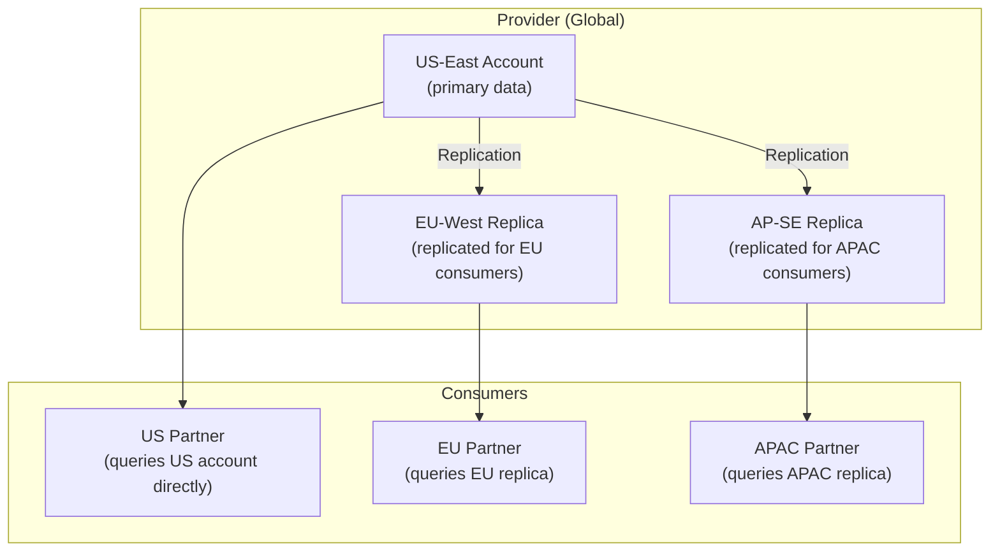

# Snowflake Data Sharing — Senior-Level Deep Dive

## Data Sharing Architecture at Scale

### Multi-Region Data Product Platform



Each region has a local replica of the shared data. Consumers query locally (fast, no cross-region transfer per query). Replication maintains consistency.

---

## Data Monetization Patterns

```sql
-- Sell data on Snowflake Marketplace (paid listings)

-- PATTERN 1: Standard Data Product (pay-per-access)
-- Provider publishes dataset → consumers pay monthly subscription
-- Snowflake handles billing + metering
-- Provider receives revenue share

-- PATTERN 2: Usage-Based Pricing (via secure UDFs)
-- Provider shares a function (not raw data)
-- Consumer calls function → provider tracks calls → bills per-call
CREATE SECURE FUNCTION shared.enrich_address(
    street VARCHAR, city VARCHAR, state VARCHAR, zip VARCHAR
)
RETURNS VARIANT  -- Returns: lat/lng, census tract, demographics
AS
$$
    -- Proprietary geocoding + enrichment logic
    SELECT OBJECT_CONSTRUCT(
        'latitude', geo.lat,
        'longitude', geo.lng,
        'census_tract', geo.tract,
        'median_income', demo.median_income
    )
    FROM internal.geocoding_data geo
    JOIN internal.demographics demo ON geo.tract = demo.tract
    WHERE geo.zip = zip AND geo.street ILIKE street
$$;
-- Consumer: SELECT shared.enrich_address(street, city, state, zip) FROM my_addresses;
-- Provider: bills per 1000 calls (tracked via Snowflake usage metrics)

-- PATTERN 3: Freemium (sample free, full dataset paid)
-- Share a SECURE VIEW that shows limited data for free:
CREATE SECURE VIEW shared.weather_sample AS
    SELECT * FROM weather.observations
    WHERE observation_date >= DATEADD('day', -7, CURRENT_DATE())  -- Only last 7 days free!
    AND region IN ('US-East', 'US-West');  -- Only 2 regions free!
-- Full dataset (all dates, all regions) available via paid listing
```

---

## Governance and Compliance

```sql
-- Enterprise sharing governance framework:

-- 1. APPROVAL WORKFLOW for new shares
-- Before creating a share, team must get approval:
-- a) Data classification review (is this data OK to share externally?)
-- b) Legal review (data sharing agreement with consumer)
-- c) Security review (secure views properly filter PII?)
-- d) Business review (commercial terms agreed)

-- 2. AUDIT all sharing activity
SELECT 
    share_name,
    granted_to,
    privilege,
    granted_on,
    granted_by
FROM SNOWFLAKE.ACCOUNT_USAGE.GRANTS_TO_SHARES
ORDER BY granted_on DESC;
-- Shows: what's shared, with whom, when, and who authorized it

-- 3. DATA TRANSFER monitoring
SELECT 
    target_account,
    SUM(bytes_transferred) / POWER(1024,3) AS gb_transferred,
    COUNT(*) AS transfer_count
FROM SNOWFLAKE.ACCOUNT_USAGE.DATA_TRANSFER_HISTORY
WHERE SOURCE_ACCOUNT = CURRENT_ACCOUNT()
  AND START_TIME >= DATEADD('day', -30, CURRENT_TIMESTAMP())
GROUP BY target_account
ORDER BY gb_transferred DESC;
-- Monitor: which consumers are pulling the most data?

-- 4. AUTOMATIC REVOCATION (when contract expires)
-- Task that checks contract end dates and revokes access:
CREATE TASK governance.revoke_expired_shares
    WAREHOUSE = 'ADMIN_WH_XS'
    SCHEDULE = 'USING CRON 0 0 * * * UTC'
AS
BEGIN
    FOR share_record IN (
        SELECT share_name, consumer_account 
        FROM governance.share_contracts 
        WHERE contract_end_date < CURRENT_DATE() AND active = TRUE
    ) DO
        EXECUTE IMMEDIATE 'ALTER SHARE ' || share_record.share_name || 
            ' REMOVE ACCOUNTS = ''' || share_record.consumer_account || '''';
        UPDATE governance.share_contracts SET active = FALSE 
        WHERE share_name = share_record.share_name;
    END FOR;
END;
```

---

## Performance Considerations

```sql
-- Sharing doesn't add overhead to provider queries
-- But consumer queries DO use provider's storage I/O

-- OPTIMIZATION 1: Cluster shared tables by common query patterns
-- If consumers always filter by date:
ALTER TABLE production.gold.shared_metrics CLUSTER BY (metric_date);
-- Better data skipping → faster consumer queries → less I/O on your storage

-- OPTIMIZATION 2: Pre-aggregate for consumers
-- Don't share 10B-row fact table directly — share pre-aggregated views:
CREATE SECURE VIEW shared.daily_metrics AS
    SELECT metric_date, region, category,
           SUM(amount) AS revenue, COUNT(*) AS transactions
    FROM production.fact_sales
    GROUP BY metric_date, region, category;
-- Consumers get fast results; your storage isn't hammered by their full scans

-- OPTIMIZATION 3: Limit historical data in shared views
CREATE SECURE VIEW shared.recent_orders AS
    SELECT * FROM production.gold.orders
    WHERE order_date >= DATEADD('year', -2, CURRENT_DATE());
-- Don't expose 10 years of history if consumers only need 2 years
-- Reduces: query scope, accidental full scans, I/O on your storage
```

---

## Bi-Directional Data Exchange

```sql
-- Two organizations sharing data WITH EACH OTHER:

-- Organization A shares customer demographics with Org B
-- Organization B shares purchase behavior with Org A
-- Both analyze the combined dataset without exchanging raw files

-- ORG A:
CREATE SHARE org_a_demographics;
GRANT SELECT ON VIEW shared.customer_demographics TO SHARE org_a_demographics;
ALTER SHARE org_a_demographics ADD ACCOUNTS = 'org_b_account';

-- ORG B:
CREATE SHARE org_b_purchases;
GRANT SELECT ON VIEW shared.purchase_behavior TO SHARE org_b_purchases;
ALTER SHARE org_b_purchases ADD ACCOUNTS = 'org_a_account';

-- ORG A can now join their own data with Org B's shared data:
CREATE DATABASE org_b_data FROM SHARE org_b_account.org_b_purchases;

SELECT a.customer_id, a.demographics, b.purchase_frequency
FROM my_db.customers a
JOIN org_b_data.shared.purchase_behavior b ON a.customer_id = b.customer_id;
-- Cross-org analysis without either party giving up raw data to the other!
```

---

## Interview Tips

> **Tip 1:** "How do you monetize data on Snowflake Marketplace?" — Three models: (1) Subscription (monthly fee for dataset access), (2) Usage-based (per-query or per-function-call via secure UDFs), (3) Freemium (limited free sample, full dataset paid). Snowflake handles billing/metering. You set pricing; Snowflake collects and distributes revenue.

> **Tip 2:** "How do you handle compliance for shared data?" — Governance framework: approval workflow before creating shares, legal review of data sharing agreements, secure views to filter PII, audit trail (GRANTS_TO_SHARES + DATA_TRANSFER_HISTORY), automatic revocation when contracts expire. Never share base tables — always use secure views with appropriate row/column filtering.

> **Tip 3:** "Performance impact of data sharing on the provider?" — Consumer queries read from YOUR storage (I/O on your account). But they use THEIR compute (warehouse). Impact: increased storage I/O during consumer queries. Mitigation: pre-aggregate shared views (smaller scans), cluster shared tables (better data skipping), limit historical data (reduce scan scope). For high-volume consumers: cross-region replication distributes the I/O.
