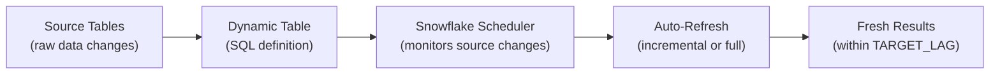

# Snowflake Dynamic Tables — Fundamentals

## What Are Dynamic Tables?

Dynamic Tables are Snowflake's **declarative data transformation** feature. You define WHAT the table should look like (a SQL query), and Snowflake automatically keeps it refreshed — handling incremental processing, scheduling, and dependency management.

```sql
-- Traditional approach: you manage scheduling, incremental logic, and dependencies
-- Step 1: Write transformation query
-- Step 2: Create a task to run it on schedule
-- Step 3: Handle incremental logic (streams, watermarks)
-- Step 4: Manage dependencies between tables
-- ... lots of plumbing code!

-- Dynamic Table approach: just write the query!
CREATE OR REPLACE DYNAMIC TABLE silver.orders
    TARGET_LAG = '10 minutes'  -- Snowflake keeps it fresh within 10 min
    WAREHOUSE = 'ETL_WH'
AS
    SELECT 
        order_id::NUMBER AS order_id,
        customer_id::NUMBER AS customer_id,
        amount::DECIMAL(10,2) AS amount,
        order_date::DATE AS order_date,
        status::VARCHAR AS status
    FROM raw.orders
    WHERE order_id IS NOT NULL AND amount > 0;

-- That's it! Snowflake automatically:
-- 1. Determines if it can process incrementally (vs full refresh)
-- 2. Refreshes within 10 minutes of source changes
-- 3. Manages dependencies (if another DT depends on this one)
```

> **Key Insight for DE:** Dynamic Tables are like dbt models that Snowflake manages for you. You write the SQL; Snowflake handles scheduling, incremental logic, and refresh. It's the easiest way to build transformation pipelines in Snowflake.

---

## How Dynamic Tables Work



Snowflake monitors the source tables for changes. When changes are detected, it refreshes the Dynamic Table within the specified TARGET_LAG window — automatically choosing incremental or full refresh based on the query pattern.

---

## TARGET_LAG (Freshness SLA)

The TARGET_LAG tells Snowflake how fresh the data should be:

```sql
-- Real-time (as fast as possible):
TARGET_LAG = '1 minute'
-- Refreshes within 1 minute of source change
-- Highest cost (most frequent refreshes)

-- Near-real-time:
TARGET_LAG = '10 minutes'
-- Refreshes within 10 minutes
-- Good balance of freshness and cost

-- Batch-style:
TARGET_LAG = '1 hour'
-- Refreshes within 1 hour
-- Lower cost (fewer refreshes)

-- Daily:
TARGET_LAG = '1 day'
-- Refreshes once per day
-- Lowest cost (like a scheduled batch job)

-- DOWNSTREAM: inherit from upstream DT:
TARGET_LAG = DOWNSTREAM
-- This DT refreshes only when a downstream DT needs fresh data
-- Useful for intermediate tables in a pipeline
```

---

## Building a Medallion Pipeline with Dynamic Tables

```sql
-- BRONZE: Snowpipe loads raw data (not a Dynamic Table — it's the source)
-- raw.orders gets new rows via Snowpipe

-- SILVER: Dynamic Table (cleaned, typed, deduplicated)
CREATE OR REPLACE DYNAMIC TABLE silver.orders
    TARGET_LAG = '10 minutes'
    WAREHOUSE = 'ETL_WH'
AS
    SELECT 
        order_id::NUMBER AS order_id,
        customer_id::NUMBER AS customer_id,
        amount::DECIMAL(10,2) AS amount,
        TRY_TO_DATE(order_date) AS order_date,
        status::VARCHAR AS status,
        _loaded_at
    FROM raw.orders
    WHERE order_id IS NOT NULL
    QUALIFY ROW_NUMBER() OVER (PARTITION BY order_id ORDER BY _loaded_at DESC) = 1;

-- GOLD: Dynamic Table (aggregated, depends on silver)
CREATE OR REPLACE DYNAMIC TABLE gold.daily_revenue
    TARGET_LAG = '30 minutes'
    WAREHOUSE = 'ETL_WH'
AS
    SELECT 
        order_date,
        COUNT(*) AS total_orders,
        SUM(amount) AS revenue,
        AVG(amount) AS avg_order_value
    FROM silver.orders
    WHERE order_date IS NOT NULL
    GROUP BY order_date;

-- Snowflake automatically:
-- 1. Detects: gold depends on silver, silver depends on raw
-- 2. When raw changes → refreshes silver (within 10 min)
-- 3. When silver changes → refreshes gold (within 30 min)
-- 4. Total end-to-end: raw change → gold updated within ~40 min
```

---

## Dynamic Tables vs Streams + Tasks

| Aspect | Dynamic Tables | Streams + Tasks |
|--------|---------------|-----------------|
| Code complexity | Just SQL (no scheduling code) | SQL + stream + task + error handling |
| Incremental logic | Automatic (Snowflake decides) | Manual (you implement MERGE) |
| Dependency management | Automatic (inferred from SQL) | Manual (AFTER clause in tasks) |
| Scheduling | Automatic (TARGET_LAG) | Manual (cron expression) |
| Error handling | Automatic retry | Manual (stored procedures) |
| Control | Less (Snowflake decides how to refresh) | Full (you control everything) |
| Best for | Standard transformations | Complex logic (conditional, multi-step) |

```sql
-- Streams + Tasks (manual, 30+ lines):
CREATE STREAM orders_stream ON TABLE raw.orders;
CREATE TASK process_orders WAREHOUSE='WH' SCHEDULE='10 MINUTE'
    WHEN SYSTEM$STREAM_HAS_DATA('orders_stream')
AS MERGE INTO silver.orders ...;
ALTER TASK process_orders RESUME;

-- Dynamic Table (declarative, 10 lines):
CREATE DYNAMIC TABLE silver.orders TARGET_LAG='10 minutes' WAREHOUSE='WH'
AS SELECT ... FROM raw.orders WHERE ...;
-- Done! No stream, no task, no MERGE logic, no resume command.
```

---

## Checking Dynamic Table Status

```sql
-- View all dynamic tables and their refresh status
SHOW DYNAMIC TABLES;

-- Detailed refresh history
SELECT *
FROM TABLE(INFORMATION_SCHEMA.DYNAMIC_TABLE_REFRESH_HISTORY(
    NAME => 'SILVER.ORDERS',
    DATA_TIMESTAMP_START => DATEADD('day', -1, CURRENT_TIMESTAMP())
))
ORDER BY DATA_TIMESTAMP DESC;

-- Check current lag (how fresh is the data?)
SELECT 
    NAME,
    TARGET_LAG,
    SCHEDULING_STATE,  -- RUNNING, SUSPENDED, etc.
    LAST_REFRESH_TIME,
    TIMESTAMPDIFF('minute', LAST_REFRESH_TIME, CURRENT_TIMESTAMP()) AS minutes_since_refresh
FROM TABLE(INFORMATION_SCHEMA.DYNAMIC_TABLES())
WHERE SCHEMA_NAME = 'SILVER';
```

---

## When to Use Dynamic Tables

**Use Dynamic Tables when:**
- Standard SQL transformation (SELECT with JOIN, GROUP BY, QUALIFY)
- Straightforward medallion pipeline (raw → silver → gold)
- You want minimal code and management overhead
- Dependencies between tables are simple (linear or fan-in)

**Use Streams + Tasks when:**
- Complex conditional logic (IF/ELSE, CASE with side effects)
- Need to call stored procedures or external functions
- Multi-statement transactions (INSERT + UPDATE + DELETE in sequence)
- Need precise control over scheduling and error handling
- Cross-database or cross-account operations

---

## Interview Tips

> **Tip 1:** "What are Dynamic Tables?" — Declarative transformation: you write a SELECT query and set a TARGET_LAG (freshness SLA). Snowflake automatically refreshes the table within that lag — handling scheduling, incremental processing, and dependency management. Like dbt models but fully managed by Snowflake.

> **Tip 2:** "Dynamic Tables vs Streams + Tasks?" — Dynamic Tables: simpler (just SQL), automatic scheduling and incremental logic, less control. Streams + Tasks: more powerful (stored procedures, complex MERGE, multi-step), manual scheduling, more code. Use DT for standard transformations (80% of pipelines); S+T for complex logic requiring procedural control.

> **Tip 3:** "How does TARGET_LAG work?" — It's a freshness SLA, not a schedule. TARGET_LAG = '10 minutes' means: "after the source changes, this table will be updated within 10 minutes." Snowflake decides WHEN and HOW to refresh (may batch multiple source changes into one refresh). Lower lag = more frequent refresh = higher cost. Higher lag = less frequent = cheaper.
