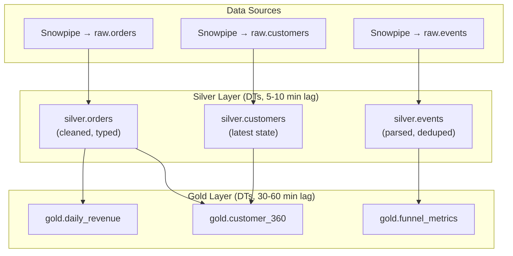

# Snowflake Dynamic Tables — Senior-Level Deep Dive

## Refresh Internals

### How Incremental Refresh Works

```sql
-- Under the hood, Snowflake's incremental refresh:
-- 1. Detects which micro-partitions in source changed since last refresh
-- 2. Reads ONLY those micro-partitions (not full table scan)
-- 3. Applies the DT's transformation to the changed data
-- 4. Merges results into the DT (inserts new, deletes old, updates changed)
-- 5. Updates metadata (new DATA_TIMESTAMP)

-- This is similar to how Streams work internally:
-- Both track table versions (micro-partition changes)
-- But DT does it automatically without you creating/managing a stream

-- PERFORMANCE IMPACT of source table clustering:
-- Well-clustered source → fewer micro-partitions change per insert → faster DT refresh
-- Poorly clustered source → many partitions touched → slower DT refresh
-- RECOMMENDATION: cluster source tables on commonly-filtered/inserted columns
ALTER TABLE raw.orders CLUSTER BY (order_date);
-- Now daily inserts only change partitions for today → DT refresh is faster
```

---

## Cost Optimization

```sql
-- Dynamic Table cost = warehouse credits for each refresh
-- Lower TARGET_LAG = more frequent refresh = higher cost
-- Higher TARGET_LAG = less frequent refresh = lower cost

-- STRATEGY 1: Right-size TARGET_LAG per business need
-- Real-time dashboard: TARGET_LAG = '5 minutes'
-- Hourly reports: TARGET_LAG = '1 hour'
-- Daily summaries: TARGET_LAG = '1 day'
-- Don't over-engineer freshness! Ask: "does anyone need this fresher?"

-- STRATEGY 2: Use DOWNSTREAM for intermediate tables
CREATE DYNAMIC TABLE silver.orders TARGET_LAG = DOWNSTREAM WAREHOUSE = 'WH' AS ...;
-- This DT only refreshes when a DOWNSTREAM DT requests fresh data
-- If no downstream DT has been refreshed recently → this one doesn't either
-- Saves: unnecessary refreshes of intermediate tables nobody queries directly

-- STRATEGY 3: Separate warehouses by refresh frequency
-- High-frequency DTs (1-5 min): dedicated small warehouse (always warm)
-- Low-frequency DTs (1 hour+): shared warehouse (can cold-start)

-- STRATEGY 4: Suspend during off-hours
-- If freshness only matters during business hours:
-- ALTER DYNAMIC TABLE ... SUSPEND; (at 6 PM)
-- ALTER DYNAMIC TABLE ... RESUME; (at 8 AM)
-- Zero cost overnight!

-- COST MONITORING:
SELECT 
    NAME,
    SUM(CREDITS_USED) AS total_credits_7d,
    COUNT(*) AS refresh_count_7d,
    AVG(CREDITS_USED) AS avg_credits_per_refresh
FROM TABLE(INFORMATION_SCHEMA.DYNAMIC_TABLE_REFRESH_HISTORY(
    DATA_TIMESTAMP_START => DATEADD('day', -7, CURRENT_TIMESTAMP())
))
GROUP BY NAME
ORDER BY total_credits_7d DESC;
```

---

## Production Architecture Patterns

### Enterprise Dynamic Table Pipeline



```sql
-- Enterprise setup: 3 sources → 3 silver DTs → 3 gold DTs
-- All managed by Snowflake (zero task management!)

-- Silver layer: clean, type, dedup (5-10 min freshness)
CREATE DYNAMIC TABLE silver.orders TARGET_LAG = '5 minutes' WAREHOUSE = 'ETL_WH' AS ...;
CREATE DYNAMIC TABLE silver.events TARGET_LAG = '10 minutes' WAREHOUSE = 'ETL_WH' AS ...;
CREATE DYNAMIC TABLE silver.customers TARGET_LAG = '10 minutes' WAREHOUSE = 'ETL_WH' AS ...;

-- Gold layer: aggregate, join, business metrics (30-60 min freshness)
CREATE DYNAMIC TABLE gold.daily_revenue TARGET_LAG = '30 minutes' WAREHOUSE = 'ETL_WH' AS
    SELECT order_date, region, SUM(amount) AS revenue, COUNT(*) AS orders
    FROM silver.orders o JOIN silver.customers c ON o.customer_id = c.customer_id
    GROUP BY order_date, region;

CREATE DYNAMIC TABLE gold.customer_360 TARGET_LAG = '1 hour' WAREHOUSE = 'ETL_WH' AS
    SELECT c.*, 
           COUNT(o.order_id) AS total_orders,
           SUM(o.amount) AS lifetime_value
    FROM silver.customers c
    LEFT JOIN silver.orders o ON c.customer_id = o.customer_id
    GROUP BY ALL;

-- Dependency resolution: Snowflake handles it automatically
-- If raw.orders gets new data → silver.orders refreshes → gold.daily_revenue refreshes
-- No manual DAG management!
```

---

## Dynamic Tables vs Other Approaches

| Approach | Code | Scheduling | Incremental | Dependencies | Best For |
|----------|------|-----------|-------------|--------------|----------|
| Dynamic Tables | Just SQL | Automatic | Automatic | Automatic | Standard transforms |
| Streams + Tasks | SQL + Task + Stream | Manual cron | Manual (MERGE) | Manual (AFTER) | Complex CDC logic |
| dbt | SQL + YAML | External (Airflow/cron) | Manual (is_incremental) | Declared in ref() | Multi-platform, SQL teams |
| Stored Procedures | Procedural SQL/JS | External or Task | Manual | Manual | Complex conditional logic |

---

## Advanced Patterns

### Slowly Changing Dimension (SCD) with Dynamic Tables

```sql
-- SCD Type 1 (latest state only) — works well as a DT
CREATE DYNAMIC TABLE silver.customers_current
    TARGET_LAG = '10 minutes'
    WAREHOUSE = 'ETL_WH'
AS
    SELECT customer_id, name, email, region, phone, updated_at
    FROM raw.customers
    QUALIFY ROW_NUMBER() OVER (PARTITION BY customer_id ORDER BY updated_at DESC) = 1;
-- Always shows the LATEST version of each customer
-- Incremental: new/changed customers processed, others untouched

-- SCD Type 2 (full history) — requires Streams + Tasks (DT can't easily do this)
-- Because SCD2 needs: close old record + insert new record = multi-step DML
-- Use Streams + Tasks for SCD Type 2
```

### Handling Late-Arriving Data

```sql
-- DT with a lookback window to handle late data
CREATE DYNAMIC TABLE silver.events_recent
    TARGET_LAG = '15 minutes'
    WAREHOUSE = 'ETL_WH'
AS
    SELECT event_id, user_id, event_type, event_time, properties
    FROM raw.events
    WHERE event_time >= DATEADD('day', -7, CURRENT_DATE())  -- Last 7 days only
      AND event_id IS NOT NULL
    QUALIFY ROW_NUMBER() OVER (PARTITION BY event_id ORDER BY _loaded_at DESC) = 1;
-- The 7-day window means:
-- Late-arriving data (for the last 7 days) is automatically incorporated on next refresh
-- Older data: not included (reduces DT size and refresh cost)
```

---

## Migration: Tasks → Dynamic Tables

```sql
-- BEFORE: Stream + Task pipeline (30 lines, manual management)
CREATE STREAM s1 ON TABLE raw.orders;
CREATE TASK t1 WAREHOUSE='WH' SCHEDULE='15 MINUTE' WHEN SYSTEM$STREAM_HAS_DATA('s1')
AS MERGE INTO silver.orders USING s1 ...;
ALTER TASK t1 RESUME;

-- AFTER: Dynamic Table (5 lines, zero management)
CREATE DYNAMIC TABLE silver.orders TARGET_LAG='15 minutes' WAREHOUSE='WH'
AS SELECT order_id, amount, order_date FROM raw.orders WHERE order_id IS NOT NULL
   QUALIFY ROW_NUMBER() OVER (PARTITION BY order_id ORDER BY _loaded_at DESC) = 1;

-- MIGRATION STEPS:
-- 1. Create DT with same logic as existing Task's MERGE
-- 2. Validate: compare row counts and checksums between old silver table and new DT
-- 3. Switch consumers to read from the Dynamic Table
-- 4. Drop old stream, task, and original silver table
-- 5. Result: less code, less maintenance, same (or better) freshness
```

---

## Interview Tips

> **Tip 1:** "When would you choose Dynamic Tables over Streams + Tasks?" — DT for: standard transformations (SELECT, JOIN, GROUP BY), automatic incremental processing, minimal code. Streams + Tasks for: complex multi-step logic (SCD2, conditional branching), stored procedure calls, cross-database operations, or when you need precise scheduling control (not just freshness-based).

> **Tip 2:** "How do you optimize Dynamic Table costs?" — (1) Right-size TARGET_LAG (don't over-engineer freshness), (2) Use DOWNSTREAM for intermediate tables (only refresh when needed), (3) Cluster source tables (fewer micro-partitions change → faster incremental refresh), (4) Separate warehouses by frequency, (5) Suspend during off-hours (zero cost when not refreshing).

> **Tip 3:** "What's the relationship between TARGET_LAG and actual refresh frequency?" — TARGET_LAG is a freshness GUARANTEE, not a schedule. If you set 10 minutes: Snowflake ensures data is never more than 10 minutes stale. It may refresh more frequently if changes are continuous, or less frequently if source is quiet (batches changes). Actual refresh interval ≤ TARGET_LAG.

## ⚡ Cheat Sheet

**Snowflake architecture layers**
```
Cloud Services:   metadata, optimizer, access control, query planning
Virtual Warehouse: compute (T-shirt sizes: XS to 6XL); auto-suspend + auto-resume
Storage:          columnar Parquet on S3/Blob/GCS; billed separately from compute
```

**Virtual warehouse management**
```sql
CREATE WAREHOUSE analytics_wh WITH WAREHOUSE_SIZE='MEDIUM'
  AUTO_SUSPEND=60 AUTO_RESUME=TRUE MAX_CLUSTER_COUNT=3 MIN_CLUSTER_COUNT=1
  SCALING_POLICY='ECONOMY';  -- or STANDARD
ALTER WAREHOUSE analytics_wh SUSPEND;
ALTER WAREHOUSE analytics_wh SET WAREHOUSE_SIZE='LARGE';
```

**Time travel**
```sql
SELECT * FROM orders AT (OFFSET => -60*60);                          -- 1 hour ago
SELECT * FROM orders AT (TIMESTAMP => '2024-01-15 08:00:00'::TIMESTAMP);
SELECT * FROM orders BEFORE (STATEMENT => '8e5d0ca9-005e-44e6-b858-a8f5b37c5726');
-- Restore from time travel
CREATE TABLE orders_restored CLONE orders AT (OFFSET => -3600);
-- Default retention: 1 day (standard), up to 90 days (enterprise)
```

**Streams and Tasks**
```sql
-- Stream: CDC on a table
CREATE STREAM orders_stream ON TABLE orders;
SELECT * FROM orders_stream;  -- METADATA$ACTION, METADATA$ISUPDATE, METADATA$ROW_ID

-- Task: scheduled or triggered compute
CREATE TASK process_orders
  WAREHOUSE = 'etl_wh'
  SCHEDULE = '5 MINUTE'
  WHEN SYSTEM$STREAM_HAS_DATA('orders_stream')
AS
  INSERT INTO gold.orders SELECT * FROM orders_stream WHERE METADATA$ACTION = 'INSERT';

ALTER TASK process_orders RESUME;
```

**Dynamic Tables**
```sql
CREATE DYNAMIC TABLE gold.orders_summary
  TARGET_LAG = '5 minutes'
  WAREHOUSE = etl_wh
AS
  SELECT region, SUM(amount) AS total FROM silver.orders GROUP BY region;
-- Snowflake automatically refreshes when source changes; no task/stream needed
```

**Snowpipe (continuous ingestion)**
```sql
CREATE PIPE orders_pipe AUTO_INGEST=TRUE AS
  COPY INTO orders FROM @orders_stage FILE_FORMAT=(TYPE='CSV');
-- S3 event notification → SQS → Snowpipe auto-triggers COPY on new files
-- Latency: ~1 minute; cost: per-file compute credits
```

**Data sharing**
```sql
CREATE SHARE sales_share;
GRANT USAGE ON DATABASE prod TO SHARE sales_share;
GRANT SELECT ON TABLE prod.gold.orders TO SHARE sales_share;
ALTER SHARE sales_share ADD ACCOUNTS = partner_account_id;
-- Consumer sees a read-only database — no data copy, no egress charges
```

**Stored procedures (JavaScript/Python/Snowflake Scripting)**
```sql
CREATE OR REPLACE PROCEDURE load_and_validate(p_date STRING)
RETURNS STRING LANGUAGE PYTHON RUNTIME_VERSION='3.10'
PACKAGES=('snowflake-snowpark-python') HANDLER='run'
AS $$
def run(session, p_date):
    df = session.table("staging.orders").filter(f"order_date = '{p_date}'")
    if df.count() == 0:
        return f"No data for {p_date}"
    df.write.save_as_table("gold.orders", mode="append")
    return f"Loaded {df.count()} rows"
$$;
```

**External tables**
```sql
CREATE EXTERNAL TABLE ext_orders (
    order_id NUMBER AS (VALUE:c1::NUMBER),
    amount   FLOAT  AS (VALUE:c3::FLOAT)
) WITH LOCATION=@orders_stage FILE_FORMAT=(TYPE='PARQUET')
AUTO_REFRESH=TRUE;
-- Reads directly from S3; no data copy to Snowflake storage
```

**Materialized views**
```sql
CREATE MATERIALIZED VIEW mv_orders_by_region AS
  SELECT region, SUM(amount) AS total FROM orders GROUP BY region;
-- Auto-incremental refresh by Snowflake when base table changes
-- Best for: complex aggregations queried frequently; available in Enterprise+
```

**Key interview points**
- Micro-partitions: 50-500 MB compressed Parquet; automatic clustering per load order
- Cluster keys: explicit clustering on high-cardinality columns (date, customer_id)
- Query profile: check for partition pruning, spillage to disk, heavy operators
- Zero-copy clone: CREATE TABLE dev_orders CLONE gold.orders — instant, no storage cost
- Fail-safe: 7-day recovery window after time travel expires (Snowflake internal only)
