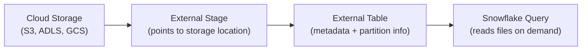

# Snowflake External Tables — Fundamentals

## What Are External Tables?

External Tables let you **query data files in cloud storage (S3/Azure/GCS) directly from Snowflake** without loading the data into Snowflake's internal storage. The data stays where it is; Snowflake provides the SQL query interface.

```sql
-- Regular table: data stored IN Snowflake (fast, costs storage)
SELECT * FROM internal_table;  -- Data in Snowflake's managed storage

-- External table: data stays in YOUR S3 bucket (no load, no Snowflake storage cost)
SELECT * FROM external_table;  -- Reads directly from S3 Parquet/JSON/CSV files!
-- Data never leaves S3 — Snowflake queries it in place
```

> **Key Insight for DE:** External tables are for data you want to query in Snowflake but DON'T want to pay Snowflake storage for — like a massive data lake or archive that's already in S3/ADLS. Query-on-read, not load-then-query.

---

## How External Tables Work



Snowflake stores only METADATA (file locations, partition info, column definitions) — not the actual data. When queried, it reads the data files directly from cloud storage.

---

## Creating External Tables

```sql
-- Step 1: Create external stage (points to S3 location)
CREATE OR REPLACE STAGE ext_stage.data_lake
    URL = 's3://company-data-lake/analytics/'
    STORAGE_INTEGRATION = my_s3_integration
    FILE_FORMAT = (TYPE = 'PARQUET');

-- Step 2: Create external table
CREATE OR REPLACE EXTERNAL TABLE ext.orders (
    order_id NUMBER AS (VALUE:order_id::NUMBER),
    customer_id NUMBER AS (VALUE:customer_id::NUMBER),
    amount DECIMAL(10,2) AS (VALUE:amount::DECIMAL(10,2)),
    order_date DATE AS (VALUE:order_date::DATE),
    region VARCHAR AS (VALUE:region::VARCHAR)
)
WITH LOCATION = @ext_stage.data_lake/orders/
FILE_FORMAT = (TYPE = 'PARQUET')
AUTO_REFRESH = TRUE;  -- Automatically detects new files!

-- Step 3: Query like any regular table
SELECT region, SUM(amount) AS revenue
FROM ext.orders
WHERE order_date >= '2024-01-01'
GROUP BY region;
-- Reads from S3 Parquet files directly!
```

---

## Partitioned External Tables

```sql
-- Files organized by partition (like Hive-style partitioning):
-- s3://lake/orders/year=2024/month=03/day=15/file001.parquet
-- s3://lake/orders/year=2024/month=03/day=16/file002.parquet

CREATE OR REPLACE EXTERNAL TABLE ext.orders_partitioned (
    order_id NUMBER AS (VALUE:order_id::NUMBER),
    amount DECIMAL(10,2) AS (VALUE:amount::DECIMAL(10,2)),
    customer_id NUMBER AS (VALUE:customer_id::NUMBER)
)
PARTITION BY (year VARCHAR, month VARCHAR, day VARCHAR)
WITH LOCATION = @ext_stage.data_lake/orders/
PARTITION_TYPE = HIVE  -- Auto-detects year=YYYY/month=MM/day=DD structure!
FILE_FORMAT = (TYPE = 'PARQUET')
AUTO_REFRESH = TRUE;

-- Partition pruning: only reads files for matching partitions!
SELECT * FROM ext.orders_partitioned
WHERE year = '2024' AND month = '03' AND day = '15';
-- Only reads: s3://lake/orders/year=2024/month=03/day=15/*.parquet
-- Skips all other dates entirely (fast!)
```

---

## External Table vs Regular Table

| Aspect | External Table | Regular (Internal) Table |
|--------|---------------|--------------------------|
| Data location | YOUR cloud storage (S3/ADLS) | Snowflake's managed storage |
| Storage cost | $0 in Snowflake (you pay S3) | Snowflake storage pricing |
| Query speed | Slower (reads from S3 each time) | Faster (Snowflake-optimized) |
| Data format | Parquet, JSON, CSV, Avro, ORC | Snowflake internal (columnar) |
| DML support | Read-only (no INSERT/UPDATE/DELETE) | Full DML |
| Clustering | No (depends on file layout) | Yes (Snowflake manages) |
| Time Travel | No | Yes |
| Best for | Data lake queries, archives, shared storage | Active analytics, BI, ETL targets |

---

## AUTO_REFRESH (Automatic File Discovery)

```sql
-- AUTO_REFRESH = TRUE: Snowflake detects new files via S3 events
-- New file lands in S3 → event notification → external table metadata updated
-- Next query sees the new data automatically!

-- Without AUTO_REFRESH: you must manually refresh metadata
ALTER EXTERNAL TABLE ext.orders REFRESH;
-- Scans the stage location and updates metadata (file list, partition info)

-- Check refresh status:
SELECT * FROM TABLE(INFORMATION_SCHEMA.EXTERNAL_TABLE_FILE_REGISTRATION_HISTORY(
    START_TIME => DATEADD('day', -1, CURRENT_TIMESTAMP()),
    TABLE_NAME => 'EXT.ORDERS'
));
```

---

## Common Patterns

### Data Lake Exploration

```sql
-- Query raw data lake files without loading (exploration):
SELECT 
    $1:event_type::VARCHAR AS event_type,
    $1:user_id::NUMBER AS user_id,
    $1:event_time::TIMESTAMP AS event_time
FROM @ext_stage.data_lake/events/2024/03/  -- Query stage directly!
(FILE_FORMAT => 'PARQUET_FORMAT')
LIMIT 1000;
-- Quick exploration: no table creation needed, just query the stage!
```

### Hybrid Pattern (External → Internal)

```sql
-- External table for querying data lake + load hot data into Snowflake:

-- Cold data (>30 days old): query via external table (save storage $)
SELECT * FROM ext.orders_archive WHERE order_date < DATEADD('day', -30, CURRENT_DATE());

-- Hot data (last 30 days): loaded into internal Snowflake table (fast queries)
SELECT * FROM internal.orders WHERE order_date >= DATEADD('day', -30, CURRENT_DATE());

-- Union view combines both:
CREATE VIEW unified.all_orders AS
    SELECT * FROM internal.orders  -- Fast (internal, last 30 days)
    UNION ALL
    SELECT * FROM ext.orders_archive;  -- Slower (external, historical)
```

---

## Interview Tips

> **Tip 1:** "What are External Tables?" — Query data in cloud storage (S3/ADLS/GCS) directly from Snowflake without loading it. Data stays in place; Snowflake provides SQL interface. Read-only. No Snowflake storage cost. Slower than internal tables but avoids data duplication.

> **Tip 2:** "When to use External vs Internal tables?" — External: data lake exploration, archive queries, cost optimization (save Snowflake storage), shared data read by multiple tools (Snowflake + Spark + Athena). Internal: active analytics, frequent queries, need for DML/Time Travel, BI dashboards requiring fast response times.

> **Tip 3:** "How do you optimize External Table performance?" — Partition the data in S3 (Hive-style: year/month/day). Use Parquet format (columnar, compressed). Enable AUTO_REFRESH for auto file discovery. For frequently-queried data: consider loading into Snowflake (hybrid approach) or creating a Materialized View on the external table.
