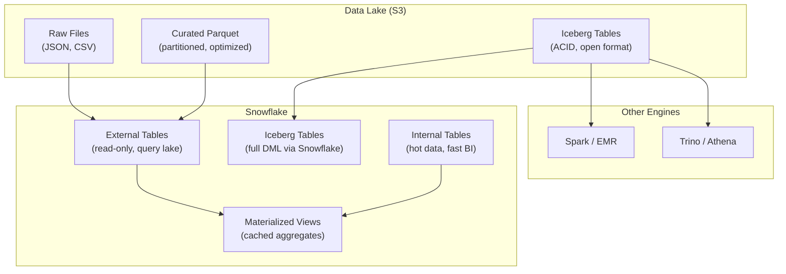

# Snowflake External Tables — Senior-Level Deep Dive

## Lakehouse Architecture with Snowflake



This shows the open lakehouse pattern: Iceberg tables on S3 are queryable by Snowflake AND other engines. External tables provide SQL access to existing lake data. MVs accelerate frequent queries. Internal tables hold hot/BI data.

---

## Iceberg Tables Deep Dive

```sql
-- Snowflake-managed Iceberg (Snowflake as the catalog):
CREATE ICEBERG TABLE production.iceberg_events
    EXTERNAL_VOLUME = 's3_lake_volume'
    CATALOG = 'SNOWFLAKE'
    BASE_LOCATION = 'production/events/';

-- Full DML works (data stored as Parquet in S3!):
INSERT INTO production.iceberg_events SELECT * FROM staging.new_events;
UPDATE production.iceberg_events SET status = 'processed' WHERE event_id = 123;
DELETE FROM production.iceberg_events WHERE event_date < '2023-01-01';

-- Other engines read the SAME data:
-- Spark: spark.read.format("iceberg").load("s3://lake/production/events/")
-- Trino: SELECT * FROM iceberg.production.events
-- All see the SAME data, SAME schema, SAME ACID guarantees!

-- Externally-managed Iceberg (Glue/Hive catalog):
CREATE ICEBERG TABLE ext.partner_data
    EXTERNAL_VOLUME = 's3_partner_volume'
    CATALOG = 'AWS_GLUE'
    CATALOG_TABLE_NAME = 'partner_events';
-- Snowflake reads Iceberg managed by another system (Spark writes, Snowflake reads)
```

---

## Cost Optimization: Hot/Cold Architecture

```sql
-- Pattern: hot data in Snowflake (fast), cold data in external tables (cheap)

-- HOT: Last 30 days in internal Snowflake tables
-- COLD: 30+ days in S3 external tables (Parquet, partitioned by date)

-- Unified view (transparent to analysts):
CREATE OR REPLACE VIEW unified.all_orders AS
    -- Hot path (fast, internal)
    SELECT order_id, customer_id, amount, order_date, 'internal' AS source
    FROM internal.orders
    WHERE order_date >= DATEADD('day', -30, CURRENT_DATE())
    UNION ALL
    -- Cold path (slower, external, but cheap storage!)
    SELECT order_id, customer_id, amount, order_date, 'external' AS source
    FROM ext.orders_archive
    WHERE order_date < DATEADD('day', -30, CURRENT_DATE());

-- Analysts query unified.all_orders — don't know/care about hot vs cold!
-- Most queries filter by recent dates → hit internal (fast)
-- Historical queries → hit external (slower but saves storage $)

-- COST SAVINGS:
-- 2 years of orders: 500 GB
-- All internal: 500 GB × $23/TB = $11.50/month
-- Hot/cold split: 30 GB internal ($0.69) + 470 GB S3 ($0.01/GB = $4.70) = $5.39/month
-- Savings: 53% on storage while maintaining same query interface!
```

---

## External Table Performance Tuning

```sql
-- TUNING STRATEGY for large external tables (1 TB+):

-- 1. PARTITION PRUNING (most important!)
-- Good partition: date (365 values/year → great pruning)
-- Bad partition: customer_id (millions → too many tiny directories)

-- 2. FILE FORMAT optimization
-- Parquet + SNAPPY compression: best balance of speed + compression
-- Row group size: 128 MB (matches Snowflake's scan granularity)
-- Column statistics: enable in Parquet writer (allows min/max filtering)

-- 3. FILE SIZING
-- Optimal: 100-250 MB compressed per file
-- Too small: S3 list overhead per file + overhead per file scan
-- Too large: can't skip irrelevant data within the file

-- 4. METADATA CACHING
-- Snowflake caches external table metadata (file list, partition info)
-- First query after REFRESH is slower (builds cache)
-- Subsequent queries: faster (uses cached metadata)

-- 5. PUSH-DOWN optimization
-- Filters on partition columns: applied at file selection (fast!)
-- Filters on data columns: applied during file scan (depends on Parquet stats)
-- Ensure Parquet row groups have useful min/max stats (sort data by filter columns!)
```

---

## Multi-Engine Data Architecture

```sql
-- Scenario: Data lake shared between Snowflake, Spark, and Athena
-- Each engine has its strengths:

-- Spark: heavy ETL processing (writes optimized Parquet to S3)
-- Snowflake: SQL analytics, BI, data sharing (queries via external tables)
-- Athena: ad-hoc exploration by developers (quick S3 queries)

-- All three query the SAME data (no duplication!):
-- S3 paths: s3://lake/production/orders/ (Parquet, Hive-partitioned)
-- Spark writes here (ETL pipeline output)
-- Snowflake external table reads here (analytics)
-- Athena points here (developer exploration)

-- With Iceberg: ACID consistency across all engines
-- Spark writes a transaction → Snowflake and Athena see the update immediately
-- No more "stale read" or "partial file" problems!
```

---

## Interview Tips

> **Tip 1:** "How do Iceberg tables differ from regular external tables?" — Regular external: read-only, Snowflake metadata only, no ACID, no DML. Iceberg: full DML (INSERT/UPDATE/DELETE), ACID transactions, schema evolution, time travel via snapshots, and open format readable by any engine (Spark, Trino, Athena). Iceberg = the future of open lakehouse.

> **Tip 2:** "Hot/cold architecture with external tables?" — Recent data (30 days) in Snowflake internal tables (fast BI queries). Historical data (30+ days) in S3 external tables (cheap storage). Unified view combines both (transparent to users). Most queries hit hot path (internal, fast). Historical queries hit cold path (external, slower but 50%+ storage savings).

> **Tip 3:** "Multi-engine data sharing?" — Store data in open format (Parquet/Iceberg) on S3. Multiple engines query the same files: Snowflake (external tables), Spark (native Parquet/Iceberg reader), Athena (S3 scan). With Iceberg: ACID consistency across all engines. No data duplication between platforms. Each engine used for its strength.
