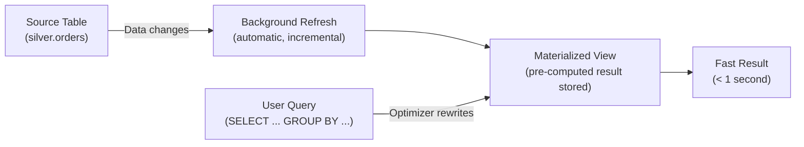

# Snowflake Materialized Views — Fundamentals

## What Are Materialized Views?

A Materialized View (MV) is a **pre-computed query result stored as a table** that Snowflake automatically maintains. When the source data changes, the MV is refreshed in the background — and the query optimizer automatically uses it to speed up queries.

```sql
-- Regular view: computed every time you query it (slow for complex queries)
CREATE VIEW gold.daily_revenue_view AS
    SELECT order_date, region, SUM(amount) AS revenue, COUNT(*) AS orders
    FROM silver.orders GROUP BY order_date, region;
-- Every query: re-scans silver.orders and re-aggregates (5-30 seconds)

-- Materialized view: pre-computed and stored (fast reads!)
CREATE MATERIALIZED VIEW gold.daily_revenue_mv AS
    SELECT order_date, region, SUM(amount) AS revenue, COUNT(*) AS orders
    FROM silver.orders GROUP BY order_date, region;
-- Query: reads pre-computed result (< 1 second!)
-- Snowflake auto-refreshes when silver.orders changes
```

> **Key Insight for DE:** MVs are like a cache that Snowflake automatically maintains. You get fast reads without managing refresh logic. The optimizer transparently rewrites queries to use MVs when beneficial.

---

## How Materialized Views Work



When the source table changes, Snowflake incrementally refreshes the MV in the background (using serverless compute). When a user runs a matching query, the optimizer transparently routes it to the MV instead of scanning the source.

---

## Creating Materialized Views

```sql
-- Basic MV (aggregation):
CREATE MATERIALIZED VIEW gold.revenue_by_region AS
    SELECT region, SUM(amount) AS total_revenue, COUNT(*) AS order_count
    FROM silver.orders
    GROUP BY region;

-- MV with filter:
CREATE MATERIALIZED VIEW gold.recent_large_orders AS
    SELECT order_id, customer_id, amount, order_date
    FROM silver.orders
    WHERE amount > 1000 AND order_date >= '2024-01-01';

-- MV with computed columns:
CREATE MATERIALIZED VIEW gold.order_metrics AS
    SELECT 
        DATE_TRUNC('month', order_date) AS month,
        COUNT(*) AS orders,
        SUM(amount) AS revenue,
        AVG(amount) AS avg_order_value,
        MAX(amount) AS max_order
    FROM silver.orders
    GROUP BY DATE_TRUNC('month', order_date);
```

---

## Automatic Query Rewriting

The optimizer **automatically** uses MVs even when users don't reference them directly:

```sql
-- User writes this query (doesn't know about the MV):
SELECT region, SUM(amount) AS total_revenue
FROM silver.orders
WHERE order_date >= '2024-01-01'
GROUP BY region;

-- Optimizer recognizes: gold.revenue_by_region covers this query!
-- Automatically rewrites to read from the MV (transparent to user)
-- Result: 30-second query becomes < 1 second (using pre-computed data)

-- Verify rewriting happened (check query plan):
EXPLAIN SELECT region, SUM(amount) FROM silver.orders GROUP BY region;
-- Look for: "MaterializedView" in the plan
```

---

## Limitations

| Supported | NOT Supported |
|-----------|--------------|
| SELECT with GROUP BY | JOINs between tables |
| Aggregate functions (SUM, COUNT, AVG, MIN, MAX) | Window functions |
| WHERE filters | Subqueries |
| Single source table | Multiple source tables |
| Deterministic expressions | Non-deterministic functions (CURRENT_DATE) |
| CLUSTER BY on MV | UDFs |

```sql
-- ✅ Works: aggregation on single table
CREATE MATERIALIZED VIEW mv1 AS
    SELECT region, SUM(amount) FROM orders GROUP BY region;

-- ❌ Fails: JOIN between tables
CREATE MATERIALIZED VIEW mv2 AS
    SELECT o.region, SUM(o.amount) 
    FROM orders o JOIN customers c ON o.customer_id = c.customer_id
    GROUP BY o.region;
-- Error: Materialized views cannot contain JOINs!

-- Workaround for JOINs: use Dynamic Tables instead
-- (Dynamic Tables support JOINs, MVs don't)
```

---

## MV vs Dynamic Table vs View

| Feature | Regular View | Materialized View | Dynamic Table |
|---------|-------------|-------------------|---------------|
| Storage | None (computed per query) | Yes (pre-computed) | Yes (pre-computed) |
| Refresh | Every query (real-time) | Automatic background | Automatic (TARGET_LAG) |
| JOINs | Yes | ❌ No | ✅ Yes |
| Query rewriting | No | ✅ Yes (transparent) | No |
| Best for | Simple reusable SQL | Single-table aggregation acceleration | Multi-table transformations |
| Maintenance | Zero | Serverless (auto) | Warehouse-based |

---

## Costs

```sql
-- MV costs:
-- 1. Storage: the pre-computed result takes space (usually small for aggregations)
-- 2. Refresh compute: serverless credits for background maintenance
--    (charged when source data changes → MV refreshes incrementally)
-- 3. Savings: dramatically reduced query costs (no full table scan!)

-- Example:
-- Source table: 1 TB (silver.orders)
-- MV result: 10 MB (aggregated by region × month = small!)
-- Without MV: every query scans 1 TB → expensive
-- With MV: query reads 10 MB → cheap, fast
-- Break-even: if the MV serves >3-5 queries/day, it saves money vs repeated scans
```

---

## Monitoring MVs

```sql
-- Check MV status:
SHOW MATERIALIZED VIEWS;
-- Shows: name, is_secure, cluster_by, rows, bytes

-- Check refresh history:
SELECT *
FROM TABLE(INFORMATION_SCHEMA.MATERIALIZED_VIEW_REFRESH_HISTORY(
    DATE_RANGE_START => DATEADD('day', -7, CURRENT_TIMESTAMP())
))
ORDER BY START_TIME DESC;

-- Check if MV is being used (query rewriting):
-- Run EXPLAIN on user queries and look for "MaterializedView" operator
```

---

## Interview Tips

> **Tip 1:** "What are Materialized Views in Snowflake?" — Pre-computed query results stored as a table, automatically maintained by Snowflake. The optimizer transparently rewrites matching queries to use the MV (users don't need to reference it directly). Best for: accelerating repeated aggregation queries on a single source table.

> **Tip 2:** "MV vs Dynamic Table?" — MV: single-table only (no JOINs), automatic query rewriting (transparent optimization), serverless refresh. DT: supports JOINs and complex transforms, no automatic rewriting (users must query the DT directly), warehouse-based refresh. Use MV for query acceleration; DT for pipeline transformations.

> **Tip 3:** "When NOT to use MVs?" — When the query involves JOINs (use Dynamic Tables). When the source table changes extremely frequently (refresh cost exceeds query savings). When the query is rarely run (< 3x/day, a regular view is cheaper). When you need window functions or UDFs in the result.
