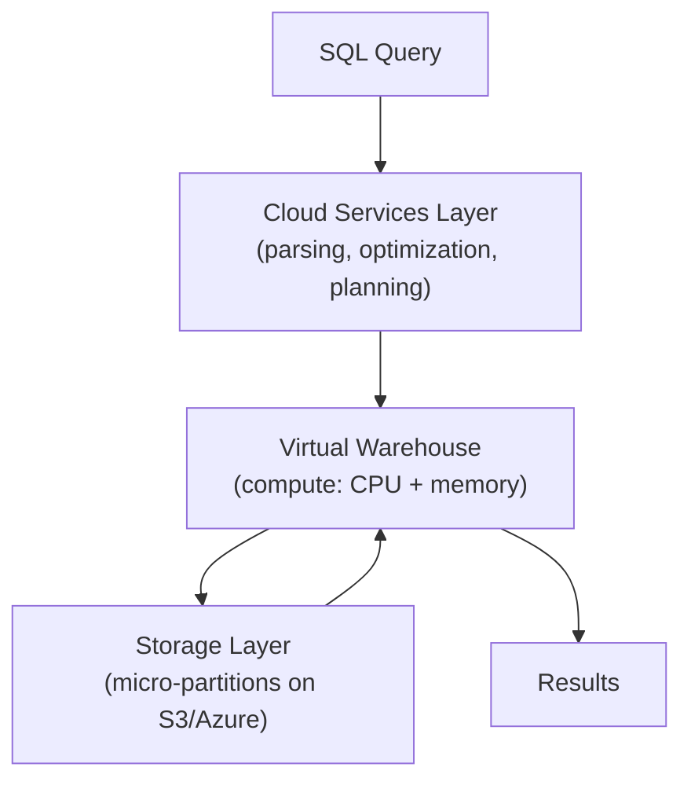

# Snowflake Performance Tuning — Fundamentals

## How Snowflake Executes Queries



Three layers: Cloud Services (query planning), Compute (virtual warehouse), Storage (micro-partitions). Performance tuning targets each layer differently.

---

## Warehouse Sizing

The warehouse SIZE determines compute power:

| Size | Servers | Credits/Hour | Best For |
|------|---------|-------------|----------|
| X-Small | 1 | 1 | Simple queries, low concurrency |
| Small | 2 | 2 | Standard analytics |
| Medium | 4 | 4 | Complex joins, moderate data |
| Large | 8 | 8 | Large scans, heavy ETL |
| X-Large | 16 | 16 | Very large datasets |
| 2X-Large | 32 | 32 | Massive workloads |

```sql
-- Rule: BIGGER warehouse = FASTER individual query (more parallelism)
-- But: also MORE EXPENSIVE per hour!

-- Right-sizing strategy:
-- Start with X-Small → run your query → check duration
-- If too slow: scale up one size → re-run → compare
-- Stop when: doubling warehouse doesn't halve the query time (diminishing returns)

-- For ETL jobs:
ALTER WAREHOUSE etl_wh SET WAREHOUSE_SIZE = 'MEDIUM';
-- For BI queries:
ALTER WAREHOUSE bi_wh SET WAREHOUSE_SIZE = 'SMALL';
-- For heavy reports:
ALTER WAREHOUSE report_wh SET WAREHOUSE_SIZE = 'LARGE';
```

---

## Clustering (Data Organization)

Clustering organizes micro-partitions by specified columns — enabling data skipping:

```sql
-- Without clustering: table data is randomly distributed across partitions
-- Query: WHERE order_date = '2024-03-15'
-- Must scan ALL 1000 micro-partitions (no idea which ones have March 15 data)

-- With clustering on order_date:
ALTER TABLE production.orders CLUSTER BY (order_date);
-- Snowflake reorganizes: March 15 data grouped in a few partitions
-- Query: WHERE order_date = '2024-03-15'
-- Now scans only 3 partitions out of 1000 (99.7% skipped!)

-- Check clustering effectiveness:
SELECT SYSTEM$CLUSTERING_INFORMATION('production.orders', '(order_date)');
-- Shows: average_depth (lower = better), partition_count, overlap
-- Well-clustered: average_depth = 1-2
-- Poorly clustered: average_depth = 10+ (data scattered everywhere)
```

### Choosing Cluster Keys

```sql
-- Best cluster key = the column(s) most used in WHERE clauses

-- If queries filter by date: CLUSTER BY (order_date)
-- If queries filter by customer: CLUSTER BY (customer_id)
-- If queries filter by BOTH: CLUSTER BY (order_date, customer_id)

-- RULES:
-- Max 3-4 cluster keys (diminishing returns with more)
-- Low cardinality FIRST (date before customer_id)
-- Match your most common query patterns
-- Don't cluster tables < 1 GB (too small to benefit)
```

---

## Query Profiling

```sql
-- Check query performance in the Snowflake UI:
-- Query History → select a query → Query Profile

-- KEY METRICS TO CHECK:
-- 1. Partitions scanned vs total (data skipping effectiveness)
--    Scanned: 50/1000 = good (95% skipped!)
--    Scanned: 950/1000 = bad (almost full scan — needs clustering)

-- 2. Bytes spilled to local/remote storage
--    Spill > 0 = not enough memory → try larger warehouse

-- 3. Join explosion (output rows >> input rows)
--    If join produces 100x more rows than expected → bad join condition (cartesian?)

-- 4. Queuing time
--    Time waiting for warehouse resources → need more clusters or larger warehouse

-- PROGRAMMATIC access to query performance:
SELECT 
    query_id, query_text,
    total_elapsed_time / 1000 AS seconds,
    bytes_scanned / POWER(1024,3) AS gb_scanned,
    partitions_scanned, partitions_total,
    bytes_spilled_to_local_storage,
    bytes_spilled_to_remote_storage
FROM SNOWFLAKE.ACCOUNT_USAGE.QUERY_HISTORY
WHERE start_time >= DATEADD('day', -1, CURRENT_TIMESTAMP())
ORDER BY total_elapsed_time DESC
LIMIT 20;
```

---

## Result Caching

```sql
-- Snowflake caches query results for 24 hours:
-- Same query + unchanged data → returns cached result INSTANTLY (0 credits!)

-- Example:
SELECT region, SUM(amount) FROM orders GROUP BY region;
-- First run: scans table, computes result, stores in cache → 15 seconds
-- Second run (within 24h, data unchanged): returns from cache → < 1 second, FREE!

-- Cache is invalidated when:
-- 1. Underlying data changes (DML on the table)
-- 2. 24 hours pass since first execution
-- 3. Query uses non-deterministic functions (CURRENT_TIMESTAMP, RANDOM)

-- For dashboards that refresh every 5 minutes:
-- If data changes hourly: 11 out of 12 refreshes hit cache (FREE!)
-- Massive cost savings for repetitive dashboard queries

-- Disable for testing:
ALTER SESSION SET USE_CACHED_RESULT = FALSE;
```

---

## Basic Optimization Checklist

| Issue | Symptom | Fix |
|-------|---------|-----|
| Full table scan | partitions_scanned ≈ partitions_total | Add clustering on filter columns |
| Memory spill | bytes_spilled > 0 | Use larger warehouse |
| Slow queries | > 30 seconds for simple aggregation | Check partition pruning, add MV |
| Queue time | queries waiting to start | Increase warehouse size or add clusters |
| Expensive scans | bytes_scanned very high | Add WHERE filters, select fewer columns |
| Repeated slow queries | same query pattern >10x/day | Create Materialized View |

```sql
-- Quick wins (do these first!):

-- 1. Don't SELECT * (read only needed columns)
SELECT order_id, amount, order_date FROM orders;  -- GOOD
-- SELECT * FROM orders;  -- BAD (reads ALL columns from storage)

-- 2. Filter early (reduce data processed)
SELECT * FROM orders WHERE order_date = '2024-03-15';  -- Good: filters
-- SELECT * FROM orders;  -- Bad: reads everything

-- 3. Use LIMIT for exploration
SELECT * FROM orders LIMIT 100;  -- Good: stops after 100 rows
-- Not: scans the whole table and returns first 100 (depends on optimizer!)

-- 4. Avoid DISTINCT unless necessary
-- DISTINCT sorts the entire result set (expensive!)
-- Alternative: GROUP BY (often same result, optimizer handles better)
```

---

## Interview Tips

> **Tip 1:** "How do you tune query performance in Snowflake?" — Start with Query Profile: check partitions_scanned/total (clustering effectiveness), spill (memory), and queuing (warehouse sizing). Common fixes: cluster tables on filter columns, scale warehouse for memory-bound queries, add MVs for repeated aggregations, and avoid SELECT * (column pruning).

> **Tip 2:** "How does clustering improve performance?" — Clustering groups related data into the same micro-partitions. When you query with WHERE on the cluster key: Snowflake reads ONLY the relevant partitions (data skipping). Without clustering: must scan all partitions. Impact: 10-100x fewer partitions scanned = 10-100x faster queries.

> **Tip 3:** "Result caching — how does it save costs?" — Snowflake caches query results for 24 hours. Same query on unchanged data = instant result, ZERO credits. For dashboards refreshing every 5 minutes on hourly-updated data: 92% of queries hit cache (free). This is automatic (no configuration), but: non-deterministic functions and data changes invalidate the cache.
