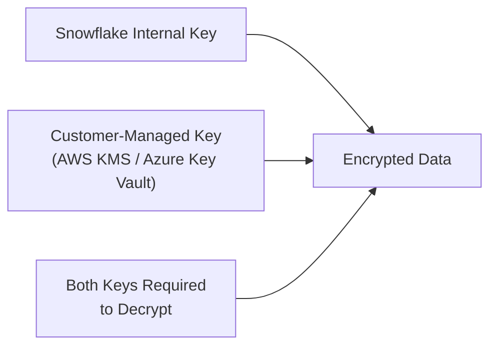

# Snowflake Security & Access Control — Intermediate Concepts

## Column-Level Security (Dynamic Data Masking)

Mask sensitive data based on the querying user's role — the column exists, but its value changes based on who's looking.

```sql
-- 1. Create a masking policy
CREATE MASKING POLICY email_mask AS (val STRING) RETURNS STRING ->
  CASE
    WHEN CURRENT_ROLE() IN ('ANALYST_ADMIN', 'SECURITY_ROLE') THEN val        -- see full email
    WHEN CURRENT_ROLE() = 'ANALYST_ROLE' THEN REGEXP_REPLACE(val, '.+@', '****@') -- mask local part
    ELSE '***REDACTED***'                                                       -- everyone else: blocked
  END;

-- 2. Apply to a column
ALTER TABLE customers MODIFY COLUMN email
    SET MASKING POLICY email_mask;

-- 3. Now analyst sees: ****@example.com; admin sees: alice@example.com
SELECT email FROM customers;
```

**Masking policy types:**

| Policy | What It Masks | Best For |
|--------|--------------|---------|
| Dynamic Data Masking | Column values at query time | PII in prod tables |
| External Tokenization | Replaces with token from vault | PCI cardholder data |
| SHA2 hash | Deterministic masking | Joining masked data across tables |

---

## Row-Level Security (Row Access Policies)

Restrict which rows a role can see — same table, different result sets per role:

```sql
-- 1. Create a mapping table (who sees what region)
CREATE TABLE region_access_map (
    role_name  VARCHAR,
    region     VARCHAR
);
INSERT INTO region_access_map VALUES
    ('APAC_ANALYST', 'APAC'),
    ('EMEA_ANALYST', 'EMEA'),
    ('GLOBAL_ANALYST', 'ALL');

-- 2. Create row access policy
CREATE ROW ACCESS POLICY region_filter AS (row_region VARCHAR) RETURNS BOOLEAN ->
    EXISTS (
        SELECT 1 FROM region_access_map
        WHERE role_name = CURRENT_ROLE()
        AND (region = row_region OR region = 'ALL')
    );

-- 3. Apply to table
ALTER TABLE sales ADD ROW ACCESS POLICY region_filter ON (region);

-- APAC analyst: only sees APAC rows; GLOBAL analyst: sees everything
SELECT * FROM sales;  -- filtered silently by policy
```

---

## Discretionary Access Control (DAC) vs RBAC

Snowflake combines both:

| Model | Who Controls Access | Snowflake Implementation |
|-------|-------------------|--------------------------|
| RBAC | Central security team grants roles | System-defined role hierarchy |
| DAC | Object owner can grant to others | `OWNERSHIP` privilege on objects |

```sql
-- Object owner (SYSADMIN) grants access
GRANT SELECT ON TABLE analytics.curated.fact_sales TO ROLE analyst_role;

-- Ownership transfer: change who owns an object
GRANT OWNERSHIP ON TABLE analytics.curated.fact_sales TO ROLE etl_role;
```

> **COPY GRANTS:** When cloning or recreating objects, privileges are lost by default. Use `COPY GRANTS` to preserve them:
> ```sql
> CREATE TABLE new_table CLONE old_table COPY GRANTS;
> ```

---

## Object-Level Privilege Hierarchy

Full privilege chain required to access a table:

```
ACCOUNT → DATABASE → SCHEMA → TABLE
  USAGE      USAGE     USAGE    SELECT
```

```sql
-- Shortcut: grant on all current + future objects in a database
GRANT USAGE ON ALL SCHEMAS IN DATABASE analytics TO ROLE analyst_role;
GRANT SELECT ON ALL TABLES IN DATABASE analytics TO ROLE analyst_role;
GRANT SELECT ON FUTURE TABLES IN DATABASE analytics TO ROLE analyst_role;
GRANT SELECT ON FUTURE VIEWS IN DATABASE analytics TO ROLE analyst_role;
```

---

## Managed Access Schemas

Prevent object owners from granting privileges — only the schema owner (or SECURITYADMIN) can grant:

```sql
-- Create schema where only centralized admin can grant access
CREATE SCHEMA analytics.sensitive WITH MANAGED ACCESS;

-- Now individual table owners CANNOT do this:
-- GRANT SELECT ON TABLE sensitive.ssn_data TO ROLE jr_analyst;  -- BLOCKED
-- Only the schema owner or SECURITYADMIN can grant in this schema
```

**Use managed access schemas for:** PII tables, financial data, health records.

---

## Data Classification and Tagging

Tag sensitive columns and use system functions to query classification:

```sql
-- Apply a tag to mark PII columns
CREATE TAG pii_tag ALLOWED_VALUES 'email', 'ssn', 'phone', 'dob';

ALTER TABLE customers MODIFY COLUMN email SET TAG pii_tag = 'email';
ALTER TABLE customers MODIFY COLUMN ssn   SET TAG pii_tag = 'ssn';

-- Query which columns are tagged as PII
SELECT *
FROM TABLE(INFORMATION_SCHEMA.TAG_REFERENCES_ALL_COLUMNS('customers', 'TABLE'))
WHERE TAG_NAME = 'PII_TAG';

-- Snowflake's built-in classification (scans for PII patterns)
SELECT EXTRACT_SEMANTIC_CATEGORIES('analytics.curated.customers');
```

---

## Snowflake Tri-Secret Secure (Enterprise+)

For maximum data sovereignty:



- **Default:** Snowflake manages all encryption keys (AES-256)
- **Customer-Managed Keys (CMK):** You own one key; Snowflake owns the other — both needed
- **Tri-Secret Secure:** If you revoke your key, Snowflake cannot access your data

---

## Audit and Compliance

```sql
-- Query login history (last 7 days)
SELECT user_name, client_ip, event_timestamp, is_success
FROM SNOWFLAKE.ACCOUNT_USAGE.LOGIN_HISTORY
WHERE event_timestamp >= DATEADD('day', -7, CURRENT_TIMESTAMP())
ORDER BY event_timestamp DESC;

-- Query grant history (who gave what access)
SELECT grantee_name, privilege, object_name, granted_by, created_on
FROM SNOWFLAKE.ACCOUNT_USAGE.GRANTS_TO_ROLES
WHERE object_type = 'TABLE'
ORDER BY created_on DESC;

-- Failed logins (suspicious activity)
SELECT user_name, COUNT(*) AS failed_attempts, MAX(event_timestamp) AS last_attempt
FROM SNOWFLAKE.ACCOUNT_USAGE.LOGIN_HISTORY
WHERE is_success = 'NO'
  AND event_timestamp >= DATEADD('hour', -24, CURRENT_TIMESTAMP())
GROUP BY 1
HAVING COUNT(*) > 5
ORDER BY failed_attempts DESC;
```

---

## Interview Tips

> **Tip 1:** "How do you implement column-level security?" — "Dynamic Data Masking: create a masking policy with a CASE statement on `CURRENT_ROLE()`, apply it to the column with `ALTER TABLE ... MODIFY COLUMN`. The column still exists — queries don't error — values are just masked based on who's asking."

> **Tip 2:** "What's the difference between masking and row access policies?" — "Masking operates on column values (same rows, obfuscated data). Row access policies filter which rows are returned (same columns, fewer rows). Use both together for full cell-level security."

> **Tip 3:** "How do you ensure new tables are automatically secured?" — "FUTURE GRANTS + Managed Access Schemas. FUTURE GRANTS automatically apply privileges to new objects. Managed Access Schemas prevent ad-hoc grants by object owners — only the central security team can grant."
