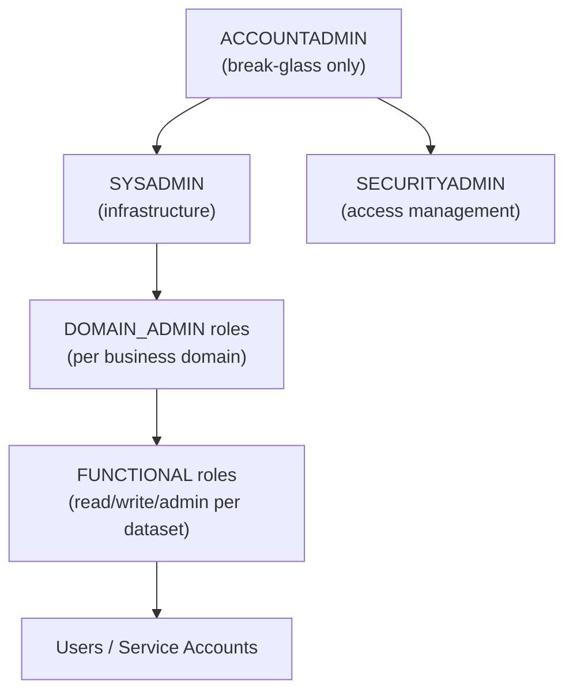

# Snowflake Security & Access Control — Senior Deep Dive

## Designing a Production RBAC Model at Scale

### The Three-Tier Role Model



**Pattern for each domain:**
```sql
-- Domain-level admin (can create objects in analytics domain)
CREATE ROLE analytics_domain_admin;
GRANT ROLE analytics_domain_admin TO ROLE sysadmin;

-- Functional roles per access level
CREATE ROLE analytics_read;
CREATE ROLE analytics_write;
CREATE ROLE analytics_admin;

-- Role hierarchy: admin > write > read
GRANT ROLE analytics_read TO ROLE analytics_write;
GRANT ROLE analytics_write TO ROLE analytics_admin;
GRANT ROLE analytics_admin TO ROLE analytics_domain_admin;
```

This creates **composable inheritance** — granting `analytics_admin` transitively gives `analytics_write` and `analytics_read` as well.

---

## Attribute-Based Access Control (ABAC) Patterns

Snowflake RBAC is static — roles are fixed. For dynamic access (e.g., "user sees only their department's data"), implement ABAC via session context variables:

```sql
-- 1. Store user → department mapping
CREATE TABLE user_context (
    username  VARCHAR,
    dept_code VARCHAR
);

-- 2. Application sets context on session start
ALTER SESSION SET SESSION_CONTEXT = '{"dept_code": "FINANCE"}';

-- 3. Row access policy reads session context
CREATE ROW ACCESS POLICY dept_filter AS (row_dept VARCHAR) RETURNS BOOLEAN ->
    row_dept = CURRENT_SESSION_CONTEXT('dept_code')
    OR CURRENT_ROLE() IN ('GLOBAL_ADMIN', 'DATA_STEWARD');

ALTER TABLE employee_data ADD ROW ACCESS POLICY dept_filter ON (department);
```

**ABAC via JWT claims (Snowflake + identity provider):**
- User authenticates via Okta/Azure AD
- JWT contains `dept_code` claim
- Snowflake session context is set from JWT at login (via OAuth integration)
- Row access policies read `CURRENT_SESSION_CONTEXT()` for dynamic filtering

---

## Governance at Scale: Horizon and Data Products

For 100+ tables with PII, manual tagging doesn't scale:

```sql
-- Auto-classify all tables in a database
SELECT SYSTEM$CLASSIFY_SCHEMA('analytics.curated', {'auto_tag': true});

-- Review classification results before applying
SELECT column_name, semantic_category, privacy_category, extra_info
FROM TABLE(RESULT_SCAN(LAST_QUERY_ID()));

-- Bulk-apply masking policies based on tags
-- (Usually done via Terraform or a governance script)
```

**Snowflake Horizon (built-in governance):**

| Feature | What It Does |
|---------|-------------|
| Data Classification | Auto-detect PII/PHI via ML patterns |
| Universal Data Consent | Policy-based consent propagation |
| Object Tagging | Metadata tags on any Snowflake object |
| Access History | Column-level lineage: who queried which columns |
| Sensitive Data Lineage | Track PII through transformations |

```sql
-- Column-level access history — detect which queries touched SSN
SELECT query_id, user_name, query_text
FROM SNOWFLAKE.ACCOUNT_USAGE.ACCESS_HISTORY
WHERE ARRAY_CONTAINS(
    PARSE_JSON('{"columnName": "SSN", "tableName": "customers"}'),
    OBJECTS_MODIFIED
)
AND query_start_time >= DATEADD('day', -30, CURRENT_TIMESTAMP());
```

---

## Secure Data Sharing and Security

Data sharing crosses account boundaries — the security model must extend:

```sql
-- Provider: create a share and control what's shared
CREATE SHARE sales_share;
GRANT USAGE ON DATABASE analytics TO SHARE sales_share;
GRANT USAGE ON SCHEMA analytics.curated TO SHARE sales_share;
GRANT SELECT ON TABLE analytics.curated.fact_sales TO SHARE sales_share;

-- Restrict the share to specific accounts
ALTER SHARE sales_share ADD ACCOUNTS = org1.partner_account;

-- Consumer can only SELECT — no INSERT/UPDATE/DELETE
-- Consumer cannot clone, export, or re-share the data by default
```

**Security implication:** Consider row access policies and masking policies on shared objects — they apply on the provider side. Consumers always see masked/filtered data.

---

## Secrets and Credential Management

```sql
-- Store credentials securely (Snowflake Secrets — 2024+)
CREATE SECRET s3_credentials
    TYPE = PASSWORD
    USERNAME = 'aws_access_key_id'
    PASSWORD = 'aws_secret_access_key';

-- Reference in external stage (credential never exposed in SQL)
CREATE STAGE my_s3_stage
    URL = 's3://my-bucket/data/'
    CREDENTIALS = (AWS_KEY_ID = SECRET s3_credentials);

-- Integration with AWS Secrets Manager / Azure Key Vault
CREATE SECRET vault_secret
    TYPE = CLOUD_PROVIDER_TOKEN
    OAUTH_SCOPES = ('https://vault.azure.net/.default')
    OAUTH_REFRESH_TOKEN = '...';
```

---

## Privilege Escalation Attack Vectors and Mitigations

Common security mistakes in Snowflake:

| Attack Vector | Example | Mitigation |
|---------------|---------|-----------|
| Over-privileged service accounts | ETL role with ACCOUNTADMIN | Least privilege: only grant what's needed |
| Ownership chaining | Analyst owns a table, re-grants to themselves | Managed Access Schemas |
| Snowpark containers breakout | Untrusted UDF code accessing network | Restrict external network access on Snowpark |
| PUBLIC role leak | Table created without schema protection | Revoke public access from sensitive databases |
| Time-travel data exfil | Query `AT (OFFSET => -86400)` to access deleted rows | Time-travel period controls + audit |

```sql
-- Audit: find tables accessible to PUBLIC role
SELECT table_catalog, table_schema, table_name
FROM INFORMATION_SCHEMA.TABLE_PRIVILEGES
WHERE GRANTEE = 'PUBLIC' AND PRIVILEGE_TYPE = 'SELECT';

-- Revoke PUBLIC access from a database entirely
REVOKE USAGE ON DATABASE analytics FROM ROLE PUBLIC;
```

---

## Compliance Frameworks: SOC2, HIPAA, GDPR

| Requirement | Snowflake Control |
|-------------|------------------|
| Encryption at rest | AES-256 (automatic), optional CMK |
| Encryption in transit | TLS 1.2+ (enforced) |
| Access logging | `ACCOUNT_USAGE.ACCESS_HISTORY`, `LOGIN_HISTORY` |
| Least privilege | RBAC with managed access schemas |
| Data residency | Choose AWS/Azure/GCP region; Business Critical: no cross-region replication without consent |
| Right to be forgotten (GDPR) | `DELETE` + flush time travel (`ALTER TABLE ... SET DATA_RETENTION_TIME_IN_DAYS = 0`) |
| PHI isolation (HIPAA) | Business Critical edition, private link, separate Snowflake account per environment |

---

## Interview Tips

> **Tip 1:** "How would you design RBAC for a data mesh organization?" — "Domain-based role hierarchy: each domain owns its data product with domain_admin, functional read/write roles. Cross-domain access requires explicit grant from domain owner. Central SECURITYADMIN enforces policy via managed access schemas and tags — no domain can accidentally expose data outside their scope."

> **Tip 2:** "How do you handle GDPR right-to-erasure in Snowflake?" — "DELETE the user's rows, then set data retention to 0 on affected tables to purge time-travel history immediately, then use UNDROP protection to prevent accidental re-exposure. Also check if the data was replicated to failover accounts or shared externally."

> **Tip 3:** "What's column-level access history used for?" — "Audit trails for compliance — prove that a specific analyst never accessed SSN or credit card columns, even if they had SELECT on the table. The table is queryable but only specific columns were accessed in practice. This is critical for SOC2 Type II evidence."
