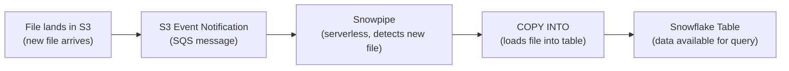

# Snowpipe — Fundamentals

## What Is Snowpipe?

Snowpipe is Snowflake's **continuous, serverless data ingestion service**. It automatically loads data from files in cloud storage (S3, Azure Blob, GCS) into Snowflake tables within minutes of the file arriving — without managing any compute.

```sql
-- Traditional COPY INTO (manual, batch):
COPY INTO raw.orders FROM @my_stage/orders/ FILE_FORMAT = (TYPE = 'JSON');
-- You run this manually or on a schedule. Files sit until you load them.

-- Snowpipe (automatic, continuous):
-- Files land in S3 → Snowpipe detects them → loads within 1-2 minutes
-- No manual intervention! No warehouse to manage!
```

> **Key Insight for DE:** Snowpipe is the equivalent of Databricks Auto Loader for Snowflake. Files arrive → automatically loaded → available for query within minutes. Zero infrastructure management.

---

## How Snowpipe Works



When a file lands in cloud storage, an event notification triggers Snowpipe, which uses serverless compute to load the file into the target table. No warehouse needed.

---

## Creating a Snowpipe

```sql
-- Step 1: Create a stage (points to S3 location)
CREATE OR REPLACE STAGE raw.orders_stage
    URL = 's3://my-bucket/landing/orders/'
    STORAGE_INTEGRATION = my_s3_integration  -- IAM role-based access
    FILE_FORMAT = (TYPE = 'JSON');

-- Step 2: Create the target table
CREATE OR REPLACE TABLE raw.orders (
    order_id NUMBER,
    customer_id NUMBER,
    amount DECIMAL(10,2),
    order_date DATE,
    _loaded_at TIMESTAMP DEFAULT CURRENT_TIMESTAMP(),
    _source_file VARCHAR DEFAULT METADATA$FILENAME
);

-- Step 3: Create the pipe
CREATE OR REPLACE PIPE raw.orders_pipe
    AUTO_INGEST = TRUE  -- Automatically loads new files!
AS
    COPY INTO raw.orders (order_id, customer_id, amount, order_date)
    FROM @raw.orders_stage
    FILE_FORMAT = (TYPE = 'JSON')
    MATCH_BY_COLUMN_NAME = CASE_INSENSITIVE;

-- Step 4: Set up S3 event notifications (one-time)
-- Get the SQS ARN from Snowpipe:
SHOW PIPES;
-- notification_channel column shows the SQS queue ARN
-- Configure S3 bucket → Event Notifications → send to this SQS queue
```

---

## AUTO_INGEST Modes

| Mode | How It Works | Latency | Setup |
|------|-------------|---------|-------|
| **AUTO_INGEST = TRUE** | Cloud events trigger loading | 1-2 minutes | S3 event → SQS → Snowpipe |
| **AUTO_INGEST = FALSE** | Manual trigger via REST API | On-demand | Call Snowpipe REST endpoint |

```sql
-- AUTO_INGEST = TRUE (recommended for most cases):
-- S3 sends event → Snowpipe picks it up → loads within 1-2 minutes
-- Zero maintenance after initial setup!

-- AUTO_INGEST = FALSE (manual trigger):
-- You call the Snowpipe REST API to notify about new files
-- Use when: cross-account (can't set up S3 events), or you want precise control
```

```python
# Manual trigger via REST API (AUTO_INGEST = FALSE):
from snowflake.ingest import SimpleIngestManager

ingest_manager = SimpleIngestManager(
    account='myaccount',
    host='myaccount.snowflakecomputing.com',
    user='pipe_user',
    pipe='raw.orders_pipe',
    private_key=private_key,
)

# Tell Snowpipe about specific files to load
resp = ingest_manager.ingest_files(['orders/2024/03/15/file_001.json'])
print(resp['responseCode'])  # 'SUCCESS'
```

---

## File Formats Supported

```sql
-- JSON
FILE_FORMAT = (TYPE = 'JSON', STRIP_OUTER_ARRAY = TRUE)

-- CSV
FILE_FORMAT = (TYPE = 'CSV', SKIP_HEADER = 1, FIELD_DELIMITER = ',', RECORD_DELIMITER = '\n')

-- Parquet
FILE_FORMAT = (TYPE = 'PARQUET')

-- Avro
FILE_FORMAT = (TYPE = 'AVRO')

-- ORC
FILE_FORMAT = (TYPE = 'ORC')

-- XML
FILE_FORMAT = (TYPE = 'XML')
```

---

## Snowpipe vs COPY INTO

| Aspect | Snowpipe | COPY INTO |
|--------|----------|-----------|
| Trigger | Automatic (event-driven) | Manual (you run it) |
| Compute | Serverless (Snowflake-managed) | Your warehouse |
| Latency | 1-2 minutes | Depends on schedule |
| Cost | Per-file pricing | Warehouse credits |
| Best for | Continuous streaming files | Bulk batch loads |
| File tracking | Automatic (load history) | Automatic (load history) |
| Error handling | Files with errors skipped | Configurable (ABORT/CONTINUE) |

```sql
-- COPY INTO (batch): good for large scheduled loads
-- "Load all files from yesterday"
COPY INTO raw.orders FROM @stage/2024/03/14/
    FILE_FORMAT = (TYPE = 'PARQUET')
    PATTERN = '.*\.parquet';
-- Uses your warehouse, loads in one batch

-- Snowpipe (continuous): good for files arriving throughout the day
-- "Load each file within 2 minutes of arrival"
-- Pipe runs continuously, no warehouse needed
```

---

## Monitoring Snowpipe

```sql
-- Check pipe status
SELECT SYSTEM$PIPE_STATUS('raw.orders_pipe');
-- Returns: executionState, pendingFileCount, lastIngestedTimestamp

-- View load history (what files were loaded)
SELECT *
FROM TABLE(INFORMATION_SCHEMA.COPY_HISTORY(
    TABLE_NAME => 'ORDERS',
    START_TIME => DATEADD('day', -1, CURRENT_TIMESTAMP())
))
ORDER BY LAST_LOAD_TIME DESC;

-- Check for errors (files that failed to load)
SELECT *
FROM TABLE(INFORMATION_SCHEMA.COPY_HISTORY(...))
WHERE STATUS = 'LOAD_FAILED';
-- Shows: file name, error message, row number of error
```

---

## Exactly-Once Semantics

```sql
-- Snowpipe guarantees each file is loaded EXACTLY ONCE:
-- 1. Snowpipe tracks loaded files by name + size + last_modified
-- 2. If the same file is re-notified: Snowpipe skips it (already loaded)
-- 3. If a file is modified after loading: Snowpipe loads the new version

-- This means:
-- ✅ Safe to have duplicate S3 notifications (deduped by Snowpipe)
-- ✅ Same file won't create duplicate rows
-- ⚠️ Modified files ARE re-loaded (may create duplicates if same content + new rows)

-- Best practice: immutable files (never modify after writing)
-- Naming: include timestamp or sequence number in file name
-- Example: orders_20240315_143022_001.json (unique, immutable)
```

---

## Cost

```sql
-- Snowpipe pricing: based on compute time used for loading
-- Approximately: 0.06 credits per file (varies by file size/complexity)
-- For 1000 files/day: ~60 credits/day × $2-3/credit = $120-180/day

-- vs COPY INTO on XS warehouse:
-- 1000 files in one batch: ~5 minutes on XS = 0.08 credits = $0.24
-- BUT: you wait for the batch (not continuous)

-- RULE:
-- Few large files (hourly/daily): COPY INTO is cheaper
-- Many small files (per-minute): Snowpipe is more convenient (despite higher per-file cost)
-- Snowpipe Streaming (newer): even cheaper for high-frequency micro-batches
```

---

## Interview Tips

> **Tip 1:** "What is Snowpipe?" — Serverless continuous data ingestion. Files land in S3/Azure/GCS → event notification → Snowpipe loads them within 1-2 minutes. No warehouse to manage. Each file loaded exactly once. Like a "file arrival trigger" that automatically runs COPY INTO.

> **Tip 2:** "Snowpipe vs COPY INTO?" — Snowpipe: automatic, serverless, continuous (1-2 min latency), per-file cost. COPY INTO: manual/scheduled, uses your warehouse, batch-oriented, cheaper per GB for large loads. Use Snowpipe for continuous file streams; COPY INTO for large scheduled batch loads.

> **Tip 3:** "How does Snowpipe guarantee exactly-once?" — Tracks loaded files by name + size + modification time. Duplicate notifications are ignored. Same file won't be loaded twice. Best practice: use immutable files with unique names (timestamp in filename) to avoid accidental re-loads from file modifications.
