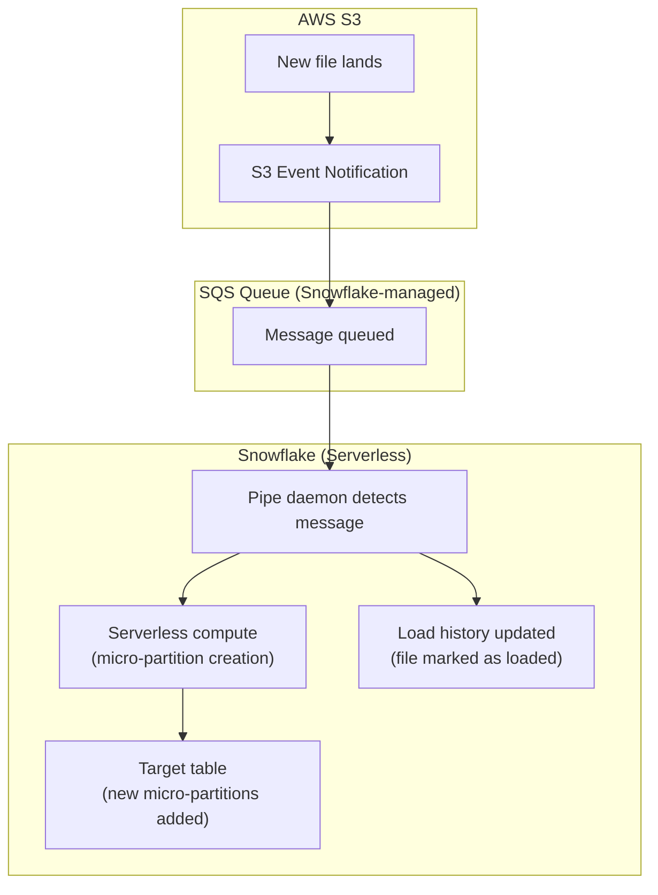

# Snowpipe — Senior-Level Deep Dive

## Snowpipe Architecture Internals

### How Auto-Ingest Works Under the Hood



Snowflake manages an internal SQS queue. When S3 sends an event, the message is queued. Snowpipe's daemon polls the queue, claims files, and loads them using serverless compute. The load history prevents re-processing.

---

## Cost Optimization at Scale

```sql
-- Snowpipe cost = serverless compute credits per file
-- Approximately: 0.06 credits per file loaded (varies by complexity)

-- Cost scenarios:
-- 100 files/day × 0.06 credits × $3/credit = $18/day ($540/month)
-- 10,000 files/day × 0.06 credits × $3/credit = $1,800/day (expensive!)
-- 1 file/day (1 GB) via COPY INTO on XS warehouse: $0.25/day ($7.50/month!)

-- OPTIMIZATION STRATEGIES:

-- 1. Consolidate small files before landing in S3
-- Instead of: 1000 × 1 MB files → use Snowpipe ($60/day)
-- Better: 10 × 100 MB files → use Snowpipe ($0.60/day)
-- 100x cheaper for the same data volume!

-- 2. Switch to COPY INTO for batch sources
-- If files arrive in hourly batches (not continuous):
-- COPY INTO with scheduled task is 10-50x cheaper than Snowpipe per-file loading

-- 3. Use Snowpipe Streaming for high-frequency inserts
-- Snowpipe Streaming charges per-byte (not per-file)
-- For 100K tiny events/day: streaming cheaper than file-based Snowpipe

-- Cost comparison framework:
-- < 100 files/day: either approach is cheap (< $20/month)
-- 100-1000 files/day: Snowpipe is convenient and affordable
-- > 10,000 files/day: consider COPY INTO batching or Snowpipe Streaming
```

---

## High-Volume Production Patterns

### Handling 100K+ Files per Day

```sql
-- Challenge: 100K small files/day from distributed microservices
-- Each service writes small JSON files (1-5 MB) every minute

-- PROBLEM: 100K files × $0.06/file = $6,000/month (expensive!)

-- SOLUTION 1: File aggregation layer
-- Add a Lambda/Firehose that batches small files into larger ones:
-- 100K × 5 MB → 500 × 1 GB files (same data, 200x fewer files)
-- Cost: 500 × $0.06 = $30/month (200x cheaper!)

-- SOLUTION 2: Snowpipe Streaming for high-frequency sources
-- Application writes rows directly via Snowpipe Streaming SDK
-- No files, no S3, no event notifications
-- Cost: per-byte pricing (~$2.50/TB ingested)
-- 100K events × 1KB each = 100 MB/day = negligible cost

-- SOLUTION 3: COPY INTO with micro-batching
-- Task runs every 5 minutes, loads ALL new files in one batch:
CREATE TASK batch_load_orders
    WAREHOUSE = 'LOAD_WH_XS'
    SCHEDULE = '5 MINUTE'
AS
    COPY INTO raw.orders FROM @stage
    FILE_FORMAT = (TYPE = 'JSON')
    PATTERN = '.*\.json';
-- One COPY command loads hundreds of files in parallel
-- Cost: XS warehouse for 30 seconds = ~0.004 credits × 288 runs/day = 1.15 credits/day ($3.45/day)
-- vs Snowpipe: 100K files × $0.18 = $18K/month(!!)
```

---

## Multi-Cloud Ingestion

```sql
-- Snowpipe works with all major cloud providers:

-- AWS S3:
CREATE PIPE s3_pipe AUTO_INGEST = TRUE AS
    COPY INTO raw.events FROM @s3_stage;
-- Uses: S3 Event Notification → SQS → Snowpipe

-- Azure Blob Storage:
CREATE PIPE azure_pipe AUTO_INGEST = TRUE AS
    COPY INTO raw.events FROM @azure_stage;
-- Uses: Azure Event Grid → Azure Queue → Snowpipe

-- GCS (Google Cloud Storage):
CREATE PIPE gcs_pipe AUTO_INGEST = TRUE AS
    COPY INTO raw.events FROM @gcs_stage;
-- Uses: GCS Pub/Sub → Snowpipe

-- Cross-cloud:
-- Snowflake account on AWS can ingest from Azure Blob (via external stage)
-- But: data transfer costs apply (cross-cloud network charges)
-- Best practice: Snowflake account in same cloud as data source
```

---

## Load History and Deduplication

```sql
-- Snowpipe's internal load history prevents duplicate loads:

-- How it works:
-- Each file tracked by: filename + file_size + last_modified_timestamp
-- If SAME file (same name+size+timestamp) is re-notified → SKIPPED
-- If file is MODIFIED (same name, different size/timestamp) → RE-LOADED

-- Load history retention: 14 days (after that, file could be re-loaded)
-- For files older than 14 days: Snowpipe won't recognize them as "already loaded"

-- Manually check load history:
SELECT FILE_NAME, STATUS, ROW_COUNT, ROW_PARSED, LAST_LOAD_TIME
FROM TABLE(INFORMATION_SCHEMA.COPY_HISTORY(
    TABLE_NAME => 'RAW.ORDERS',
    START_TIME => DATEADD('day', -14, CURRENT_TIMESTAMP())
))
ORDER BY LAST_LOAD_TIME DESC;

-- Force re-load of a specific file (if needed):
-- Must use COPY INTO with FORCE = TRUE (not Snowpipe):
COPY INTO raw.orders FROM @stage/specific_file.json FORCE = TRUE;
-- This bypasses load history (use carefully — may create duplicates!)
```

---

## Production Monitoring and Alerting

```sql
-- Comprehensive Snowpipe monitoring:

-- 1. Pipe status (are pipes running?)
SELECT 
    PIPE_NAME,
    PARSE_JSON(SYSTEM$PIPE_STATUS(PIPE_CATALOG || '.' || PIPE_SCHEMA || '.' || PIPE_NAME)) AS status,
    status:executionState::STRING AS execution_state,
    status:pendingFileCount::NUMBER AS pending_files,
    status:lastIngestedTimestamp::TIMESTAMP AS last_ingested
FROM INFORMATION_SCHEMA.PIPES
WHERE PIPE_CATALOG = 'MY_DB';

-- 2. Alert if pipe is paused or has pending files accumulating
-- (Pending files growing = ingestion can't keep up)

-- 3. Load failure monitoring
CREATE OR REPLACE VIEW ops.snowpipe_failures AS
SELECT 
    PIPE_NAME, FILE_NAME, STATUS, 
    FIRST_ERROR_MESSAGE, ERROR_COUNT,
    LAST_LOAD_TIME
FROM TABLE(INFORMATION_SCHEMA.COPY_HISTORY(
    START_TIME => DATEADD('hour', -24, CURRENT_TIMESTAMP())
))
WHERE STATUS IN ('LOAD_FAILED', 'PARTIALLY_LOADED')
ORDER BY LAST_LOAD_TIME DESC;

-- 4. Throughput monitoring (files/hour, rows/hour)
SELECT 
    DATE_TRUNC('hour', LAST_LOAD_TIME) AS hour,
    PIPE_NAME,
    COUNT(*) AS files_loaded,
    SUM(ROW_COUNT) AS rows_loaded,
    SUM(FILE_SIZE) / 1024 / 1024 AS mb_loaded
FROM TABLE(INFORMATION_SCHEMA.COPY_HISTORY(
    START_TIME => DATEADD('day', -7, CURRENT_TIMESTAMP())
))
WHERE STATUS = 'LOADED'
GROUP BY hour, PIPE_NAME
ORDER BY hour DESC;
```

---

## Snowpipe Streaming Architecture

```python
# Snowpipe Streaming: SDK-based row insertion (sub-second latency)
# Best for: real-time application events, Kafka consumers, IoT

from snowflake.streaming.client import SnowflakeStreamingClient
from snowflake.streaming.client import OpenChannelRequest

# Create client
client = SnowflakeStreamingClient(
    account='myaccount',
    user='streaming_user',
    private_key=key,
    role='STREAMING_ROLE',
    database='RAW',
    schema='STREAMING',
)

# Open a channel (connection to a specific table)
channel = client.open_channel(OpenChannelRequest(
    channel_name='orders_channel_01',
    table_name='RAW.STREAMING.ORDERS',
))

# Insert rows (sub-second latency!)
rows = [
    {"order_id": 1001, "amount": 99.50, "customer_id": 42},
    {"order_id": 1002, "amount": 150.00, "customer_id": 43},
]
channel.insert_rows(rows)

# Rows are available for query within ~1 second!
# No files, no S3, no event notifications — direct API insertion
```

---

## Interview Tips

> **Tip 1:** "How do you handle 100K files per day cost-effectively?" — Don't use Snowpipe for 100K tiny files (too expensive at $0.06/file). Instead: (1) aggregate small files into fewer larger files before S3 (Lambda/Firehose), (2) use COPY INTO with a scheduled task every 5 minutes (warehouse is cheaper per-file), or (3) use Snowpipe Streaming (per-byte pricing, no per-file cost). The right choice depends on latency needs vs cost tolerance.

> **Tip 2:** "Snowpipe load history and deduplication?" — Snowpipe tracks files by name + size + modification timestamp for 14 days. Same file re-notified → skipped (deduplicated). Modified file → re-loaded (may create duplicates if same rows + new rows). After 14 days: load history expires (file could theoretically be re-loaded). Best practice: immutable files with unique names.

> **Tip 3:** "Snowpipe vs Snowpipe Streaming?" — Standard Snowpipe: file-based, 1-2 min latency, per-file pricing, best for batch file sources. Streaming: row-based API, sub-second latency, per-byte pricing, best for real-time application events. Use Streaming when: latency < 1 min required, source is an application (not files), or high-frequency small inserts. Use standard when: source produces files (S3, SFTP, partner drops).

## ⚡ Cheat Sheet

**Snowflake architecture layers**
```
Cloud Services:   metadata, optimizer, access control, query planning
Virtual Warehouse: compute (T-shirt sizes: XS to 6XL); auto-suspend + auto-resume
Storage:          columnar Parquet on S3/Blob/GCS; billed separately from compute
```

**Virtual warehouse management**
```sql
CREATE WAREHOUSE analytics_wh WITH WAREHOUSE_SIZE='MEDIUM'
  AUTO_SUSPEND=60 AUTO_RESUME=TRUE MAX_CLUSTER_COUNT=3 MIN_CLUSTER_COUNT=1
  SCALING_POLICY='ECONOMY';  -- or STANDARD
ALTER WAREHOUSE analytics_wh SUSPEND;
ALTER WAREHOUSE analytics_wh SET WAREHOUSE_SIZE='LARGE';
```

**Time travel**
```sql
SELECT * FROM orders AT (OFFSET => -60*60);                          -- 1 hour ago
SELECT * FROM orders AT (TIMESTAMP => '2024-01-15 08:00:00'::TIMESTAMP);
SELECT * FROM orders BEFORE (STATEMENT => '8e5d0ca9-005e-44e6-b858-a8f5b37c5726');
-- Restore from time travel
CREATE TABLE orders_restored CLONE orders AT (OFFSET => -3600);
-- Default retention: 1 day (standard), up to 90 days (enterprise)
```

**Streams and Tasks**
```sql
-- Stream: CDC on a table
CREATE STREAM orders_stream ON TABLE orders;
SELECT * FROM orders_stream;  -- METADATA$ACTION, METADATA$ISUPDATE, METADATA$ROW_ID

-- Task: scheduled or triggered compute
CREATE TASK process_orders
  WAREHOUSE = 'etl_wh'
  SCHEDULE = '5 MINUTE'
  WHEN SYSTEM$STREAM_HAS_DATA('orders_stream')
AS
  INSERT INTO gold.orders SELECT * FROM orders_stream WHERE METADATA$ACTION = 'INSERT';

ALTER TASK process_orders RESUME;
```

**Dynamic Tables**
```sql
CREATE DYNAMIC TABLE gold.orders_summary
  TARGET_LAG = '5 minutes'
  WAREHOUSE = etl_wh
AS
  SELECT region, SUM(amount) AS total FROM silver.orders GROUP BY region;
-- Snowflake automatically refreshes when source changes; no task/stream needed
```

**Snowpipe (continuous ingestion)**
```sql
CREATE PIPE orders_pipe AUTO_INGEST=TRUE AS
  COPY INTO orders FROM @orders_stage FILE_FORMAT=(TYPE='CSV');
-- S3 event notification → SQS → Snowpipe auto-triggers COPY on new files
-- Latency: ~1 minute; cost: per-file compute credits
```

**Data sharing**
```sql
CREATE SHARE sales_share;
GRANT USAGE ON DATABASE prod TO SHARE sales_share;
GRANT SELECT ON TABLE prod.gold.orders TO SHARE sales_share;
ALTER SHARE sales_share ADD ACCOUNTS = partner_account_id;
-- Consumer sees a read-only database — no data copy, no egress charges
```

**Stored procedures (JavaScript/Python/Snowflake Scripting)**
```sql
CREATE OR REPLACE PROCEDURE load_and_validate(p_date STRING)
RETURNS STRING LANGUAGE PYTHON RUNTIME_VERSION='3.10'
PACKAGES=('snowflake-snowpark-python') HANDLER='run'
AS $$
def run(session, p_date):
    df = session.table("staging.orders").filter(f"order_date = '{p_date}'")
    if df.count() == 0:
        return f"No data for {p_date}"
    df.write.save_as_table("gold.orders", mode="append")
    return f"Loaded {df.count()} rows"
$$;
```

**External tables**
```sql
CREATE EXTERNAL TABLE ext_orders (
    order_id NUMBER AS (VALUE:c1::NUMBER),
    amount   FLOAT  AS (VALUE:c3::FLOAT)
) WITH LOCATION=@orders_stage FILE_FORMAT=(TYPE='PARQUET')
AUTO_REFRESH=TRUE;
-- Reads directly from S3; no data copy to Snowflake storage
```

**Materialized views**
```sql
CREATE MATERIALIZED VIEW mv_orders_by_region AS
  SELECT region, SUM(amount) AS total FROM orders GROUP BY region;
-- Auto-incremental refresh by Snowflake when base table changes
-- Best for: complex aggregations queried frequently; available in Enterprise+
```

**Key interview points**
- Micro-partitions: 50-500 MB compressed Parquet; automatic clustering per load order
- Cluster keys: explicit clustering on high-cardinality columns (date, customer_id)
- Query profile: check for partition pruning, spillage to disk, heavy operators
- Zero-copy clone: CREATE TABLE dev_orders CLONE gold.orders — instant, no storage cost
- Fail-safe: 7-day recovery window after time travel expires (Snowflake internal only)
