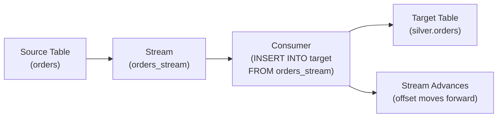

# Snowflake Streams and Tasks — Fundamentals

## What Are Streams?

A Stream is Snowflake's **change data capture (CDC) mechanism**. It tracks row-level changes (INSERT, UPDATE, DELETE) on a table, view, or directory table since the last time the stream was consumed.

```sql
-- Create a stream to track changes on the orders table
CREATE OR REPLACE STREAM orders_stream ON TABLE raw.orders;

-- The stream captures:
-- New rows inserted (INSERT)
-- Rows that were updated (before and after images)
-- Rows that were deleted (DELETE)

-- Query the stream to see changes since last consumption
SELECT * FROM orders_stream;
-- Shows: columns from orders + METADATA$ACTION + METADATA$ISUPDATE + METADATA$ROW_ID
```

> **Key Insight for DE:** Streams are how you do incremental processing in Snowflake. Instead of scanning the entire table to find "what changed," the stream tells you exactly which rows are new/modified/deleted since your last load.

---

## How Streams Work



When you create a stream on a table, it tracks an offset (like a bookmark). When you consume the stream in a DML statement (INSERT, MERGE), the offset advances. Next time you query the stream, you only see changes AFTER the last consumption.

---

## Stream Metadata Columns

| Column | Type | Meaning |
|--------|------|---------|
| `METADATA$ACTION` | VARCHAR | 'INSERT' or 'DELETE' |
| `METADATA$ISUPDATE` | BOOLEAN | TRUE if this is part of an UPDATE |
| `METADATA$ROW_ID` | VARCHAR | Unique identifier for the row |

```sql
-- Understanding UPDATE representation:
-- An UPDATE is represented as a DELETE + INSERT pair:
-- Row 1: METADATA$ACTION='DELETE', METADATA$ISUPDATE=TRUE (old values)
-- Row 2: METADATA$ACTION='INSERT', METADATA$ISUPDATE=TRUE (new values)

-- To get only the LATEST version of updated rows:
SELECT * FROM orders_stream
WHERE METADATA$ACTION = 'INSERT';
-- This gives you: new inserts + new version of updated rows (excludes deletes)
```

---

## Stream Types

| Type | Tracks | Use Case |
|------|--------|----------|
| **Standard** (default) | INSERT, UPDATE, DELETE | Full CDC, MERGE operations |
| **Append-Only** | INSERT only | Event logs, append-only tables |

```sql
-- Standard stream (captures all changes)
CREATE STREAM orders_cdc_stream ON TABLE raw.orders;

-- Append-only stream (only new inserts, ignores updates/deletes)
CREATE STREAM events_stream ON TABLE raw.events APPEND_ONLY = TRUE;
-- Lighter weight: no need to track before/after images
-- Perfect for: event logs, clickstream, sensor data (append-only by nature)
```

---

## What Are Tasks?

A Task is Snowflake's **built-in scheduler**. It executes SQL statements on a defined schedule (cron) or when triggered by another task (DAG).

```sql
-- Create a task that runs every hour
CREATE OR REPLACE TASK process_orders
    WAREHOUSE = 'ETL_WH'
    SCHEDULE = '60 MINUTE'  -- or USING CRON '0 * * * * UTC'
AS
    INSERT INTO silver.orders (order_id, amount, order_date, customer_id)
    SELECT order_id, amount, order_date, customer_id
    FROM orders_stream
    WHERE METADATA$ACTION = 'INSERT';

-- Tasks are created in SUSPENDED state — must be resumed to start!
ALTER TASK process_orders RESUME;
```

---

## Streams + Tasks Together (The Pattern)

The killer combination: Stream (tracks changes) + Task (processes them on schedule):

```sql
-- 1. Source table receives new data (via Snowpipe, COPY, INSERT)
-- INSERT INTO raw.orders VALUES (...);

-- 2. Stream captures the changes automatically
-- (No action needed — stream is always tracking)

-- 3. Task runs on schedule and processes the stream
CREATE OR REPLACE TASK hourly_orders_etl
    WAREHOUSE = 'ETL_WH'
    SCHEDULE = 'USING CRON 0 * * * * UTC'  -- Every hour at :00
    WHEN SYSTEM$STREAM_HAS_DATA('orders_stream')  -- Only run if there's new data!
AS
    MERGE INTO silver.orders t
    USING (
        SELECT order_id, amount, order_date, customer_id
        FROM orders_stream
        WHERE METADATA$ACTION = 'INSERT'
    ) s ON t.order_id = s.order_id
    WHEN MATCHED THEN UPDATE SET t.amount = s.amount, t.order_date = s.order_date
    WHEN NOT MATCHED THEN INSERT (order_id, amount, order_date, customer_id)
        VALUES (s.order_id, s.amount, s.order_date, s.customer_id);

-- 4. After the MERGE completes, stream offset advances
-- Next run: stream only shows changes AFTER this point

ALTER TASK hourly_orders_etl RESUME;
```

---

## Task Scheduling Options

```sql
-- Fixed interval:
SCHEDULE = '5 MINUTE'     -- Every 5 minutes
SCHEDULE = '60 MINUTE'    -- Every hour
SCHEDULE = '1440 MINUTE'  -- Every day

-- Cron expression (more control):
SCHEDULE = 'USING CRON 0 6 * * * America/New_York'   -- 6 AM ET daily
SCHEDULE = 'USING CRON */15 * * * * UTC'              -- Every 15 minutes
SCHEDULE = 'USING CRON 0 0 * * MON UTC'              -- Monday midnight

-- Conditional execution (skip if no new data):
WHEN SYSTEM$STREAM_HAS_DATA('my_stream')
-- Task wakes up on schedule but immediately skips if stream is empty
-- Saves warehouse compute (no pointless runs!)
```

---

## Task DAGs (Dependencies)

Tasks can form dependency chains (like mini-pipelines):

```sql
-- Root task (has schedule)
CREATE TASK ingest_task
    WAREHOUSE = 'ETL_WH'
    SCHEDULE = '60 MINUTE'
AS
    COPY INTO raw.orders FROM @my_stage;

-- Child task (triggered AFTER root completes)
CREATE TASK transform_task
    WAREHOUSE = 'ETL_WH'
    AFTER ingest_task  -- Runs after ingest_task succeeds
AS
    INSERT INTO silver.orders
    SELECT * FROM orders_stream WHERE METADATA$ACTION = 'INSERT';

-- Grandchild task (triggered after transform)
CREATE TASK aggregate_task
    WAREHOUSE = 'ETL_WH'
    AFTER transform_task
AS
    INSERT INTO gold.daily_revenue
    SELECT order_date, SUM(amount) FROM silver.orders
    WHERE order_date = CURRENT_DATE - 1
    GROUP BY order_date;

-- Resume the entire tree (start from root):
ALTER TASK ingest_task RESUME;
ALTER TASK transform_task RESUME;
ALTER TASK aggregate_task RESUME;
-- Execution: ingest → transform → aggregate (sequential)
```

---

## Checking Stream and Task Status

```sql
-- See what's in a stream (pending changes)
SELECT COUNT(*) FROM orders_stream;  -- Number of unprocessed changes

-- Check if stream has data (used in WHEN condition)
SELECT SYSTEM$STREAM_HAS_DATA('orders_stream');  -- TRUE/FALSE

-- View task execution history
SELECT *
FROM TABLE(INFORMATION_SCHEMA.TASK_HISTORY(
    TASK_NAME => 'HOURLY_ORDERS_ETL',
    SCHEDULED_TIME_RANGE_START => DATEADD('day', -1, CURRENT_TIMESTAMP())
))
ORDER BY SCHEDULED_TIME DESC;

-- View task state
SHOW TASKS;
-- Shows: name, schedule, state (started/suspended), last_run_time
```

---

## Interview Tips

> **Tip 1:** "What are Snowflake Streams?" — CDC mechanism that tracks INSERT/UPDATE/DELETE on a table. Creates a change log you can query. When consumed in a DML statement, the offset advances (you only see new changes next time). Use with Tasks for automated incremental ETL.

> **Tip 2:** "Streams + Tasks vs external orchestrator (Airflow)?" — Streams + Tasks: native Snowflake, zero infrastructure, serverless, ideal for Snowflake-only pipelines. Airflow: multi-system orchestration, more flexible, better for complex DAGs spanning multiple tools. Use Streams/Tasks for simple Snowflake ETL; add Airflow when you need cross-system coordination.

> **Tip 3:** "What does SYSTEM$STREAM_HAS_DATA do?" — Returns TRUE if the stream has unconsumed changes. Used in the task's WHEN clause to skip execution if there's nothing new. This prevents wasting compute on empty runs (task wakes up, checks, and immediately goes back to sleep if no new data).
