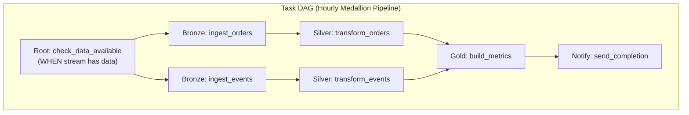

# Snowflake Streams and Tasks — Senior-Level Deep Dive

## Stream Internals and Offset Management

### How Streams Track Changes

```sql
-- Streams use Snowflake's internal versioning (micro-partitions + metadata)
-- No separate change table is created — it's a LOGICAL view of changes

-- Stream offset = the table version when the stream was last consumed
-- Query: SYSTEM$STREAM_GET_TABLE_TIMESTAMP('stream_name')

-- Under the hood:
-- 1. Snowflake tracks table versions (each DML creates a new version)
-- 2. Stream stores: "last consumed at version X"
-- 3. When queried: compares current table vs version X → shows differences
-- 4. After DML consuming the stream: offset advances to current version

-- This means:
-- Streams have ZERO storage cost (no data duplication!)
-- They're computed on-the-fly from table metadata
-- Performance depends on: number of micro-partitions changed since last offset
```

### Transaction Semantics

```sql
-- Stream consumption is TRANSACTIONAL:
-- The offset advances ONLY if the consuming DML commits successfully

-- Example: if MERGE fails mid-execution:
BEGIN;
    MERGE INTO target USING my_stream ...;  -- Partially executes, then fails
ROLLBACK;  -- Transaction rolled back
-- Stream offset: NOT advanced (still shows the same changes)
-- Next run: processes the SAME changes again (exactly-once semantics!)

-- This gives you EXACTLY-ONCE processing:
-- Success: data in target + offset advanced = processed once
-- Failure: rollback + offset unchanged = will retry next run
```

---

## Production Task DAG Architecture



```sql
-- Production DAG with error handling and monitoring

-- Root task (scheduler + gate)
CREATE OR REPLACE TASK pipeline_root
    WAREHOUSE = 'ETL_WH'
    SCHEDULE = 'USING CRON 0 * * * * UTC'
    WHEN SYSTEM$STREAM_HAS_DATA('orders_stream') OR SYSTEM$STREAM_HAS_DATA('events_stream')
AS
    SELECT 1;  -- No-op, just triggers children

-- Bronze tasks (parallel, independent)
CREATE TASK bronze_orders WAREHOUSE = 'ETL_WH' AFTER pipeline_root AS
    CALL etl.ingest_orders_sp();

CREATE TASK bronze_events WAREHOUSE = 'ETL_WH' AFTER pipeline_root AS
    CALL etl.ingest_events_sp();

-- Silver tasks (depend on their bronze parent)
CREATE TASK silver_orders WAREHOUSE = 'ETL_WH' AFTER bronze_orders AS
    CALL etl.transform_orders_sp();

CREATE TASK silver_events WAREHOUSE = 'ETL_WH' AFTER bronze_events AS
    CALL etl.transform_events_sp();

-- Gold task (depends on both silver tasks)
CREATE TASK gold_metrics WAREHOUSE = 'ETL_WH' AFTER silver_orders, silver_events AS
    CALL etl.build_gold_metrics_sp();

-- Notification task (depends on gold)
CREATE TASK notify_completion WAREHOUSE = 'ETL_WH' AFTER gold_metrics AS
    CALL etl.send_slack_notification('Pipeline complete');

-- Error handling task (runs if ANY task in the DAG fails)
CREATE TASK error_handler WAREHOUSE = 'ETL_WH' AFTER gold_metrics
    WHEN SYSTEM$GET_PREDECESSOR_RETURN_VALUE('gold_metrics') IS NULL  -- Implies failure
AS
    CALL etl.send_alert('Pipeline failed — check task history');

-- Resume all tasks in the DAG (from leaves to root):
ALTER TASK notify_completion RESUME;
ALTER TASK error_handler RESUME;
ALTER TASK gold_metrics RESUME;
ALTER TASK silver_orders RESUME;
ALTER TASK silver_events RESUME;
ALTER TASK bronze_orders RESUME;
ALTER TASK bronze_events RESUME;
ALTER TASK pipeline_root RESUME;
```

---

## Handling Multiple Streams Atomically

```sql
-- Challenge: process orders_stream AND customers_stream together
-- Both must advance atomically (or neither advances)

-- Solution: consume both in a single transaction
CREATE OR REPLACE PROCEDURE etl.process_orders_with_customers()
RETURNS VARCHAR
LANGUAGE SQL
AS
$$
BEGIN
    -- Both streams consumed in same transaction
    -- If ANY step fails → both streams roll back (unchanged)
    
    -- Step 1: Merge customers first (dimension)
    MERGE INTO silver.customers t
    USING (SELECT * FROM customers_stream WHERE METADATA$ACTION = 'INSERT') s
    ON t.customer_id = s.customer_id
    WHEN MATCHED THEN UPDATE SET t.name = s.name, t.email = s.email
    WHEN NOT MATCHED THEN INSERT VALUES (s.customer_id, s.name, s.email);
    
    -- Step 2: Merge orders (references customers)
    MERGE INTO silver.orders t
    USING (SELECT * FROM orders_stream WHERE METADATA$ACTION = 'INSERT') s
    ON t.order_id = s.order_id
    WHEN MATCHED THEN UPDATE SET t.amount = s.amount
    WHEN NOT MATCHED THEN INSERT VALUES (s.order_id, s.customer_id, s.amount, s.order_date);
    
    RETURN 'SUCCESS: processed ' || SQLROWCOUNT || ' rows';
EXCEPTION
    WHEN OTHER THEN
        -- Both stream offsets stay unchanged (transaction failed)
        INSERT INTO etl.error_log VALUES ('process_orders_with_customers', SQLERRM, CURRENT_TIMESTAMP());
        RAISE;  -- Re-raise to mark task as FAILED
END;
$$;
```

---

## Performance Optimization

```sql
-- Stream query performance depends on:
-- 1. Number of micro-partitions changed since last consumption
-- 2. Table size (more partitions to scan for changes)
-- 3. Clustering (better clustering = faster change detection)

-- OPTIMIZATION 1: Frequent consumption (smaller change sets per run)
-- Every 5 minutes = ~5 min of changes per run (small, fast)
-- Every 24 hours = full day of changes (large, slow)
-- Recommendation: consume at least every hour for large tables

-- OPTIMIZATION 2: Append-only streams for event tables
-- Standard streams track UPDATE/DELETE (more overhead)
-- For append-only tables (events, logs): use APPEND_ONLY = TRUE (faster)
CREATE STREAM fast_events_stream ON TABLE events APPEND_ONLY = TRUE;

-- OPTIMIZATION 3: Proper warehouse sizing for tasks
-- Small tasks (< 1M rows): XSMALL warehouse
-- Medium tasks (1-100M rows): SMALL-MEDIUM warehouse
-- Large tasks (> 100M rows): LARGE+ warehouse
-- Or: use serverless tasks (auto-sizes)

-- OPTIMIZATION 4: Avoid SELECT * from stream (column pruning)
-- BAD: SELECT * FROM orders_stream; (reads all columns)
-- GOOD: SELECT order_id, amount FROM orders_stream; (reads only needed columns)
```

---

## Multi-Consumer Patterns

```sql
-- Challenge: Two downstream systems need to consume the same changes
-- Problem: ONE stream can only be consumed by ONE consumer (offset advances once)

-- Solution: Create MULTIPLE streams on the same table
CREATE STREAM orders_stream_silver ON TABLE raw.orders;  -- For silver ETL
CREATE STREAM orders_stream_alerts ON TABLE raw.orders;  -- For alerting system
CREATE STREAM orders_stream_audit ON TABLE raw.orders;   -- For audit log

-- Each stream has its own offset
-- Each consumer processes at its own pace
-- One consumer being slow doesn't block others!

-- Alternative: Stream on a view with different filters
CREATE VIEW high_value_orders AS SELECT * FROM raw.orders WHERE amount > 10000;
CREATE STREAM high_value_stream ON VIEW high_value_orders;
-- Only tracks changes to high-value orders (lightweight for alert system)
```

---

## Interview Tips

> **Tip 1:** "How do Snowflake streams achieve exactly-once processing?" — Stream consumption is transactional: the offset only advances when the consuming DML COMMITS. If the DML fails (error, timeout), the transaction rolls back and the offset stays unchanged. Next run sees the exact same changes and retries. No data loss, no duplicates.

> **Tip 2:** "How do you handle multiple consumers for the same stream?" — Create separate streams on the same source table. Each stream has its own independent offset. Consumer A (silver ETL) and Consumer B (alerting) each have their own stream, advance at their own pace, and don't interfere with each other. Snowflake supports unlimited streams per table.

> **Tip 3:** "Stream performance considerations?" — Streams are faster when: consumed frequently (smaller change sets), table is well-clustered (fewer partitions to scan), using APPEND_ONLY for event tables (less overhead), and selecting only needed columns (column pruning). Stale streams (not consumed within retention) become unusable — prevent by consuming at least daily.

## ⚡ Cheat Sheet

**Snowflake architecture layers**
```
Cloud Services:   metadata, optimizer, access control, query planning
Virtual Warehouse: compute (T-shirt sizes: XS to 6XL); auto-suspend + auto-resume
Storage:          columnar Parquet on S3/Blob/GCS; billed separately from compute
```

**Virtual warehouse management**
```sql
CREATE WAREHOUSE analytics_wh WITH WAREHOUSE_SIZE='MEDIUM'
  AUTO_SUSPEND=60 AUTO_RESUME=TRUE MAX_CLUSTER_COUNT=3 MIN_CLUSTER_COUNT=1
  SCALING_POLICY='ECONOMY';  -- or STANDARD
ALTER WAREHOUSE analytics_wh SUSPEND;
ALTER WAREHOUSE analytics_wh SET WAREHOUSE_SIZE='LARGE';
```

**Time travel**
```sql
SELECT * FROM orders AT (OFFSET => -60*60);                          -- 1 hour ago
SELECT * FROM orders AT (TIMESTAMP => '2024-01-15 08:00:00'::TIMESTAMP);
SELECT * FROM orders BEFORE (STATEMENT => '8e5d0ca9-005e-44e6-b858-a8f5b37c5726');
-- Restore from time travel
CREATE TABLE orders_restored CLONE orders AT (OFFSET => -3600);
-- Default retention: 1 day (standard), up to 90 days (enterprise)
```

**Streams and Tasks**
```sql
-- Stream: CDC on a table
CREATE STREAM orders_stream ON TABLE orders;
SELECT * FROM orders_stream;  -- METADATA$ACTION, METADATA$ISUPDATE, METADATA$ROW_ID

-- Task: scheduled or triggered compute
CREATE TASK process_orders
  WAREHOUSE = 'etl_wh'
  SCHEDULE = '5 MINUTE'
  WHEN SYSTEM$STREAM_HAS_DATA('orders_stream')
AS
  INSERT INTO gold.orders SELECT * FROM orders_stream WHERE METADATA$ACTION = 'INSERT';

ALTER TASK process_orders RESUME;
```

**Dynamic Tables**
```sql
CREATE DYNAMIC TABLE gold.orders_summary
  TARGET_LAG = '5 minutes'
  WAREHOUSE = etl_wh
AS
  SELECT region, SUM(amount) AS total FROM silver.orders GROUP BY region;
-- Snowflake automatically refreshes when source changes; no task/stream needed
```

**Snowpipe (continuous ingestion)**
```sql
CREATE PIPE orders_pipe AUTO_INGEST=TRUE AS
  COPY INTO orders FROM @orders_stage FILE_FORMAT=(TYPE='CSV');
-- S3 event notification → SQS → Snowpipe auto-triggers COPY on new files
-- Latency: ~1 minute; cost: per-file compute credits
```

**Data sharing**
```sql
CREATE SHARE sales_share;
GRANT USAGE ON DATABASE prod TO SHARE sales_share;
GRANT SELECT ON TABLE prod.gold.orders TO SHARE sales_share;
ALTER SHARE sales_share ADD ACCOUNTS = partner_account_id;
-- Consumer sees a read-only database — no data copy, no egress charges
```

**Stored procedures (JavaScript/Python/Snowflake Scripting)**
```sql
CREATE OR REPLACE PROCEDURE load_and_validate(p_date STRING)
RETURNS STRING LANGUAGE PYTHON RUNTIME_VERSION='3.10'
PACKAGES=('snowflake-snowpark-python') HANDLER='run'
AS $$
def run(session, p_date):
    df = session.table("staging.orders").filter(f"order_date = '{p_date}'")
    if df.count() == 0:
        return f"No data for {p_date}"
    df.write.save_as_table("gold.orders", mode="append")
    return f"Loaded {df.count()} rows"
$$;
```

**External tables**
```sql
CREATE EXTERNAL TABLE ext_orders (
    order_id NUMBER AS (VALUE:c1::NUMBER),
    amount   FLOAT  AS (VALUE:c3::FLOAT)
) WITH LOCATION=@orders_stage FILE_FORMAT=(TYPE='PARQUET')
AUTO_REFRESH=TRUE;
-- Reads directly from S3; no data copy to Snowflake storage
```

**Materialized views**
```sql
CREATE MATERIALIZED VIEW mv_orders_by_region AS
  SELECT region, SUM(amount) AS total FROM orders GROUP BY region;
-- Auto-incremental refresh by Snowflake when base table changes
-- Best for: complex aggregations queried frequently; available in Enterprise+
```

**Key interview points**
- Micro-partitions: 50-500 MB compressed Parquet; automatic clustering per load order
- Cluster keys: explicit clustering on high-cardinality columns (date, customer_id)
- Query profile: check for partition pruning, spillage to disk, heavy operators
- Zero-copy clone: CREATE TABLE dev_orders CLONE gold.orders — instant, no storage cost
- Fail-safe: 7-day recovery window after time travel expires (Snowflake internal only)
