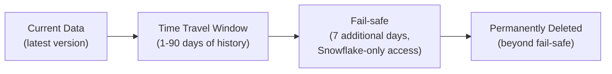

# Snowflake Time Travel — Fundamentals

## What Is Time Travel?

Time Travel lets you **access historical versions of data** — query, clone, or restore data as it existed at any point within the retention period (up to 90 days). It's like an automatic "undo" for your tables.

```sql
-- Query data as it was 1 hour ago:
SELECT * FROM orders AT (OFFSET => -3600);  -- 3600 seconds ago

-- Query data as it was at a specific timestamp:
SELECT * FROM orders AT (TIMESTAMP => '2024-03-15 10:00:00'::TIMESTAMP);

-- Query a specific historical version:
SELECT * FROM orders BEFORE (STATEMENT => '01a1b2c3-...');  -- Before a specific query ran
```

> **Key Insight for DE:** Time Travel is your safety net. Accidentally deleted data? Ran a bad UPDATE? Just query or restore the previous version. It's also how Streams track changes internally.

---

## How Time Travel Works



Snowflake retains old micro-partitions for the retention period. When you modify data, old partitions aren't deleted immediately — they remain accessible via Time Travel until the retention window expires.

---

## Accessing Historical Data

### By Timestamp

```sql
-- "Show me the orders table as it looked yesterday at noon"
SELECT * FROM production.orders
AT (TIMESTAMP => '2024-03-14 12:00:00'::TIMESTAMP_LTZ);

-- Compare current vs historical (what changed?):
SELECT 
    current_data.order_id,
    current_data.status AS current_status,
    historical.status AS old_status
FROM production.orders current_data
JOIN production.orders AT (TIMESTAMP => '2024-03-14 12:00:00'::TIMESTAMP_LTZ) historical
    ON current_data.order_id = historical.order_id
WHERE current_data.status != historical.status;
-- Shows all orders whose status changed since yesterday noon!
```

### By Offset (Seconds Ago)

```sql
-- "Show me the data from 30 minutes ago"
SELECT * FROM production.orders AT (OFFSET => -1800);  -- 1800 seconds = 30 minutes

-- Useful for: "what did this table look like BEFORE my last query ran?"
```

### By Statement (Before/After a Specific Query)

```sql
-- "Show me the data BEFORE that bad UPDATE ran"
-- First, find the statement ID from query history:
SELECT query_id, query_text, start_time
FROM TABLE(INFORMATION_SCHEMA.QUERY_HISTORY())
WHERE query_text LIKE '%UPDATE%orders%'
ORDER BY start_time DESC LIMIT 5;
-- query_id: '01a1b2c3-0000-0000-0000-000000000001'

-- Now query the state BEFORE that statement:
SELECT * FROM production.orders
BEFORE (STATEMENT => '01a1b2c3-0000-0000-0000-000000000001');
-- Returns data as it was RIGHT BEFORE the UPDATE executed!
```

---

## Restoring Data (UNDROP and Clone)

### UNDROP (Restore Dropped Tables/Schemas/Databases)

```sql
-- Accidentally dropped a table? Bring it back!
DROP TABLE production.orders;  -- Oops!

-- Undo it:
UNDROP TABLE production.orders;
-- Table is back, with ALL its data!

-- Also works for schemas and databases:
UNDROP SCHEMA production;
UNDROP DATABASE analytics;

-- Constraint: UNDROP only works within the retention period (DATA_RETENTION_TIME_IN_DAYS)
```

### Clone from Historical Point (Restore Data)

```sql
-- "My UPDATE corrupted data. Restore it to yesterday's version."

-- Option 1: Clone the table at a historical point (creates a copy)
CREATE TABLE production.orders_restored
CLONE production.orders AT (TIMESTAMP => '2024-03-14 12:00:00'::TIMESTAMP_LTZ);

-- Then swap if it looks correct:
ALTER TABLE production.orders SWAP WITH production.orders_restored;
-- Now production.orders has the restored data!
-- orders_restored has the corrupted data (drop it when confirmed)

-- Option 2: INSERT from historical data (selective restore)
-- Only restore specific rows (not entire table):
INSERT INTO production.orders
SELECT * FROM production.orders AT (TIMESTAMP => '2024-03-14 12:00:00'::TIMESTAMP_LTZ)
WHERE customer_id = 12345  -- Only restore this customer's data
  AND order_id NOT IN (SELECT order_id FROM production.orders);  -- Don't duplicate
```

---

## Retention Period

```sql
-- Default retention: 1 day (Standard edition), up to 90 days (Enterprise+)

-- Check current retention:
SHOW TABLES LIKE 'orders';
-- retention_time column shows the configured days

-- Set retention per table:
ALTER TABLE production.orders SET DATA_RETENTION_TIME_IN_DAYS = 30;
-- Now: 30 days of time travel history for this table

-- Set at schema/database level (applies to all tables within):
ALTER SCHEMA production SET DATA_RETENTION_TIME_IN_DAYS = 14;

-- Retention affects:
-- Time Travel queries (can query up to N days back)
-- UNDROP (can undrop within N days of dropping)
-- Streams (stream staleness linked to retention)
-- Storage cost (old micro-partitions consume storage for N days)
```

---

## Storage Cost of Time Travel

```sql
-- Time Travel data consumes storage (you pay for old versions):
-- More retention days = more storage cost

-- Check Time Travel storage usage:
SELECT 
    TABLE_NAME,
    ACTIVE_BYTES / (1024*1024*1024) AS active_gb,
    TIME_TRAVEL_BYTES / (1024*1024*1024) AS time_travel_gb,
    FAILSAFE_BYTES / (1024*1024*1024) AS failsafe_gb
FROM INFORMATION_SCHEMA.TABLE_STORAGE_METRICS
WHERE TABLE_SCHEMA = 'PRODUCTION'
ORDER BY TIME_TRAVEL_BYTES DESC;

-- High time-travel storage = frequent updates/deletes on large tables
-- Example: 100 GB table with daily full refresh → 100 GB × retention_days of old versions!

-- OPTIMIZATION: For staging/temp tables, set retention = 0
ALTER TABLE staging.temp_load SET DATA_RETENTION_TIME_IN_DAYS = 0;
-- No time travel, no fail-safe → zero extra storage cost
-- Use for: temporary tables that don't need recovery
```

---

## Common Use Cases

| Use Case | How |
|----------|-----|
| Accidental DELETE/UPDATE | Query AT historical time → restore |
| Dropped table recovery | UNDROP TABLE |
| Data audit (what changed?) | Compare current vs AT(timestamp) |
| Point-in-time reporting | Query AT specific business date |
| Development (test against yesterday's data) | CLONE AT timestamp |
| Stream staleness recovery | Based on table's retention period |

---

## Fail-Safe (Beyond Time Travel)

```sql
-- After Time Travel retention expires: data enters Fail-Safe (7 additional days)
-- Fail-Safe: ONLY accessible by Snowflake Support (not you!)
-- Purpose: disaster recovery (hardware failure, corruption)
-- You cannot query or restore Fail-Safe data yourself

-- Timeline: data modified → Time Travel (0-90 days) → Fail-Safe (7 days) → permanently gone

-- For transient tables: NO fail-safe (saves storage)
CREATE TRANSIENT TABLE staging.temp_data (...);
-- Transient: time travel (0-1 day) → NO fail-safe → permanently gone
-- Use for: staging data, temp tables, ETL intermediates
```

---

## Interview Tips

> **Tip 1:** "What is Snowflake Time Travel?" — Ability to query, clone, or restore data as it existed at any point within the retention period (1-90 days). Uses historical micro-partitions that Snowflake retains. Enables: accident recovery (UNDROP, restore from clone), auditing (compare versions), and development (work with yesterday's data).

> **Tip 2:** "How do you recover from an accidental bad UPDATE?" — Query the table BEFORE the statement: `SELECT * FROM table BEFORE (STATEMENT => 'query_id')`. If correct: CLONE at that point into a new table, verify, then SWAP with the corrupted table. Takes 5 minutes, zero data loss. This is why Time Travel is invaluable.

> **Tip 3:** "Time Travel storage cost?" — Old micro-partitions are retained for the retention period. High-churn tables (frequent UPDATE/DELETE) accumulate significant time travel storage. Optimize: reduce retention for non-critical tables (staging → 0 days, dev → 1 day, prod → 7-30 days). Use TRANSIENT tables for temp data (no fail-safe, minimal time travel).
