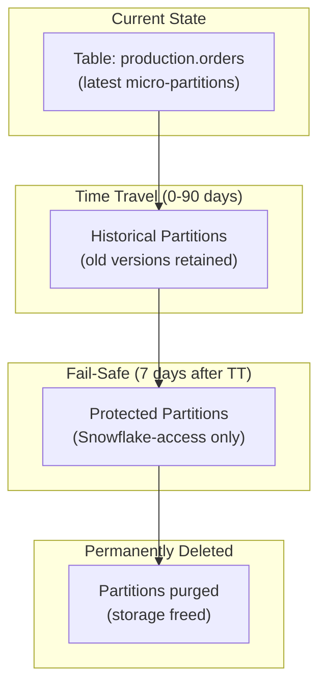

# Snowflake Time Travel — Senior-Level Deep Dive

## Micro-Partition Versioning Internals

```sql
-- How Time Travel works under the hood:
-- 1. Snowflake stores data in immutable micro-partitions (50-500 MB compressed)
-- 2. DML operations CREATE new micro-partitions (don't modify existing ones)
-- 3. Old partitions are marked as "historical" but NOT deleted
-- 4. Time Travel: reads the old partitions directly (no reconstruction needed)

-- Example: UPDATE changes 100 rows in a 1M-row table
-- Before: partition P1 contains the 100 rows (among others)
-- After UPDATE: P1 is retained (historical), P1' created with updated values
-- Time Travel query: reads P1 (old version) directly
-- Current query: reads P1' (new version)

-- This explains why:
-- Time Travel queries are FAST (just reading old files, no reconstruction)
-- Time Travel STORAGE scales with change frequency (more changes = more old partitions)
-- DELETE doesn't immediately free storage (old partitions retained for retention period)
```

---

## Time Travel in Production Architecture



Data lifecycle: Active → Time Travel (your control) → Fail-Safe (Snowflake's control) → Purged.

---

## Enterprise Time Travel Strategy

```sql
-- Tiered retention based on data criticality and cost:

-- TIER 1: Critical business tables (orders, customers, financial)
ALTER TABLE production.orders SET DATA_RETENTION_TIME_IN_DAYS = 90;
ALTER TABLE production.customers SET DATA_RETENTION_TIME_IN_DAYS = 90;
ALTER TABLE production.financial_transactions SET DATA_RETENTION_TIME_IN_DAYS = 90;
-- Maximum protection: 90 days of history + 7 days fail-safe
-- Cost: significant for large tables, but critical data warrants it

-- TIER 2: Important analytical tables (silver layer)
ALTER TABLE silver.enriched_orders SET DATA_RETENTION_TIME_IN_DAYS = 14;
ALTER TABLE silver.customer_metrics SET DATA_RETENTION_TIME_IN_DAYS = 14;
-- 14 days: enough to catch ETL bugs within 2 weeks
-- Can be reconstructed from raw if needed beyond 14 days

-- TIER 3: Derived/Gold tables (can be rebuilt from silver)
ALTER TABLE gold.daily_revenue SET DATA_RETENTION_TIME_IN_DAYS = 3;
ALTER TABLE gold.dashboards SET DATA_RETENTION_TIME_IN_DAYS = 1;
-- Minimal retention: these can be rebuilt from silver if corrupted
-- Low cost since they're recreatable

-- TIER 4: Staging/Temp (no recovery needed)
CREATE TRANSIENT TABLE staging.raw_load (...);
ALTER TABLE staging.raw_load SET DATA_RETENTION_TIME_IN_DAYS = 0;
-- Zero retention: data exists only in current state
-- Cheapest option (no time travel storage, no fail-safe)
```

---

## GDPR and Regulatory Compliance

```sql
-- Challenge: GDPR requires data deletion, but Time Travel retains old versions!
-- Customer requests deletion → you DELETE from current table
-- BUT: their data still exists in Time Travel for up to 90 days!

-- APPROACH 1: Reduce retention for PII tables
ALTER TABLE production.customers SET DATA_RETENTION_TIME_IN_DAYS = 7;
-- After 7 days: customer's old data is purged from Time Travel
-- Then 7 more days in Fail-Safe → fully gone after 14 days
-- Compliant: "data erased within 30 days" (most GDPR interpretations accept this)

-- APPROACH 2: For immediate compliance, disable time travel on PII tables
ALTER TABLE production.customers SET DATA_RETENTION_TIME_IN_DAYS = 0;
-- No time travel: DELETE immediately removes the data's accessibility
-- (Fail-safe still retains for 7 days, but that's Snowflake-only access)
-- Trade-off: lose recovery capability for this table

-- APPROACH 3: Separate PII from non-PII
-- Keep PII in a separate table with low/zero retention
-- Keep non-PII (aggregates, analytics) with high retention
-- DELETE from PII table (fast, low retention)
-- Analytics tables don't contain PII → retain freely

-- AUDIT TRAIL (prove deletion happened):
-- Snowflake Account Usage tracks all DML:
SELECT query_text, execution_status, start_time
FROM SNOWFLAKE.ACCOUNT_USAGE.QUERY_HISTORY
WHERE query_text LIKE '%DELETE%customers%'
  AND start_time >= DATEADD('day', -30, CURRENT_TIMESTAMP());
```

---

## Time Travel Cost Analysis

```sql
-- Calculate monthly time travel storage cost:
WITH storage_analysis AS (
    SELECT 
        TABLE_CATALOG || '.' || TABLE_SCHEMA || '.' || TABLE_NAME AS full_name,
        ACTIVE_BYTES,
        TIME_TRAVEL_BYTES,
        FAILSAFE_BYTES,
        -- Snowflake storage: ~$23/TB/month (on-demand)
        (TIME_TRAVEL_BYTES / POWER(1024, 4)) * 23 AS tt_monthly_cost_usd,
        (FAILSAFE_BYTES / POWER(1024, 4)) * 23 AS fs_monthly_cost_usd
    FROM SNOWFLAKE.ACCOUNT_USAGE.TABLE_STORAGE_METRICS
    WHERE ACTIVE_BYTES > 0
)
SELECT 
    full_name,
    ROUND(ACTIVE_BYTES / POWER(1024, 3), 2) AS active_gb,
    ROUND(TIME_TRAVEL_BYTES / POWER(1024, 3), 2) AS tt_gb,
    ROUND(tt_monthly_cost_usd, 2) AS tt_cost_usd,
    ROUND(FAILSAFE_BYTES / POWER(1024, 3), 2) AS fs_gb
FROM storage_analysis
ORDER BY TIME_TRAVEL_BYTES DESC
LIMIT 20;

-- Typical findings:
-- Large fact tables with daily INSERT OVERWRITE: massive TT storage
-- Example: 500 GB table × 30 day retention = up to 15 TB of old versions = $345/month!
-- Fix: switch to incremental load (MERGE) instead of full refresh
-- Incremental: only changed rows create new partitions → much less TT storage
```

---

## Advanced Recovery Patterns

### Cross-Table Consistent Recovery

```sql
-- Challenge: restore multiple related tables to the SAME point in time
-- (Orders table must be consistent with order_items table)

-- Step 1: Identify the consistent timestamp (before corruption in either table)
SET recovery_timestamp = '2024-03-15 08:00:00'::TIMESTAMP_LTZ;

-- Step 2: Clone BOTH tables at the same timestamp
CREATE TABLE recovery.orders CLONE production.orders AT (TIMESTAMP => $recovery_timestamp);
CREATE TABLE recovery.order_items CLONE production.order_items AT (TIMESTAMP => $recovery_timestamp);

-- Step 3: Verify consistency (foreign keys match)
SELECT COUNT(*) FROM recovery.order_items i
LEFT JOIN recovery.orders o ON i.order_id = o.order_id
WHERE o.order_id IS NULL;
-- Should be 0 (all items have matching orders at this point)

-- Step 4: Swap both atomically (using a transaction)
BEGIN;
    ALTER TABLE production.orders SWAP WITH recovery.orders;
    ALTER TABLE production.order_items SWAP WITH recovery.order_items;
COMMIT;
-- Both tables restored to same consistent point
```

### Incremental Recovery (Selective Restore)

```sql
-- Restore ONLY specific rows without affecting others
-- Scenario: customer 12345's data was corrupted, everything else is fine

-- Find the correct historical data for this customer:
SELECT * FROM production.orders 
AT (TIMESTAMP => '2024-03-14 12:00:00'::TIMESTAMP_LTZ)
WHERE customer_id = 12345;

-- Remove corrupted rows:
DELETE FROM production.orders WHERE customer_id = 12345;

-- Insert historical (correct) rows:
INSERT INTO production.orders
SELECT * FROM production.orders AT (TIMESTAMP => '2024-03-14 12:00:00'::TIMESTAMP_LTZ)
WHERE customer_id = 12345;
-- Only customer 12345 is restored; all other data untouched!
```

---

## Time Travel for Development and Testing

```sql
-- Pattern: clone production for testing (instant, free until modified)

-- Daily development refresh (automated):
CREATE OR REPLACE DATABASE dev_latest CLONE production;
-- Developers always have fresh data to work with
-- Storage: ~$0 (until they modify tables in dev)
-- Refresh: schedule nightly (DROP + re-CLONE)

-- Point-in-time test datasets:
CREATE SCHEMA test.regression_data CLONE production AT (TIMESTAMP => '2024-03-01 00:00:00');
-- Deterministic test data (same data every time you run tests against March 1 snapshot)
-- Perfect for: regression testing, performance benchmarking

-- A/B testing (compare results on same data):
CREATE TABLE test.version_a_output AS SELECT ...;  -- Run algorithm A on cloned data
CREATE TABLE test.version_b_output AS SELECT ...;  -- Run algorithm B on same cloned data
-- Compare: both ran on identical data (no time-difference affecting results)
```

---

## Interview Tips

> **Tip 1:** "How do you design a retention strategy?" — Tier by criticality: critical business data = 90 days (maximum protection), silver/intermediate = 7-14 days (rebuildable from raw), gold/derived = 1-3 days (rebuildable from silver), staging/temp = 0 days (transient tables). Balance: recovery capability vs storage cost.

> **Tip 2:** "Time Travel and GDPR compliance?" — Challenge: deleted data persists in Time Travel for the retention period. Solutions: (1) Reduce retention on PII tables (7 days max), (2) Use 0-day retention for truly sensitive data (immediate purge), (3) Separate PII from analytics (different retention policies). Document: audit trail proves deletion happened; explain retention as technical buffer.

> **Tip 3:** "How does Time Travel impact storage costs?" — Every DML creates new micro-partitions; old ones are retained for retention_days. INSERT OVERWRITE (full refresh) is the worst: creates a full table copy per refresh × retention days. Fix: use MERGE (incremental) instead of full refresh — only changed rows create new partitions. Monitor: SNOWFLAKE.ACCOUNT_USAGE.TABLE_STORAGE_METRICS shows exact TT bytes per table.
