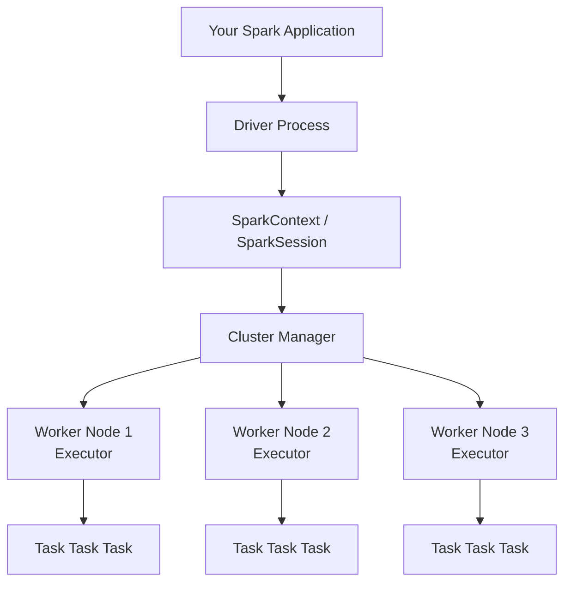

# Spark Architecture — Fundamentals

## 🎯 Analogy

Think of Spark like a film production. The **Driver** is the director — it holds the script (your code) and calls the shots. **Executors** are the crew members scattered across set — they do the actual filming. The **Cluster Manager** is the studio that assigns crew to each production. The director never does the physical work; the crew handles it in parallel.

---

## The Big Picture

Apache Spark is a unified analytics engine for large-scale data processing. It runs across a cluster of machines and processes data in memory, making it 10–100× faster than Hadoop MapReduce for iterative workloads.



---

## Core Components

| Component | Role | Lives Where |
|-----------|------|-------------|
| **Driver** | Runs your `main()`, creates SparkSession, builds DAG, schedules tasks | Master node / your laptop |
| **SparkSession** | Entry point — creates DataFrames, runs SQL, manages config | Inside Driver |
| **Cluster Manager** | Allocates resources (CPU/RAM) to executors | Dedicated service (YARN, K8s, Standalone) |
| **Worker Node** | Machine in the cluster that runs executors | Physical/virtual servers |
| **Executor** | JVM process on a Worker — executes tasks, stores cached data | Worker Node |
| **Task** | Smallest unit of work — processes one partition | Inside Executor |

---

## The Driver

The Driver is the brain of the application:

```python
from pyspark.sql import SparkSession

# Driver starts here — SparkSession is the modern entry point
spark = SparkSession.builder \
    .appName("MyApp") \
    .config("spark.executor.memory", "4g") \
    .getOrCreate()

# Driver builds the logical plan for these operations
df = spark.read.parquet("s3://data/orders/")      # no data moved yet
filtered = df.filter(df["amount"] > 100)           # still lazy
grouped = filtered.groupBy("region").sum("amount") # still lazy

# Driver triggers execution — sends tasks to executors
grouped.show()   # ← Action! Driver submits jobs to cluster
```

The Driver:
- Converts your code into a **DAG** (Directed Acyclic Graph) of stages
- Negotiates resources with the Cluster Manager
- Schedules tasks on executors
- Coordinates retries on failure
- Collects results back from executors

---

## Executors

Executors are worker processes, one or more per Worker Node:

```
Worker Node (16 CPU cores, 64 GB RAM)
├── Executor 1  (4 cores, 16 GB)  → runs tasks for your app
├── Executor 2  (4 cores, 16 GB)  → runs tasks for another app
└── (remaining resources idle or reserved for OS)
```

Each executor:
- Runs tasks in **thread slots** (one thread per core)
- Has an in-memory storage region for **cached data**
- Communicates results back to the Driver via the Cluster Manager
- Stays alive for the lifetime of the application (unlike MapReduce — no JVM startup per task)

---

## Cluster Managers

Spark supports three cluster managers:

| Manager | Best For | Notes |
|---------|---------|-------|
| **Standalone** | Dev/test, simple clusters | Built into Spark, easy to set up |
| **YARN** | Hadoop shops | Shares cluster with HDFS workloads |
| **Kubernetes** | Cloud-native | Containerized, elastic scaling |

```bash
# Standalone
spark-submit --master spark://master:7077 app.py

# YARN
spark-submit --master yarn --deploy-mode cluster app.py

# Kubernetes
spark-submit --master k8s://https://k8s-api:6443 app.py
```

---

## Deploy Modes: Client vs Cluster

| | Client Mode | Cluster Mode |
|--|-------------|--------------|
| **Driver runs on** | Your machine / edge node | Worker node inside cluster |
| **Best for** | Interactive (notebooks, dev) | Production jobs |
| **Logs** | Printed locally | On cluster node |
| **Risk** | Driver dies if your machine dies | More resilient |

```bash
spark-submit --deploy-mode client  app.py   # dev
spark-submit --deploy-mode cluster app.py   # prod
```

---

## From Code to Execution: DAG

When you call an **action** (`.show()`, `.collect()`, `.write()`), Spark:

1. Builds a **Logical Plan** (what transformations to do)
2. Optimizes it into an **Optimized Logical Plan** (Catalyst optimizer)
3. Converts to a **Physical Plan** (how to execute — join strategies, etc.)
4. Divides into **Stages** at shuffle boundaries
5. Divides each Stage into **Tasks** (one per partition)
6. Sends Tasks to Executors

```
Job (one action call)
└── Stage 1 (no shuffle)
│   ├── Task 1 — partition 0
│   ├── Task 2 — partition 1
│   └── Task 3 — partition 2
└── Stage 2 (after shuffle)
    ├── Task 1 — partition 0
    └── Task 2 — partition 1
```

---

## Key Spark Concepts in One Table

| Concept | Definition |
|---------|-----------|
| **Job** | One action call triggers one job |
| **Stage** | Group of tasks with no shuffle between them |
| **Task** | Processes one partition on one executor thread |
| **Partition** | A chunk of data — more partitions = more parallelism |
| **Shuffle** | Redistribution of data across executors (expensive!) |
| **Lineage** | The chain of transformations from source to result |

---

## ▶️ Try It Yourself

```python
from pyspark.sql import SparkSession

spark = SparkSession.builder.master("local[*]").appName("arch-demo").getOrCreate()

# Check how many partitions (= tasks for a stage)
df = spark.range(1000)
print(f"Partitions: {df.rdd.getNumPartitions()}")  # typically = number of cores

# See the execution plan
df.filter("id % 2 == 0").groupBy((df.id % 10).alias("bucket")).count().explain()

# Spark UI — see stages, tasks, executors
# Open http://localhost:4040 while app is running
```

> **Run it:** Works locally with `local[*]` — no cluster needed.

---

## Interview Tips

> **Tip 1:** "Describe Spark's architecture." — Driver/SparkSession manages the application and builds the DAG. Cluster Manager allocates resources. Executors run tasks and cache data. One key advantage over MapReduce: executors are long-lived JVM processes — no JVM startup overhead per task, and intermediate results stay in memory.

> **Tip 2:** "What is a Stage in Spark?" — A stage is a set of tasks that can run without a shuffle. Stage boundaries are drawn wherever data must be redistributed across partitions (joins on non-co-located keys, aggregations, sorts). Minimizing shuffles is the single biggest Spark performance lever.

> **Tip 3:** "Client vs cluster deploy mode?" — Client mode runs the Driver on the submitting machine — good for interactive notebooks but fragile for production. Cluster mode runs the Driver inside the cluster — essential for production jobs since the job survives if the submitting machine disconnects.
